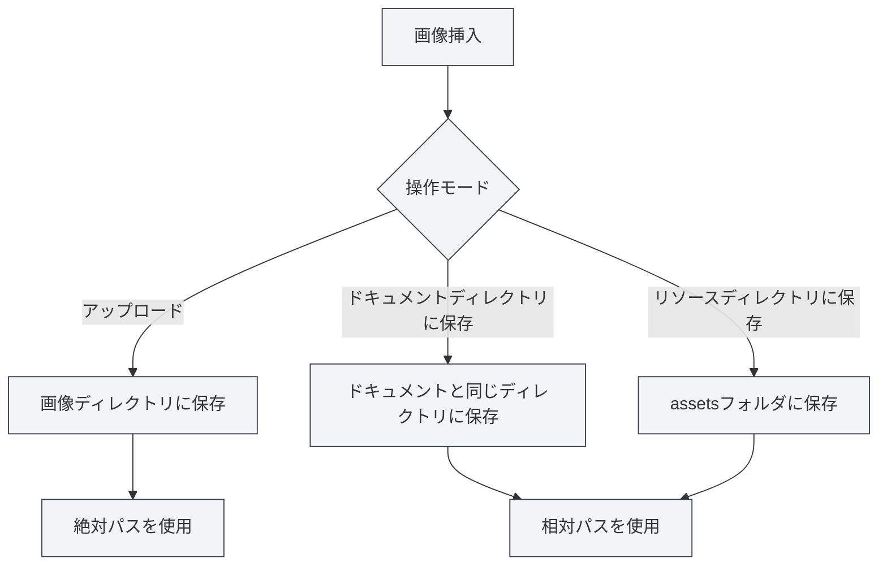

# 画像アップロード設定

## 概要

画像アップロード設定は、ドキュメント内に画像を挿入する際の処理方法を決定します。MetaDocは複数の画像処理モードをサポートしており、必要に応じて適切な設定を選択できます。

## 画像挿入操作

### 操作モード

画像を挿入する際、以下の操作モードから選択できます：

- **アップロード**：画像を指定の画像ディレクトリにアップロードする
- **ドキュメントディレクトリに保存**：画像をドキュメントが存在するディレクトリに保存する
- **リソースディレクトリに保存**：画像をドキュメントディレクトリ内の`assets`フォルダに保存する

トップメニューバーから画像設定にアクセスできます：

<MenuItemsDemo mode="demo" :items='[{"id": "settings"}]' />

### 画像設定インターフェース

以下の図は、画像設定ページの完全なインターフェースを示しています：

<SettingImageSection mode="demo" />

画像設定インターフェースには、以下の主要な設定領域が含まれます：

- **画像アップロードサービス**：ローカルストレージまたはサードパーティの画像ホスティングを選択
- **ローカル保存パス**：画像を保存するローカルディレクトリを設定
- **ネットワーク画像処理**：元のURLを保持するか、自動的に保存するかなどのオプションを設定

### アップロードモード

アップロードモードでは、設定されたローカル画像ディレクトリに画像を保存します：

- **利点**：すべての画像を一元管理でき、バックアップや移行が容易
- **欠点**：画像とドキュメントが分離され、ドキュメントを移動する際に画像も同時に移動する必要がある
- **適用シナリオ**：複数ドキュメントで画像を共有、画像リソースの集中管理

<DialogDemo mode="demo" dialogType="image-upload" />

### ドキュメントディレクトリに保存

画像をドキュメントが存在するディレクトリに保存します：

- **利点**：画像とドキュメントが同じディレクトリにあり、管理が容易
- **欠点**：各ドキュメントディレクトリに画像が存在し、重複する可能性がある
- **適用シナリオ**：単一ドキュメントプロジェクト、ドキュメントを独立してパッケージ化する必要がある場合

<DialogDemo mode="demo" dialogType="file-save" />

### リソースディレクトリに保存

画像をドキュメントディレクトリ内の`assets`フォルダに保存します：

- **利点**：画像が`assets`フォルダに統一して保存され、構造が明確
- **欠点**：`assets`フォルダを作成する必要がある
- **適用シナリオ**：明確なファイル構造が必要、ドキュメントをエクスポートして共有する必要がある場合

<DialogDemo mode="demo" dialogType="folder-select" />

## ネットワーク画像URLの保持

### 機能説明

「ネットワーク画像URLを保持」を有効にすると、ネットワーク画像を挿入する際に画像をダウンロードせず、元のURLを直接使用します：

- **有効**：ネットワーク画像の元のURLを保持し、ローカルにダウンロードしない
- **無効**：ネットワーク画像をローカルにダウンロードし、ローカルパスを使用する

### 使用シナリオ

- **有効にするシナリオ**：

  - 画像リソースが大きく、ローカルバックアップが不要な場合
  - 画像が定期的に更新され、最新バージョンをリアルタイムで表示する必要がある場合
  - ローカルストレージを節約したい場合

- **無効にするシナリオ**：
  - オフラインで画像にアクセスする必要がある場合
  - 画像リソースをバックアップする必要がある場合
  - ネットワーク画像が無効になる可能性がある場合

### 注意事項

- ネットワークURLを保持する場合、画像を表示するにはネットワーク接続が必要です
- ネットワーク画像が無効になった場合、ドキュメント内の画像は表示されません
- 重要な画像については、このオプションを無効にして画像の可用性を確保することをお勧めします

## 画像URLの自動エスケープ

### 機能説明

「画像URLの自動エスケープ」を有効にすると、画像を挿入する際にURL内の特殊文字を自動的にエスケープします：

- **有効**：URL内の特殊文字（スペース、日本語文字など）を自動的にエスケープする
- **無効**：URLをそのまま保持し、エスケープを行わない

### エスケープルール

システムは以下の文字を自動的にエスケープします：

- **スペース**：`%20`に変換
- **日本語文字**：URLエンコードを実行
- **特殊文字**：URL安全な形式にエスケープ

### 使用上の推奨事項

- **有効**：有効にすることを推奨し、URLが様々な環境で正しく解析されることを確保します
- **無効**：URL形式が正しく、エスケープが不要であることが確実な場合のみ無効にします

## パス形式

### 絶対パス

アップロードモードを使用する場合、画像は絶対パスを使用します：

- **形式**：`/path/to/image.png`
- **利点**：パスが明確で、ドキュメントの位置に影響されない
- **欠点**：ドキュメントや画像を移動した後、パスが無効になる

### 相対パス

ドキュメントディレクトリまたはリソースディレクトリに保存する場合、画像は相対パスを使用します：

- **形式**：`./image.png` または `./assets/image.png`
- **利点**：ドキュメントと画像を一緒に移動できる
- **欠点**：ドキュメントの位置が変更された後、パスを調整する必要がある

## 設定の有効化

### 有効化タイミング

画像アップロード設定の変更は、以下の状況で有効になります：

- **新しく挿入された画像**：新しい設定が直ちに使用される
- **開かれているドキュメント**：ドキュメントを再度開く必要がある
- **保存済みのドキュメント**：保存済みのドキュメントには影響しない

### ファイルの再オープン

一部の設定変更は、ファイルを再度開く必要があります：

1. 画像アップロード設定を変更
2. 現在のドキュメントを閉じる
3. ドキュメントを再度開く
4. 新しい設定が有効になる

## ベストプラクティス

1. **一元管理**：アップロードモードを使用して画像を集中管理する
2. **ドキュメントの独立性**：ドキュメントを独立させる必要がある場合は、ドキュメントディレクトリに保存する
3. **構造の明確化**：リソースディレクトリモードを使用してファイル構造を明確に保つ
4. **ネットワーク画像**：重要な画像については、URL保持オプションを無効にすることを推奨
5. **パスのエスケープ**：自動エスケープを有効にして互換性を確保することを推奨

## 注意事項

1. **設定の有効化**：一部の設定はファイルを再度開く必要がある
2. **パス形式**：絶対パスと相対パスの違いに注意
3. **ネットワーク画像**：ネットワークURLを保持する場合、ネットワーク接続が必要
4. **画像のバックアップ**：重要な画像については、URL保持を無効にしてバックアップを確保することを推奨
5. **ストレージ容量**：アップロードモードはローカルストレージ容量を消費する

## 関連ドキュメント

- [[settings.image-upload|アップロードサービス設定]]
- [[settings.basic|基本設定]]
- [[core.file-operations|ファイル操作]]

<SettingImageSection mode="demo" />

<MenuItemsDemo mode="demo" :items='[{"id": "settings", "items": ["image"]}]' />

<DialogDemo mode="demo" dialogType="image-upload" />

<DialogDemo mode="demo" dialogType="file-save" />