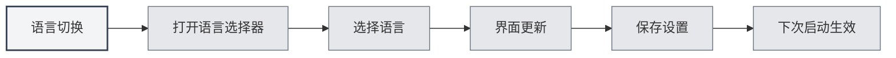

# 多言語サポート

## 概要

MetaDocは多言語インターフェースをサポートしており、ご利用の習慣に合わせて適切な言語を選択できます。言語を切り替えると、インターフェースは直ちに選択した言語に更新されます。

## サポート言語

MetaDocは現在以下の言語をサポートしています：

- **中文简体** (zh_CN)：デフォルト言語
- **English** (en_US)：英語
- **日本語** (ja_JP)：日本語
- **한국어** (ko_KR)：韓国語
- **Français** (fr_FR)：フランス語
- **Deutsch** (de_DE)：ドイツ語

## 言語切り替え

### 言語の切り替え

1.  左側メニュー下部の言語セレクターをクリックします
2.  使用する言語を選択します
3.  インターフェースは直ちに選択した言語に更新されます

上部メニューバーから言語設定にアクセスすることもできます：

<MenuItemsDemo mode="demo" :items='[{"id": "settings"}]' />

<SettingBasicSection mode="demo" />

<SettingLlmSection mode="demo" />



### 言語の保存

選択した言語は自動的に保存されます：

- **自動保存**：言語選択後、直ちに保存されます
- **次回起動時**：次回アプリケーション起動時には、前回選択した言語が使用されます
- **マルチウィンドウ同期**：すべてのウィンドウは自動的に言語設定を同期します

<SettingThemeSection mode="demo" />

## インターフェースのローカライズ

### ローカライズ範囲

言語切り替えは以下のインターフェース要素に影響します：

- **メニュー項目**：すべてのメニューとメニュー項目
- **ボタンテキスト**：すべてのボタンのテキスト
- **ダイアログ**：すべてのダイアログとメッセージ
- **設定ページ**：すべての設定ページのラベルと説明
- **エラーメッセージ**：エラーおよび警告メッセージ

### コンテンツ言語

言語設定はインターフェース言語にのみ影響し、以下には影響しません：

- **ドキュメントコンテンツ**：ドキュメントの内容はそのまま保持されます
- **ファイルパス**：ファイルパスはそのまま保持されます
- **ユーザー入力**：ユーザーが入力した内容には影響しません

<ViewMenuItemsDemo mode="demo" :items='["settings"]' />

## 言語選択のアドバイス

### 使用習慣に基づく

- **中国語ユーザー**：中文简体を使用すると、インターフェースがより馴染み深くなります
- **英語ユーザー**：Englishを使用すると、使用習慣に合致します
- **その他の言語**：個人の好みに基づいて選択してください

### ドキュメント言語に基づく

- **中国語ドキュメント**：中国語インターフェースを使用できます
- **英語ドキュメント**：英語インターフェースを使用できます
- **多言語ドキュメント**：最もよく使用する言語を選択してください

## 言語切り替えの効果

### 即時反映

言語切り替えは即座に反映されます：

- **インターフェース更新**：すべてのインターフェース要素が直ちに更新されます
- **再起動不要**：アプリケーションを再起動する必要はありません
- **状態保持**：現在の編集状態は失われません

<MainTabs mode="demo" />

### マルチウィンドウ同期

すべてのウィンドウは自動的に言語を同期します：

- **メインウィンドウ**：メインウィンドウの言語が切り替わります
- **補助ウィンドウ**：すべての補助ウィンドウが同期して更新されます
- **新規ウィンドウ**：新しく開かれたウィンドウは現在の言語を使用します

## 言語ファイル

### 言語ファイルの場所

言語ファイルはアプリケーションディレクトリに保存されています：

- **ファイル形式**：JSON形式
- **ファイル場所**：`src/renderer/src/locales/`
- **ファイル命名**：言語コードで命名されます（例：`zh_cn.json`）

### 言語ファイルの構造

言語ファイルはキーと値のペア構造を採用しています：

```json
{
  "common": {
    "confirm": "確認",
    "cancel": "取消"
  },
  "setting": {
    "basic": "基礎設置"
  }
}
```

## 注意事項

1.  **言語コード**：言語コードはアンダースコア形式を使用します（例：`zh_CN`）
2.  **翻訳の完全性**：一部の新機能は、一時的に一部の言語でのみ翻訳されている場合があります
3.  **フォールバック言語**：翻訳が欠落している場合、中文简体にフォールバックします
4.  **ドキュメントコンテンツ**：言語設定はドキュメントの内容に影響しません
5.  **ファイルパス**：言語設定はファイルパスの表示に影響しません

## 関連ドキュメント

- [[settings.basic|基本設定]]
- [[quick-start.guide|クイックスタートガイド]]

<ViewMenuItemsDemo mode="demo" :items='["settings"]' />
