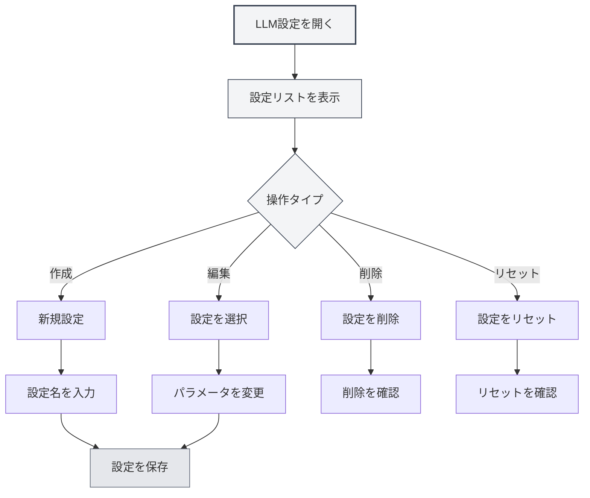

# LLM設定管理

## 概要

LLM設定管理では、複数のLLM設定を作成、編集、削除、管理することができます。設定管理を通じて、異なる使用シナリオに応じて異なるLLMサービスを設定し、柔軟に切り替えて様々なニーズに対応できます。

## 設定の作成

### 新規設定の作成

1.  LLM設定ページで、左側の設定リスト上部の「新規設定」ボタン（+アイコン）をクリックします
2.  表示されるダイアログに設定名を入力します
3.  システムは現在の設定に基づいて新しい設定を作成します
4.  作成が成功すると、自動的に新しい設定に切り替わります

上部メニューバーからLLM設定にアクセスできます：

<MenuItemsDemo mode="demo" :items='[{"id": "settings"}]' />

### 設定インターフェースのデモ

以下の図は、LLM設定管理インターフェースの主な機能を示しています：

<SettingLlmSection mode="demo" />

**注意事項**：

-   設定名は空にできません
-   設定名は識別しやすいように説明的であるべきです
-   新しく作成された設定は、現在のすべての設定を継承します
-   手動設定タイプ（manual）は新規設定の作成をサポートしていません



### 現在の設定から作成

新規設定を作成する際、システムは以下の操作を行います：

-   現在選択されているLLMタイプをコピーします
-   現在のすべての設定パラメータ（API URL、API Key、モデルなど）をコピーします
-   新しい設定IDを作成します
-   新しい設定を設定リストに追加します

既存の設定を基に新しい設定を作成し、その後パラメータを変更することで、類似した設定を素早く作成できます。

<DialogDemo mode="demo" dialogType="llm-config" />

## 設定の編集

### 設定パラメータの変更

1.  設定リストで編集する設定を選択します
2.  右側のフォームで各パラメータを変更します
3.  変更後、システムは「未保存の変更」としてマークします
4.  「変更を保存」ボタンをクリックして変更を保存します

<DialogDemo mode="demo" dialogType="api-config" />

### 設定パラメータの説明

LLMタイプによって設定パラメータは異なります：

-   **MetaDoc API**：モデル選択
-   **Ollama**：API URL、モデル選択、最大トークン数
-   **OpenAI互換**：API URL、API Key、モデル選択、サフィックス設定
-   **OpenAI公式**：API Key、モデル選択
-   **DeepSeek**：API Key、モデル選択
-   **Gemini**：API Key、モデル選択

### リアルタイムプレビュー

設定パラメータを変更する際、システムは変更をリアルタイムで検出します：

-   未保存の変更がある場合は警告ラベルが表示されます
-   いつでも「変更を破棄」をクリックして元に戻せます
-   保存後、変更は直ちに有効になります

<AIChat mode="demo" />

## 設定の削除

### 設定の削除

1.  設定項目の右側にある「その他」ボタン（三点アイコン）をクリックします
2.  「設定を削除」を選択します
3.  削除操作を確認します

**制限条件**：

-   少なくとも1つの設定を残す必要があり、最後の設定は削除できません
-   デフォルト設定（isDefault）は削除できず、リセットのみ可能です
-   削除操作は元に戻せません。慎重に操作してください

### 削除の確認

設定を削除する前に、システムは確認を求めます：

-   削除を確認すると、設定は永久に削除されます
-   現在使用中の設定を削除する場合、システムは自動的に他の設定に切り替えます
-   削除後は復元できません。その設定が不要であることを確認してください

<DialogDemo mode="demo" dialogType="confirm-delete" />

## 設定のリセット

### デフォルト設定のリセット

デフォルト設定（例：「Ollama (デフォルト)」）については、初期値にリセットできます：

1.  設定項目の右側にある「その他」ボタンをクリックします
2.  「設定をリセット」を選択します
3.  リセット操作を確認します

リセット後、設定は作成時のデフォルト値に戻り、すべてのカスタム変更はクリアされます。

**適用シナリオ**：

-   設定が誤って変更され、デフォルト値に戻す必要がある場合
-   設定をテストした後、リセットが必要な場合
-   不要なカスタム設定をクリーンアップする場合

## 設定のエクスポート

### 単一設定のエクスポート

1.  設定項目の右側にある「その他」ボタンをクリックします
2.  「設定をエクスポート」を選択します
3.  システムはJSON形式の設定ファイルを生成します
4.  ファイルをローカルに保存します

<DialogDemo mode="demo" dialogType="export-config" />

エクスポートされる設定ファイルには以下が含まれます：

-   設定IDと名前
-   LLMタイプ
-   すべての設定パラメータ
-   作成日時と更新日時

### すべての設定のエクスポート

1.  設定リスト上部の「すべての設定をエクスポート」ボタン（ダウンロードアイコン）をクリックします
2.  システムはすべての設定を1つのJSONファイルにエクスポートします
3.  ファイルをローカルに保存します

すべての設定をエクスポートすることは、以下の用途に使用できます：

-   すべての設定のバックアップ
-   他のデバイスへの移行
-   他のユーザーへの設定の共有

## 設定のインポート

### 設定のインポート

1.  設定リスト上部の「設定をインポート」ボタン（文書コピーアイコン）をクリックします
2.  以前にエクスポートした設定ファイルを選択します
3.  システムは設定を解析してインポートします
4.  インポートされた設定は設定リストに追加されます

<DialogDemo mode="demo" dialogType="import-config" />

**インポートルール**：

-   単一設定または設定配列のインポートをサポートします
-   インポートする設定IDが既に存在する場合、競合を避けるために新しいIDが作成されます
-   インポート後は、手動で新しい設定に切り替える必要があります

### インポート形式

設定ファイルはJSON形式である必要があり、以下の構造をサポートします：

```json
{
  "id": "config-xxx",
  "name": "設定名",
  "type": "ollama",
  "ollama": {
    "apiUrl": "http://localhost:11434/api",
    "selectedModel": "llama2"
  }
}
```

または設定配列：

```json
[
  { "id": "config-1", ... },
  { "id": "config-2", ... }
]
```

## 設定の並び替え

### ドラッグ＆ドロップによる並び替え

設定リストはドラッグ＆ドロップによる並び替えをサポートしています：

1.  設定項目をクリックして押し続けます
2.  目的の位置までドラッグします
3.  マウスを放して並び替えを完了します

並び替え後の順序は保存され、次回設定ページを開いた際に保持されます。

**使用シナリオ**：

-   よく使う設定を上部に配置する
-   使用頻度で並び替える
-   LLMタイプでグループ化する

## 設定の状態

### 現在の設定

現在使用中の設定は以下のようになります：

-   リスト内でハイライト表示されます
-   「未保存の変更」ラベルが表示されます（未保存の変更がある場合）
-   すべてのAI機能はこの設定のLLMサービスを使用します

### 設定の切り替え

設定を切り替える際：

-   システムは現在の設定に未保存の変更があるかチェックします
-   未保存の変更がある場合は、先に保存または破棄することを推奨します
-   切り替え後は直ちに有効になり、すべてのAI機能が新しい設定を使用します

## ベストプラクティス

1.  **命名規則**：明確な設定名を使用します（例：「仕事-Ollama」、「実験-OpenAI」）
2.  **定期的なバックアップ**：重要な設定は定期的にエクスポートしてバックアップします
3.  **設定のテスト**：新しい設定を作成したら、まずテストを行い、使用可能であることを確認してから使用します
4.  **不要な設定のクリーンアップ**：使用しなくなった設定は定期的に削除し、リストを整理整頓します
5.  **ドキュメント記録**：複雑な設定には備考や説明文書を追加します

## 注意事項

1.  **設定のセキュリティ**：API Keyを含む設定は適切に保管し、共有しないでください
2.  **設定の競合**：設定をインポートする際はIDの競合問題に注意してください
3.  **デフォルト設定**：デフォルト設定は削除できず、リセットのみ可能です
4.  **設定の依存関係**：一部の機能は特定の設定に依存している可能性があるため、削除前に確認してください
5.  **マルチウィンドウ同期**：設定の変更はすべてのウィンドウ間で同期されます

## 関連ドキュメント

-   [[settings.llm|LLM設定]]
-   [[settings.llm-types|LLMタイプ設定]]
-   [[ai.chat|AI対話機能]]
-   [[agent.config|Agent設定管理]]

<QuickStartPanel mode="demo" />

<MainTabs mode="demo" />