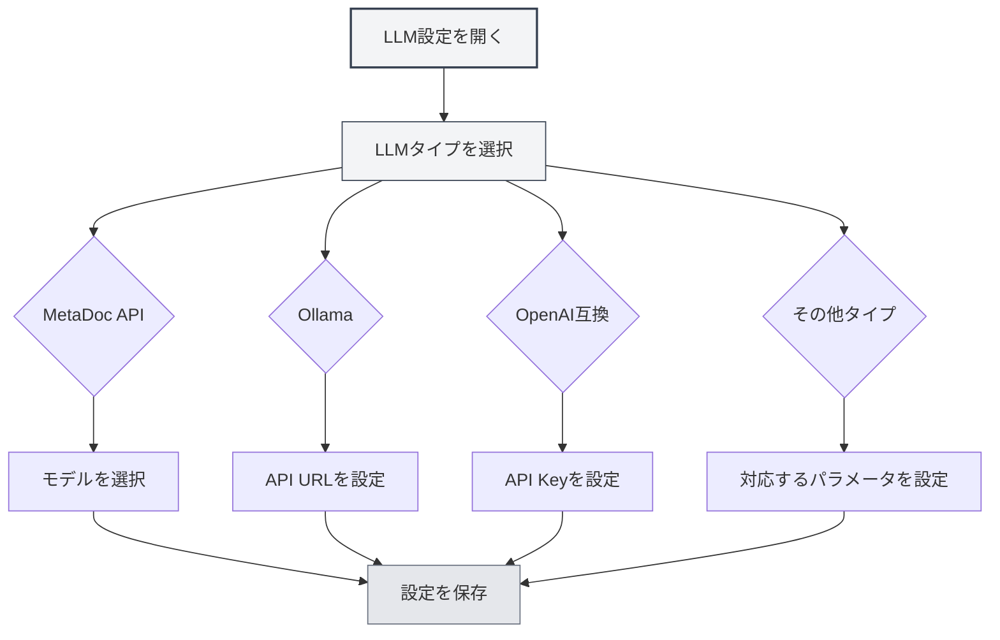

# LLMタイプ設定

## 概要

MetaDocは複数のLLMサービスプロバイダーをサポートしており、各タイプには異なる設定要件があります。このドキュメントでは、MetaDoc API、Ollama、OpenAI、DeepSeek、Geminiなど、さまざまなLLMタイプの設定方法について説明します。

## MetaDoc API

### 設定説明

MetaDoc APIはMetaDocが公式に提供するLLMサービスで、使いやすく、APIキーの設定は不要です。

### 設定手順

1.  LLMタイプのドロップダウンで「MetaDoc」を選択
2.  「モデルを選択」ドロップダウンで利用可能なモデルを選択
3.  最大トークン数を設定（オプション）

上部メニューバーからLLM設定にアクセスできます：

<MenuItemsDemo mode="demo" :items='[{"id": "settings"}]' />

### LLM設定画面デモ

以下の図は、LLM設定ページの主な機能エリアを示しています：

<SettingLlmSection mode="demo" />

### 設定要件

-   **アカウントログイン**：MetaDocアカウントへのログインが必要です
-   **モデル選択**：利用可能なモデルリストから選択します
-   **最大トークン数**：オプションで、1回のリクエストで生成可能な最大トークン数を制限します

<MainTabs mode="demo" />

### 適用シナリオ

-   AI機能をすぐに使い始めたい場合
-   外部サービスの設定が不要な場合
-   MetaDoc公式サービスを利用したい場合

<DialogDemo mode="demo" dialogType="llm-config" />

## Ollama

### 設定説明

OllamaはローカルLLM実行環境で、ネットワーク接続なしでローカルに大規模言語モデルを実行できます。

### 設定手順

1.  LLMタイプのドロップダウンで「Ollama」を選択
2.  APIベースURLを設定（デフォルト：`http://localhost:11434/api`）
3.  「モデルを選択」ドロップダウンをクリックすると、システムが自動的にローカルで利用可能なモデルリストを取得します
4.  使用するモデルを選択
5.  最大トークン数を設定（オプション）

### 設定要件

-   **Ollamaのインストール**：事前にOllamaをインストールし、サービスを起動する必要があります
-   **API URL**：デフォルトは `http://localhost:11434/api` です。Ollamaが別のアドレスで実行されている場合は変更が必要です
-   **モデルのダウンロード**：事前にOllamaを使用してモデルをダウンロードする必要があります（例：`ollama pull llama2`）

### モデルリストの取得

「モデルを選択」ドロップダウンをクリックすると、MetaDocは自動的にOllamaサービスに接続し、利用可能なモデルリストを取得します。接続に失敗した場合は、以下を確認してください：

-   Ollamaサービスが実行中か
-   API URLが正しいか
-   ネットワーク接続が正常か

### 適用シナリオ

-   データプライバシーを保護してローカルでLLMを実行したい場合
-   ネットワーク接続が不要な場合
-   十分な計算リソース（GPU推奨）がある場合

<DialogDemo mode="demo" dialogType="api-config" />

## OpenAI互換

### 設定説明

OpenAI互換APIは、OpenAI公式APIやサードパーティの互換サービスなど、OpenAI API形式に互換性のあるすべてのサービスをサポートします。

### 設定手順

1.  LLMタイプのドロップダウンで「OpenAI互換」を選択
2.  APIベースURLを設定（デフォルト：`https://api.openai.com/v1`）
3.  API Keyを入力
4.  「モデルを選択」ドロップダウンをクリックして利用可能なモデルリストを取得
5.  使用するモデルを選択
6.  CompletionサフィックスとChatサフィックスを設定（オプション、カスタムAPIパス用）
7.  最大トークン数を設定（オプション）

### 設定要件

-   **API URL**：OpenAI公式APIまたは互換サービスのAPIアドレス
-   **API Key**：サービスプロバイダーから取得したAPIキー
-   **モデルリスト**：システムが自動的に利用可能なモデルリストを取得します

### APIサフィックス設定

一部の互換サービスでは、カスタムAPIパスの設定が必要な場合があります：

-   **Completionサフィックス**：Completion API用のカスタムパスサフィックス
-   **Chatサフィックス**：Chat API用のカスタムパスサフィックス

ほとんどの場合、設定は不要でデフォルト値を使用できます。

### 適用シナリオ

-   OpenAI公式APIを使用する場合
-   OpenAI API互換のサードパーティサービスを使用する場合
-   カスタムAPIパスが必要なサービスを使用する場合

<QuickStartPanel mode="demo" />

<MainTabs mode="demo" />

## OpenAI公式

### 設定説明

OpenAI公式設定はOpenAI公式API専用で、設定がより簡単で、API URLは固定されています。

### 設定手順

1.  LLMタイプのドロップダウンで「OpenAI公式」を選択
2.  OpenAI API Keyを入力
3.  「モデルを選択」ドロップダウンをクリックして利用可能なモデルリストを取得
4.  使用するモデルを選択
5.  最大トークン数を設定（オプション）

### 設定要件

-   **API Key**：OpenAI公式サイトから取得したAPIキー
-   **API URL**：`https://api.openai.com/v1` に固定されており、変更できません

### API Keyの取得

1.  [OpenAI公式サイト](https://platform.openai.com/)にアクセス
2.  アカウントを登録またはログイン
3.  API Keysページに移動
4.  新しいAPI Keyを作成
5.  API KeyをコピーしてMetaDoc設定に貼り付け

<ResizableDivider mode="demo" />

### 適用シナリオ

-   OpenAI公式GPTモデルを使用する場合
-   安定した公式サービスが必要な場合
-   OpenAIアカウントとAPIクォータがある場合

## DeepSeek

### 設定説明

DeepSeekは高性能なLLMサービスプロバイダーで、強力な中国語理解能力を提供します。

### 設定手順

1.  LLMタイプのドロップダウンで「DeepSeek」を選択
2.  DeepSeek API Keyを入力
3.  モデルを選択（deepseek-chat または deepseek-reasoner）
4.  最大トークン数を設定（オプション）

### 設定要件

-   **API Key**：DeepSeek公式サイトから取得したAPIキー
-   **モデル選択**：
    -   `deepseek-chat`：汎用対話モデル
    -   `deepseek-reasoner`：推論モデル

### API Keyの取得

1.  [DeepSeek公式サイト](https://www.deepseek.com/)にアクセス
2.  アカウントを登録またはログイン
3.  API Keysページに移動
4.  新しいAPI Keyを作成
5.  API KeyをコピーしてMetaDoc設定に貼り付け

### 適用シナリオ

-   強力な中国語理解能力が必要な場合
-   推論能力が必要な場合（deepseek-reasonerを使用）
-   コストパフォーマンスの高いLLMサービスを求める場合

<SettingKnowledgeBaseSection mode="demo" />

<CompletionSettingsPanel mode="demo" />

## Gemini

### 設定説明

GeminiはGoogleが提供するLLMサービスで、マルチモーダル能力をサポートしています。

### 設定手順

1.  LLMタイプのドロップダウンで「Gemini」を選択
2.  Gemini API Keyを入力
3.  「モデルを選択」ドロップダウンをクリックして利用可能なモデルリストを取得
4.  使用するモデルを選択
5.  最大トークン数を設定（オプション）

### 設定要件

-   **API Key**：Google AI Studioから取得したAPIキー
-   **モデル選択**：システムが自動的に利用可能なモデルリストを取得します

### API Keyの取得

1.  [Google AI Studio](https://makersuite.google.com/app/apikey)にアクセス
2.  Googleアカウントでログイン
3.  新しいAPI Keyを作成
4.  API KeyをコピーしてMetaDoc設定に貼り付け

### 適用シナリオ

-   GoogleのLLMサービスを使用する場合
-   マルチモーダル能力が必要な場合
-   Googleアカウントを持っている場合

<AgentView mode="demo" />

## 最大トークン数設定

### 機能説明

最大トークン数は、1回のリクエストで生成できる最大トークン数を制限します。この機能を有効にすることで、以下が可能です：

-   生成コンテンツの長さを制御
-   API費用を節約
-   長すぎるコンテンツの生成を回避

### 設定方法

1.  「最大トークン数」スイッチを有効化
2.  トークン数を設定（範囲：1-32768）
3.  設定を保存

### 使用上の推奨

-   **短いテキスト生成**：100-500 トークン
-   **中程度の長さ**：500-2000 トークン
-   **長いテキスト生成**：2000-8000 トークン
-   **制限なし**：このオプションをオフにする

## 設定検証

### 設定テスト

設定完了後、設定が正常に機能するかテストすることをお勧めします：

1.  設定を保存
2.  LLM機能を有効化
3.  AI対話機能を試用
4.  エラーが発生した場合は、設定が正しいか確認

### よくある問題

**接続失敗**：

-   API URLが正しいか確認
-   ネットワーク接続を確認
-   サービスが正常に実行されているか確認

**認証失敗**：

-   API Keyが正しいか確認
-   API Keyの有効期限を確認
-   アカウントに十分なクォータがあるか確認

**モデルが利用不可**：

-   モデル名が正しいか確認
-   アカウントにそのモデルを使用する権限があるか確認
-   サービスがそのモデルをサポートしているか確認

## 注意事項

1.  **APIキーのセキュリティ**：APIキーは適切に保管し、他人と共有しないでください
2.  **費用管理**：外部APIの使用には費用が発生する可能性があるため、使用量に注意してください
3.  **ネットワーク要件**：外部APIを使用するには安定したネットワーク接続が必要です
4.  **サービスの可用性**：サービスによって可用性と安定性は異なる場合があります
5.  **モデル選択**：モデルによって能力と制限が異なります。必要に応じて選択してください

## 関連ドキュメント

-   [[settings.llm|LLM設定]]
-   [[settings.llm-management|LLM設定管理]]
-   [[ai.chat|AI対話機能]]
-   [[ai.completion|AI自動補完]]

<MenuItemsDemo mode="demo" :items='[{"id": "file"}]' />

<ViewMenuItemsDemo mode="demo" :items='["settings"]' />

<SettingLlmSection mode="demo" />

<DialogDemo mode="demo" dialogType="llm-config" />

<MainTabs mode="demo" />