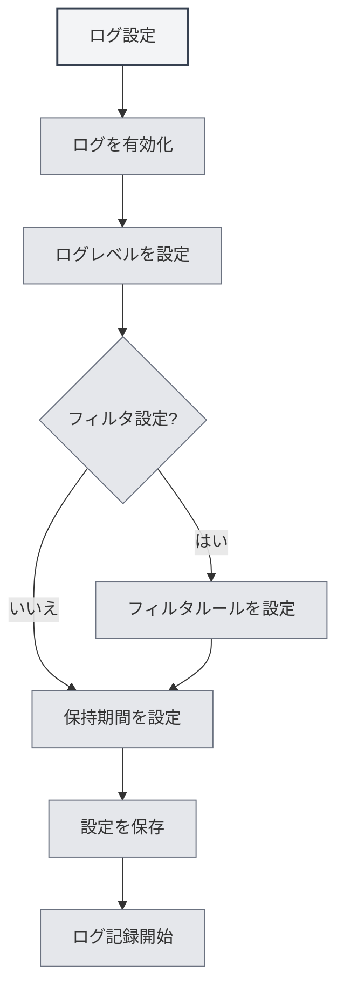

# ログ設定

## 概要

ログ設定では、MetaDocのログ記録機能を管理できます。ログを設定することで、アプリケーションの実行状態を記録し、問題の調査やパフォーマンス分析を容易に行うことができます。

<Demo component="SettingLoggerSection" mode="demo" />

## ログの有効化

### ログ機能の有効化

ログ設定ページでは、まずログ機能を有効にする必要があります：

1. 「ログを有効にする」スイッチを見つけます
2. スイッチを「有効」状態に切り替えます
3. ログがファイルに記録され始めます

上部メニューバーからログ設定にアクセスできます：

<MenuItemsDemo mode="demo" :items='[{"id": "settings"}]' />

ログを有効にすると、システムは以下のようなアプリケーションの実行情報を記録します：

- 操作記録
- エラー情報
- 警告情報
- デバッグ情報（有効な場合）



**注意事項**：

- ログは一定のディスク容量を消費します
- 問題調査が必要な場合に有効にすることを推奨します
- 本番環境ではリソース消費を減らすために無効にできます

## ログレベル

### レベル説明

ログレベルは、どのレベルのログを記録するかを決定します：

<ConsoleTerminal mode="demo" consoleKey="log-levels" :history='[{"content": "[INFO] 应用启动完成", "type": "out"}, {"content": "[DEBUG] 加载配置文件", "type": "out"}, {"content": "[WARN] 配置项缺失，使用默认值", "type": "warn"}, {"content": "[ERROR] 连接失败，正在重试...", "type": "error"}]' />

- **DEBUG**：詳細なデバッグ情報。すべての操作の詳細を含みます
- **INFO**：一般的な情報。重要な操作や状態を記録します
- **WARN**：警告情報。可能性のある問題を記録します
- **ERROR**：エラー情報。エラーや例外を記録します

### レベル優先順位

ログレベルには優先順位関係があります：

```
DEBUG < INFO < WARN < ERROR
```

あるレベルを選択すると、そのレベルおよびそれより上位のレベルのログが記録されます。例：

- INFOを選択：INFO、WARN、ERRORを記録
- WARNを選択：WARN、ERRORのみ記録
- ERRORを選択：ERRORのみ記録

### レベル選択の推奨

- **開発・デバッグ**：DEBUGレベルを使用し、詳細情報を取得します
- **日常使用**：INFOレベルを使用し、重要な操作を記録します
- **問題調査**：WARNレベルを使用し、警告とエラーに注目します
- **本番環境**：ERRORレベルを使用し、エラーのみ記録します

<SettingLoggerSection mode="demo" />

## ログフィルタ

### フィルタ機能

ログフィルタを使用すると、特定の範囲のログのみを記録できます：

- **スコープによるフィルタ**：特定のモジュールのログのみを記録します
- **プレフィックス一致**：プレフィックス一致をサポートします（例："ai-graph"は"ai-graph"で始まるすべてのスコープに一致）
- **完全一致**：完全一致をサポートします（例："[ai-graph][WorkflowTool]"）

### フィルタルール

フィルタルールは以下の形式をサポートします：

- **単純一致**：`ai-graph` - "ai-graph"を含むすべてのスコープに一致
- **プレフィックス一致**：`ai-` - "ai-"で始まるすべてのスコープに一致
- **完全一致**：`[ai-graph][WorkflowTool]` - そのスコープに完全一致

### 使用シナリオ

- **特定モジュールのデバッグ**：特定のモジュールのログのみを記録
- **ログ量の削減**：関心のないログを除外
- **問題の特定**：特定機能のログに集中

<SettingDebugSection mode="demo" />

### フィルタ例

**例1：AI関連ログのみ記録**

```
フィルタ条件：ai-
```

**例2：ワークフローログのみ記録**

```
フィルタ条件：workflow
```

**例3：特定ツールのログのみ記録**

```
フィルタ条件：[ai-graph][WorkflowTool]
```

## ログ保持期間

### 保持期間の設定

ログ保持期間は、ログファイルを保持する期間を決定します：

- **保持しない**：ログを自動的にクリーンアップしません
- **1日**：1日分のログを保持します
- **3日**：3日分のログを保持します
- **7日**：7日分のログを保持します
- **1ヶ月**：1ヶ月分のログを保持します
- **3ヶ月**：3ヶ月分のログを保持します
- **6ヶ月**：6ヶ月分のログを保持します
- **1年**：1年分のログを保持します
- **永久**：ログを永久に保持します

### 自動クリーンアップ

保持期間を設定すると、システムは期限切れのログファイルを自動的にクリーンアップします：

- **クリーンアップタイミング**：保持期間を変更した時点で即時実行
- **クリーンアップルール**：保持期間を超えたログファイルを削除
- **クリーンアップ範囲**：ログディレクトリ内のファイルのみをクリーンアップ

<ConsoleTerminal mode="demo" consoleKey="cleanup" :history='[{"content": "[INFO] 开始清理过期日志文件...", "type": "out"}, {"content": "[INFO] 删除: 2026-02-10 10-30-45.log (超过保留期限)", "type": "out"}, {"content": "[INFO] 删除: 2026-02-11 14-20-30.log (超过保留期限)", "type": "out"}, {"content": "[INFO] 清理完成，共删除 2 个文件", "type": "out"}]' />

### 選択の推奨

- **開発環境**：短い保持期間（1-3日）を使用
- **本番環境**：中程度の保持期間（7日-1ヶ月）を使用
- **重要プロジェクト**：長い保持期間（3-6ヶ月）を使用
- **監査要件**：永久保持を使用

## ログファイルパス

### ログパスの確認

ログ設定ページでは、以下を確認できます：

- **ログファイルパス**：現在のログファイルの完全なパス
- **ログディレクトリパス**：ログファイルが配置されているディレクトリのパス

### ログファイルを開く

1. ログ設定ページで「ログファイルパス」を見つけます
2. 「ログファイルを開く」ボタンをクリックします
3. システムがデフォルトのテキストエディタでログファイルを開きます

### ログディレクトリを開く

1. ログ設定ページで「ログディレクトリ」を見つけます
2. 「ログディレクトリを開く」ボタンをクリックします
3. システムがファイルマネージャでログディレクトリを開きます

<ViewMenuItemsDemo mode="demo" :items='["home", "editor"]'
/>

## ログコンソール

### ログのリアルタイム表示

ログ設定ページにはログコンソールが用意されており、ログをリアルタイムで表示できます：

- **リアルタイム表示**：最新のログエントリを表示
- **履歴**：最近のログ履歴を表示（最大500件）
- **ログレベル**：異なるレベルのログは異なる色で表示

<ConsoleTerminal mode="demo" consoleKey="realtime-logs" :history='[{"content": "[2026-02-24 10:30:15] [INFO] [main][App] 应用启动完成", "type": "out"}, {"content": "[2026-02-24 10:30:16] [DEBUG] [renderer][Editor] 编辑器初始化", "type": "out"}, {"content": "[2026-02-24 10:30:18] [INFO] [renderer][Workspace] 加载工作目录", "type": "out"}]' />

### コンソール機能

- **ログ表示**：アプリケーションログをリアルタイムで表示
- **表示フィルタ**：ログレベルに基づいて表示をフィルタリング
- **ログ検索**：コンソール内でログ内容を検索

## ログファイル形式

### ファイル命名

ログファイルは以下の命名形式を使用します：

```
YYYY-MM-DD HH-mm-ss.log
```

例：`2026-02-19 14-30-45.log`

### ログ形式

各ログには以下の情報が含まれます：

- **タイムスタンプ**：ログが記録された時刻
- **レベル**：ログレベル（DEBUG/INFO/WARN/ERROR）
- **プロセス種別**：main（メインプロセス）またはrenderer（レンダラープロセス）
- **スコープ**：ログの発生元モジュールまたはコンポーネント
- **メッセージ**：ログメッセージの内容

### ログ例

```
[2026-02-19 14:30:45] [INFO] [main][Logger] 日志配置更新: enabled=true, level=info
[2026-02-19 14:30:46] [DEBUG] [renderer][Editor] 文档已保存
[2026-02-19 14:30:47] [WARN] [main][RAG] 知识库文件未找到
[2026-02-19 14:30:48] [ERROR] [renderer][LLM] API调用失败
```

<ConsoleTerminal mode="demo" consoleKey="log-examples" :history='[{"content": "[2026-02-19 14:30:45] [INFO] [main][Logger] 日志配置更新: enabled=true, level=info", "type": "out"}, {"content": "[2026-02-19 14:30:46] [DEBUG] [renderer][Editor] 文档已保存", "type": "out"}, {"content": "[2026-02-19 14:30:47] [WARN] [main][RAG] 知识库文件未找到", "type": "warn"}, {"content": "[2026-02-19 14:30:48] [ERROR] [renderer][LLM] API调用失败", "type": "error"}]' />

## ベストプラクティス

1. **適切なレベルの設定**：使用シナリオに応じて適切なログレベルを選択
2. **フィルタの活用**：フィルタ機能を使用してログ量を削減
3. **定期的なクリーンアップ**：適切な保持期間を設定し、過剰な容量消費を回避
4. **問題調査**：問題発生時は、一時的にログレベルを上げて詳細情報を取得
5. **ログのバックアップ**：重要なログはバックアップ保存を推奨

<MainTabs mode="demo" />

## 注意事項

1. **ディスク容量**：ログはディスク容量を消費するため、定期的なクリーンアップに注意
2. **パフォーマンス影響**：DEBUGレベルはパフォーマンスに影響する可能性があるため、デバッグ時のみの使用を推奨
3. **プライバシーとセキュリティ**：ログには機密情報が含まれる可能性があるため、ログファイルの保護に注意
4. **ファイル権限**：ログディレクトリに書き込み権限があることを確認
5. **ログの場所**：ログファイルの場所はシステムによって自動管理されるため、手動での変更は推奨しません

## 関連ドキュメント

- [[settings.basic|基本設定]]
- [[settings.about|情報について]]


<ResizableDivider mode="demo" />
