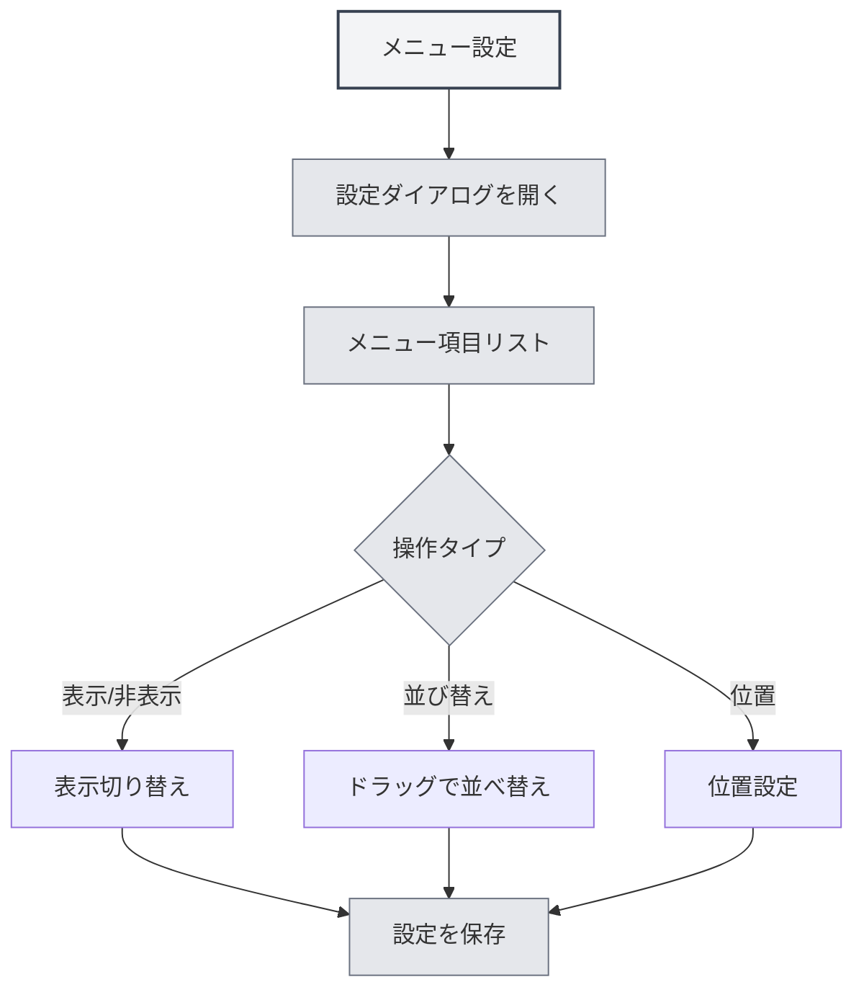

# メニュー設定

## 概要

メニュー設定機能では、左側メニューの表示と順序をカスタマイズできます。メニュー設定を通じて、不要なメニュー項目を非表示にしたり、メニューの順序を調整したり、メニューの位置を設定したりして、個人に合わせたインターフェースレイアウトを作成できます。

## メニュー設定を開く

### アクセス方法

以下の方法でメニュー設定を開くことができます：

- **設定ページ**：設定ページ内にメニュー設定へのエントリがある場合があります
- **メニューオプション**：左側メニューの「その他の機能」内にメニュー設定オプションがある場合があります
- **右クリックメニュー**：一部のメニュー項目には設定オプションがある場合があります

上部メニューバーからメニュー設定にアクセスできます：

<MenuItemsDemo mode="demo" :items='[{"id": "settings"}]' />

## メニュー項目管理

### メニュー項目リスト

メニュー設定ページには、設定可能なすべてのメニュー項目が表示されます：

- **メニュー項目名**：メニュー項目の名前を表示
- **表示状態**：メニュー項目が表示されているかどうかを表示
- **位置**：メニュー項目の位置（上部/下部）を表示
- **コア識別**：コアメニュー項目（非表示不可）を識別

### メニュー項目タイプ

メニュー項目は2種類に分けられます：

- **コアメニュー項目**：表示が必須で、非表示にできないメニュー項目
  - ホーム
  - ファイル
  - 設定
  - その他の機能
  - 終了
- **通常メニュー項目**：非表示にできるメニュー項目
  - AIアシスタント
  - 最近のファイル
  - ナレッジベース
  - 作業ディレクトリ
  - ユーザーマニュアル
  - ユーザーフィードバック
  - LLM統計
  - デバッグツール（開発環境）

## メニュー項目の表示/非表示

### メニュー項目を非表示にする

不要なメニュー項目を非表示にできます：

1. **設定を開く**：メニュー設定ダイアログを開く
2. **メニュー項目を探す**：非表示にするメニュー項目を見つける
3. **表示状態を切り替える**：メニュー項目の表示切り替えスイッチを操作する
4. **設定を保存する**：「保存」ボタンをクリックして設定を保存

<DialogDemo mode="demo" dialogType="menu-config" />

### メニュー項目を表示する

非表示になっているメニュー項目を表示できます：

1. **設定を開く**：メニュー設定ダイアログを開く
2. **メニュー項目を探す**：表示するメニュー項目を見つける
3. **表示状態を切り替える**：メニュー項目の表示切り替えスイッチを操作する
4. **設定を保存する**：「保存」ボタンをクリックして設定を保存

### コアメニュー項目の制限

コアメニュー項目は非表示にできません：

- **強制表示**：コアメニュー項目は常に表示されます
- **非表示不可**：コアメニュー項目の表示切り替えスイッチは無効化されます
- **自動復元**：コアメニュー項目を非表示にしようとすると、自動的に表示状態に戻ります

## メニュー項目の並び替え

### ドラッグでの並び替え

ドラッグ操作でメニュー項目の順序を調整できます：

1. **設定を開く**：メニュー設定ダイアログを開く
2. **メニュー項目をドラッグ**：メニュー項目のドラッグハンドルをクリックしてドラッグする
3. **位置を調整**：メニュー項目を目的の位置までドラッグする
4. **設定を保存**：「保存」ボタンをクリックして設定を保存

### 並び替えルール

メニュー項目の並び替えは以下のルールに従います：

- **位置グループ化**：上部メニュー項目と下部メニュー項目は別々に並び替えられます
- **区切り線**：上部と下部の間に区切り線が表示されます
- **自動調整**：異なる位置にドラッグすると、位置属性が自動的に調整されます

## メニュー項目の位置設定

### 位置タイプ

メニュー項目には2種類の位置を設定できます：

- **上部**：メニューバーの上部エリアに表示
- **下部**：メニューバーの下部エリアに表示

### 位置を設定する

メニュー項目の位置を設定できます：

1. **設定を開く**：メニュー設定ダイアログを開く
2. **位置にドラッグ**：メニュー項目を上部または下部エリアにドラッグする
3. **自動調整**：システムが自動的に位置属性を調整します
4. **設定を保存**：「保存」ボタンをクリックして設定を保存

<LeftMenu mode="demo" />

### 位置区切り線

上部と下部の間には区切り線が表示されます：

- **自動表示**：上部と下部のメニュー項目がある場合、自動的に区切り線が表示されます
- **ドラッグ不可**：区切り線はドラッグできず、視覚的な区切りとして機能します
- **自動非表示**：上部または下部のメニュー項目のみの場合、区切り線は自動的に非表示になります

## 設定の保存

### 自動保存

一部の操作では設定が自動的に保存されます：

- **表示状態の切り替え**：メニュー項目の表示状態を切り替えると自動保存
- **位置調整**：メニューの位置を調整すると自動保存

### 手動保存

設定を手動で保存することもできます：

1. **設定を調整**：メニュー項目の順序と表示状態を調整する
2. **保存をクリック**：「保存」ボタンをクリックする
3. **設定が有効化**：設定が直ちに有効になります

### 設定のリセット

メニュー設定をリセットできます：

1. **設定を開く**：メニュー設定ダイアログを開く
2. **リセットをクリック**：「リセット」ボタンをクリックする
3. **リセットを確認**：リセット操作を確認する
4. **デフォルトに復元**：設定がデフォルト状態に戻ります

**注意事項**：

- リセット操作は元に戻せません
- リセット後もコアメニュー項目は表示されたままです

<DialogDemo mode="demo" dialogType="confirm-reset" />

## 設定の永続化

### 設定の保存

メニュー設定はローカルに保存されます：

- **ローカル保存**：設定はローカル設定に保存されます
- **自動読み込み**：次回アプリケーション起動時に自動的に設定が読み込まれます
- **マルチウィンドウ同期**：設定はすべてのウィンドウ間で同期されます

### 設定の移行

旧バージョンの設定は自動的に移行されます：

- **位置移行**：旧バージョンの「middle」位置は自動的に「bottom」に移行されます
- **互換性処理**：システムは旧バージョンの設定形式を自動的に処理します
- **スムーズなアップグレード**：アップグレード後、設定は自動的に新バージョンに適応されます

## ベストプラクティス

1. **メニューの簡素化**：使用頻度の低いメニュー項目を非表示にして、インターフェースをシンプルに保つ
2. **合理的な並び替え**：よく使うメニュー項目を前に配置して、アクセスしやすくする
3. **位置グループ化**：関連するメニュー項目を同じ位置エリアに配置する
4. **定期的な調整**：使用習慣に基づいて定期的にメニュー設定を調整する
5. **設定のバックアップ**：重要な設定はバックアップを取っておき、復元しやすくする

## 注意事項

1. **コアメニュー項目**：コアメニュー項目は非表示にできず、必ず表示されます
2. **設定の保存**：一部の操作は自動保存されますが、一部は手動保存が必要です
3. **リセット操作**：リセット操作は元に戻せないため、注意して使用してください
4. **マルチウィンドウ同期**：設定はすべてのウィンドウ間で同期されます
5. **開発ツール**：デバッグツールは開発環境でのみ表示されます

## 関連ドキュメント

- [[settings.basic|基本設定]]
- [[core.multi-tab|マルチタブ管理]]

<MainTabs mode="demo" />

<LeftMenu mode="demo" />

<MenuItemsDemo mode="demo" :items='[{"id": "settings"}]' />

<DialogDemo mode="demo" dialogType="menu-config" />

<MenuItemsDemo mode="demo" :items='[{"id": "file", "items": ["new", "open"]}]' />

<DialogDemo mode="demo" dialogType="confirm-reset" />
