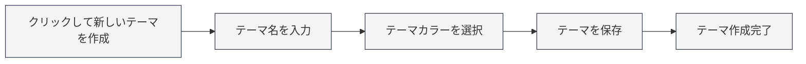

# カスタムテーマ管理

## 概要

カスタムテーマ管理では、カスタムテーマの作成、編集、削除、複製が可能です。カスタムテーマを使用することで、個人の好みに合ったインターフェースの外観を作り上げ、使用体験を向上させることができます。

## 新しいカスタムテーマの作成

### 新規テーマの作成

1.  テーマ設定ページで、「新しいテーマ」カード（+アイコン）をクリックします。
2.  表示されるダイアログで：
    *   テーマ名を入力します（オプション、デフォルトはカラー値を使用）。
    *   テーマカラーを選択します（カラーピッカーを使用）。
3.  「保存」ボタンをクリックします。

上部メニューバーからテーマ設定にアクセスできます：

<MenuItemsDemo mode="demo" :items='[{"id": "settings"}]' />

### テーマカラーの選択

カラーピッカーは以下の機能を提供します：

*   **カラー選択**：カラー領域をクリックして色を選択します。
*   **プリセットカラー**：プリセットカラーリストから選択します。
*   **透明度調整**：カラーの透明度（アルファチャンネル）を調整します。
*   **カラー値入力**：HEXカラー値を直接入力します。

### テーマの命名

*   **自動命名**：名前を入力しない場合、システムはカラー値を名前として使用します。
*   **カスタム名**：識別と管理を容易にするため、意味のある名前を入力します。
*   **命名の提案**：「作業用テーマ」、「ナイトモード」など、説明的な名前を使用します。

<SettingThemeSection mode="demo" />

## カスタムテーマの編集

### テーマの変更

1.  テーマリストで、編集するカスタムテーマを見つけます。
2.  テーマカード上の「その他」ボタン（三点アイコン）をクリックします。
3.  「編集」を選択します。
4.  ダイアログでテーマ名またはカラーを変更します。
5.  「保存」ボタンをクリックします。

<DialogDemo mode="demo" dialogType="theme-edit" />

### カラーのクイック編集

テーマカード上で直接カラーを編集することもできます：

1.  テーマカード上のカラーピッカーをクリックします。
2.  新しいカラーを選択します。
3.  カラーが即座に適用されます。

**注意事項**：

*   プリセットテーマは編集できません。
*   カスタムテーマのみ編集可能です。
*   編集後、保存して初めて永続的に有効になります。

## カスタムテーマの削除

### テーマの削除

1.  テーマリストで、削除するカスタムテーマを見つけます。
2.  テーマカード上の「その他」ボタンをクリックします。
3.  「削除」を選択します。
4.  削除操作を確認します。

**注意事項**：

*   削除操作は元に戻せません。
*   現在使用中のテーマを削除すると、システムは自動的にデフォルトテーマに切り替わります。
*   プリセットテーマは削除できません。

## テーマの複製

### 既存テーマの複製

1.  テーマリストで、複製するテーマを見つけます。
2.  テーマカード上の「その他」ボタンをクリックします。
3.  「複製」を選択します。
4.  システムはコピーを作成し、名前の後に「コピー」を追加します。
5.  コピーを編集して新しいテーマを作成できます。

### 使用シナリオ

*   **既存テーマを基に新規テーマを作成**：複製後にカラーを変更します。
*   **テーマのバリエーションを作成**：類似しているがわずかに異なるテーマを作成します。
*   **テーマのバックアップ**：バックアップとして複製します。

## テーマカラー設定

### カラーピッカーの機能

カラーピッカーは豊富なカラー選択機能を提供します：

*   **カラーパネル**：クリックしてカラーを選択します。
*   **プリセットカラー**：よく使われるカラーを素早く選択します。
*   **カラー値入力**：HEX、RGB、HSLなどの形式を直接入力します。
*   **透明度調整**：カラーの透明度を調整します。

<DialogDemo mode="demo" dialogType="color-picker" />

### プリセットカラー

MetaDocは複数のプリセットカラーを提供しています：

*   **基本色**：赤、オレンジ、黄、緑、シアン、青、紫、グレー
*   **ライト系**：ライトレッド、ライトオレンジ、ライトイエローなど
*   **ダーク系**：ダークレッド、ダークオレンジ、ダークイエローなど

### カラーフォーマット

サポートされているカラーフォーマット：

*   **HEX**：`#FF5733`（最も一般的）
*   **RGB**：`rgb(255, 87, 51)`
*   **HSL**：`hsl(9, 100%, 60%)`

## テーマの適用

### カスタムテーマの適用

1.  テーマリストで、使用するカスタムテーマのカードをクリックします。
2.  テーマが即座に適用されます。
3.  インターフェースのカラーはテーマカラーに基づいて自動生成されます。

### テーマカラーの影響

テーマカラーは以下のインターフェース要素に影響します：

*   **背景色**：メイン背景とサブ背景
*   **テキスト色**：主要テキストと補助テキスト
*   **サイドバー**：サイドバーの背景とテキスト
*   **エディター**：エディターの背景とツールバー
*   **その他の要素**：ボタン、ボーダー、ハイライトなど

### 自動配色

MetaDocはテーマカラーに基づいて自動的に配色を生成します：

*   **ライトテーマ**：テーマカラーが明るい場合、ライト配色を生成します。
*   **ダークテーマ**：テーマカラーが暗い場合、ダーク配色を生成します。
*   **配色アルゴリズム**：カラーブレンディングと彩度調整を使用します。

## テーマ管理

### テーマリスト

テーマ設定ページには利用可能なすべてのテーマが表示されます：

*   **プリセットテーマ**：システムに組み込まれたテーマ
*   **カスタムテーマ**：ユーザーが作成したテーマ
*   **現在のテーマ**：選択マークを表示

### テーマの並び順

テーマは以下の順序で表示されます：

1.  システム同期テーマ（システムに追従）
2.  ライト/ダークプリセットテーマ
3.  カスタムテーマ（作成日時順）

### テーマの状態

各テーマカードには以下が表示されます：

*   **テーマカラープレビュー**：テーマの主要カラーを表示します。
*   **テーマ名**：テーマの名前を表示します。
*   **カラー値**：カラーのHEX値を表示します。
*   **選択マーク**：現在使用中のテーマ

## ベストプラクティス

1.  **テーマ命名**：識別しやすいように、意味のある名前を使用します。
2.  **カラー選択**：目に優しいカラーを選択し、過度に鮮やかな色は避けます。
3.  **テーマのバックアップ**：重要なテーマは複製してバックアップすることをお勧めします。
4.  **定期的な整理**：使用しなくなったテーマは削除し、リストを整理された状態に保ちます。
5.  **効果のテスト**：テーマ作成後は実際の効果をテストし、使用体験に基づいて調整します。

## 注意事項

1.  **プリセットテーマ**：プリセットテーマは編集または削除できません。
2.  **テーマの互換性**：一部のテーマは環境によって表示効果が異なる場合があります。
3.  **カラー選択**：可読性を確保するため、適度なコントラストのカラーを選択することをお勧めします。
4.  **テーマの数**：テーマを過剰に作成せず、リストを簡潔に保つことをお勧めします。
5.  **テーマの同期**：テーマの変更はすべてのウィンドウ間で同期されます。

## 関連ドキュメント

*   [[settings.theme|テーマ設定]]
*   [[settings.basic|基本設定]]
*   [[core.editor-settings|エディター設定]]

<ResizableDivider mode="demo" />

<SettingThemeSection mode="demo" />

<MenuItemsDemo mode="demo" :items='[{"id": "settings", "items": ["theme"]}]' />

<DialogDemo mode="demo" dialogType="color-picker" />

<DialogDemo mode="demo" dialogType="theme-edit" />

<MenuItemsDemo mode="demo" :items='[{"id": "settings"}]' />
