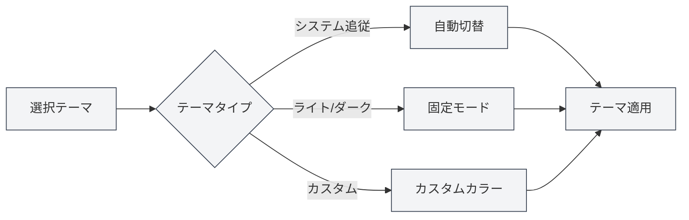

# テーマ設定

## 概要

テーマ設定では、MetaDocの外観をカスタマイズできます。グローバルテーマ、コンテンツテーマ、コードテーマなどを含みます。適切なテーマ設定は、使用体験を向上させ、視覚的な疲労を軽減します。

## グローバルテーマ

### テーマタイプ

MetaDocは以下のグローバルテーマタイプをサポートしています：

- **システムの明暗に追従**：オペレーティングシステムのライト/ダークモードに自動的に追従
- **システムのカラーに追従**：オペレーティングシステムのテーマカラーに追従（Windows 11）
- **ライト**：ライトテーマを固定で使用
- **ダーク**：ダークテーマを固定で使用
- **カスタム**：カスタムテーマカラーを使用

### テーマの選択

1.  テーマ設定ページで、テーマカードを閲覧します
2.  使用したいテーマカードをクリックします
3.  テーマが即座に適用されます

トップメニューバーからテーマ設定にアクセスできます：

<MenuItemsDemo mode="demo" :items='[{"id": "settings"}]' />

### ライトテーマのプレビュー

<SettingThemeSection mode="demo" theme="light" />

### ダークテーマのプレビュー

<SettingThemeSection mode="demo" theme="dark" />

### テーマ設定インターフェース

以下の図は、テーマ設定ページの完全なインターフェースを示しています：

<SettingThemeSection mode="demo" />

<ViewMenuItemsDemo mode="demo" :items='["editor", "outline"]' />

テーマ設定インターフェースには、以下の主要な機能エリアが含まれます：

- **グローバルテーマ**：ライト、ダーク、システム追従、またはカスタムテーマを選択
- **コンテンツテーマ**：エディターエリアの表示テーマを設定
- **コードテーマ**：コードブロックのシンタックスハイライトテーマを選択
- **行番号表示**：コードブロックに行番号を表示するかどうかを制御
- **カスタムテーマ**：カスタムカラーテーマの作成と管理

### テーマプレビュー

各テーマカードには以下が表示されます：

- **テーマカラープレビュー**：テーマの主要な色を表示
- **テーマ名**：テーマの名前を表示
- **選択マーク**：現在使用中のテーマには選択マークが表示されます

## コンテンツテーマ

<SettingThemeSection mode="demo" />

### コンテンツテーマの設定

コンテンツテーマは、ドキュメント編集エリアの表示テーマを制御します：

- **自動**：グローバルテーマに追従
- **ライト**：ライトコンテンツテーマを固定で使用
- **ダーク**：ダークコンテンツテーマを固定で使用

### 使用シナリオ

- **グローバルダーク、コンテンツライト**：暗い環境でライトドキュメントを編集するのに適しています
- **グローバルライト、コンテンツダーク**：明るい環境でダークドキュメントを編集するのに適しています
- **自動モード**：コンテンツテーマがグローバルテーマに自動的に追従します

## コードテーマ

<SettingThemeSection mode="demo" />

### コードテーマの設定

コードテーマは、コードブロックのシンタックスハイライトテーマを制御します：

- **自動**：グローバルテーマに基づいて自動選択
- **カスタム**：コードテーマリストから選択

### コードテーマリスト

MetaDocは、以下のような多様なコードテーマをサポートしています：

- **ライトテーマ**：GitHub、VS、OneLightなど
- **ダークテーマ**：Monokai、Dracula、OneDarkなど

### 選択の提案

- **ライトドキュメント**：ライトコードテーマを使用
- **ダークドキュメント**：ダークコードテーマを使用
- **自動モード**：システムに自動選択させ、一貫性を保つ

## 行番号表示

<SettingThemeSection mode="demo" />

### 行番号の表示

「コードボックスに行番号を表示」を有効にすると、コードブロックに行番号が表示されます：

- **有効**：コードブロックの左側に行番号を表示
- **無効**：行番号を表示しない

### 使用シナリオ

- **コードデバッグ**：行番号はコード位置の特定に役立ちます
- **コード共有**：行番号は特定の行を参照するのに便利です
- **コード読解**：行番号はコード構造の理解に役立ちます

## テーマ切替

<SettingThemeSection mode="demo" />

<ViewMenuItemsDemo mode="demo" :items='["editor", "outline"]' />

### リアルタイム切替

テーマ切替は即座に反映されます：

1.  新しいテーマを選択
2.  インターフェースが即座に更新
3.  すべてのウィンドウに同期して適用

### テーマ同期

- **マルチウィンドウ同期**：すべてのウィンドウは自動的にテーマを同期します
- **設定保存**：テーマ選択は自動的に保存されます
- **次回起動時**：次回起動時には、前回選択したテーマが使用されます

## プリセットテーマ

<SettingThemeSection mode="demo" />

### 内蔵テーマ

MetaDocは、以下のような多様なプリセットテーマを提供しています：

- **ライトテーマ**：明るい環境に適しています
- **ダークテーマ**：暗い環境に適しています
- **システム同期**：システム設定に自動的に追従

### プリセットテーマの特徴

- **最適化された配色**：注意深く設計されたカラースキーム
- **目に優しい設計**：視覚的な疲労を軽減
- **一貫性**：インターフェース要素の一貫性を保証

## ベストプラクティス

1.  **環境適応**：使用環境に応じてテーマを選択
2.  **コンテンツマッチング**：コンテンツテーマとドキュメントタイプを一致させる
3.  **コード可読性**：コードの可読性が高いコードテーマを選択
4.  **定期的な調整**：使用体験に基づいてテーマ設定を調整

## 注意事項

1.  **システム互換性**：システムテーマへの追従にはオペレーティングシステムのサポートが必要です
2.  **テーマ一貫性**：グローバルテーマとコンテンツテーマの一貫性を保つことをお勧めします
3.  **コードテーマ**：コードテーマはコードの可読性に影響します
4.  **カスタムテーマ**：カスタムテーマは手動で作成・管理する必要があります

## 関連ドキュメント

- [[settings.theme-custom|カスタムテーマ管理]]
- [[settings.basic|基本設定]]
- [[core.editor-settings|エディター設定]]
