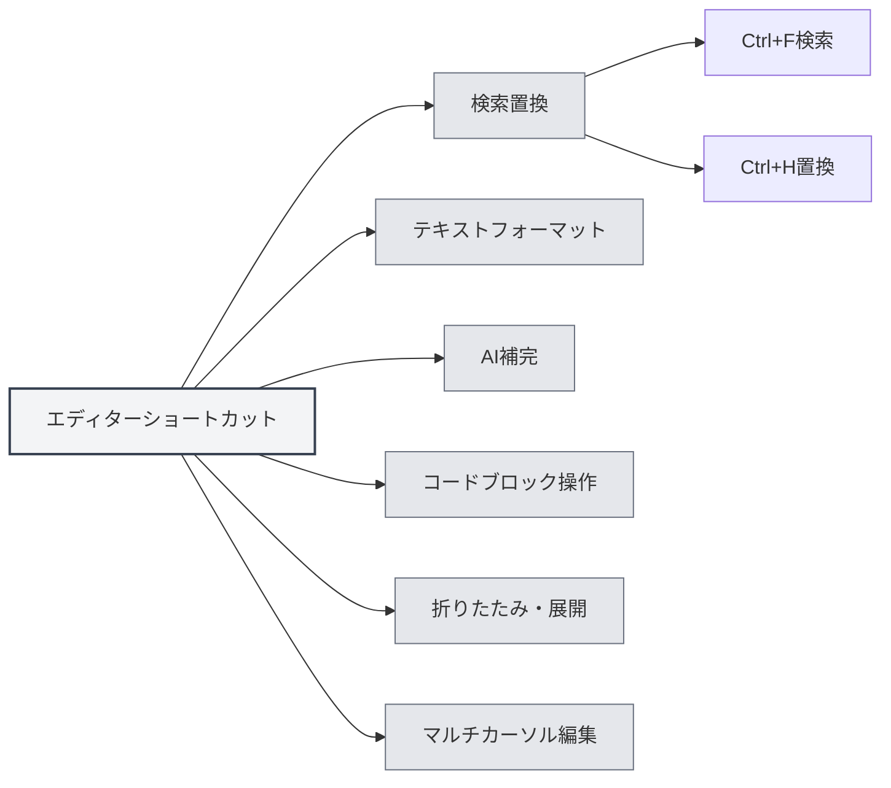

# エディターショートカット

## 概要

エディターショートカットは、エディターインターフェースで使用するショートカットキーであり、テキスト編集、検索・置換、フォーマットなどの機能を含みます。これらのショートカットを習熟することで、編集効率を向上させることができます。

<MenuItemsDemo mode="demo" :items='[{"id": "edit"}]' />

<ViewMenuItemsDemo mode="demo" :items='["editor", "outline"]' />

**説明**：検索/置換（Ctrl+F、Ctrl+H）はアプリケーション全体で実装されています。太字/斜体/リンク/コードブロックなどは、基盤となるエディター（MarkdownはVditor、LaTeXはMonacoを使用）によって提供されます。無効な場合は、実際のエディターの動作を基準としてください。

## 検索と置換

### 検索

- **ショートカット**：`Ctrl+F`（Windows/Linux）または `Cmd+F`（macOS）
- **機能**：検索ダイアログを開く
- **使用場面**：ドキュメント内で特定のテキストを検索する

### 検索と置換

- **ショートカット**：`Ctrl+H`（Windows/Linux）または `Cmd+H`（macOS）
- **機能**：検索・置換ダイアログを開く
- **使用場面**：テキストを検索して置換する

### 検索機能

検索ダイアログは以下の機能をサポートしています：

- **テキスト検索**：検索するテキストを入力
- **テキスト置換**：置換後のテキストを入力
- **正規表現**：正規表現検索をサポート
- **大文字小文字の区別**：大文字と小文字を区別
- **単語単位の一致**：完全な単語に一致

検索・置換メニューインターフェースは以下の通りです：

<SearchReplaceMenu mode="demo" :position='{"top": 100, "left": 200}' :adapter='null' />

<SearchReplaceMenu mode="demo" :position='{"top": 150, "left": 200}' :adapter='null' />

## テキストフォーマット

<TextFormatToolbar mode="demo" />

### 太字

- **ショートカット**：`Ctrl+B`（Windows/Linux）または `Cmd+B`（macOS）
- **機能**：選択したテキストを太字にする
- **使用場面**：重要な内容を強調する

### 斜体

- **ショートカット**：`Ctrl+I`（Windows/Linux）または `Cmd+I`（macOS）
- **機能**：選択したテキストを斜体にする
- **使用場面**：引用や強調を表す

### リンクの挿入

- **ショートカット**：`Ctrl+K`（Windows/Linux）または `Cmd+K`（macOS）
- **機能**：リンクを挿入する
- **使用場面**：ハイパーリンクを追加する

**注意事項**：このショートカットは「すべて保存（Ctrl+K S）」と競合する可能性があります。同時に押すのではなく、まずCtrl+Kを押し、次にKを押す必要があります。

## AI補完

<AISuggestionGhost mode="demo" />

<CompletionSettingsPanel mode="demo" />

### 手動トリガー補完

- **ショートカット**：`Shift+Tab`
- **機能**：AI自動補完を手動でトリガーする
- **使用場面**：AI補完が必要なときに手動でトリガーする

### 補完トリガーキー

AI補完は以下のキーでも自動的にトリガーできます：

- **Enter**：Enterキーでトリガー
- **Space**：スペースキーでトリガー
- **セミコロン**：セミコロン（;）でトリガー
- **スラッシュ**：スラッシュ（/）でトリガー

これらのトリガーキーは[[settings.llm|LLM設定]]で設定できます。

## コードブロック操作

### コードブロックの挿入

- **ショートカット**：`Ctrl+Shift+K`（Markdownエディター）
- **機能**：コードブロックを挿入する
- **使用場面**：コード例を追加する

## 折りたたみ・展開

### コードブロックの折りたたみ

- **ショートカット**：`Ctrl+Shift+[`（Windows/Linux）または `Cmd+Option+[`（macOS）
- **機能**：現在のコードブロックまたは環境を折りたたむ
- **使用場面**：表示する必要のないコードを隠す

### コードブロックの展開

- **ショートカット**：`Ctrl+Shift+]`（Windows/Linux）または `Cmd+Option+]`（macOS）
- **機能**：折りたたまれたコードブロックまたは環境を展開する
- **使用場面**：折りたたまれた内容を表示する

## マルチカーソル編集

### 同じ単語をすべて選択

- **ショートカット**：`Ctrl+Shift+L`（Windows/Linux）または `Cmd+Shift+L`（macOS）
- **機能**：ドキュメント内の同じ単語をすべて選択し、カーソルを追加する
- **使用場面**：同じテキストを一括編集する

## 元に戻すとやり直し

### 元に戻す

- **ショートカット**：`Ctrl+Z`（Windows/Linux）または `Cmd+Z`（macOS）
- **機能**：直前の操作を元に戻す
- **使用場面**：誤操作を取り消す

### やり直し

- **ショートカット**：`Ctrl+Y` または `Ctrl+Shift+Z`（Windows/Linux）または `Cmd+Shift+Z`（macOS）
- **機能**：元に戻した操作をやり直す
- **使用場面**：取り消した操作を復元する

## 選択操作

### すべて選択

- **ショートカット**：`Ctrl+A`（Windows/Linux）または `Cmd+A`（macOS）
- **機能**：すべてのテキストを選択する
- **使用場面**：すべての内容を選択してコピーまたは削除する

### コピー

- **ショートカット**：`Ctrl+C`（Windows/Linux）または `Cmd+C`（macOS）
- **機能**：選択したテキストをコピーする
- **使用場面**：クリップボードに内容をコピーする

### 貼り付け

- **ショートカット**：`Ctrl+V`（Windows/Linux）または `Cmd+V`（macOS）
- **機能**：クリップボードの内容を貼り付ける
- **使用場面**：コピーした内容を貼り付ける

### 切り取り

- **ショートカット**：`Ctrl+X`（Windows/Linux）または `Cmd+X`（macOS）
- **機能**：選択したテキストを切り取る
- **使用場面**：テキスト内容を移動する

## エディターショートカット一覧

### Windows/Linuxショートカット

| 機能             | ショートカット             |
| ---------------- | -------------------------- |
| 検索             | `Ctrl+F`                   |
| 検索と置換       | `Ctrl+H`                   |
| 太字             | `Ctrl+B`                   |
| 斜体             | `Ctrl+I`                   |
| リンク挿入       | `Ctrl+K`                   |
| コードブロック挿入 | `Ctrl+Shift+K`             |
| 折りたたみ       | `Ctrl+Shift+[`             |
| 展開             | `Ctrl+Shift+]`             |
| 同じ単語をすべて選択 | `Ctrl+Shift+L`             |
| 元に戻す         | `Ctrl+Z`                   |
| やり直し         | `Ctrl+Y` または `Ctrl+Shift+Z` |
| すべて選択       | `Ctrl+A`                   |
| コピー           | `Ctrl+C`                   |
| 貼り付け         | `Ctrl+V`                   |
| 切り取り         | `Ctrl+X`                   |
| AI補完           | `Shift+Tab`                |

### macOSショートカット

| 機能             | ショートカット         |
| ---------------- | -------------- |
| 検索             | `Cmd+F`        |
| 検索と置換       | `Cmd+H`        |
| 太字             | `Cmd+B`        |
| 斜体             | `Cmd+I`        |
| リンク挿入       | `Cmd+K`        |
| コードブロック挿入 | `Cmd+Shift+K`  |
| 折りたたみ       | `Cmd+Option+[` |
| 展開             | `Cmd+Option+]` |
| 同じ単語をすべて選択 | `Cmd+Shift+L`  |
| 元に戻す         | `Cmd+Z`        |
| やり直し         | `Cmd+Shift+Z`  |
| すべて選択       | `Cmd+A`        |
| コピー           | `Cmd+C`        |
| 貼り付け         | `Cmd+V`        |
| 切り取り         | `Cmd+X`        |
| AI補完           | `Shift+Tab`    |

## Markdownエディター固有のショートカット

<LaTeXEditorDemo mode="demo" />

### Vditorショートカット

MarkdownエディターはVditorをベースとしており、以下のショートカットをサポートしています：

- **太字**：`Ctrl+B`
- **斜体**：`Ctrl+I`
- **リンク挿入**：`Ctrl+K`
- **コードブロック挿入**：`Ctrl+Shift+K`

## LaTeXエディター固有のショートカット

<LaTeXEditorDemo mode="demo" />

### Monacoエディターショートカット

LaTeXエディターはMonaco Editorをベースとしており、以下のショートカットをサポートしています：

- **折りたたみ**：`Ctrl+Shift+[`
- **展開**：`Ctrl+Shift+]`
- **同じ単語をすべて選択**：`Ctrl+Shift+L`
- **マルチカーソル編集**：`Alt+Click` でカーソルを追加

## ショートカット使用のコツ

<LaTeXEditorDemo mode="demo" />

<Outline mode="demo" />

### 組み合わせ使用

複数のショートカットを組み合わせて使用できます：

1. **検索と置換**：`Ctrl+H`で検索・置換を開き、Tabキーで入力ボックスを切り替える
2. **テキストフォーマット**：テキストを選択後、`Ctrl+B`または`Ctrl+I`でフォーマットする
3. **一括編集**：`Ctrl+Shift+L`で同じ単語をすべて選択し、統一して編集する

### ショートカットの覚え方

- **フォーマット**：B（Bold）、I（Italic）は太字と斜体に対応
- **検索**：F（Find）、H（Hunt/検索置換）
- **折りたたみ**：`[` と `]` は折りたたみと展開に対応

## ベストプラクティス

<MainTabs mode="demo" />

1. **習熟する**：よく使う編集ショートカットを習熟する
2. **組み合わせ操作**：複数のショートカットを組み合わせて複雑な編集を行う
3. **一括編集**：マルチカーソル機能を使用して一括編集する
4. **迅速なフォーマット**：ショートカットを使用してテキストを迅速にフォーマットする
5. **検索と置換**：検索・置換機能を使用して効率を上げる

## 注意事項

1. **プラットフォームの違い**：Windows/LinuxはCtrl、macOSはCmdを使用
2. **ショートカットの競合**：一部のショートカットはエディター機能と競合する可能性がある
3. **コンテキスト依存**：一部のショートカットは特定のコンテキストでのみ有効
4. **エディターの違い**：MarkdownとLaTeXエディターでサポートされるショートカットが異なる場合がある
5. **AI補完**：Shift+Tabは手動トリガーで、自動トリガーにはトリガーキーの設定が必要

## 関連ドキュメント

- [[shortcuts.global|グローバルショートカット]]
- [[core.editor-basics|エディター基本操作]]
- [[markdown.features|Markdownエディター機能]]
- [[ai.completion|AI自動補完]]

<MenuItemsDemo mode="demo" :items='[{"id": "file"}]' />

<ViewMenuItemsDemo mode="demo" :items='["editor"]' />

<AISuggestionGhost mode="demo" />

<CompletionSettingsPanel mode="demo" />

<LaTeXEditorDemo mode="demo" />
