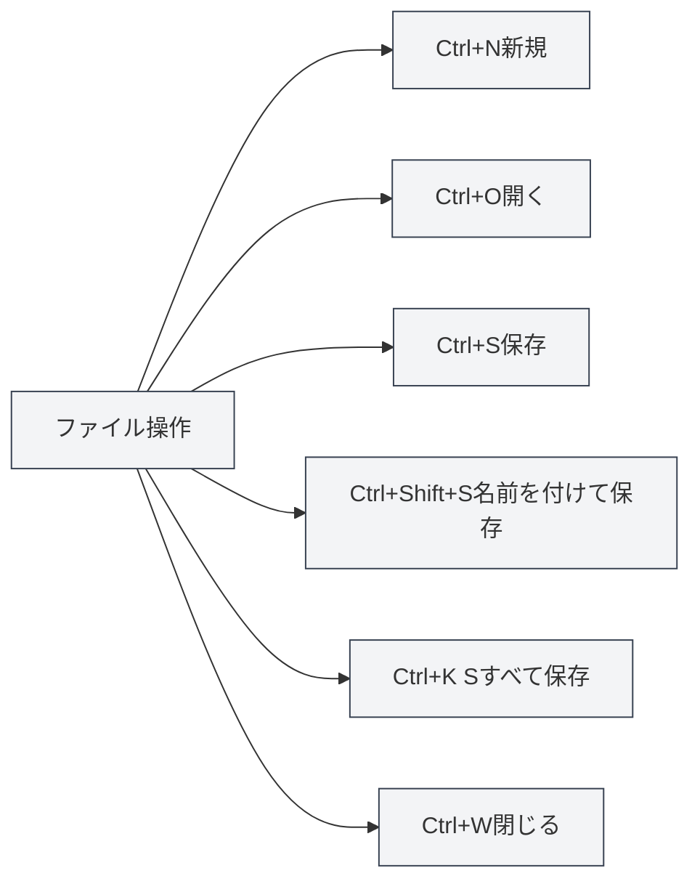

# グローバルショートカット

## 概要

グローバルショートカットは、MetaDoc内のあらゆるインターフェースで使用できるショートカットキーです。これらのショートカットを習得することで、作業効率を大幅に向上させることができます。

**説明**：このドキュメントのショートカットは、現在のコード実装と照合済みであり、メインプロセスまたはレンダラープロセスで実装され、使用可能です。

## ファイル操作

### 新規ドキュメント

- **ショートカット**：`Ctrl+N`（Windows/Linux）または `Cmd+N`（macOS）
- **機能**：新しい空白のドキュメントを作成
- **使用シナリオ**：新しいドキュメント編集を素早く開始

### ドキュメントを開く

- **ショートカット**：`Ctrl+O`（Windows/Linux）または `Cmd+O`（macOS）
- **機能**：ファイル選択ダイアログを開く
- **使用シナリオ**：既存のドキュメントを開く

### ドキュメントを保存

- **ショートカット**：`Ctrl+S`（Windows/Linux）または `Cmd+S`（macOS）
- **機能**：現在のドキュメントを保存
- **使用シナリオ**：編集内容を保存し、紛失を防止

### 名前を付けて保存

- **ショートカット**：`Ctrl+Shift+S`（Windows/Linux）または `Cmd+Shift+S`（macOS）
- **機能**：現在のドキュメントを新しいファイルとして保存
- **使用シナリオ**：ドキュメントのコピーを作成、または保存場所を変更

### すべてのドキュメントを保存

- **ショートカット**：`Ctrl+K S`（Windows/Linux）または `Cmd+K S`（macOS）
- **機能**：開いているすべてのドキュメントを保存
- **使用説明**：まず `Ctrl+K`（または `Cmd+K`）を押し、次に `S` を押す
- **使用シナリオ**：すべてのドキュメントを一度に保存

<MenuItemsDemo mode="demo" :items='[{"id": "file", "items": ["save-all"]}]' />

### ファイルを閉じる

- **ショートカット**：`Ctrl+W`（Windows/Linux）または `Cmd+W`（macOS）
- **機能**：現在のタブを閉じる
- **使用シナリオ**：不要なドキュメントを閉じる

## タブ操作

タブバーには開いているすべてのドキュメントが表示され、新規作成、切り替え、閉じるなどの操作をサポートします：

<MainTabs mode="demo" />

<ViewMenuItemsDemo mode="demo" :items='["editor", "outline"]' />

### 新規タブ

- **ショートカット**：`Ctrl+T`（Windows/Linux）または `Cmd+T`（macOS）
- **機能**：新しいタブを作成
- **使用シナリオ**：新しいドキュメントを素早く作成

### タブの切り替え

#### 次のタブ

- **ショートカット**：`Ctrl+Tab`（Windows/Linux）または `Cmd+Tab`（macOS）
- **機能**：次のタブに切り替え
- **使用説明**：`Ctrl+Tab` を押し続けるとタブ切り替えオーバーレイが表示され、Tabキーを押し続けて選択するか、直接クリックできます
- **使用シナリオ**：複数のドキュメント間を素早く切り替え

<TabSwitcherOverlay mode="demo" />

#### 前のタブ

- **ショートカット**：`Ctrl+Shift+Tab`（Windows/Linux）または `Cmd+Shift+Tab`（macOS）
- **機能**：前のタブに切り替え
- **使用シナリオ**：タブを逆方向に切り替え

### 閉じたタブを再度開く

- **ショートカット**：`Ctrl+Shift+T`（Windows/Linux）または `Cmd+Shift+T`（macOS）
- **機能**：最近閉じたタブを再度開く
- **使用説明**：連続して使用でき、最近閉じたタブを順に復元します（最大20個まで復元可能）
- **使用シナリオ**：誤ってタブを閉じた後、素早く復元

<MainTabs mode="demo" />

## その他のショートカット

### ユーザーマニュアルを開く

- **ショートカット**：`F1`
- **機能**：ユーザーマニュアルページを開く
- **使用シナリオ**：ヘルプドキュメントを参照する必要がある場合

<MenuItemsDemo mode="demo" :items='[{"id": "help"}]' />

## ショートカット一覧

### Windows/Linuxショートカット

| 機能                     | ショートカット       |
| ------------------------ | -------------------- |
| 新規ドキュメント         | `Ctrl+N`             |
| ドキュメントを開く       | `Ctrl+O`             |
| ドキュメントを保存       | `Ctrl+S`             |
| 名前を付けて保存         | `Ctrl+Shift+S`       |
| すべて保存               | `Ctrl+K S`           |
| タブを閉じる             | `Ctrl+W`             |
| 新規タブ                 | `Ctrl+T`             |
| 次のタブ                 | `Ctrl+Tab`           |
| 前のタブ                 | `Ctrl+Shift+Tab`     |
| 閉じたタブを再度開く     | `Ctrl+Shift+T`       |
| ユーザーマニュアルを開く | `F1`                 |

### macOSショートカット

| 機能                     | ショートカット      |
| ------------------------ | ------------------- |
| 新規ドキュメント         | `Cmd+N`             |
| ドキュメントを開く       | `Cmd+O`             |
| ドキュメントを保存       | `Cmd+S`             |
| 名前を付けて保存         | `Cmd+Shift+S`       |
| すべて保存               | `Cmd+K S`           |
| タブを閉じる             | `Cmd+W`             |
| 新規タブ                 | `Cmd+T`             |
| 次のタブ                 | `Cmd+Tab`           |
| 前のタブ                 | `Cmd+Shift+Tab`     |
| 閉じたタブを再度開く     | `Cmd+Shift+T`       |
| ユーザーマニュアルを開く | `F1`                |

## ショートカット使用のコツ

### キーの組み合わせ順序

一部のショートカットは順番に押す必要があります：

- **すべて保存**：まず `Ctrl+K` を押し、次に `S` を押す（同時押しではありません）
- **タブ切り替え**：`Ctrl+Tab` を押し続けてオーバーレイを表示し、Tabキーを押し続けて選択

### ショートカットのカスタマイズ

**設定 → ショートカット** でグローバルショートカットを管理できます：

- **キーバインドスキーム**：プログラムはWindows、Linux、macOS用の3つのデフォルトスキームを提供し、初回起動時に現在のシステムに基づいて自動選択されます
- **新規作成/編集スキーム**：カスタムスキームを作成し、各アクションのキーを変更できます
- **インポート/エクスポート**：スキームをJSONファイルとしてエクスポート、またはファイルからスキームをインポートすることをサポート
- **デフォルトに戻す**：各キーバインド項目がデフォルトスキームと異なる場合、「デフォルトに戻す」をクリックして復元できます

スキームを変更した後は、下部の「保存」をクリックして初めて有効になります。

### ショートカットの競合

ショートカットがシステムや他のソフトウェアと競合する場合：

- **システムショートカット**：一部のシステムショートカットが優先される場合があります
- **他のソフトウェア**：競合するソフトウェアを閉じるか、そのショートカットを変更します
- **カスタムショートカット**：**設定 → ショートカット** で他のキーに変更できます

### 記憶のコツ

- **ファイル操作**：標準的なファイル操作ショートカットを使用（Ctrl+N/O/S）
- **タブ操作**：Tabキー関連の組み合わせを使用
- **すべて保存**：コマンドプレフィックスとしてCtrl+Kを使用

## ベストプラクティス

1.  **習熟**：よく使うショートカットを習熟し、効率を向上
2.  **組み合わせ使用**：複数のショートカットを組み合わせて複雑な操作を完了
3.  **タブ切り替え**：Ctrl+Tabを使用して素早く切り替え、マウス操作を回避
4.  **定期的な保存**：Ctrl+Sを使用して定期的に保存する習慣を身につける
5.  **素早い復元**：誤ってタブを閉じた場合、Ctrl+Shift+Tを使用して素早く復元

## 注意事項

1.  **プラットフォームの違い**：Windows/LinuxはCtrl、macOSはCmdを使用
2.  **ショートカットの競合**：他のソフトウェアとのショートカット競合に注意
3.  **キーの組み合わせ順序**：一部のショートカットは順番に押す必要があります
4.  **タブ切り替え**：Ctrl+Tabはオーバーレイを表示し、選択を続けることができます
5.  **すべて保存**：Ctrl+K SはまずCtrl+K、次にSを押す必要があります

## 関連ドキュメント

- [[shortcuts.editor|エディターショートカット]]
- [[core.file-operations|ファイル操作]]
- [[core.multi-tab|マルチタブ管理]]

<MenuItemsDemo mode="demo" :items='[{"id": "file"}]' />

<MainTabs mode="demo" />

<ViewMenuItemsDemo mode="demo" :items='["editor", "outline", "agent"]' />

