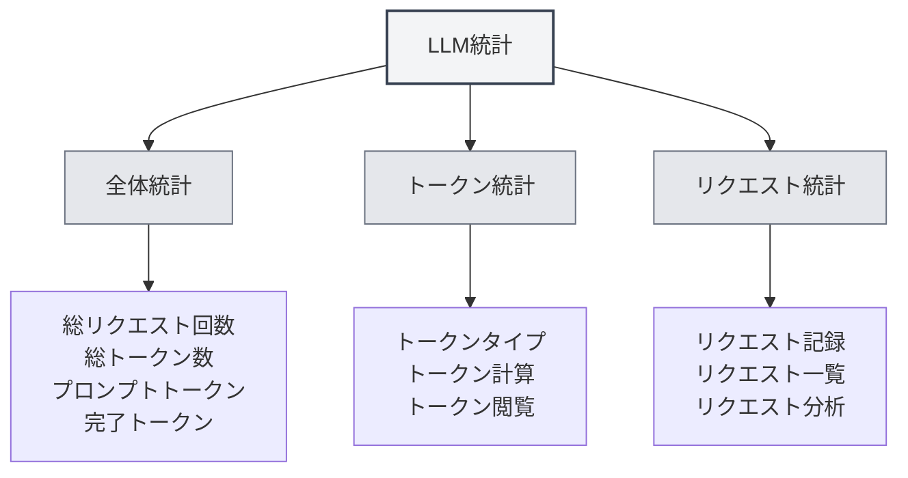

# LLM統計

## 概要

LLM統計機能は、LLM APIの使用状況を追跡・閲覧するためのもので、トークン使用量、リクエスト回数、コスト統計などの情報を含みます。これらの統計データは、LLMの使用状況を把握し、使用戦略を最適化するのに役立ちます。

## LLM統計を開く

### アクセス方法

以下の方法でLLM統計ページを開くことができます：

- **設定ページ**：設定ページ内にLLM統計へのエントリがある場合があります
- **メニューオプション**：一部のメニューにLLM統計オプションがある場合があります
- **ショートカットキー**：状況によってはショートカットキーが利用できる場合があります（将来サポートされる可能性あり）

<SettingLlmSection mode="demo" />

## 統計情報

<LlmStatisticsView mode="demo" />

<LlmStatisticsContent mode="demo" />

### 全体統計

LLM統計ページには以下の全体統計情報が表示されます：

- **総リクエスト回数**：すべてのLLMリクエストの合計回数
- **総トークン数**：すべてのリクエストで使用された合計トークン数
- **プロンプトトークン**：すべてのリクエストのプロンプトトークンの合計
- **完了トークン**：すべてのリクエストの完了トークンの合計

### 期間フィルター

統計データを期間でフィルタリングできます：

- **全期間**：すべての期間の統計データを表示
- **今日**：今日の統計データを表示
- **今週**：今週の統計データを表示
- **今月**：今月の統計データを表示
- **カスタム範囲**：カスタムの開始日と終了日を選択

### 統計グラフ

<ChartGenerationDisplay mode="demo" />

統計ページには以下のグラフが含まれる場合があります：

- **トークン使用傾向**：トークン使用量の時間経過に伴う変化傾向を表示
- **リクエスト回数傾向**：リクエスト回数の時間経過に伴う変化傾向を表示
- **モデル使用分布**：異なるモデルの使用状況を表示
- **リクエストタイプ分布**：異なるタイプのリクエストの分布状況を表示

## トークン統計

<DataAnalysisDisplay mode="demo" />

### トークンタイプ

トークン統計には以下のタイプが含まれます：

- **プロンプトトークン**：入力プロンプトのトークン数
- **完了トークン**：生成コンテンツのトークン数
- **合計トークン**：総トークン数（プロンプト + 完了）

### トークン計算

トークンの計算方法：

- **自動記録**：各LLMリクエスト後にトークン使用量を自動記録
- **リアルタイム更新**：統計データはリアルタイムで更新
- **累積統計**：統計データは累積計算

### トークン閲覧

以下のトークン情報を閲覧できます：

- **総トークン数**：すべてのリクエストの合計トークン数
- **平均トークン数**：リクエストごとの平均トークン数
- **最大トークン数**：単一リクエストの最大トークン数
- **最小トークン数**：単一リクエストの最小トークン数

## リクエスト統計

<LlmStatisticsContent mode="demo" />

### リクエスト記録

各LLMリクエストは以下の情報を記録します：

- **タイムスタンプ**：リクエストの時間
- **モデル名**：使用されたモデル名
- **リクエストタイプ**：リクエストタイプ（chat/completion）
- **トークン使用量**：当該リクエストのトークン使用量

### リクエスト一覧

リクエスト一覧を閲覧できます：

- **時間順ソート**：時間の降順で並べ替え
- **詳細情報**：各リクエストの詳細情報を閲覧
- **フィルター機能**：モデル、タイプなどでリクエストをフィルタリング

### リクエスト分析

リクエストを分析できます：

- **リクエスト頻度**：リクエストの頻度を分析
- **モデル使用**：異なるモデルの使用状況を分析
- **タイプ分布**：異なるタイプのリクエストの分布を分析

## コスト統計

<LlmStatisticsView mode="demo" />

### コスト計算

コスト統計は以下の情報に基づきます：

- **トークン使用量**：トークン使用量に基づくコスト計算
- **モデル価格設定**：モデルごとに異なる価格設定
- **コスト見積もり**：コスト見積もりを提供（サポートされている場合）

### コスト閲覧

以下のコスト情報を閲覧できます：

- **総コスト**：すべてのリクエストの合計コスト
- **日平均コスト**：1日あたりの平均コスト
- **モデル別コスト**：異なるモデルのコスト分布
- **コスト傾向**：時間経過に伴うコストの変化傾向

**注意事項**：コスト統計は参考情報であり、実際のコストはAPIプロバイダーの請求書を基準とします。

## データエクスポート

<DataAnalysisDisplay mode="demo" />

### エクスポート機能

統計データをエクスポートできます：

- **エクスポート形式**：複数の形式（JSON、CSVなど）をサポートする場合があります
- **エクスポート範囲**：全データまたはフィルタリング後のデータを選択してエクスポート
- **エクスポート内容**：どの統計情報をエクスポートするか選択可能

### データバックアップ

統計データは自動的に保存されます：

- **ローカルストレージ**：統計データはローカルに保存
- **自動保存**：各リクエスト後に自動保存
- **データ永続化**：アプリケーション再起動後もデータは保持

## 統計クリア

### クリア操作

統計データをクリアできます：

1. LLM統計ページを開く
2. 統計クリアボタンを見つける
3. クリア操作を確認
4. 統計データがクリアされる

**注意事項**：

- クリア操作は元に戻せません
- クリア前にデータバックアップをエクスポートすることを推奨します
- クリア後、すべての統計データは失われます

## 統計設定

### 統計スイッチ

統計機能を制御できます：

- **統計有効化**：LLM使用統計を有効化
- **統計無効化**：統計機能を無効化（データを記録しない）

### 統計精度

統計精度を設定できます：

- **詳細記録**：各リクエストの詳細情報を記録
- **簡略記録**：全体統計情報のみ記録

## ベストプラクティス

1. **定期的な確認**：LLM使用統計を定期的に確認し、使用状況を把握する
2. **コスト管理**：コスト統計に基づき使用量を管理する
3. **戦略最適化**：統計データに基づき使用戦略を最適化する
4. **データバックアップ**：統計データのバックアップを定期的にエクスポートする
5. **適切な使用**：統計情報に基づきLLM機能を適切に使用する

## 注意事項

1. **統計精度**：統計データはAPIが返すトークン情報に基づきます
2. **コスト見積もり**：コスト統計は参考情報であり、実際のコストは請求書を基準とします
3. **データ保存**：統計データはローカルに保存され、アップロードされません
4. **プライバシー保護**：統計データには具体的な内容は含まれず、使用量情報のみを含みます
5. **パフォーマンス影響**：統計機能によるパフォーマンスへの影響は非常に小さく、安心して使用できます

## 関連ドキュメント

- [[settings.llm|LLM設定]]
- [[ai.chat|AI対話機能]]
- [[ai.completion|AI自動補完]]

<LlmStatisticsView mode="demo" />

<LlmStatisticsContent mode="demo" />