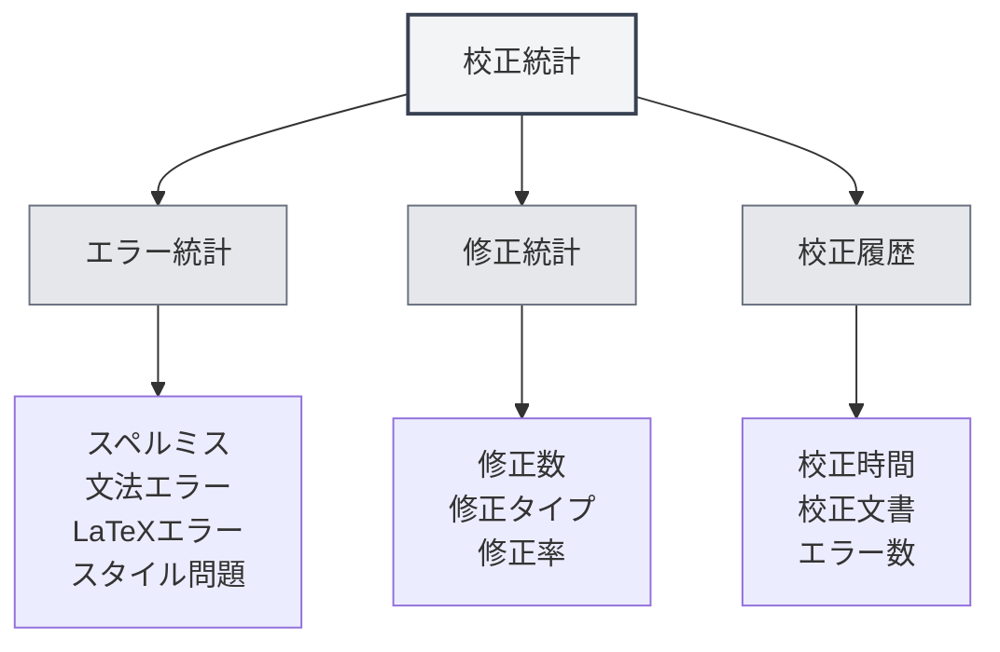

# 校正ツール統計

## 概要

校正ツール統計機能は、文書校正の使用状況を追跡・閲覧するために使用され、スペルチェック、文法チェックなどの統計情報を含みます。これらの統計データは、校正機能の使用状況を把握し、校正戦略を最適化するのに役立ちます。

<ProofreadView mode="demo" />

<ProofreadDisplay mode="demo" />

<DataAnalysisDisplay mode="demo" />

## 校正統計の紹介

### 校正統計とは

校正統計は、文書校正プロセスにおける関連情報を記録します：

- **エラー統計**：検出されたエラーの数と種類を記録
- **修正統計**：修正されたエラーの数を記録
- **校正履歴**：校正操作の履歴を記録

### 統計の種類

校正統計には以下の種類が含まれます：

- **スペルミス**：スペルチェックで発見されたエラー
- **文法エラー**：文法チェックで発見されたエラー
- **LaTeXエラー**：LaTeX文法チェックで発見されたエラー
- **スタイル問題**：スタイルチェックで発見された問題
- **その他のエラー**：その他の種類のエラー

## エラー統計

<DataAnalysisDisplay mode="demo" />

<ChartGenerationDisplay mode="demo" />

### エラーの分類

校正ツールはエラーを分類して統計します：

- **スペルミス**：単語のスペルミスの数
- **文法エラー**：文法エラーの数
- **LaTeXエラー**：LaTeX文法エラーの数
- **スタイル問題**：執筆スタイルの問題の数
- **その他のエラー**：その他の種類のエラーの数

### エラーカウント

各校正でエラーを統計します：

- **総エラー数**：すべてのエラーの合計数
- **各種エラー数**：各種エラーの数
- **エラー分布**：エラータイプの分布状況

## 修正統計

### 修正記録

エラー修正の状況を記録します：

- **修正数**：修正済みのエラーの数
- **修正タイプ**：修正されたエラーの種類
- **修正率**：修正されたエラーの割合

### 修正履歴

修正履歴を閲覧できます：

- **修正時間**：エラーが修正された時間
- **修正内容**：修正された具体的な内容
- **修正方法**：修正の方法（手動/自動）

## 校正履歴

### 履歴記録

校正操作の履歴を記録します：

- **校正時間**：校正操作が行われた時間
- **校正文書**：校正された文書
- **エラー数**：発見されたエラーの数
- **修正数**：修正されたエラーの数

### 履歴閲覧

校正履歴を閲覧できます：

- **履歴一覧**：すべての校正履歴記録を表示
- **詳細情報**：各校正の詳細情報を閲覧
- **統計分析**：履歴データに対して統計分析を実施

## 統計ビュー

<ProofreadView mode="demo" />

### 統合ビュー

統合ビューはすべてのエラーを表示します：

- **エラー一覧**：すべてのエラーを順番に表示
- **エラー詳細**：各エラーの詳細情報を表示
- **エラー位置特定**：エラーの位置を特定可能

<DataAnalysisDisplay mode="demo" />

### 分類ビュー

分類ビューはタイプ別にエラーを表示します：

- **タイプ別グループ化**：エラーをタイプ別にグループ化して表示
- **タイプ別統計**：各タイプのエラー数を表示
- **タイプフィルター**：特定のタイプのエラーをフィルタリング可能

## 統計エクスポート

### エクスポート機能

校正統計をエクスポートできます：

- **エクスポート形式**：複数の形式（JSON、CSVなど）をサポートする可能性
- **エクスポート範囲**：すべてのデータまたはフィルタリング後のデータを選択可能
- **エクスポート内容**：どの統計情報をエクスポートするか選択可能

<ChartGenerationDisplay mode="demo" />

## ベストプラクティス

1. **定期的な校正**：定期的に校正機能を使用して文書をチェック
2. **統計の注視**：エラー統計に注目し、文書の品質を把握
3. **迅速な修正**：エラーを発見したら迅速に修正
4. **傾向の分析**：エラーの傾向を分析し、執筆習慣を改善
5. **履歴の活用**：履歴記録を活用し、文書の改善を追跡

## 注意事項

1. **統計の正確性**：統計データは校正ツールの検出結果に基づく
2. **誤検知の処理**：一部の検出は誤検知の可能性があり、人的判断が必要
3. **データ保存**：統計データはローカルに保存され、アップロードされない
4. **プライバシー保護**：統計データには具体的な内容は含まれず、統計情報のみを含む
5. **パフォーマンスへの影響**：統計機能はパフォーマンスへの影響が非常に小さいため、安心して使用可能

## 関連ドキュメント

- [[ai.proofread|AI校正機能]]
- [[statistics.llm|LLM統計]]