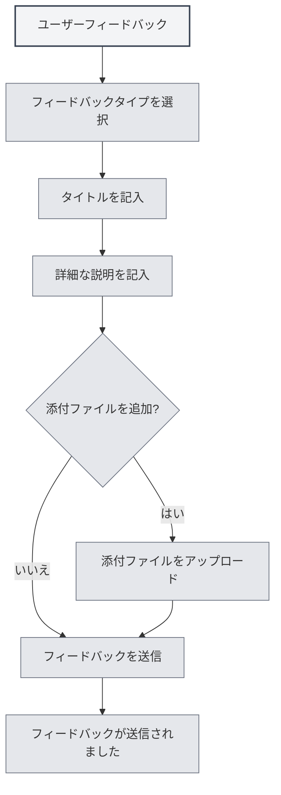

# ユーザーフィードバック

## 概要

ユーザーフィードバック機能では、MetaDocチームに問題報告、機能提案、その他のフィードバックを送信できます。皆様からのフィードバックは、製品改善のために非常に重要です。

## ユーザーフィードバックを開く

### アクセス方法

以下の方法でユーザーフィードバックページを開くことができます：

- **設定ページ**：「設定」の「このソフトウェアについて」ページで「ユーザーフィードバック」ボタンをクリック
- **メニューオプション**：一部のメニューにユーザーフィードバックオプションが含まれている場合があります
- **ショートカットキー**：状況によってはショートカットキーが利用できる場合があります（将来サポートされる可能性があります）

<SettingAboutSection mode="demo" />

## フィードバックの種類

### フィードバックタイプの選択

フィードバックを送信する際には、フィードバックの種類を選択する必要があります：

- **バグ報告**：ソフトウェアの不具合や問題を報告
- **機能提案**：新機能や改善案を提案
- **セキュリティ報告**：セキュリティ上の問題を報告
- **その他**：その他の種類のフィードバック

<DialogDemo mode="demo" dialogType="feedback" />

### 種類の説明

- **バグ報告**：ソフトウェアの不具合、クラッシュ、異常動作などの問題を報告するために使用
- **機能提案**：新機能の要望や既存機能の改善提案を行うために使用
- **セキュリティ報告**：セキュリティ上の脆弱性や問題を報告するために使用
- **その他**：使用方法に関する質問、ドキュメントの問題など、その他の種類のフィードバックに使用

## フィードバック内容

### タイトル

フィードバックのタイトルは以下のようにする必要があります：

- **簡潔で分かりやすい**：問題や提案を簡潔に説明
- **具体的で明確**：曖昧なタイトルは避ける
- **必須項目**：タイトルは必須項目です

### 詳細な説明

詳細な説明には以下を含める必要があります：

- **問題の説明**：発生した問題を明確に説明
- **期待する結果**：期待する結果を説明
- **その他の情報**：診断に役立つその他の情報を提供
- **連絡先**：オプションで連絡先を記入し、今後のフォローアップを容易に

### フィードバックテンプレート

システムは以下の部分を含むフィードバックテンプレートを提供します：

- **システム情報**：自動的に入力されるシステム情報
- **問題の説明**：問題を説明する領域
- **期待する結果**：期待する結果を記入する領域
- **その他の情報**：その他の情報を記入する領域
- **連絡先**：オプションの連絡先

<MenuItemsDemo mode="demo" :items='[{"id": "settings"}]' />

## 添付ファイルのアップロード

### 添付ファイルのサポート

問題の説明を補助するために添付ファイルをアップロードできます：

- **ファイル形式**：あらゆる種類のファイルをサポート
- **ファイルサイズ**：単一ファイルは10MB以下
- **合計サイズ**：すべての添付ファイルの合計サイズは50MB以下
- **ファイル数**：最大5つの添付ファイルをアップロード可能

<SettingImageSection mode="demo" />

### 添付ファイルの用途

添付ファイルは以下の目的で使用できます：

- **スクリーンショット**：問題のスクリーンショットを提供
- **ログファイル**：エラーログを提供
- **サンプルファイル**：問題のサンプルファイルを提供
- **その他のファイル**：その他の関連ファイルを提供

### 添付ファイルのルール

- **単一ファイル制限**：単一ファイルは10MB以下
- **合計サイズ制限**：すべての添付ファイルの合計サイズは50MB以下
- **数量制限**：最大5つの添付ファイルまで
- **形式制限**：ファイル形式は制限なし（Gistの能力に準拠）

## フィードバックの送信

### 送信手順

1. **種類を選択**：フィードバックの種類を選択
2. **タイトルを記入**：フィードバックのタイトルを記入
3. **説明を記入**：詳細な説明を記入
4. **添付ファイルを追加**：オプションで添付ファイルを追加
5. **フィードバックを送信**：「フィードバックを送信」ボタンをクリック

設定ページからユーザーフィードバックにアクセスできます：

<MenuItemsDemo mode="demo" :items='[{"id": "settings"}]' />

### 送信前の検証

送信前に以下の検証が行われます：

- **タイトルの検証**：タイトルが空でないことを確認
- **説明の検証**：説明が空でないことを確認
- **添付ファイルの検証**：添付ファイルがルールに準拠していることを確認

<DialogDemo mode="demo" dialogType="submit-confirm" />

### 送信結果

送信後、結果が表示されます：

- **送信成功**：成功メッセージを表示
- **送信失敗**：エラーメッセージと原因を表示

## その他の連絡方法

### メールでのフィードバック

メールでもフィードバックを送信できます：

- **メールアドレス**：フィードバックページの下部に表示
- **メールアドレスのコピー**：メールアドレスをコピー可能
- **メール件名**：明確な件名を使用することを推奨

<ViewMenuItemsDemo mode="demo" :items='["settings"]' />

### QQグループ

公式QQグループに参加できます：

- **QQグループ番号**：フィードバックページの下部に表示
- **グループ番号のコピー**：QQグループ番号をコピー可能
- **グループへの参加**：グループに参加後、リアルタイムでフィードバック可能

## フィードバックの処理

### フィードバック処理フロー

フィードバック送信後の処理フロー：

1. **フィードバック受信**：システムがフィードバックを受信
2. **分類処理**：フィードバックの種類に基づいて分類
3. **問題分析**：問題や提案を分析
4. **フォローアップ処理**：状況に応じてフォローアップ処理
5. **フィードバックへの返信**：メールやQQグループを通じて返信される場合があります

### フィードバックの優先度

フィードバックは種類と深刻度に基づいて優先度が設定されます：

- **セキュリティ報告**：最高優先度
- **重大なバグ**：高優先度
- **機能提案**：中優先度
- **その他のフィードバック**：通常優先度

<MainTabs mode="demo" />

## ベストプラクティス

1. **詳細な説明**：問題や提案を可能な限り詳細に説明
2. **スクリーンショットの提供**：可能であれば、問題のスクリーンショットを提供
3. **ログの提供**：エラーが発生した場合、エラーログを提供
4. **サンプルの提供**：可能であれば、問題のサンプルファイルを提供
5. **連絡先の提供**：今後のフォローアップのために連絡先を提供

## 注意事項

1. **フィードバック形式**：テンプレート形式に従ってフィードバックを記入
2. **添付ファイルサイズ**：添付ファイルのサイズ制限に注意
3. **連絡先の提供**：今後のフォローアップのために連絡先を提供
4. **フィードバックタイプ**：正しいフィードバックタイプを選択
5. **システム情報**：システム情報は自動的に入力されるため、削除しないでください

## 関連ドキュメント

- [[settings.about|このソフトウェアについて]]
- [[user.profile|ユーザープロファイル]]

<AIChat mode="demo" />
