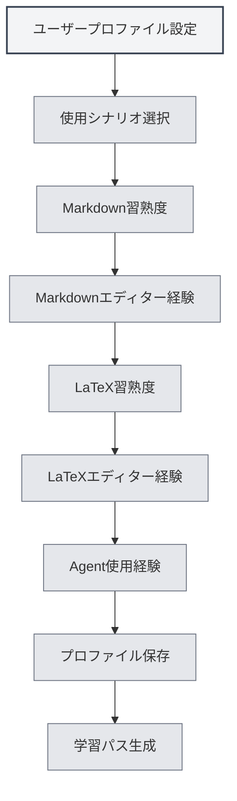

# ユーザープロファイル

## 概要

ユーザープロファイル機能では、個人情報や使用設定を設定することができ、MetaDocがユーザーのニーズをより深く理解し、パーソナライズされた使用体験と学習パスを提供するのに役立ちます。

## ユーザープロファイル設定

### ユーザープロファイルを開く

以下の方法でユーザープロファイルダイアログを開くことができます：

- **ホームページのプロンプト**：初回使用時、ホームページがプロファイル設定を促す場合があります
- **ユーザーマニュアル**：ユーザーマニュアル内からユーザープロファイル設定にアクセスできます
- **メニューオプション**：一部のメニューにユーザープロファイルオプションがある場合があります

### ユーザープロファイルインターフェース

ユーザープロファイルインターフェースは以下の主要部分で構成されています：

<UserProfileView mode="demo" />

### プロファイル設定ウィザード

ユーザープロファイル設定はステップバイステップのウィザード形式で行われます：

1.  **使用シナリオ**：主な使用シナリオを選択
2.  **Markdown習熟度**：Markdown構文の理解度を評価
3.  **Markdownエディター経験**：使用経験のあるMarkdownエディターの種類を選択
4.  **LaTeX習熟度**：LaTeX構文の理解度を評価
5.  **LaTeXエディター経験**：使用経験のあるLaTeXエディターの種類を選択
6.  **Agent使用経験**：Agentフレームワークの使用経験を評価

## 使用シナリオ選択

### シナリオタイプ

以下の使用シナリオから選択できます：

- **学生**：学生ユーザー向け。基本的な編集とMarkdown機能の学習に重点
- **研究者**：研究者向け。LaTeXと学術執筆機能の学習に重点
- **IT従事者**：IT従事者向け。Agentフレームワークと高度な機能の学習に重点
- **オフィスユーザー**：オフィスユーザー向け。基本機能とエクスポートの学習に重点
- **その他**：その他の使用シナリオ

### シナリオの影響

選択したシナリオは以下に影響します：

- **学習パス**：システムが適切な学習パスを推薦
- **機能推薦**：関連する機能を優先的に推薦
- **AI理解**：AIがユーザーのニーズをより良く理解するのに役立つ

## スキル評価

### Markdown習熟度

Markdown構文への習熟度を評価します：

- **未経験**：Markdownを使用したことがない
- **初級**：基本構文（見出し、リスト、リンクなど）を理解している
- **中級**：一般的な構文と拡張機能に慣れている
- **上級**：Markdownに精通し、様々な拡張構文を理解している

### LaTeX習熟度

LaTeX構文への習熟度を評価します：

- **未経験**：LaTeXを使用したことがない
- **初級**：基本構文とドキュメント構造を理解している
- **中級**：一般的な環境とコマンドに慣れている
- **上級**：LaTeXに精通し、複雑なドキュメントを作成できる

<MenuItemsDemo mode="demo" :items='[{"id": "file"}]' />

### Agent使用経験

Agentフレームワークの使用経験を評価します：

- **未経験**：Agent機能を使用したことがない
- **初級**：基本概念を理解し、簡単な機能を使用したことがある
- **中級**：ツールセットとワークフローに慣れている
- **上級**：複雑なAgent設定とワークフローを作成できる

<AgentView mode="demo" />

## エディター経験

### Markdownエディター経験

使用経験のあるMarkdownエディターの種類を選択します：

- **WYSIWYGエディター**：WYSIWYG（What You See Is What You Get）エディターを使用したことがある
- **その他のMarkdownエディター**：その他のMarkdownエディターを使用したことがある

### LaTeXエディター経験

使用経験のあるLaTeXエディターの種類を選択します：

- **オンラインLaTeXエディター**：オンラインLaTeXエディターを使用したことがある
- **ローカルLaTeXエディター**：ローカルLaTeXエディターを使用したことがある

## 使用設定

### 編集設定

編集に関連する設定が可能です：

- **編集モード**：優先して使用する編集モード
- **プレビュー方法**：優先して使用するプレビュー方法
- **自動保存**：自動保存の設定

<MainTabs mode="demo" />

### 機能設定

機能に関連する設定が可能です：

- **よく使う機能**：よく使用する機能をマーク
- **機能の優先度**：機能の優先順位を設定
- **インターフェースレイアウト**：優先して使用するインターフェースレイアウト

<ViewMenuItemsDemo mode="demo" :items='["settings"]' />

## ユーザーペルソナ設定

### ペルソナ生成

ユーザーの設定に基づき、システムがユーザーペルソナを生成します：

- **スキルレベル**：各スキルのレベルを評価
- **使用シナリオ**：主要な使用シナリオを識別
- **学習ニーズ**：学習ニーズを分析

### ペルソナの適用

ユーザーペルソナは以下に適用されます：

- **学習パス**：パーソナライズされた学習パスを推薦
- **機能推薦**：関連する機能を優先的に推薦
- **AIアシスタンス**：AIがニーズをより良く理解するのに役立つ

## 学習パス推薦

### パスタイプ

ユーザープロファイルに基づき、システムが適切な学習パスを推薦します：

- **学生向けパス**：学生ユーザー向けの学習パス
- **研究者向けパス**：研究者向けの学習パス
- **IT従事者向けパス**：IT従事者向けの学習パス
- **オフィスユーザー向けパス**：オフィスユーザー向けの学習パス

<AIChat mode="demo" />

### パス内容

学習パスには以下が含まれます：

- **ドキュメントリスト**：順序立てられた学習ドキュメント
- **学習目標**：各ドキュメントの学習目標
- **予想時間**：学習完了に必要な予想時間

## プロファイル更新

### プロファイルの変更

いつでもユーザープロファイルを変更できます：

1.  ユーザープロファイルダイアログを開く
2.  各設定を変更する
3.  変更を保存する

### プロファイル同期

ユーザープロファイルは以下のように扱われます：

- **ローカル保存**：ローカルに保存されます
- **マルチウィンドウ同期**：すべてのウィンドウ間で同期されます
- **永続化**：次回起動時も有効です

## ベストプラクティス

1.  **正確に入力**：正確な情報を入力し、より適切な推薦を受けましょう
2.  **定期的な更新**：スキル向上に伴い、定期的にプロファイルを更新しましょう
3.  **シナリオ選択**：実際の使用状況に最も合ったシナリオを選択しましょう
4.  **スキル評価**：自身のスキルレベルを客観的に評価しましょう
5.  **推薦の活用**：システムが推薦する学習パスを十分に活用しましょう

## 注意事項

1.  **プロファイルのプライバシー**：ユーザープロファイルはローカルにのみ保存され、アップロードされません
2.  **プロファイルは任意**：ユーザープロファイル設定は任意であり、設定しなくても構いません
3.  **推薦は参考情報**：学習パスの推薦は参考情報であり、必要に応じて調整できます
4.  **スキルの変化**：スキルレベルは変化するため、定期的な更新をお勧めします
5.  **複数シナリオ**：複数のシナリオを使用する場合は、最も主要なシナリオを選択してください

## 関連ドキュメント

- [[home.features|ホームページ機能]]
- [[user.feedback|ユーザーフィードバック]]
- [[quick-start.guide|クイックスタートガイド]]

<MenuItemsDemo mode="demo" :items='[{"id": "settings"}]' />

<MainTabs mode="demo" />
