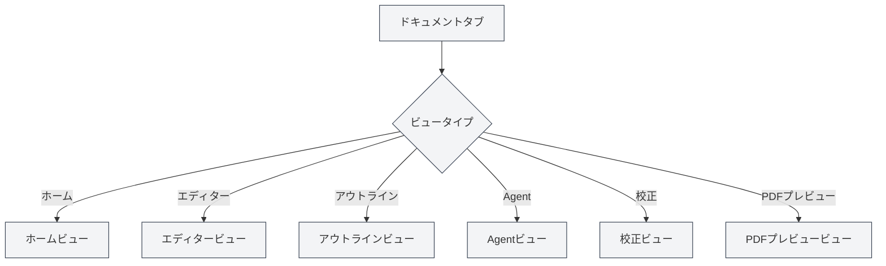

# ビュータイプ

## 概要

MetaDocは複数のビュータイプをサポートしており、各ビューは異なる機能とインターフェースを提供します。必要に応じて異なるビューを切り替えて、様々なタスクを完了することができます。

## ビュータイプ紹介

### ホームビュー

ホームビューはMetaDocのエントリーインターフェースで、クイックスタートと最近のドキュメント機能を提供します。

**主な機能**：

- **クイックスタート**：ドキュメント形式を選択し、新規ドキュメントを素早く作成
- **最近のドキュメント**：最近開いたドキュメントのリストを表示
- **ユーザーマニュアル**：ユーザーマニュアルへのクイックアクセス
- **ユーザープロフィール**：ユーザープロフィール設定へのアクセス

**使用シナリオ**：

- アプリケーション起動後の初期画面
- 新規ドキュメントを素早く作成する必要がある場合
- 最近使用したドキュメントを確認する場合

サイドバーから異なるビューに切り替えることができます。

### エディタービュー

エディタービューはドキュメント編集のメインインターフェースで、Markdown、LaTeX、プレーンテキスト編集をサポートします。

<LaTeXEditor mode="demo" />

**主な機能**：

- **Markdown編集**：Vditorエディターを使用してMarkdownドキュメントを編集
- **LaTeX編集**：Monacoエディターを使用してLaTeXドキュメントを編集
- **プレーンテキスト編集**：Monacoエディターを使用してプレーンテキストを編集
- **リアルタイムプレビュー**：Markdownエディターはリアルタイムプレビューをサポート

**使用シナリオ**：

- ドキュメント内容の編集
- 技術文書の作成
- 学術論文の執筆

### アウトラインビュー

アウトラインビューはドキュメントの構造化されたアウトラインを表示し、ドキュメント構造の確認と編集を容易にします。

<Outline mode="demo" />

**主な機能**：

- **アウトライン表示**：ツリー構造でドキュメントの見出しを表示
- **ノード操作**：ノードの追加、編集、削除、移動
- **ドラッグ＆ドロップ並べ替え**：ノードをドラッグして順序を調整
- **AI機能**：サブセクションの生成、コンテンツ生成、アウトライン最適化

**使用シナリオ**：

- ドキュメント構造の確認
- 特定のセクションへの迅速なナビゲーション
- ドキュメントアウトラインの編集
- AIを使用したコンテンツ生成

### Agentビュー

AgentビューはAgentフレームワークの対話型インターフェースを提供し、Agentセッションの作成と管理に使用します。

<AgentView mode="demo" />

**主な機能**：

- **セッション管理**：Agentセッションの作成、編集、削除
- **ツール設定**：Agentが使用するツールセットの設定
- **ワークフロー**：ワークフローの作成と実行
- **メッセージ対話**：Agentとの対話

**使用シナリオ**：

- Agentを使用した複雑なタスクの完了
- ドキュメント処理の自動化
- ドキュメントの一括操作

### 校正ビュー

校正ビューはAI校正機能を提供し、ドキュメント内のエラーをチェックして修正提案を行います。

<ProofreadView mode="demo" />

**主な機能**：

- **エラー検出**：スペル、文法、LaTeX構文エラーの検出
- **エラーリスト**：検出されたすべてのエラーの表示
- **エラー修正**：単一修正または一括修正
- **辞書管理**：単語を辞書に追加

**使用シナリオ**：

- ドキュメントのエラーチェック
- ドキュメント品質の向上
- スペルおよび文法エラーの修正

### PDFプレビュービュー

PDFプレビュービューはLaTeXドキュメントをコンパイルした後のPDFプレビューを表示します（LaTeXドキュメントのみ）。

<PdfPreviewPanel mode="demo" pdfUrl="" />

**主な機能**：

- **PDF表示**：コンパイルされたPDFコンテンツの表示
- **ズーム制御**：PDFの拡大、縮小
- **PDF更新**：再コンパイルとPDFの更新
- **コードへの位置特定**：PDFの位置からLaTeXコードへの位置特定

**使用シナリオ**：

- LaTeXドキュメントの効果のプレビュー
- PDFフォーマットの確認
- PDF内の問題の位置特定

## ビュー切り替え

### 切り替え方法

以下の方法でビューを切り替えることができます：

<MainTabs mode="demo" />

<ViewMenuItemsDemo mode="demo" :items='["editor", "outline", "agent"]' />

1. **ビューメニュー**：左側のビューメニューボタンをクリック
2. **ビューセレクター**：ビューメニューで切り替えたいビューを選択
3. **ショートカットキー**：一部のビューにはショートカットキーがある場合があります（将来的にサポートされる可能性あり）

### ビューメニュー

ビューメニューは左サイドバーに表示されます：

- **ホーム**：ホームビューに切り替え
- **エディター**：エディタービューに切り替え
- **アウトライン**：アウトラインビューに切り替え
- **Agent**：Agentビューに切り替え
- **校正**：校正ビューに切り替え
- **PDFプレビュー**：PDFプレビュービューに切り替え（LaTeXドキュメントのみ）

### ビューステータス

各ドキュメントタブは独立したビューステータスを持っています：

- **ビュー記憶**：ビュー切り替え後、ビューステータスは保存されます
- **次回開く時**：次回ドキュメントを開く時に前回のビューに復元されます
- **複数タブ**：異なるタブで異なるビューを使用できます

## ビュー特性

### ビュー独立性

各ビューは独立しています：

- **ステータス独立**：各ビューは独立したステータスを持っています
- **データ同期**：ビュー間のデータは自動的に同期されます
- **高速切り替え**：ビュー切り替えは非常に高速で、再読み込みは不要です

### ビュー組み合わせ

一部のビューは組み合わせて使用できます：

- **エディター＋アウトライン**：エディターとアウトラインを同時に表示
- **エディター＋PDFプレビュー**：LaTeXエディターはコードとPDFを同時に表示できます
- **エディター＋校正**：編集中に校正を行うことができます

## ビュー使用の推奨事項

### ドキュメント編集

- **エディタービュー**：編集には主にエディタービューを使用
- **アウトラインビュー**：構造を確認する必要がある時はアウトラインビューに切り替え
- **PDFプレビュー**：LaTeXドキュメント編集時はPDFプレビューで効果を確認

### ドキュメント校正

- **校正ビュー**：ドキュメント校正専用
- **エディタービュー**：校正後はエディタービューに戻って編集を続行

### Agentタスク

- **Agentビュー**：Agentセッションの作成と管理
- **エディタービュー**：Agent処理後のドキュメントを確認

## 注意事項

1. **ビュー切り替え**：ビュー切り替えは現在のステータスを保存します
2. **PDFプレビュー**：PDFプレビュービューはLaTeXドキュメントのみサポートします
3. **ビューステータス**：各タブのビューステータスは独立して保存されます
4. **データ同期**：ビュー間のデータは自動的に同期されます
5. **パフォーマンス考慮**：一部のビューは多くのリソースを消費する場合があります

## 関連ドキュメント

- [[core.multi-tab|マルチタブ管理]]
- [[outline.basics|アウトラインビュー機能]]
- [[agent.session|Agentセッション管理]]
- [[ai.proofread|AI校正機能]]
- [[latex.pdf-preview|PDFプレビュー機能]]
