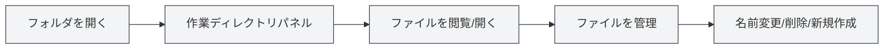

# 作業ディレクトリ管理

## 概要

作業ディレクトリ管理により、MetaDocでフォルダを開いて管理することができ、ファイルマネージャーに似た機能を提供します。作業ディレクトリを通じて、プロジェクトファイルの閲覧、開封、管理を便利に行うことができます。

## 作業ディレクトリの紹介

<ViewMenuItemsDemo mode="demo" :items='["workspace"]' />

### 作業ディレクトリとは

作業ディレクトリは、MetaDocで開かれたフォルダであり、以下のことが可能です：

- **ファイルの閲覧**：フォルダ内のファイルとサブフォルダを表示
- **ファイルを開く**：ファイルを直接MetaDocで開く
- **ファイルの管理**：名前変更、削除などの操作
- **プロジェクトの整理**：関連ファイルを一つのディレクトリに整理

### 使用シナリオ

作業ディレクトリは以下のシナリオに適しています：

- **プロジェクト管理**：プロジェクト内のすべてのドキュメントを管理
- **ファイル閲覧**：ファイルの迅速な閲覧と開封
- **ドキュメント整理**：関連ドキュメントをまとめて整理
- **一括操作**：複数のファイルに対する操作

## 作業ディレクトリを開く

<ViewMenuItemsDemo mode="demo" :items='["workspace", "editor"]' />

### ディレクトリを開く

1. 左側メニューの「作業ディレクトリ」アイコンをクリック
2. まだディレクトリが開かれていない場合、ディレクトリ選択ダイアログが表示されます
3. 開きたいフォルダを選択
4. ディレクトリがサイドバーに表示されます

サイドバーから作業ディレクトリビューにアクセスできます：

<ViewMenuItemsDemo mode="demo" :items='["workspace"]' />

<ViewMenuItemsDemo mode="demo" :items='["editor", "outline", "home"]' />

### ディレクトリの切り替え

他のディレクトリに切り替える必要がある場合：

1. 作業ディレクトリのタイトルバーのメニューボタンをクリック
2. 「フォルダを開く」を選択
3. 新しいフォルダを選択
4. 新しいディレクトリが現在のディレクトリを置き換えます

### ディレクトリを閉じる

現在開いている作業ディレクトリを閉じることができます：

1. 作業ディレクトリのタイトルバーのメニューボタンをクリック
2. 「作業ディレクトリを閉じる」を選択
3. 作業ディレクトリパネルが非表示になります

## ファイルの閲覧

<ViewMenuItemsDemo mode="demo" :items='["workspace", "editor", "outline"]' />

### ディレクトリツリー構造

作業ディレクトリはツリー構造で表示されます：

- **フォルダ**：フォルダアイコンを表示、展開/折りたたみ可能
- **ファイル**：ファイルアイコンを表示、ファイル名を表示
- **階層構造**：多階層のフォルダのネストをサポート

### 展開と折りたたみ

- **フォルダを展開**：フォルダアイコンまたは名前をクリック
- **フォルダを折りたたむ**：展開済みのフォルダをもう一度クリック
- **すべて展開**：右クリックメニューから「すべて展開」を選択可能
- **すべて折りたたむ**：右クリックメニューから「すべて折りたたむ」を選択可能

### ファイルタイプの識別

作業ディレクトリはファイルタイプを識別します：

- **Markdownファイル** (.md)：Markdownアイコンを表示
- **LaTeXファイル** (.tex)：LaTeXアイコンを表示
- **画像ファイル** (.png, .jpgなど)：画像アイコンを表示
- **その他のファイル**：汎用ファイルアイコンを表示

## ファイル操作

<ViewMenuItemsDemo mode="demo" :items='["workspace"]' />

<MenuItemsDemo mode="demo" :items='[{"id": "file", "items": ["new", "open"]}]' />

### ファイルを開く

ファイルを開く方法は複数あります：

- **ファイルをダブルクリック**：ファイルアイコンまたは名前をダブルクリック
- **右クリックメニュー**：ファイルを右クリックし、「開く」を選択
- **ドラッグ＆ドロップ**：ファイルをエディター領域にドラッグ＆ドロップ

ファイルを開くと、ファイルは新しいタブで開かれます。

### ファイルをプレビュー

<ViewMenuItemsDemo mode="demo" :items='["workspace"]' />

ファイルを開かずにプレビューできます：

- **右クリックメニュー**：ファイルを右クリックし、「プレビュー」を選択
- **プレビューモード**：ファイルがプレビュータブで開かれます
- **編集モードに切り替え**：プレビューモードから編集モードに切り替え可能

### ファイル名の変更

<ViewMenuItemsDemo mode="demo" :items='["workspace"]' />

1. 名前を変更したいファイルを右クリック
2. 「名前を変更」を選択
3. 新しいファイル名を入力
4. Enterキーで確定、またはEscキーでキャンセル

**注意事項**：

- 名前変更はファイルシステム上のファイル名を変更します
- ファイルが編集中の場合は、先に保存する必要があります
- 名前変更後、ファイルパスが変更されます

### ファイルの削除

<ViewMenuItemsDemo mode="demo" :items='["workspace"]' />

1. 削除したいファイルを右クリック
2. 「削除」を選択
3. 削除操作を確認

**注意事項**：

- 削除操作は元に戻せません
- ファイルが編集中の場合は、先に閉じる必要があります
- フォルダを削除すると、その中のすべてのファイルが削除されます

### 新規ファイルの作成

1. フォルダまたは空白領域を右クリック
2. 「新規ファイル」を選択
3. ファイル名（拡張子を含む）を入力
4. Enterキーで確定

新規作成されたファイルは、すぐにエディターで開かれます。

### 新規フォルダの作成

<ViewMenuItemsDemo mode="demo" :items='["workspace"]' />

1. フォルダまたは空白領域を右クリック
2. 「新規フォルダ」を選択
3. フォルダ名を入力
4. Enterキーで確定

## ファイル操作の高度な機能

<ViewMenuItemsDemo mode="demo" :items='["workspace", "editor"]' />

### ファイルのコピー

1. コピーしたいファイルを右クリック
2. 「コピー」を選択
3. ターゲット位置を右クリック
4. 「貼り付け」を選択

### ファイルの切り取り

1. 切り取りたいファイルを右クリック
2. 「切り取り」を選択
3. ターゲット位置を右クリック
4. 「貼り付け」を選択

### ファイルの貼り付け

1. ファイルをコピーまたは切り取りした後
2. ターゲット位置を右クリック
3. 「貼り付け」を選択

**注意事項**：

- フォルダ内に貼り付けると、そのフォルダ内にファイルが作成されます
- ターゲット位置に同じ名前のファイルが既にある場合、上書きまたは名前変更のプロンプトが表示されます

### 一括操作

複数のファイルを同時に選択して操作できます：

- **複数選択**：Ctrlキーを押しながら複数のファイルをクリック
- **すべて選択**：Ctrl+Aですべてのファイルを選択
- **一括操作**：選択したファイルに対してコピー、削除などの操作を実行

## ファイル検索

<ViewMenuItemsDemo mode="demo" :items='["workspace"]' />

### 検索機能

作業ディレクトリはファイル検索をサポートしています：

1. 作業ディレクトリパネルで、検索ボックスを使用
2. ファイル名またはキーワードを入力
3. 検索結果がハイライト表示されます

### 検索範囲

検索は以下の範囲で行われます：

- **現在のディレクトリ**：現在開いている作業ディレクトリ
- **サブディレクトリ**：すべてのサブフォルダを含む
- **ファイル名**：ファイル名を検索、ファイル内容は検索しません

## ディレクトリ監視

<ViewMenuItemsDemo mode="demo" :items='["workspace", "outline"]' />

### 自動更新

作業ディレクトリはファイルシステムの変更を自動的に監視します：

- **ファイル作成**：新規ファイルが自動的に表示されます
- **ファイル削除**：削除されたファイルが自動的に削除されます
- **ファイル名変更**：名前変更されたファイルが自動的に更新されます
- **ファイル変更**：変更されたファイルに更新マークが表示されます

### 手動更新

手動でディレクトリを更新する必要がある場合：

1. フォルダまたは空白領域を右クリック
2. 「更新」を選択
3. ディレクトリが再読み込みされます

## ファイルパス

### パスの表示

作業ディレクトリはファイルの完全なパスを表示します：

- **ホバーヒント**：ファイルにマウスを置くと完全なパスを表示
- **パスバー**：一部のビューではパスバーが表示される場合があります
- **右クリックメニュー**：右クリックメニューでパス情報が表示される場合があります

### パス操作

- **パスのコピー**：ファイルの完全なパスをコピー可能
- **場所を開く**：ファイルマネージャーでファイルの場所を開く
- **パスナビゲーション**：パスを通じてファイルを迅速に特定

## ベストプラクティス

1. **プロジェクト整理**：関連ファイルを一つの作業ディレクトリに整理
2. **ファイル命名**：明確な命名規則を使用
3. **定期的なバックアップ**：重要なファイルは定期的にバックアップ
4. **ファイル整理**：不要なファイルを定期的に整理
5. **ディレクトリ構造**：明確なディレクトリ構造を維持

## 注意事項

1. **ファイル権限**：ファイルの読み書き権限があることを確認
2. **ファイルロック**：一部のファイルは他のプログラムによってロックされている場合があります
3. **パスの長さ**：ファイルパスの長さ制限に注意
4. **特殊文字**：ファイル名に特殊文字を使用しない
5. **ファイルサイズ**：大きなファイルを開くには時間がかかる場合があります

## 関連ドキュメント

- [[core.file-operations|ファイル操作]]
- [[core.multi-tab|マルチタブ管理]]
- [[core.multi-window|マルチウィンドウ管理]]
