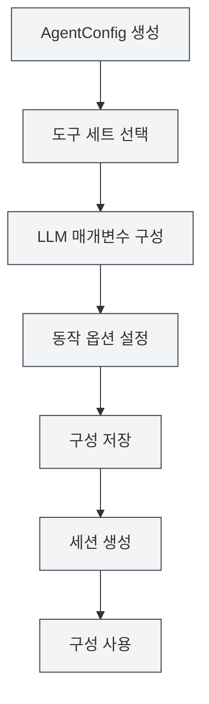

# 에이전트 구성 관리

## 개요

에이전트 구성(AgentConfig)은 에이전트 프레임워크의 핵심 구성 요소로, 에이전트의 신원과 능력 범위를 정의하는 데 사용됩니다. 각 AgentConfig는 도구 세트 그룹과 연결되어 에이전트가 사용할 수 있는 도구를 결정하며, LLM 매개변수 및 동작 옵션을 구성할 수 있습니다.

AgentConfig는 도구 세트 교집합 메커니즘을 통해 에이전트의 능력 범위를 유연하게 제어하여 다양한 시나리오에 맞는 전용 에이전트 구성을 생성할 수 있게 합니다.

<AgentView mode="demo" />

## 핵심 개념

### AgentConfig 구조

AgentConfig는 다음 주요 부분을 포함합니다:

- **기본 정보**: ID, 이름, 설명, 버전 번호
- **도구 세트 연결**: 연결된 도구 세트 ID 목록 (교집합 적용)
- **LLM 구성**: 모델, 온도, 최대 토큰 수, 시스템 프롬프트 등
- **동작 구성**: 도구 호출 허용 여부, 최대 호출 횟수 등
- **시나리오 유형**: outline, editor, analysis, visualization, custom

### 도구 세트 교집합

AgentConfig가 여러 도구 세트와 연결될 때, 사용 가능한 도구는 모든 도구 세트의 교집합입니다:

- 도구 세트 A 포함: `[tool1, tool2, tool3]`
- 도구 세트 B 포함: `[tool2, tool3, tool4]`
- AgentConfig 사용 가능 도구: `[tool2, tool3]`

이 메커니즘을 통해 에이전트의 능력 범위를 정밀하게 제어할 수 있습니다.

<AgentConfigManager mode="demo" />

## AgentConfig 생성

### 새 구성 생성

AgentConfig 생성 단계:

1. **에이전트 관리 열기**: 에이전트 뷰에서 "관리" → "에이전트 구성" 클릭
2. **구성 생성**: "새 구성" 버튼 클릭
3. **기본 정보 입력**:
   - 이름: 구성의 이름 (다국어 지원)
   - 설명: 구성의 설명 (다국어 지원)
4. **도구 세트 선택**: 드롭다운 목록에서 하나 이상의 도구 세트 선택
5. **LLM 구성** (선택 사항):
   - 시스템 프롬프트: 사용자 정의 시스템 프롬프트
   - 타임스탬프 주입: 시스템 프롬프트에 현재 시간을 주입할지 여부
6. **동작 설정** (선택 사항):
   - 최대 도구 호출 횟수: 에이전트의 도구 호출 횟수 제한 (null은 무제한 의미)
7. **구성 저장**: "저장" 버튼 클릭

<AgentView mode="demo" />

사이드바를 통해 에이전트 뷰에 접근할 수 있습니다:

### 기본 구성

시스템은 모든 내장 도구를 포함하는 기본 AgentConfig(`default-agent-config`)를 제공하며, 삭제할 수 없지만 복사는 가능합니다.

## AgentConfig 편집

### 편집 작업

기존 AgentConfig 편집:

1. **관리 인터페이스 열기**: 에이전트 구성 관리 인터페이스에서 편집할 구성 찾기
2. **편집 클릭**: 구성 카드의 "편집" 버튼 클릭
3. **구성 수정**: 이름, 설명, 도구 세트, LLM 구성 또는 동작 구성 수정
4. **변경 사항 저장**: "저장" 버튼 클릭

**참고**: 기본 구성(`default-agent-config`)은 편집이 허용되지 않지만, 복사 후 편집할 수 있습니다.

<AgentConfigManager mode="demo" />

## AgentConfig 삭제

### 삭제 작업

불필요한 AgentConfig 삭제:

1. **관리 인터페이스 열기**: 에이전트 구성 관리 인터페이스에서 삭제할 구성 찾기
2. **삭제 클릭**: 구성 카드의 "삭제" 버튼 클릭
3. **삭제 확인**: 표시되는 확인 대화 상자에서 삭제 확인

<AgentConfigManager mode="demo" />

**참고**:

- 기본 구성(`default-agent-config`)은 삭제할 수 없습니다.
- 구성을 삭제해도 이미 생성된 세션에는 영향을 미치지 않지만, 새 세션에서는 해당 구성을 사용할 수 없습니다.
- 구성이 세션에서 사용 중인 경우, 삭제 전에 알림이 표시됩니다.

## AgentConfig 복사

### 복사 작업

기존 AgentConfig 복사:

1. **관리 인터페이스 열기**: 에이전트 구성 관리 인터페이스에서 복사할 구성 찾기
2. **복사 클릭**: 구성 카드의 "복사" 버튼 클릭
3. **사본 편집**: 시스템이 사본을 생성하며, 이름에 자동으로 "(사본)" 접미사가 추가됩니다.
4. **수정 사항 저장**: 필요에 따라 사본을 수정하고 저장

<AgentView mode="demo" />

구성을 복사하면 도구 세트 연결, LLM 구성 및 동작 구성 등 모든 설정이 복사됩니다.

## AgentConfig 가져오기/내보내기

### 구성 내보내기

AgentConfig를 JSON 파일로 내보내기:

1. **관리 인터페이스 열기**: 에이전트 구성 관리 인터페이스에서 내보낼 구성 찾기
2. **내보내기 클릭**: 구성 카드의 "내보내기" 버튼 클릭
3. **위치 선택**: 저장 위치와 파일 이름 선택
4. **파일 저장**: 저장을 클릭하여 구성 내보내기

내보낸 JSON 파일에는 구성의 모든 정보가 포함되어 있으며, 백업 또는 공유에 사용할 수 있습니다.

<AgentConfigManager mode="demo" />

### 구성 가져오기

JSON 파일에서 AgentConfig 가져오기:

1. **관리 인터페이스 열기**: 에이전트 구성 관리 인터페이스에서
2. **가져오기 클릭**: "구성 가져오기" 버튼 클릭
3. **파일 선택**: 가져올 JSON 파일 선택
4. **데이터 검증**: 시스템이 파일 형식과 내용을 검증합니다.
5. **구성 가져오기**: 가져오기 성공 후 새 구성 생성

가져온 구성은 새 ID가 생성되며, 기존 구성을 덮어쓰지 않습니다 (덮어쓰기 모드를 사용하지 않는 한).

## LLM 구성

### 시스템 프롬프트

AgentConfig는 사용자 정의 시스템 프롬프트를 구성할 수 있습니다:

- **기본 프롬프트**: 설정하지 않으면 에이전트 프레임워크의 기본 시스템 프롬프트 사용
- **사용자 정의 프롬프트**: 에이전트의 역할과 동작을 정의하는 전용 시스템 프롬프트 설정 가능
- **타임스탬프 주입**: 시스템 프롬프트에 현재 시간을 주입할지 여부 선택 가능

### LLM 매개변수

AgentConfig는 전역 LLM 구성을 재정의할 수 있습니다:

- **모델**: 사용할 LLM 모델 지정
- **온도**: 출력의 무작위성 제어 (0-2)
- **최대 토큰 수**: 단일 호출의 최대 토큰 수 제한

**참고**: AgentConfig에 LLM 매개변수가 설정되지 않은 경우, 전역 LLM 구성이 사용됩니다.

<AgentConfigManager mode="demo" />

## 동작 구성

### 도구 호출 제어

AgentConfig는 도구 호출 동작을 제어할 수 있습니다:

- **도구 호출 허용**: 에이전트가 도구를 호출할 수 있는지 여부 (기본값 허용)
- **최대 도구 호출 횟수**: 단일 작업의 최대 도구 호출 횟수 제한 (null은 무제한 의미)
- **워크플로 호출 허용**: 에이전트가 워크플로를 호출할 수 있는지 여부 (기본값 허용)

### 사용 시나리오

다른 동작 구성은 다른 시나리오에 적합합니다:

- **순수 대화 시나리오**: 도구 호출 비활성화, 대화만 수행
- **제한된 도구 시나리오**: 도구 호출 횟수 제한, 과도한 호출 방지
- **전체 기능 시나리오**: 모든 도구 호출 허용, 제한 없음

<AgentConfigManager mode="demo" />

## 시나리오 유형

AgentConfig는 분류 및 관리를 위해 시나리오 유형을 설정할 수 있습니다:

- **outline**: 아웃라인 시나리오, 문서 구조 관련 작업용
- **editor**: 편집기 시나리오, 문서 편집 작업용
- **analysis**: 분석 시나리오, 문서 분석 작업용
- **visualization**: 시각화 시나리오, 차트 생성 작업용
- **custom**: 사용자 정의 시나리오

시나리오 유형은 주로 분류에 사용되며, 에이전트의 실제 동작에는 영향을 미치지 않습니다.

## 사용 팁

### 구성 조직화

1. **명명 규칙**: "데이터 분석 에이전트", "문서 편집 에이전트"와 같이 명확한 이름 사용
2. **시나리오 분류**: 시나리오 유형을 사용하여 분류 관리
3. **도구 세트 선택**: 작업 요구 사항에 맞는 적절한 도구 세트 조합 선택

<AgentConfigManager mode="demo" />

### 도구 세트 교집합

1. **정밀 제어**: 여러 도구 세트의 교집합을 사용하여 에이전트 능력 정밀 제어
2. **도구 세트 설계**: 전용 도구 세트를 설계한 후 교집합을 통해 조합 사용
3. **테스트 검증**: 구성 생성 후, 도구 세트 교집합이 올바른지 테스트

<AgentConfigManager mode="demo" />

### LLM 구성

1. **시스템 프롬프트**: 다른 시나리오에 맞는 전용 시스템 프롬프트 작성
2. **매개변수 조정**: 작업 특성에 따라 온도와 최대 토큰 수 조정
3. **타임스탬프 주입**: 시간 인식이 필요한 작업의 경우 타임스탬프 주입 활성화

## 자주 묻는 질문

### Q: 전용 에이전트 구성은 어떻게 생성하나요?

A: 새 구성을 생성하고, 전용 도구 세트를 선택하며, 사용자 정의 시스템 프롬프트와 동작 구성을 설정합니다. 예를 들어, "데이터 분석 에이전트"를 생성하고 데이터 분석 도구 세트를 연결한 후 전용 시스템 프롬프트를 설정합니다.

### Q: 도구 세트 교집합이 무엇을 의미하나요?

A: AgentConfig가 여러 도구 세트와 연결될 때, 사용 가능한 도구는 모든 도구 세트의 교집합입니다. 예를 들어, 도구 세트 A가 `[tool1, tool2, tool3]`를 포함하고, 도구 세트 B가 `[tool2, tool3, tool4]`를 포함하면, AgentConfig의 사용 가능 도구는 `[tool2, tool3]`입니다.

### Q: 기본 구성을 수정할 수 있나요?

A: 기본 구성(`default-agent-config`)은 편집이 허용되지 않지만, 복사 후 편집할 수 있습니다. 기본 구성을 복사한 후 사본을 수정하세요.

### Q: LLM 구성과 전역 구성의 관계는 어떻게 되나요?

A: AgentConfig에 LLM 매개변수가 설정된 경우, AgentConfig의 설정이 사용됩니다. 그렇지 않으면 전역 LLM 구성이 사용됩니다. AgentConfig의 설정이 더 높은 우선순위를 가집니다.

### Q: 에이전트의 도구 호출 횟수를 제한하려면 어떻게 하나요?

A: AgentConfig의 동작 구성에서 "최대 도구 호출 횟수"를 설정하세요. 특정 숫자(예: 10)로 설정하면 호출 횟수가 제한되며, null로 설정하면 무제한입니다.

### Q: 구성을 삭제하면 기존 세션에 영향을 미치나요?

A: 구성을 삭제해도 이미 생성된 세션에는 영향을 미치지 않지만, 새 세션에서는 해당 구성을 사용할 수 없습니다. 구성이 세션에서 사용 중인 경우, 삭제 전에 알림이 표시됩니다.

<AgentView mode="demo" />

## 관련 문서

- [[agent.introduction|에이전트 프레임워크 개요]]
- [[agent.tools|도구 세트 관리]]
- [[agent.session|에이전트 세션 관리]]
- [[agent.engine|에이전트 엔진 관리]]
