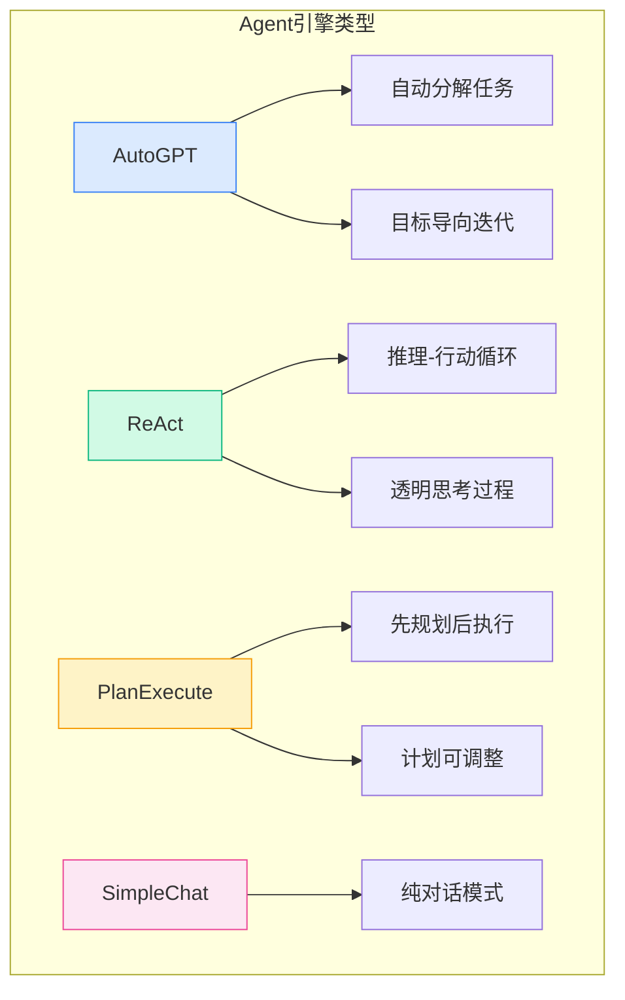
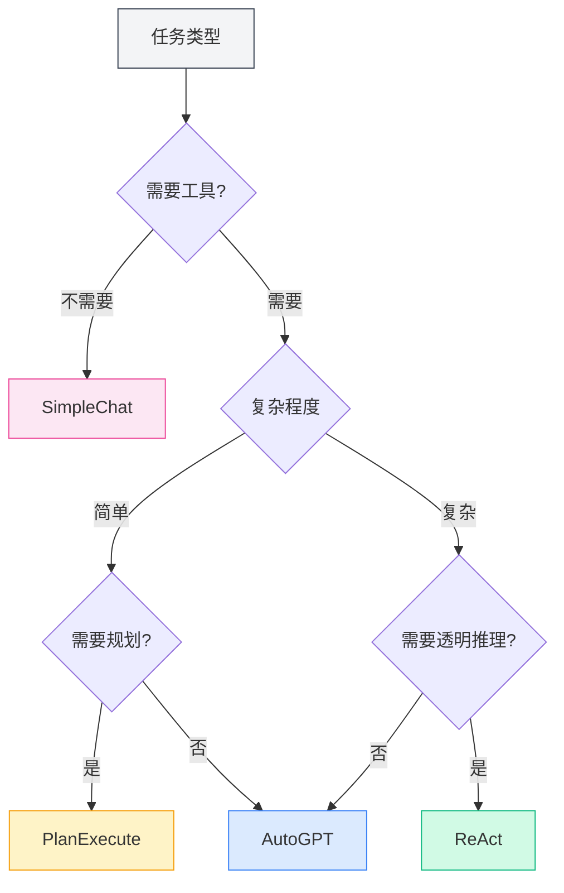
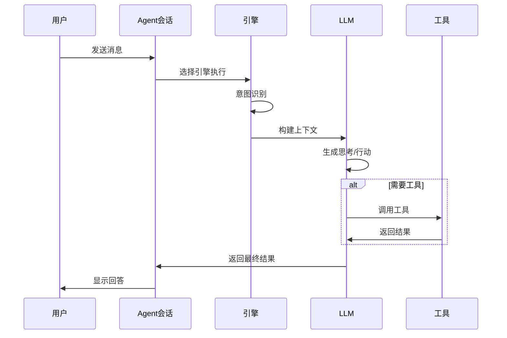

# 에이전트 엔진 관리

## 개요

에이전트 엔진은 에이전트의 실행 전략과 행동 방식을 정의합니다. MetaDoc는 다양한 내장 엔진을 제공하며, 각 엔진은 서로 다른 AI 실행 패러다임을 채택하여 다양한 작업 시나리오에 적합합니다. 적절한 엔진을 선택함으로써 특정 작업을 가장 적합한 방식으로 완료하도록 에이전트를 설정할 수 있습니다.

<AgentView mode="demo" />

## 엔진 유형

MetaDoc는 다음 에이전트 엔진을 지원합니다:

| 엔진 이름        | 특징                        | 적용 시나리오           |
| --------------- | --------------------------- | ------------------ |
| **AutoGPT**     | 자동 작업 분해, 목표 지향적 반복 실행  | 복잡한 다단계 작업     |
| **ReAct**       | 추론-행동 순환, 사고 과정 투명 | 상세한 추론이 필요한 작업 |
| **PlanExecute** | 계획 후 실행, 계획 조정 가능    | 구조화된 작업         |
| **SimpleChat**  | 순수 대화, 도구 호출 없음          | 간단한 질의응답           |



## 엔진 상세 설명

### AutoGPT 엔진

**특징**:

- **자동 작업 분해**: 복잡한 작업을 자동으로 하위 작업으로 분해
- **목표 지향적**: 최종 목표를 중심으로 반복 실행
- **자율적 의사 결정**: 에이전트가 다음 행동을 자율적으로 결정

<AgentView mode="demo" />
<AgentEngineManager mode="demo" />

**적용 시나리오**:

- 연구 및 정보 수집
- 다단계 문서 처리
- 개방형 창작 작업

**예시**:

```
사용자: 인공지능에 관한 종설(리뷰) 글을 작성해 주세요.
Agent: [자동 분해: 1. 자료 수집 2. 개요 정리 3. 내용 작성 4. 다듬기 및 수정]
```

### ReAct 엔진

**특징**:

- **추론-행동 순환**: 사고 과정(Reasoning)과 행동(Action)을 명시적으로 표시
- **추적 가능**: 각 단계마다 명확한 추론 근거가 있음
- **투명하고 제어 가능**: 사용자가 에이전트의 사고 논리를 볼 수 있음

<AgentView mode="demo" />
<AgentEngineManager mode="demo" />

**적용 시나리오**:

- 추론 과정 설명이 필요한 작업
- 논리 분석 작업
- 교육 및 시연 시나리오

**예시**:

```
사고: 사용자가 이 코드의 기능을 설명해 달라고 요청함
행동: 코드 분석 도구 호출
관찰: [도구 결과 반환]
사고: 분석 결과를 바탕으로, 다음과 같이 설명할 수 있음...
```

### PlanExecute 엔진

**특징**:

- **계획 후 실행**: 먼저 완전한 계획을 수립한 후 계획에 따라 실행
- **계획 조정 가능**: 실행 과정에서 계획을 수정할 수 있음
- **구조화된 출력**: 출력 형식이 규격화되어 이해하기 쉬움

<AgentView mode="demo" />
<AgentEngineManager mode="demo" />

**적용 시나리오**:

- 프로젝트 관리 작업
- 구조화된 문서 생성
- 프로세스화된 작업

**예시**:

```
계획:
1. 요구사항 분석
2. 설계안 작성
3. 기능 구현
4. 테스트 및 검증

실행: 각 단계를 순서대로 완료
```

### SimpleChat 엔진

**특징**:

- **순수 대화 모드**: 대화만 진행하며 어떠한 도구도 호출하지 않음
- **빠른 응답**: 도구 실행 대기 시간 없음
- **간단하고 직접적**: 간단한 질의응답에 적합

**적용 시나리오**:

- 일반적인 질의응답
- 개념 설명
- 간단한 대화

**주의**: 이 엔진은 도구를 호출하지 않으므로 파일 작업, 데이터 분석 등의 기능을 수행할 수 없습니다.

<AgentEngineManager mode="demo" />

## 엔진 선택

### 적절한 엔진 선택 방법

작업의 특성에 따라 엔진을 선택하세요:



<AgentView mode="demo" />

### 선택 권장사항

| 작업 시나리오 | 권장 엔진             |
| -------- | -------------------- |
| 일상적인 질의응답 | SimpleChat           |
| 문서 편집 | AutoGPT 또는 ReAct     |
| 데이터 분석 | ReAct 또는 PlanExecute |
| 코드 작성 | ReAct                |
| 연구 및 조사 | AutoGPT              |
| 프로젝트 관리 | PlanExecute          |

<AgentView mode="demo" />

## 엔진 구성

### 에이전트 구성에서 엔진 선택하기

1. [[agent.config|에이전트 구성 관리]]로 이동
2. 에이전트 구성을 생성하거나 편집
3. "엔진" 옵션에서 원하는 엔진 유형 선택
4. 구성 저장

### 엔진 매개변수 설정

다른 엔진은 특정 매개변수 설정이 있을 수 있습니다:

**공통 매개변수**:

- **최대 반복 횟수**: 에이전트의 사고 및 행동 라운드 수 제한
- **시간 초과**: 단일 호출의 최대 대기 시간
- **온도(Temperature)**: 출력의 창의성 정도 제어

**엔진별 매개변수**:

- **AutoGPT**: 목표 분해 깊이
- **ReAct**: 사고 과정 표시 옵션
- **PlanExecute**: 계획 조정 권한

## 엔진 실행 흐름

### 공통 실행 흐름



### 다른 엔진의 실행 특징

**AutoGPT 실행 특징**:

1. 사용자 목표 분석
2. 자동으로 하위 작업으로 분해
3. 하위 작업을 하나씩 실행
4. 결과를 취합하여 반환

**ReAct 실행 특징**:

1. 사고 과정 생성
2. 다음 행동 결정
3. 행동 실행 (도구 호출 또는 응답 생성)
4. 결과 관찰
5. 작업 완료 시까지 순환

**PlanExecute 실행 특징**:

1. 요구사항 분석
2. 완전한 계획 수립
3. 단계별 실행
4. 구조화된 결과 반환

## 사용자 정의 엔진

### 엔진 구성 사용자 정의

고급 사용자는 엔진 동작을 사용자 정의할 수 있습니다:

1. **시스템 프롬프트 수정**: 에이전트의 역할과 행동 조정
2. **도구 선호도 설정**: 우선 사용할 도구 지정
3. **추론 매개변수 조정**: 온도, 최대 토큰 수 등

### 사용자 정의 엔진 생성 (고급)

개발자는 새로운 엔진 유형을 생성할 수 있습니다:

1. 기본 엔진 인터페이스 상속
2. 특정 실행 로직 구현
3. 엔진 관리자에 등록
4. 구성에서 선택하여 사용

## 모범 사례

### 엔진 선택 원칙

1. **간단한 것부터 시작**: 확실하지 않을 때는 먼저 SimpleChat으로 테스트
2. **복잡도에 따라 선택**: 복잡한 작업은 AutoGPT 또는 ReAct 사용
3. **설명 가능성 고려**: 설명이 필요할 때는 ReAct 사용

### 엔진 효과 최적화

1. **요구사항 명확히 설명**: 엔진의 효과는 입력의 명확성에 크게 좌우됨
2. **도구 적절히 사용**: 에이전트에 적합한 도구 세트 구성
3. **합리적인 제한 설정**: 최대 반복 횟수 등의 매개변수로 비용 제어
4. **적시 피드백**: 에이전트의 응답에 피드백을 주어 개선에 도움

## 자주 묻는 질문

### Q: 에이전트가 예상대로 실행되지 않는 이유는 무엇인가요?

A: 가능한 원인:

- 엔진 선택이 적절하지 않음
- 도구 세트 구성이 부족함
- 작업 설명이 명확하지 않음
- 최대 반복 횟수 제한에 도달함

### Q: 대화 중에 엔진을 전환할 수 있나요?

A: 현재 단일 대화 내에서 엔진 전환은 지원되지 않습니다. 엔진을 변경하려면 다음을 권장합니다:

1. 현재 세션 종료
2. 새 세션 생성
3. 다른 엔진을 사용하는 에이전트 구성 선택

### Q: 초보자에게 가장 적합한 엔진은 무엇인가요?

A: 권장사항:

- 먼저 SimpleChat으로 대화 기능 익히기
- 그 다음 ReAct를 시도하여 추론 과정 관찰하기
- 숙련된 후 AutoGPT로 복잡한 작업 처리하기

### Q: 엔진이 응답 품질에 영향을 미치나요?

A: 그렇습니다. 다른 엔진은 사고 방식과 실행 전략이 다릅니다:

- 동일한 작업이라도 다른 엔진은 다른 답변을 줄 수 있음
- 적절한 엔진 선택은 효과를 크게 향상시킬 수 있음
- 다른 유형의 작업에 대해 다른 에이전트를 구성하는 것을 권장함

## 관련 문서

- [[agent.introduction|에이전트 프레임워크 개요]]
- [[agent.config|에이전트 구성 관리]]
- [[agent.session|에이전트 세션 관리]]
- [[agent.tools|도구 세트 관리]]