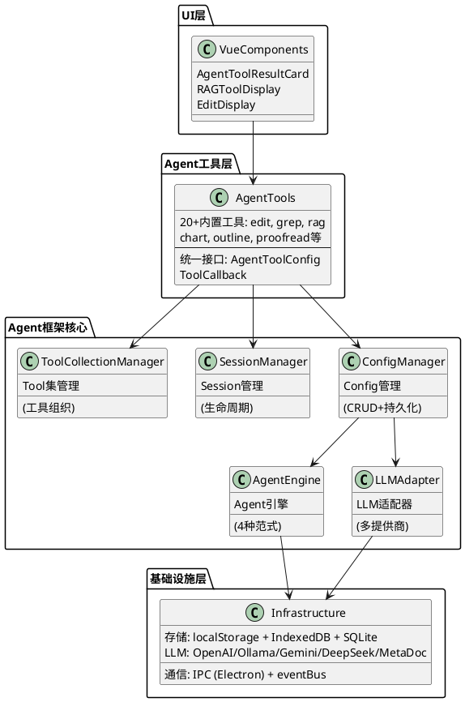
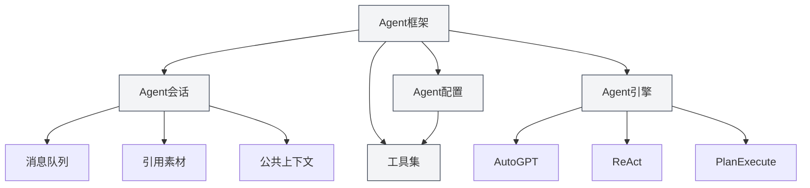
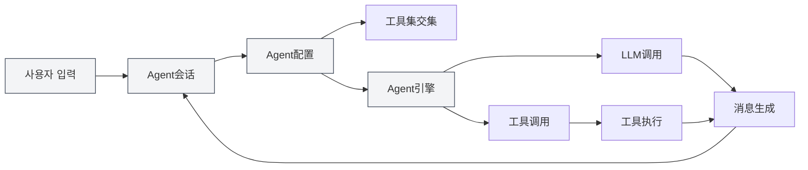
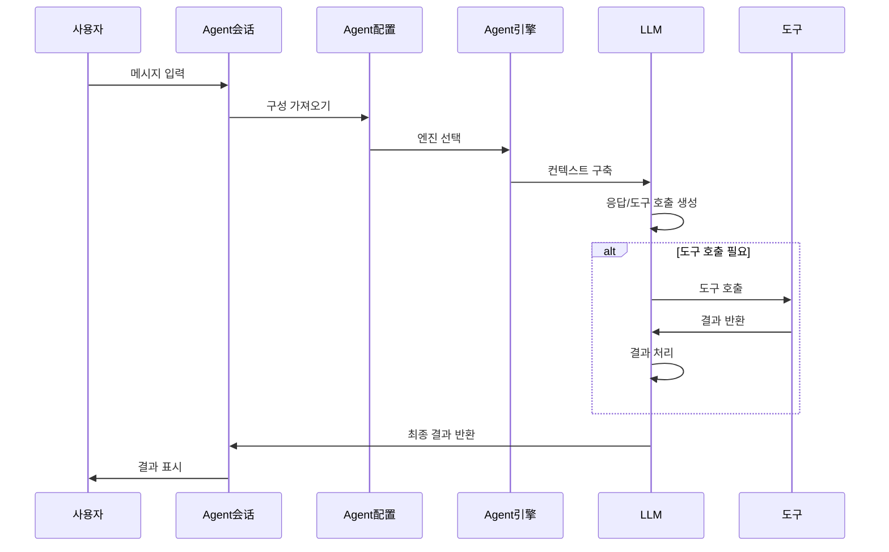

# 에이전트 프레임워크 개요

## 개요

에이전트 프레임워크는 MetaDoc에서 지능형 에이전트 시스템을 구축하고 관리하기 위한 핵심 프레임워크로, **계층적 아키텍처 설계**를 채택합니다. 이는 세션 관리, 구성 관리, 도구 집합 관리 및 엔진 관리 등을 포함한 완전한 에이전트 생명주기 관리를 제공합니다.

에이전트 프레임워크는 기존의 Tool 시스템을 기반으로 구축되었으며, 에이전트 구성(AgentConfig), 도구 집합(ToolCollection), 에이전트 세션(AgentSession) 등의 핵심 구성 요소를 통해 유연하고 확장 가능한 에이전트 시스템을 구현합니다.

<AgentSessionManager mode="demo" />

## 인터페이스 미리보기

에이전트 프레임워크는 에이전트 세션과 도구를 관리하기 위한 직관적인 인터페이스를 제공합니다:

<AgentView mode="demo" />

## 기술 아키텍처

### 아키텍처 계층화



### 핵심 파일 경로

| 카테고리           | 파일 경로                                                            | 설명                      |
| ------------------ | ------------------------------------------------------------------- | ------------------------- |
| **타입 정의**      | `src/renderer/src/types/agent-framework.ts`                         | 에이전트 프레임워크 핵심 타입 정의 |
| **타입 정의**      | `src/renderer/src/types/agent-tool.ts`                              | 에이전트 도구 타입 정의         |
| **구성 관리**      | `src/renderer/src/utils/agent-framework/agent-config-manager.ts`    | AgentConfig의 CRUD 및 지속성 |
| **세션 관리**      | `src/renderer/src/utils/agent-framework/agent-session-manager.ts`   | AgentSession 생명주기 관리  |
| **도구 집합 관리** | `src/renderer/src/utils/agent-framework/tool-collection-manager.ts` | 도구 집합의 조직 및 관리        |
| **엔진 관리**      | `src/renderer/src/utils/agent-framework/agent-engine-manager.ts`    | 에이전트 엔진 구성 관리         |
| **엔진 실행**      | `src/renderer/src/utils/agent-framework/agent-engine-executor.ts`   | 4가지 실행 패러다임 구현       |
| **도구 실행**      | `src/renderer/src/utils/agent-framework/tool-runner.ts`             | 통합 도구 호출 진입점          |
| **LLM 어댑터**     | `src/renderer/src/utils/agent-framework/llm-adapter.ts`             | 다중 LLM 제공업체 어댑터       |



## 핵심 개념

### 에이전트 세션 (AgentSession)

<AgentView mode="demo" />

에이전트 세션은 AgentConfig의 인스턴스로, 독립적이고 컨텍스트를 가진 에이전트 실행 환경을 나타냅니다. `agent-session-manager.ts`를 기반으로 구현되며, 각 세션은 자체 메시지 기록, 참조 자료, 공용 컨텍스트 공간을 유지하고 메시지 큐, 재시도, Duplicate 등 고급 기능을 지원합니다.

**타입 정의** (`types/agent-framework.ts` 387-424행):

```typescript
export interface AgentSession {
  entityType: 'agent-session'
  id: string
  title: string
  agentConfigId: string // 연결된 AgentConfig
  messages: AgentMessage[] // 메시지 기록
  messageQueue: QueuedMessage[] // 메시지 큐
  referenceStore: Reference[] // 참조 자료
  publicContext: PublicContext // 공용 컨텍스트
  executionNodes: ExecutionNode[] // 실행 노드 (재시도용)
  status: AgentSessionStatus // 세션 상태
}
```

**세션 상태 머신**:

```
idle → thinking → generating → tool-calling → waiting-input → error
```

자세한 내용은 [[agent.session|에이전트 세션 관리]]를 참조하세요.

### 에이전트 구성 (AgentConfig)

<CompletionSettingsPanel mode="demo" />

AgentConfig는 에이전트의 정체성과 능력 범위를 정의하며, `agent-config-manager.ts`를 기반으로 구현됩니다.

**타입 정의** (`types/agent-framework.ts` 242-289행):

```typescript
export interface AgentConfig {
  entityType: 'agent-config'
  id: string
  name: LocalizedText // i18n 지원 이름
  description: LocalizedText // i18n 지원 설명
  toolCollectionIds: string[] // 연결된 도구 집합 ID (교집합 취함)
  maxToolCalls?: number | null // 최대 도구 호출 횟수
  llmConfig?: {
    model?: string
    temperature?: number
    systemPrompt?: string // 시스템 프롬프트
    injectTimestamp?: boolean
  }
  behavior?: {
    allowToolCalls?: boolean
  }
  scenario?: 'outline' | 'editor' | 'analysis' | 'visualization' | 'custom'
}
```

**핵심 기능**:

- **기본 구성**: `default-agent-config` (내장, 삭제 불가)
- **도구 집합 교집합**: 여러 도구 집합을 연결할 때, 사용 가능한 도구는 모든 도구 집합의 교집합입니다.
- **LLM 매개변수 재정의**: 전역 LLM 구성을 재정의할 수 있습니다.
- **지속성**: `localStorage`에 저장되며, 키는 `'agent-configs'`입니다.

에이전트 관련 관리는 **에이전트 보기** 메뉴에 모여 있습니다. 먼저 [[agent.tools|도구 집합 관리]]와 [[agent.capabilities|규칙, 스킬 및 MCP 관리]]를 읽어 보세요. (구 「에이전트 구성 관리」 목차 항목은 제거되었고 문서 파일만 참고용으로 남아 있습니다.)

### 도구 집합 (ToolCollection)

<DataAnalysisDisplay mode="demo" />

도구 집합은 에이전트 도구의 모음으로, 에이전트가 사용할 수 있는 도구를 조직하고 관리하는 데 사용됩니다. AgentConfig는 여러 도구 집합을 연결할 수 있으며, 사용 가능한 도구는 모든 도구 집합의 교집합입니다.

자세한 내용은 [[agent.tools|도구 집합 관리]]를 참조하세요.

### 참조 자료 (Reference)

<RAGToolDisplay mode="demo" />

참조 자료는 에이전트 세션에서 참조되는 문서와 파일로, 에이전트는 이 내용을 인식하고 이를 기반으로 추론 및 작업을 수행할 수 있습니다. 파일, URL, 지식 베이스 등 다양한 유형의 참조를 지원합니다.

참조 자료는 세션에서 사용·관리합니다. [[agent.session|에이전트 세션 관리]]를 참조하세요. (「참조 자료 관리」 독립 목차는 제거되었습니다.)

### 에이전트 엔진 (AgentEngine)

<DiffDisplay mode="demo" />

에이전트 엔진은 에이전트의 실행 전략과 동작 방식을 정의하며, AutoGPT, ReAct, PlanExecute 등 다양한 패러다임을 포함합니다. 다른 엔진은 다른 작업 시나리오에 적합합니다.

실행 방식은 세션·설정에 따라 자동으로 선택됩니다. [[agent.session|에이전트 세션 관리]]를 참조하세요. (「에이전트 엔진 관리」 독립 목차는 제거되었습니다.)

## 시스템 아키텍처

에이전트 프레임워크의 시스템 아키텍처는 다음과 같습니다:



## 실행 흐름

에이전트의 기본 실행 흐름:

1. **사용자 입력**: 사용자가 에이전트 세션에 메시지를 입력합니다.
2. **의도 인식**: 시스템이 사용자 의도를 인식하고 사용 가능한 도구 설명을 업데이트합니다.
3. **엔진 선택**: 에이전트 구성에 따라 실행 엔진을 선택합니다.
4. **컨텍스트 구축**: 기록 메시지, 참조 자료, 도구 설명을 포함하는 컨텍스트를 구축합니다.
5. **LLM 호출**: LLM을 호출하여 응답 또는 도구 호출을 생성합니다.
6. **도구 실행**: LLM이 도구 호출을 결정하면 해당 도구를 실행합니다.
7. **결과 처리**: 도구 실행 결과를 관찰(Observation)로 LLM에 반환합니다.
8. **반복 루프**: 엔진 유형에 따라 작업 완료까지 여러 차례 반복될 수 있습니다.
9. **결과 출력**: 최종 결과를 사용자에게 표시합니다.



## 기능 특성

### 핵심 기능

- **세션 관리**: 세션 생성, 삭제, 복사, 내보내기/가져오기
- **구성 관리**: 유연한 에이전트 구성, 다중 도구 집합 교집합 지원
- **도구 집합 관리**: 에이전트 도구 조직 및 관리
- **참조 자료 관리**: 세션 내 참조 문서 및 파일 관리
- **엔진 관리**: 다양한 실행 패러다임 지원, 사용자 정의 엔진 가능

### 고급 기능

- **메시지 큐**: 에이전트 실행 과정에 메시지 삽입
- **재시도 메커니즘**: 실패한 실행 노드 재시도 지원
- **Duplicate 기능**: 세션 또는 실행 노드 복사
- **공용 컨텍스트**: 세션 수준의 공유 컨텍스트 공간
- **실행 노드 추적**: 각 실행 노드의 상태 및 결과 기록

## 사용 시나리오

에이전트 프레임워크는 다음 시나리오에 적합합니다:

- **문서 편집**: 에이전트 도구를 사용한 문서 편집 및 최적화
- **데이터 분석**: 데이터 분석 도구를 사용한 데이터 처리 및 시각화
- **콘텐츠 생성**: 에이전트 엔진과 도구 집합을 사용한 구조화된 콘텐츠 생성
- **지식 검색**: 지식 베이스와 결합한 지능형 검색 및 분석
- **자동화 작업**: 에이전트와 도구 집합을 통한 다단계 작업 구현

## 빠른 시작

에이전트 프레임워크 사용을 시작하려면 다음 순서대로 학습하는 것이 좋습니다:

1. [[agent.introduction|에이전트 프레임워크 개요]] (이 문서)
2. [[agent.tools|도구 집합 관리]]: 도구 집합 관리 방법 학습
3. [[agent.capabilities|규칙, 스킬 및 MCP 관리]]: 규칙, 워크스페이스 스킬, MCP
4. [[agent.session|에이전트 세션 관리]]: 세션 생성 및 관리

## 자주 묻는 질문

### Q: 에이전트 프레임워크와 AI 대화의 차이점은 무엇인가요?

A: AI 대화는 단순한 대화 기능인 반면, 에이전트 프레임워크는 도구 호출, 참조 자료 관리 등 고급 기능을 포함한 완전한 에이전트 시스템을 제공합니다. 에이전트 프레임워크는 단순한 대화뿐만 아니라 복잡한 작업을 수행할 수 있습니다.

### Q: 적절한 에이전트 엔진을 어떻게 선택하나요?

A:

- **AutoGPT 엔진**: 대부분의 지능형 작업에 적합, 자율 의사 결정 능력이 강함
- **ReAct 엔진**: 상세한 추론 단계가 필요한 작업에 적합, 명시적 사고 과정
- **PlanExecute 엔진**: 구조화된 실행이 필요한 작업에 적합, 먼저 계획 후 실행
- **SimpleChat 엔진**: 순수 대화 작업에 적합, 도구 호출 없음

### Q: 도구 집합 교집합이란 무엇을 의미하나요?

A: AgentConfig가 여러 도구 집합을 연결할 때, 사용 가능한 도구는 모든 도구 집합의 교집합입니다. 예를 들어, 도구 집합 A가 `[tool1, tool2, tool3]`를 포함하고, 도구 집합 B가 `[tool2, tool3, tool4]`를 포함하면, AgentConfig의 사용 가능한 도구는 `[tool2, tool3]`입니다.

## 관련 문서

- [[agent.session|에이전트 세션 관리]]
- [[agent.tools|도구 집합 관리]]
- [[agent.capabilities|규칙, 스킬 및 MCP 관리]]
- [[ai.llm-config|LLM 구성]]

<QuickStartPanel mode="demo" />