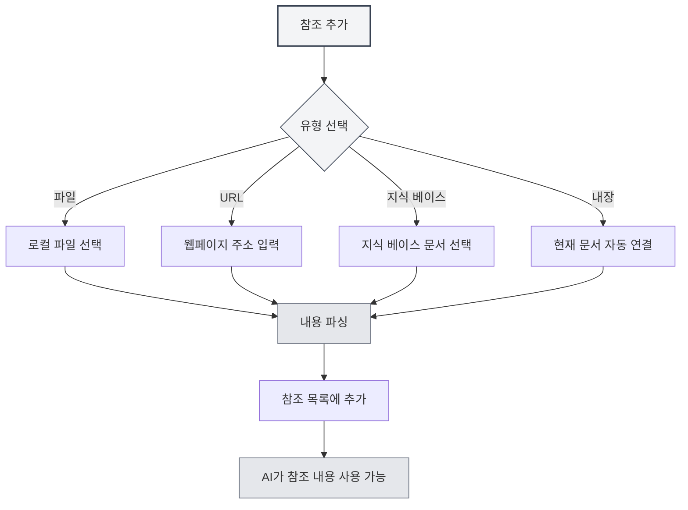

# 참조 자료 관리

## 개요

참조 자료는 에이전트 대화에서 중요한 기능으로, 외부 문서, 웹페이지, 파일 등의 내용을 대화에 도입할 수 있게 합니다. 에이전트는 이러한 참조 자료를 기반으로 추론하고 답변하여 AI의 응답을 더 정확하고 관련성 높게 만듭니다.

참조 자료를 통해 다음과 같은 작업이 가능합니다:

- AI가 특정 문서 내용을 참조하도록 하기
- 웹페이지 정보를 바탕으로 논의하기
- 로컬 파일 내용 분석하기
- 지식 베이스와 결합한 심층 질의응답하기

## 참조 관리 열기

에이전트 대화 인터페이스에서 "참조" 탭을 클릭하면 참조 자료 관리 패널이 열립니다.

참조 패널에는 현재 대화에 추가된 모든 참조 자료가 표시되며, 다음을 포함합니다:

- 파일 이름 또는 URL
- 참조 유형 (파일/URL/지식 베이스/내장 문서)
- 활성화 상태
- 내용 미리보기

사이드바를 통해 에이전트 뷰에 접근할 수 있습니다:

<ReferenceManager mode="demo" />
<ReferenceDisplay mode="demo" />

## 참조 추가

### 파일 참조 추가

로컬 파일을 참조 자료로 추가하기:

1. 참조 패널에서 "참조 추가" 버튼 클릭
2. "파일" 유형 선택
3. 파일 선택기에서 참조할 파일 선택
4. 추가 확인

**지원되는 파일 형식**:

- Markdown 문서 (.md)
- LaTeX 문서 (.tex)
- PDF 파일 (.pdf)
- Word 문서 (.docx)
- 일반 텍스트 파일 (.txt)
- 이미지 파일 (.png, .jpg)

<ReferenceManager mode="demo" />

### URL 참조 추가

웹페이지 내용 참조하기:

1. 참조 패널에서 "참조 추가" 버튼 클릭
2. "URL" 유형 선택
3. 참조할 웹페이지 주소 입력
4. 확인 클릭

MetaDoc은 자동으로 웹페이지 내용을 가져와 참조에 추가합니다.

<ReferenceManager mode="demo" />
<ReferenceDisplay mode="demo" />

### 지식 베이스 참조 추가

지식 베이스 내 문서 참조하기:

1. 참조 패널에서 "참조 추가" 버튼 클릭
2. "지식 베이스" 유형 선택
3. 지식 베이스 목록에서 참조할 문서 선택
4. 추가 확인

<ReferenceDisplay mode="demo" />

### 내장 문서 참조

각 에이전트 대화는 기본적으로 "내장 문서 참조"(0번 참조)가 활성화되어 있으며, 현재 열려 있는 문서 내용을 동적으로 가져와 참조 자료로 사용합니다.



## 참조 관리

### 참조 활성화/비활성화

각 참조 자료는 독립적으로 활성화 상태를 제어할 수 있습니다:

- **활성화**: 참조 내용이 AI의 추론 과정에 참여합니다.
- **비활성화**: 참조 내용이 일시적으로 추론에 참여하지 않지만 목록에는 유지됩니다.

참조 자료 옆의 스위치를 클릭하여 활성화 상태를 전환할 수 있습니다.

<ReferenceDisplay mode="demo" />

### 참조 내용 미리보기

참조 자료를 클릭하면 내용을 미리 볼 수 있습니다:

- **파일 참조**: 파일 내용의 텍스트 미리보기 표시
- **URL 참조**: 가져온 웹페이지 내용 표시
- **지식 베이스 참조**: 지식 베이스 내 관련 조각 표시
- **내장 참조**: 현재 문서 내용 표시

### 참조 삭제

더 이상 필요하지 않은 참조를 참조 목록에서 제거하기:

1. 참조 패널에서 삭제할 참조 찾기
2. 삭제 버튼(× 아이콘) 클릭
3. 삭제 확인

**참고**: 참조 삭제는 참조 관계만 제거하며 원본 파일에는 영향을 미치지 않습니다.

<ReferenceManager mode="demo" />

## 대화에서 참조의 역할

### 참조 인식

참조를 활성화하면 에이전트는 응답 시 다음과 같이 동작합니다:

1. **참조 내용 분석**: 참조된 문서, 웹페이지 또는 파일 내용 이해
2. **컨텍스트 결합**: 참조 내용과 대화 기록 결합
3. **답변 생성**: 참조 내용을 기반으로 더 정확한 답변 생성

### 사용 예시

**시나리오 1: 문서 기반 질의응답**

```
사용자: [기술 문서 한 편을 참조로 추가]
사용자 질문: 이 문서에서 언급된 모범 사례는 무엇인가요?
AI: 귀하가 참조한 문서에 따르면, 모범 사례는 다음과 같습니다...
```

**시나리오 2: 다중 문서 비교**

```
사용자: [논문 두 편을 참조로 추가]
사용자 질문: 이 두 논문의 연구 방법을 비교해 주세요.
AI: 첫 번째 논문은 ... 방법을 사용했고, 두 번째 논문은 ... 방법을 채택했습니다...
```

**시나리오 3: 웹페이지 내용 분석**

```
사용자: [뉴스 웹페이지 하나를 참조로 추가]
사용자 질문: 이 보도의 주요 내용을 요약해 주세요.
AI: 웹페이지 내용에 따르면, 주로 ...에 대해 보도했습니다...
```

## 모범 사례

### 참조 효율적 사용

1. **관련 자료 선택**: 현재 주제와 관련된 참조만 추가하여 정보 과부하 방지
2. **참조 수량 제어**: 처리 효율을 위해 동시에 활성화된 참조는 5개 이하로 권장
3. **적시 정리**: 대화 종료 후 더 이상 필요하지 않은 참조 삭제하여 목록 정리 유지

### 참조 전략

1. **문서 분석**: 긴 문서 분석 시, 문서 참조 추가 후 구체적인 질문하기
2. **지식 검색**: 지식 베이스 참조를 사용하여 지식 베이스 기반 질의응답 수행
3. **실시간 정보**: URL 참조를 통해 최신 웹페이지 정보 획득
4. **컨텍스트 연속**: 내장 참조를 활용하여 AI가 현재 편집 중인 문서 이해하도록 하기

## 사용 팁

### 빠른 추가

- **드래그 앤 드롭 추가**: 파일을 직접 참조 패널로 드래그 앤 드롭
- **우클릭 추가**: 파일 또는 웹페이지에서 우클릭 후 "참조에 추가" 선택
- **단축키**: 단축키를 사용하여 참조 패널 빠르게 열기

<ReferenceManager mode="demo" />

### 참조 조합

여러 가지 다른 유형의 참조를 동시에 추가할 수 있습니다:

- PDF 문서 한 부 + 웹페이지 링크 하나
- 지식 베이스 문서 여러 편
- 로컬 파일 + 내장 문서 참조

AI는 활성화된 모든 참조 내용을 종합적으로 분석합니다.

<ReferenceDisplay mode="demo" />

### 임시 비활성화

특정 참조의 유용성을 확신하지 못할 경우, 먼저 비활성화할 수 있습니다:

1. AI가 해당 참조 없이 답변하는 모습 관찰
2. 참조 활성화 후 답변 차이 비교
3. 효과에 따라 유지 여부 결정

## 자주 묻는 질문

### Q: 참조 내용에 크기 제한이 있나요?

A: 예. 너무 큰 파일은 잘려 처리될 수 있습니다. 권장 사항:

- 대형 문서는 장별로 추가
- 대량 문서 처리는 지식 베이스 사용
- 긴 문서는 먼저 핵심 부분 추출

### Q: 참조를 추가했는데 AI가 사용하지 않는 것 같습니다. 이유가 무엇인가요?

A: 가능한 원인:

- 참조가 활성화되지 않음 (스위치 상태 확인)
- 참조 내용이 질문과 무관함
- 참조 파싱 실패 (파일 형식 확인)

### Q: URL 참조가 실패하면 어떻게 하나요?

A: 가능한 원인:

- 웹페이지에 로그인 필요
- 웹페이지에 크롤러 방지 메커니즘 존재
- 네트워크 연결 문제
  권장: 웹페이지 내용을 파일로 저장한 후 파일 참조로 추가

### Q: 참조가 저장 공간을 차지하나요?

A: 참조 자체는 링크일 뿐 추가 공간을 차지하지 않습니다. 하지만 참조의 파싱 결과는 로컬에 캐시됩니다.

## 관련 문서

- [[agent.session|에이전트 세션 관리]]
- [[agent.introduction|에이전트 설정 관리]]
- [[knowledge-base.usage|지식 베이스 사용]]
- [[agent.introduction|에이전트 프레임워크 개요]]