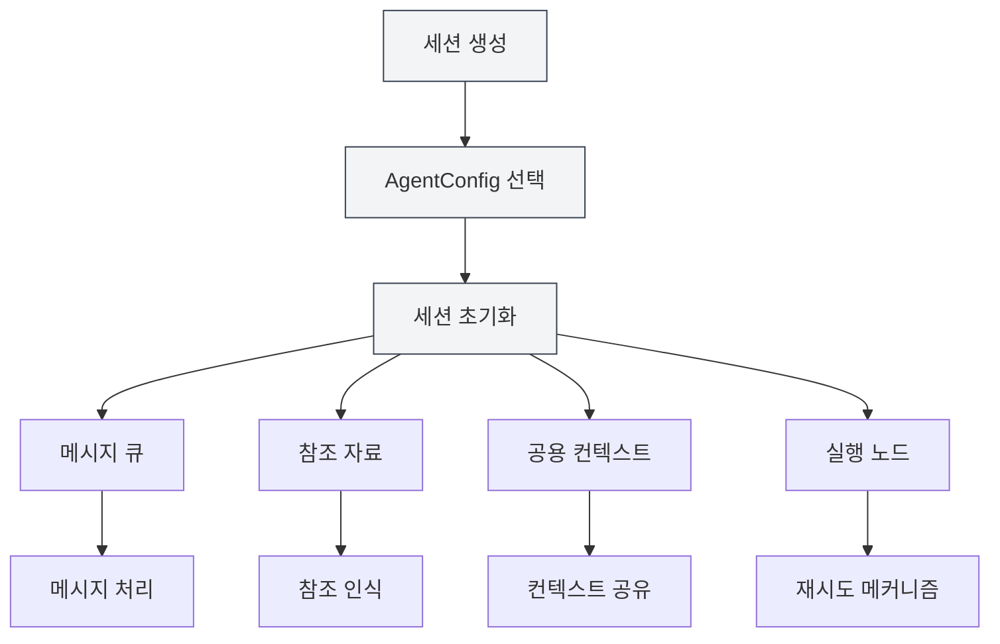
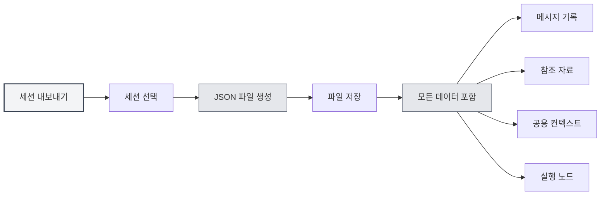
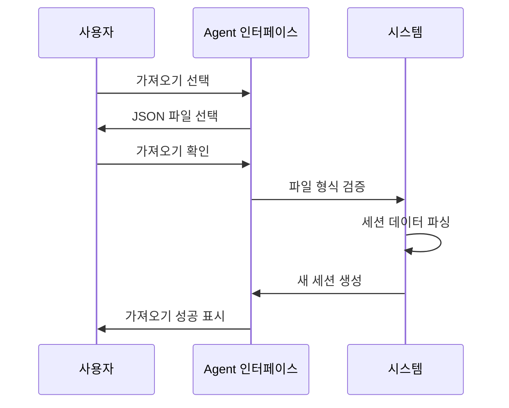
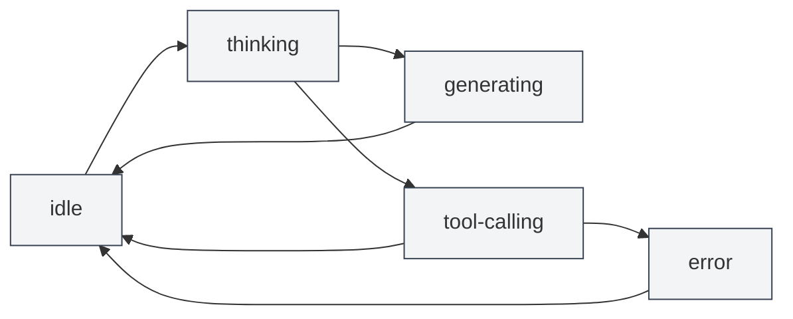

# 에이전트 세션 관리

## 개요

에이전트 세션은 에이전트 프레임워크의 핵심 구성 요소로, 독립적이고 컨텍스트를 가진 에이전트 실행 환경을 나타냅니다. 각 세션은 자체 메시지 기록, 참조 자료, 공용 컨텍스트 공간을 유지하며, 메시지 큐, 재시도, 복제 등 고급 기능을 지원합니다.

<AgentView mode="demo" />

에이전트 세션은 AgentConfig를 기반으로 생성되며, AgentConfig의 도구 세트와 능력 범위를 상속받지만, 각 세션은 독립적인 실행 상태와 기록을 가집니다.

## 세션 생성

### 새 세션 생성

에이전트 세션 생성 단계:

<AgentView mode="demo" />

1.  **에이전트 뷰 열기**: 메뉴 바의 "AI" → "Agent"를 클릭하여 에이전트 뷰를 엽니다.
2.  **AgentConfig 선택**: 세션 목록 상단에서 사용할 AgentConfig를 선택합니다.
3.  **세션 생성**: "새 세션" 버튼을 클릭합니다.
4.  **제목 입력**: 선택적으로 세션 제목을 입력합니다 (기본적으로 첫 번째 메시지를 제목으로 사용).
5.  **대화 시작**: 첫 번째 메시지를 입력하여 에이전트와 상호작용을 시작합니다.

### 세션 초기화

세션 생성 시 시스템은 자동으로 다음을 수행합니다:

<AgentSessionManager mode="demo" />

-   **세션 ID 생성**: 고유한 세션 식별자를 생성합니다.
-   **AgentConfig 연결**: 지정된 AgentConfig에 바인딩합니다.
-   **메시지 큐 초기화**: 빈 메시지 큐를 생성합니다.
-   **참조 자료 초기화**: 빈 참조 자료 저장소를 생성합니다.
-   **공용 컨텍스트 초기화**: 현재 시간 등의 정보를 포함하는 공용 컨텍스트 공간을 생성합니다.
-   **인사말 생성**: 에이전트의 인사말 메시지를 자동으로 추가합니다.
-   **내장 참조 활성화**: 기본적으로 내장 0번 reference(현재 문서 내용 동적 획득)를 활성화합니다.

## 세션 이름 변경

### 이름 변경 작업

기존 세션 이름 변경:

<AgentView mode="demo" />

1.  **마우스 오른쪽 버튼 메뉴**: 세션을 마우스 오른쪽 버튼으로 클릭하고 "이름 변경"을 선택합니다.
2.  **새 이름 입력**: 팝업 대화 상자에 새 세션 이름을 입력합니다.
3.  **확인 및 저장**: 확인을 클릭하여 새 이름을 저장합니다.

세션 이름은 다른 세션을 식별하고 구분하는 데 사용되며, 설명적인 이름을 사용하는 것이 좋습니다.

## 세션 삭제

### 삭제 작업

필요하지 않은 세션 삭제:

<AgentSessionManager mode="demo" />

1.  **마우스 오른쪽 버튼 메뉴**: 세션을 마우스 오른쪽 버튼으로 클릭하고 "삭제"를 선택합니다.
2.  **삭제 확인**: 팝업 확인 대화 상자에서 삭제를 확인합니다.

**주의**: 세션 삭제 시 해당 세션의 모든 메시지 기록, 참조 자료 및 실행 노드가 함께 삭제되며, 이 작업은 복구할 수 없습니다.

### 일괄 삭제

현재 일괄 삭제는 지원되지 않으며, 세션을 하나씩 삭제해야 합니다.

## 세션 복사

### 복사 작업

기존 세션 복사:

<AgentView mode="demo" />

1.  **마우스 오른쪽 버튼 메뉴**: 세션을 마우스 오른쪽 버튼으로 클릭하고 "복사"를 선택합니다.
2.  **복사본 생성**: 시스템이 새로운 세션 복사본을 생성합니다.

세션 복사 시 다음이 복사됩니다:

-   **메시지 기록**: 모든 메시지 기록
-   **참조 자료**: 모든 참조 자료
-   **공용 컨텍스트**: 공용 컨텍스트 공간의 내용
-   **실행 노드**: 모든 실행 노드 기록

복사된 세션은 독립적이며, 수정해도 원본 세션에 영향을 미치지 않습니다.

### 사용 시나리오

세션 복사는 다음에 적합합니다:

-   **분기 토론**: 기존 대화를 기반으로 다른 주제에 대해 계속 토론
-   **실험 테스트**: 다른 에이전트 구성 또는 도구 세트 테스트
-   **백업 저장**: 중요한 세션 상태 저장

## 세션 내보내기/가져오기

### 세션 내보내기

<AgentView mode="demo" />

세션을 JSON 파일로 내보내기:

<AgentView mode="demo" />

1.  **마우스 오른쪽 버튼 메뉴**: 세션을 마우스 오른쪽 버튼으로 클릭하고 "내보내기"를 선택합니다.
2.  **위치 선택**: 저장 위치와 파일 이름을 선택합니다.
3.  **파일 저장**: 저장을 클릭하여 세션을 내보냅니다.

내보낸 JSON 파일에는 다음이 포함됩니다:

-   세션 기본 정보 (ID, 제목, 설명 등)
-   메시지 기록
-   참조 자료
-   공용 컨텍스트
-   실행 노드

### 세션 가져오기

<AgentSessionManager mode="demo" />

JSON 파일에서 세션 가져오기:

1.  **가져오기 열기**: 에이전트 뷰에서 가져오기 기능을 찾습니다.
2.  **파일 선택**: 가져올 JSON 파일을 선택합니다.
3.  **데이터 검증**: 시스템이 파일 형식과 내용을 검증합니다.
4.  **세션 가져오기**: 가져오기 성공 후 새 세션을 생성합니다.

가져온 세션은 새로운 세션 ID를 생성하며, 기존 세션을 덮어쓰지 않습니다.

## 세션 재시도

### 재시도 기능

세션 재시도를 통해 실패한 에이전트 작업을 다시 실행할 수 있습니다:

1.  **실행 노드 확인**: 세션에서 실행 노드 목록을 확인합니다.
2.  **노드 선택**: 재시도할 실행 노드를 선택합니다.
3.  **재실행**: "재시도" 버튼을 클릭하여 다시 실행합니다.

재시도는 선택한 실행 노드부터 다시 실행되며, 이전 메시지 기록은 유지됩니다.

### 실행 노드

실행 노드는 에이전트 실행 과정의 각 단계를 기록합니다:

-   **메시지 노드**: 사용자 메시지 또는 AI 응답
-   **도구 호출 노드**: 도구 호출 및 실행 결과
-   **워크플로우 호출 노드**: 워크플로우 실행 과정
-   **LLM 호출 노드**: LLM 호출 및 응답

각 노드에는 상태(pending, running, succeeded, failed, cancelled)와 결과가 있습니다.

## 세션 메시지 관리

### 메시지 작업

세션 메시지에 대해 다음 작업을 수행할 수 있습니다:

-   **메시지 편집**: 사용자 메시지를 편집하여 다시 보냅니다.
-   **다시 생성**: AI 응답을 다시 생성합니다.
-   **메시지 복사**: 메시지 내용을 복사합니다.
-   **메시지 삭제**: 메시지를 삭제합니다 (해당 메시지 이후의 모든 메시지가 삭제됨).

### 메시지 큐

<AgentView mode="demo" />

메시지 큐를 통해 에이전트 실행 과정 중에 메시지를 삽입할 수 있습니다:

1.  **삽입 시점**: 에이전트가 응답을 생성하거나 도구를 호출하는 중일 때, 메시지는 큐에 임시 저장됩니다.
2.  **처리 시점**: 현재 작업 실행이 완료된 후, 다음 단계를 실행하기 전에 큐의 메시지를 먼저 처리합니다.
3.  **주석 정보**: 큐 메시지에는 삽입 시간점과 삽입 시 메시지 ID가 표시되어 에이전트가 컨텍스트를 이해하는 데 도움을 줍니다.

메시지 큐 기능을 사용하면 에이전트 실행 과정 중에 추가 정보나 지시를 제공할 수 있습니다.

## 참조 자료 관리

### 참조 추가

<ReferenceManager mode="demo" />

세션에 참조 자료 추가:

1.  **참조 관리 열기**: 세션의 "참조" 탭을 클릭합니다.
2.  **참조 추가**: "참조 추가" 버튼을 클릭합니다.
3.  **유형 선택**: 참조 유형(파일, URL, 텍스트 등)을 선택합니다.
4.  **내용 선택**: 참조할 내용을 선택합니다.

자세한 내용은 [[agent.references|참조 자료 관리]]를 참조하세요.

### 참조 유형

다음 참조 유형을 지원합니다:

-   **파일 참조**: 로컬 파일 참조 (Markdown, LaTeX, PDF, Word, 이미지 등)
-   **URL 참조**: 웹페이지 URL 참조
-   **텍스트 참조**: 사용자 정의 텍스트 내용 참조
-   **지식 베이스 참조**: 지식 베이스의 내용 참조
-   **내장 참조**: 현재 문서 내용 동적 획득 (기본 활성화)

### 참조 활성화

<ReferenceManager mode="demo" />

참조 자료를 활성화하거나 비활성화할 수 있습니다:

-   **참조 활성화**: 활성화된 참조는 에이전트 실행 시 사용됩니다.
-   **참조 비활성화**: 비활성화된 참조는 에이전트 실행에 영향을 미치지 않습니다.

에이전트는 참조 자료의 내용을 인식하고 이를 기반으로 추론 및 작업을 수행할 수 있습니다.

## 공용 컨텍스트

### 컨텍스트 공간

공용 컨텍스트는 세션 수준의 공유 컨텍스트 공간으로 다음을 포함합니다:

<AgentView mode="demo" />

-   **현재 시간**: 자동 업데이트되는 타임스탬프
-   **문서 정보**: 현재 열린 문서 정보 (활성화된 경우)
-   **사용자 정의 데이터**: 사용자 정의 컨텍스트 데이터

### 사용 시나리오

공용 컨텍스트는 다음에 적합합니다:

-   **시간 인식**: 에이전트가 현재 시간을 알 수 있도록 함
-   **문서 인식**: 에이전트가 현재 열린 문서를 알 수 있도록 함
-   **상태 공유**: 워크플로우에서 상태 정보 공유

## 세션 상태

<AgentSessionManager mode="demo" />

### 상태 유형

세션에는 다음과 같은 상태가 있습니다:

-   **idle**: 유휴 상태, 사용자 입력 대기 중
-   **thinking**: 에이전트가 사고 중
-   **generating**: 에이전트가 응답 생성 중
-   **tool-calling**: 에이전트가 도구 호출 중
-   **waiting-input**: 사용자 입력 대기 중
-   **error**: 오류 발생

### 상태 전환

## 사용 팁

<AgentView mode="demo" />

### 세션 구성

1.  **분류 관리**: 다른 주제에 대해 다른 세션 생성
2.  **명명 규칙**: 명확한 세션 이름 사용
3.  **정기 정리**: 필요하지 않은 세션 정기 삭제

### 메시지 관리

1.  **메시지 편집**: AI 응답이 만족스럽지 않으면 사용자 메시지를 편집하여 다시 보냅니다.
2.  **참조 사용**: 참조 자료를 추가하여 더 많은 컨텍스트를 제공합니다.
3.  **메시지 큐**: 에이전트 실행 과정 중 메시지 큐를 사용하여 추가 정보를 삽입합니다.

### 재시도 메커니즘

1.  **노드 확인**: 실행 노드를 확인하여 에이전트 실행 과정을 이해합니다.
2.  **재시도 선택**: 실패한 노드를 선택하여 재시도합니다.
3.  **구성 조정**: 자주 실패하는 경우 AgentConfig 또는 도구 세트 조정을 고려합니다.

## 자주 묻는 질문

<AgentView mode="demo" />

### Q: 새 세션을 어떻게 생성하나요?

A: 에이전트 뷰에서 AgentConfig를 선택한 후 "새 세션" 버튼을 클릭합니다. 세션 생성 후 첫 번째 메시지를 입력하여 대화를 시작합니다.

### Q: 세션 메시지 기록은 저장되나요?

A: 네, 세션 메시지 기록은 문서의 metadata에 자동 저장됩니다. 문서를 다시 열면 모든 세션이 복원됩니다.

### Q: 세션을 어떻게 삭제하나요?

A: 세션을 마우스 오른쪽 버튼으로 클릭하고 "삭제"를 선택한 후 확인 대화 상자에서 삭제를 확인합니다. 삭제 작업은 복구할 수 없습니다.

### Q: 세션 복사 시 무엇이 복사되나요?

A: 세션 복사 시 메시지 기록, 참조 자료, 공용 컨텍스트 및 실행 노드가 복사됩니다. 복사된 세션은 독립적입니다.

### Q: 세션을 어떻게 내보내나요?

A: 세션을 마우스 오른쪽 버튼으로 클릭하고 "내보내기"를 선택한 후 저장 위치를 선택합니다. 내보낸 JSON 파일에는 세션의 모든 정보가 포함됩니다.

### Q: 메시지 큐란 무엇인가요?

A: 메시지 큐를 통해 에이전트 실행 과정 중에 메시지를 삽입할 수 있습니다. 현재 작업 실행이 완료된 후 큐의 메시지가 처리됩니다.

### Q: 실패한 실행을 어떻게 재시도하나요?

A: 세션에서 실행 노드 목록을 확인하고, 실패한 노드를 선택한 후 "재시도" 버튼을 클릭합니다.

### Q: 참조 자료는 에이전트에 어떻게 영향을 미치나요?

A: 에이전트는 참조 자료의 내용을 인식하고 이를 기반으로 추론 및 작업을 수행할 수 있습니다. 활성화된 참조는 에이전트 실행 시 사용됩니다.

## 관련 문서

-   [[agent.introduction|에이전트 프레임워크 개요]]