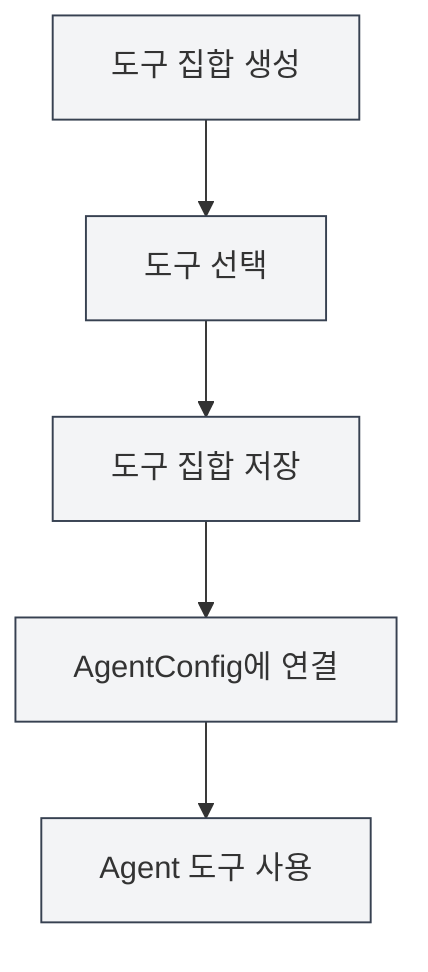

# 도구 집합 관리

## 개요

도구 집합(ToolCollection)은 Agent 프레임워크에서 Agent 도구를 조직하고 관리하는 데 사용되는 집합입니다. 도구 집합은 관련 도구들을 함께 조직하여 관리와 재사용을 용이하게 합니다. AgentConfig는 도구 집합을 연결하여 Agent가 사용할 수 있는 도구를 결정합니다.

도구 집합은 도구의 동적 추가 및 제거를 지원하며, 특정 용도를 위한 도구 집합을 생성하거나 여러 도구 집합을 조합하여 사용할 수 있습니다.

## 핵심 개념

### 도구 집합 구조

<AgentView mode="demo" />

도구 집합은 다음과 같은 주요 부분을 포함합니다:

- **기본 정보**: ID, 이름, 설명, 버전 번호
- **도구 목록**: 포함된 도구 ID 목록 (내부 도구, 외부 도구 포함)
- **활성화 상태**: 해당 도구 집합의 활성화 여부
- **태그**: 분류 및 검색을 위한 태그
- **내장 식별자**: 내장 도구 집합인지 여부 (삭제 불가)

### 도구 유형

<GrepDisplay mode="demo" />

도구 집합은 다음 유형의 도구를 포함할 수 있습니다:

- **내부 도구**: MetaDoc에 내장된 Agent 도구 (예: edit-tool, proofread-tool 등)
- **외부 도구**: 사용자 정의 외부 도구

### 기본 도구 집합

시스템은 모든 내장 Agent 도구를 포함하는 기본 도구 집합(`default-tool-set`)을 제공하며, 삭제할 수 없지만 복사는 가능합니다.

## 도구 집합 생성

<AgentView mode="demo" />

### 새 도구 집합 생성

도구 집합 생성 단계:

1. **도구 집합 관리 열기**: Agent 뷰에서 "관리" → "도구 집합" 클릭
2. **도구 집합 생성**: "새 도구 집합" 버튼 클릭
3. **기본 정보 입력**:
   - 이름: 도구 집합의 이름 (다국어 지원)
   - 설명: 도구 집합의 설명 (다국어 지원)
4. **도구 선택**: 드롭다운 목록에서 하나 이상의 도구 선택
   - 도구 이름으로 검색 가능
   - 다중 선택 지원
   - 도구 유형 및 설명 표시
5. **도구 집합 저장**: "저장" 버튼 클릭

사이드바를 통해 Agent 뷰에 접근할 수 있습니다:

### Agent 도구 집합 인터페이스

아래 그림은 도구 집합 관리 인터페이스의 주요 기능을 보여줍니다:

<AgentView mode="demo" />

### 도구 선택

도구를 선택할 때 시스템은 다음을 표시합니다:

- **도구 이름**: 도구의 표시 이름
- **도구 ID**: 도구의 고유 식별자
- **도구 유형**: 내부 도구, 외부 도구 또는 워크플로 도구
- **도구 설명**: 도구의 간략한 설명

<DialogDemo mode="demo" dialogType="tool-select" />

## 도구 집합 편집

<AgentView mode="demo" />

### 편집 작업

기존 도구 집합 편집:

1. **관리 인터페이스 열기**: 도구 집합 관리 인터페이스에서 편집할 도구 집합 찾기
2. **편집 클릭**: 도구 집합 카드의 "편집" 버튼 클릭
3. **정보 수정**: 이름, 설명 또는 도구 목록 수정
4. **변경 사항 저장**: "저장" 버튼 클릭

**참고**: 기본 도구 집합(`default-tool-set`)은 편집이 허용되지 않지만, 복사 후 편집은 가능합니다.

### 도구 추가

도구 집합에 도구 추가:

1. **편집 인터페이스 열기**: 도구 집합 편집
2. **도구 선택**: 도구 드롭다운 목록에서 추가할 도구 선택
3. **변경 사항 저장**: "저장" 버튼 클릭

### 도구 제거

도구 집합에서 도구 제거:

1. **편집 인터페이스 열기**: 도구 집합 편집
2. **선택 해제**: 도구 목록에서 제거할 도구 선택 해제
3. **변경 사항 저장**: "저장" 버튼 클릭

## 도구 집합 삭제

<AgentView mode="demo" />

### 삭제 작업

불필요한 도구 집합 삭제:

1. **관리 인터페이스 열기**: 도구 집합 관리 인터페이스에서 삭제할 도구 집합 찾기
2. **삭제 클릭**: 도구 집합 카드의 "삭제" 버튼 클릭
3. **삭제 확인**: 표시되는 확인 대화 상자에서 삭제 확인

**참고**:

- 기본 도구 집합(`default-tool-set`)은 삭제할 수 없습니다.
- 도구 집합 삭제는 생성된 AgentConfig에 영향을 미치지 않지만, 해당 도구 집합에 연결된 AgentConfig는 도구 집합을 사용할 수 없게 됩니다.
- 도구 집합이 AgentConfig에서 사용 중인 경우, 삭제 전에 알림이 표시됩니다.

## 도구 집합 복사

### 복사 작업

<OutlineTreeDisplay mode="demo" />

기존 도구 집합 복사:

1. **관리 인터페이스 열기**: 도구 집합 관리 인터페이스에서 복사할 도구 집합 찾기
2. **복사 클릭**: 도구 집합 카드의 "복사" 버튼 클릭
3. **사본 편집**: 시스템이 사본을 생성하며, 이름에 자동으로 "(사본)" 접미사가 추가됩니다.
4. **수정 사항 저장**: 필요에 따라 사본을 수정하고 저장

도구 집합을 복사하면 도구 목록 및 구성을 포함한 모든 도구가 복사됩니다.

## 도구 집합 가져오기/내보내기

### 도구 집합 내보내기

도구 집합을 JSON 파일로 내보내기:

1. **관리 인터페이스 열기**: 도구 집합 관리 인터페이스에서 내보낼 도구 집합 찾기
2. **내보내기 클릭**: 도구 집합 카드의 "내보내기" 버튼 클릭
3. **위치 선택**: 저장 위치 및 파일 이름 선택
4. **파일 저장**: 저장을 클릭하여 도구 집합 내보내기

<DialogDemo mode="demo" dialogType="export-config" />

내보낸 JSON 파일에는 도구 집합의 모든 정보가 포함되어 있으며, 백업 또는 공유에 사용할 수 있습니다.

### 도구 집합 가져오기

<DataAnalysisDisplay mode="demo" />

JSON 파일에서 도구 집합 가져오기:

1. **관리 인터페이스 열기**: 도구 집합 관리 인터페이스에서
2. **가져오기 클릭**: "도구 집합 가져오기" 버튼 클릭
3. **파일 선택**: 가져올 JSON 파일 선택
4. **데이터 검증**: 시스템이 파일 형식 및 내용을 검증
5. **도구 집합 가져오기**: 가져오기 성공 후 새 도구 집합 생성

<DialogDemo mode="demo" dialogType="import-config" />

가져온 도구 집합은 새로운 ID로 생성되며, 기존 도구 집합을 덮어쓰지 않습니다 (덮어쓰기 모드를 사용하지 않는 한).

## 도구 집합과 AgentConfig

### 도구 집합 연결

AgentConfig는 도구 집합을 연결하여 사용 가능한 도구를 결정합니다:

1. **AgentConfig 생성**: 새 AgentConfig 생성
2. **도구 집합 선택**: AgentConfig에서 하나 이상의 도구 집합 선택
3. **도구 교집합**: 여러 도구 집합을 선택한 경우, 사용 가능한 도구는 모든 도구 집합의 교집합입니다.

### 도구 집합 교집합

<DiffDisplay mode="demo" />

AgentConfig가 여러 도구 집합에 연결된 경우:

- 도구 집합 A 포함: `[tool1, tool2, tool3]`
- 도구 집합 B 포함: `[tool2, tool3, tool4]`
- AgentConfig 사용 가능 도구: `[tool2, tool3]` (교집합)

이 메커니즘을 통해 Agent의 능력 범위를 정밀하게 제어할 수 있습니다.

## 사용 팁

### 도구 집합 조직화

1. **기능별 분류**: "문서 편집 도구 집합", "데이터 분석 도구 집합"과 같이 기능별로 도구 집합 생성
2. **시나리오별 분류**: "학술 작성 도구 집합", "코드 분석 도구 집합"과 같이 시나리오별로 도구 집합 생성
3. **명명 규칙**: 식별 및 관리가 용이하도록 명확한 이름 사용

### 도구 집합 설계

1. **단일 책임**: 각 도구 집합은 특정 기능이나 시나리오에 집중
2. **도구 조합**: 관련 도구를 적절히 조합하고, 도구 집합이 너무 커지지 않도록 주의
3. **재사용성**: 다양한 AgentConfig에서 사용할 수 있도록 재사용 가능한 도구 집합 설계

### 도구 집합 관리

1. **정기 정리**: 더 이상 사용하지 않는 도구 집합 삭제
2. **버전 관리**: 내보내기 기능을 통해 중요한 도구 집합 백업
3. **문서 기록**: 도구 집합 설명에 용도 및 사용 시나리오 명시

## 자주 묻는 질문

### Q: 전용 도구 집합을 어떻게 생성하나요?

A: 새 도구 집합을 생성하고, 관련 도구를 선택하며, 명확한 이름과 설명을 설정하세요. 예를 들어, "데이터 분석 도구 집합"을 생성하고 데이터 분석 관련 도구를 선택합니다.

### Q: 도구 집합과 AgentConfig의 관계는 무엇인가요?

A: AgentConfig는 도구 집합을 연결하여 사용 가능한 도구를 결정합니다. 하나의 AgentConfig는 여러 도구 집합에 연결될 수 있으며, 사용 가능한 도구는 모든 도구 집합의 교집합입니다.

### Q: 기본 도구 집합을 수정할 수 있나요?

A: 기본 도구 집합(`default-tool-set`)은 편집이 허용되지 않지만, 복사 후 편집은 가능합니다. 기본 도구 집합을 복사한 후 사본을 수정하세요.

### Q: 도구 집합에 사용자 정의 도구를 어떻게 추가하나요?

A: 먼저 사용자 정의 도구를 등록한 후, 도구 집합 생성 또는 편집 시 해당 도구를 선택해야 합니다. 사용자 정의 도구는 Agent 도구 규격을 준수해야 합니다.

### Q: 도구 집합을 삭제하면 AgentConfig에 영향을 미치나요?

A: 도구 집합 삭제는 생성된 AgentConfig에 영향을 미치지 않지만, 해당 도구 집합에 연결된 AgentConfig는 도구 집합을 사용할 수 없게 됩니다. 도구 집합이 사용 중인 경우 삭제 전에 알림이 표시됩니다.

## 관련 문서

- [[agent.introduction|Agent 프레임워크 개요]]
- [[agent.config|Agent 구성 관리]]
- [[agent.session|Agent 세션 관리]]