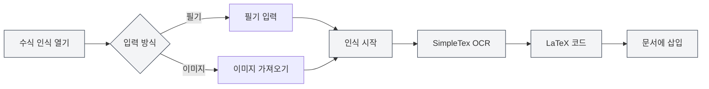

# AI 어시스턴트 기능

## 개요

AI 어시스턴트 기능은 문서 작성, 수식 인식, 차트 생성, 데이터 분석 등 다양한 작업을 지원하는 여러 지능형 보조 도구를 제공합니다. AI 어시스턴트를 통해 다양한 문서 처리 작업을 효율적으로 완료할 수 있습니다.

AI 어시스턴트 기능에는 AI 대화, 필기 수식 인식, 지능형 드로잉 어시스턴트, 데이터 분석 도구, OCR 문자 인식, 첨부 파일 파싱 도구, AIGC 감지 등이 포함됩니다.

<AgentView mode="demo" />

## AI 대화

### 기능 소개

AI 대화 기능은 현재 문서 내용을 기반으로 대화할 수 있는 지능형 대화 어시스턴트를 제공합니다:

- **컨텍스트 이해**: 현재 문서의 내용과 컨텍스트를 이해합니다.
- **지능형 답변**: 문서 내용에 따라 관련 질문에 답변합니다.
- **문서 분석**: 문서 구조, 내용, 스타일 등을 분석합니다.

AI 어시스턴트 메뉴를 통해 AI 대화 기능에 접근할 수 있습니다:

<MenuItemsDemo mode="demo" :items='[{"id": "ai-assistant", "items": ["ai-chat"]}]' />

### 인터페이스 미리보기

AI 대화 인터페이스에는 대화 목록과 대화 영역이 포함되어 있으며, 다중 세션 관리 및 참조 자료를 지원합니다:

<AIChat mode="demo" />

자세한 내용은 [[ai.chat|AI 대화]]를 참조하세요.

## 필기 수식 인식

### 기능 소개

필기 수식 인식 기능은 손으로 쓴 수학 수식을 LaTeX 코드로 변환할 수 있습니다:

<FormulaRecognition mode="demo" />

- **필기 입력**: 마우스/터치스크린 필기 입력을 지원합니다.
- **이미지 가져오기**: 수식 이미지를 가져와 인식을 지원합니다.
- **실시간 인식**: SimpleTex OCR API를 사용하여 인식합니다.
- **LaTeX 출력**: 표준 LaTeX 형식으로 자동 변환됩니다.

### 사용 방법

1. **수식 인식 열기**: AI 어시스턴트 메뉴에서 수식 인식 창을 엽니다.
2. **필기 입력**: 캔버스에 수학 수식을 손으로 씁니다.
3. **또는 이미지 가져오기**: 가져오기 버튼을 클릭하고 수식 이미지를 선택합니다.
4. **인식 시작**: 인식 버튼을 클릭합니다.
5. **결과 확인**: 인식된 LaTeX 코드를 확인합니다.
6. **문서에 삽입**: LaTeX 코드를 문서에 삽입합니다.

AI 어시스턴트 메뉴를 통해 필기 수식 인식 기능에 접근할 수 있습니다:

<MenuItemsDemo mode="demo" :items='[{"id": "ai-assistant", "items": ["formula-recognition"]}]' />

### 인식 정확도

- **고정밀 인식**: SimpleTex OCR API는 고정밀 수학 수식 인식을 제공합니다.
- **복잡한 수식 지원**: 분수, 근호, 적분, 합계 등 복잡한 수식을 지원합니다.
- **자동 오류 수정**: 인식 결과는 수동으로 편집 및 수정할 수 있습니다.

## 지능형 드로잉 어시스턴트

### 기능 소개

지능형 드로잉 어시스턴트는 AI를 사용하여 차트 코드를 생성하며, 다양한 차트 형식을 지원합니다:

- **Mermaid 차트**: 플로우차트, 시퀀스 다이어그램, 클래스 다이어그램, 상태 다이어그램 등
- **PlantUML 차트**: UML 다이어그램, 시퀀스 다이어그램, 액티비티 다이어그램 등
- **ECharts 차트**: 선 그래프, 막대 그래프, 원 그래프, 산점도 등
- **직접 삽입**: 생성된 차트를 문서에 직접 삽입할 수 있습니다.

### 인터페이스 미리보기

지능형 드로잉 어시스턴트는 다중 세션 관리를 지원하며, 차트 엔진을 자동 선택하여 시각적 차트를 생성합니다:

<GraphWindow mode="demo" />

<MenuItemsDemo mode="demo" :items='[{"id": "ai-assistant"}]' />

### 사용 방법

1. **드로잉 어시스턴트 열기**: 메뉴 또는 도구 모음에서 드로잉 어시스턴트를 엽니다.
2. **요구사항 설명**: 생성할 차트에 대해 자연어로 설명합니다.
3. **유형 선택**: 차트 유형(Mermaid, PlantUML, ECharts 등)을 선택합니다.
4. **차트 생성**: AI가 설명에 따라 차트 코드를 생성합니다.
5. **차트 미리보기**: 생성된 차트를 미리 봅니다.
6. **문서에 삽입**: 차트를 문서에 삽입합니다.

### 지원하는 차트 유형

- **Mermaid**: 플로우차트, 시퀀스 다이어그램, 클래스 다이어그램, 상태 다이어그램, ER 다이어그램, 간트 차트, 원 그래프, Git 그래프, 여정 지도, 마인드 맵, 타임라인 등
- **PlantUML**: UML 다이어그램, 시퀀스 다이어그램, 액티비티 다이어그램, 컴포넌트 다이어그램, 배포 다이어그램 등
- **ECharts**: 선 그래프, 막대 그래프, 원 그래프, 산점도, 레이더 차트, 히트맵, 트리 맵, 트리맵, 선라이즈 차트 등

자세한 내용은 [[charts.introduction|차트 기능 소개]]를 참조하세요.

## 데이터 분석 도구

### 기능 소개

데이터 분석 도구는 문서 내 데이터 테이블을 분석하여 시각적 차트를 생성할 수 있습니다:

- **테이블 인식**: 문서 내 테이블 데이터를 자동으로 인식합니다.
- **데이터 분석**: 테이블 데이터의 통계 정보를 분석합니다.
- **차트 생성**: 데이터를 기반으로 시각적 차트를 생성합니다.
- **차트 삽입**: 생성된 차트를 문서에 삽입합니다.

<DataAnalysisWindow mode="demo" />

### 사용 방법

1. **데이터 분석 열기**: 메뉴 또는 도구 모음에서 데이터 분석 창을 엽니다.
2. **테이블 선택**: 문서에서 분석할 테이블을 선택합니다.
3. **데이터 분석**: 분석 버튼을 클릭하면 AI가 테이블 데이터를 분석합니다.
4. **차트 생성**: 분석 결과를 기반으로 시각적 차트를 생성합니다.
5. **문서에 삽입**: 차트를 문서에 삽입합니다.

## OCR 문자 인식

### 기능 소개

OCR 문자 인식 기능은 이미지 내의 문자를 인식하여 텍스트 내용을 추출할 수 있습니다:

- **이미지 인식**: 이미지 내의 문자 내용을 인식합니다.
- **다국어 지원**: 중국어, 영어 등 다양한 언어를 지원합니다.
- **텍스트 추출**: 인식된 문자 내용을 추출합니다.
- **문서에 삽입**: 추출된 텍스트를 문서에 삽입합니다.

### 인터페이스 미리보기

OCR 인식 창은 다중 이미지 관리, 이미지 전처리 매개변수 조정 및 인식 결과 편집을 지원합니다:

<OcrWindow mode="demo" />

<MenuItemsDemo mode="demo" :items='[{"id": "ai-assistant", "items": ["proofread"]}]' />

### 사용 방법

1. **OCR 인식 열기**: 메뉴 또는 도구 모음에서 OCR 인식 창을 엽니다.
2. **이미지 가져오기**: 인식할 이미지를 가져옵니다.
3. **인식 시작**: 인식 버튼을 클릭합니다.
4. **결과 확인**: 인식된 문자 내용을 확인합니다.
5. **문서에 삽입**: 텍스트를 문서에 삽입합니다.

## 첨부 파일 파싱 도구

### 기능 소개

첨부 파일 파싱 도구는 PDF, Word 등의 첨부 파일을 파싱하여 파일 내용을 추출할 수 있습니다:

- **파일 파싱**: PDF, Word 등의 파일 형식을 파싱합니다.
- **내용 추출**: 파일 내의 텍스트와 이미지를 추출합니다.
- **지식 베이스에 추가**: 추출된 내용을 지식 베이스에 추가합니다.
- **문서 참조**: 문서에서 첨부 파일 내용을 참조합니다.

<KnowledgeBase mode="demo" />

### 사용 방법

1. **첨부 파일 파싱 열기**: 메뉴 또는 도구 모음에서 첨부 파일 파싱 창을 엽니다.
2. **파일 선택**: 파싱할 PDF 또는 Word 파일을 선택합니다.
3. **파싱 시작**: 파싱 버튼을 클릭합니다.
4. **결과 확인**: 파싱된 내용을 확인합니다.
5. **지식 베이스에 추가**: 내용을 지식 베이스에 추가합니다(선택 사항).

## AIGC 감지

### 기능 소개

AIGC 감지 기능은 텍스트가 AI 생성 내용인지 여부를 감지할 수 있습니다:

- **텍스트 감지**: 텍스트가 AI 생성인지 감지합니다.
- **신뢰도 점수**: AI 생성 확률 점수를 제공합니다.
- **감지 보고서**: 상세한 감지 보고서를 생성합니다.

<AigcDetectionWindow mode="demo" />

### 사용 방법

1. **AIGC 감지 열기**: 메뉴 또는 도구 모음에서 AIGC 감지 창을 엽니다.
2. **텍스트 선택**: 감지할 텍스트를 선택합니다.
3. **감지 시작**: 감지 버튼을 클릭합니다.
4. **결과 확인**: 감지 결과와 신뢰도 점수를 확인합니다.

## 사용 팁

### AI 어시스턴트 효율적 사용

1. **명확한 요구사항**: 요구사항을 명확히 설명하여 더 나은 결과를 얻습니다.
2. **컨텍스트 제공**: 충분한 컨텍스트 정보를 제공합니다.
3. **반복 최적화**: 결과에 따라 요구사항을 반복적으로 최적화합니다.

### 수식 인식 팁

1. **명확한 필기**: 필기 시 명확하게 쓰고, 흘려 쓰지 않습니다.
2. **올바른 형식**: 올바른 수학 기호 형식을 사용합니다.
3. **결과 확인**: 인식 후 결과를 확인하고, 필요 시 수동으로 수정합니다.

### 차트 생성 팁

1. **상세한 설명**: 데이터 유형, 스타일 등을 포함하여 차트 요구사항을 상세히 설명합니다.
2. **유형 선택**: 요구사항에 맞는 적절한 차트 유형을 선택합니다.
3. **미리보기 및 조정**: 차트를 미리 본 후 필요에 따라 조정합니다.

## 자주 묻는 질문

### Q: 수식 인식이 정확하지 않나요?

A: 수식 인식은 SimpleTex OCR API를 기반으로 하므로 부정확할 수 있습니다. 필기 시 명확하게 쓰거나, 이미지 가져오기를 사용하는 것이 좋습니다.

### Q: 생성된 차트가 기대와 다르나요?

A: 요구사항을 상세히 설명하거나, 생성된 차트 코드를 수동으로 편집하여 조정할 수 있습니다.

### Q: OCR 인식은 어떤 언어를 지원하나요?

A: OCR 인식은 중국어, 영어 등 다양한 언어를 지원하며, 사용된 OCR 서비스에 따라 다릅니다.

### Q: 첨부 파일 파싱은 어떤 형식을 지원하나요?

A: 첨부 파일 파싱은 PDF, Word 등 일반적인 형식을 지원하며, 파싱 서비스의 능력에 따라 다릅니다.

<AgentView mode="demo" />

## 관련 문서

- [[ai.chat|AI 대화]]
- [[charts.introduction|차트 기능 소개]]
- [[knowledge-base.usage|지식 베이스 사용]]