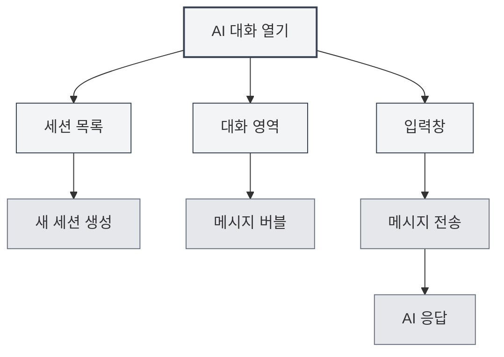
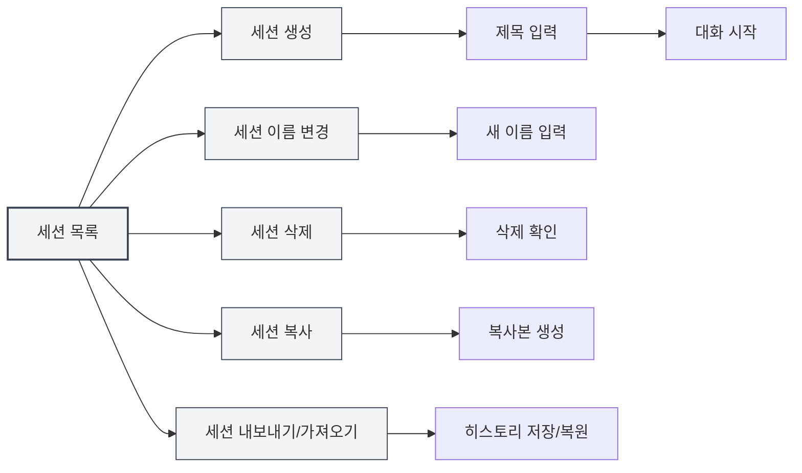
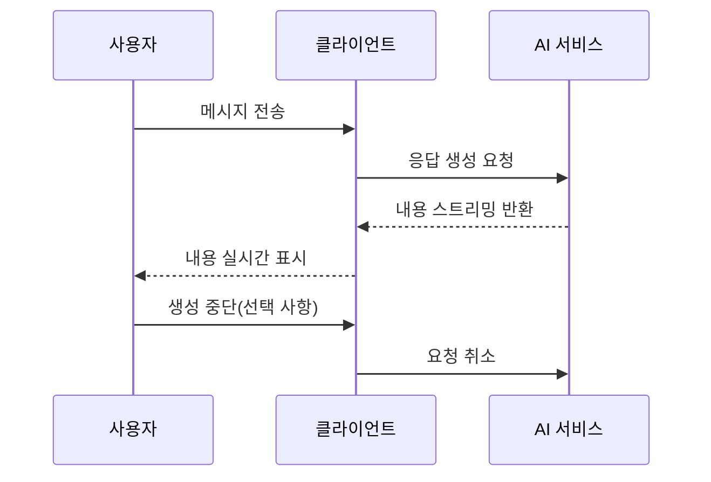
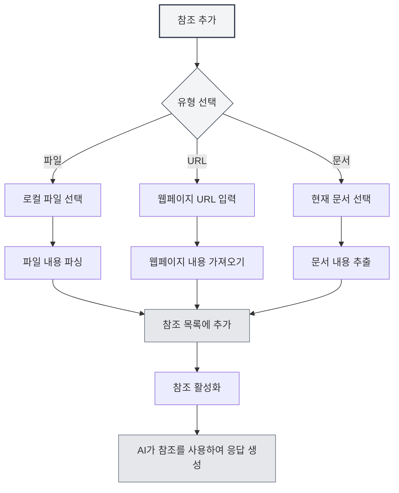

# AI 대화

## 개요

AI 대화 기능은 지능형 대화 어시스턴트를 제공하여 질문에 답변하고 콘텐츠를 생성하며 문서를 분석하는 등 여러분을 도와줍니다. AI 대화를 통해 자연어로 AI와 상호작용하며 지능형 도움과 조언을 얻을 수 있습니다.

AI 대화는 다중 세션 관리, 참조 자료, 지식 베이스 통합 등의 기능을 지원하여 다양한 작업을 효율적으로 AI의 도움을 받아 완료할 수 있게 합니다.

## AI 대화 열기

### 열기 방법

AI 대화를 여는 방법은 여러 가지가 있습니다:

- **메뉴 바**: "AI" 메뉴를 클릭하고 "AI 대화"를 선택합니다.
- **단축키**: (설정된 경우) 단축키를 사용하여 빠르게 엽니다.
- **사이드바**: 사이드바에서 AI 대화 패널을 엽니다.

상단 메뉴 바의 AI 어시스턴트 메뉴를 통해 AI 대화 기능에 접근할 수 있습니다:

<MenuItemsDemo mode="demo" :items='[{"id": "ai-assistant", "items": ["ai-chat"]}]' />

### 인터페이스 소개

AI 대화 인터페이스는 다음 부분으로 구성됩니다:

<AIChat mode="demo" />

- **세션 목록**: 왼쪽에 모든 세션 목록이 표시됩니다.
- **대화 영역**: 중앙에 대화 메시지가 표시됩니다.
- **입력창**: 하단에 메시지를 입력합니다.
- **참조 관리**: 참조 자료를 관리합니다.

## 세션 관리

AI 대화는 다중 세션 관리를 지원하며, 세션을 생성, 이름 변경, 삭제 및 복사할 수 있습니다.

<AIChat mode="demo" />

### 세션 생성

새로운 AI 대화 세션을 생성합니다:

1. **새로 만들기 클릭**: 세션 목록 상단의 "새 세션" 버튼을 클릭합니다.
2. **제목 입력**: (선택 사항) 세션 제목을 입력합니다 (기본값은 첫 번째 메시지를 사용합니다).
3. **대화 시작**: 첫 번째 메시지를 입력하여 대화를 시작합니다.

### 세션 작업

### 세션 이름 변경

기존 세션의 이름을 변경합니다:

1. **마우스 오른쪽 버튼 메뉴**: 세션을 마우스 오른쪽 버튼으로 클릭하고 "이름 변경"을 선택합니다.
2. **새 이름 입력**: 새로운 세션 이름을 입력합니다.
3. **확인 및 저장**: 확인 후 새 이름을 저장합니다.

### 세션 삭제

필요하지 않은 세션을 삭제합니다:

1. **마우스 오른쪽 버튼 메뉴**: 세션을 마우스 오른쪽 버튼으로 클릭하고 "삭제"를 선택합니다.
2. **삭제 확인**: 확인 후 세션을 삭제합니다.

세션을 삭제하면 해당 세션의 모든 메시지 기록도 함께 삭제됩니다.

### 세션 복사

기존 세션을 복사합니다:

1. **마우스 오른쪽 버튼 메뉴**: 세션을 마우스 오른쪽 버튼으로 클릭하고 "복사"를 선택합니다.
2. **복사본 생성**: 시스템이 새로운 세션 복사본을 생성합니다.

세션을 복사하면 모든 메시지 기록이 복사되어 기존 대화를 기반으로 토론을 계속할 수 있습니다.

### 세션 내보내기/가져오기

세션을 내보내고 가져옵니다:

- **세션 내보내기**: 세션을 마우스 오른쪽 버튼으로 클릭하고 "내보내기"를 선택하여 JSON 파일로 저장합니다.
- **세션 가져오기**: 파일에서 세션을 가져와 메시지 기록을 복원합니다.

내보내기/가져오기 기능을 통해 대화 내용을 백업하고 공유할 수 있습니다.

<MenuItemsDemo mode="demo" :items='[{"id": "file", "items": ["save", "open"]}]' />

## 메시지 전송

AI 대화는 다양한 메시지 전송 기능을 제공합니다.

<AIChat mode="demo" />

### 메시지 입력

입력창에 메시지를 입력합니다:

1. **텍스트 입력**: 입력창에 질문이나 요청을 입력합니다.
2. **서식 지정**: Markdown 형식을 지원하여 텍스트에 서식을 지정할 수 있습니다.
3. **메시지 전송**: 전송 버튼을 클릭하거나 `Enter` 키를 눌러 전송합니다.

### 메시지 유형

다음 메시지 유형을 지원합니다:

- **텍스트 메시지**: 일반 텍스트 메시지
- **Markdown 메시지**: Markdown 형식을 지원하는 메시지
- **코드 메시지**: 코드가 포함된 메시지

### 단축키

메시지 전송 단축키:

- **Enter**: 메시지 전송
- **Shift+Enter**: 줄 바꿈 (전송하지 않음)
- **Ctrl+Enter**: (일부 설정에서) 메시지 전송

## AI 응답

AI 응답 기능은 스트리밍 출력과 메시지 작업 기능을 제공합니다.

<AIChat mode="demo" />

<AIChat mode="demo" />

### 스트리밍 출력

AI 응답은 스트리밍 출력 방식을 사용합니다:

- **실시간 표시**: AI가 생성하는 내용이 실시간으로 표시됩니다.
- **점진적 생성**: 내용이 점진적으로 생성되며 완료될 때까지 기다릴 필요가 없습니다.
- **중단 가능**: 언제든지 AI 생성을 중단할 수 있습니다.

### 메시지 작업

AI 응답에 대해 다음 작업을 수행할 수 있습니다:

- **복사**: AI 응답 내용을 복사합니다.
- **다시 생성**: AI 응답을 다시 생성합니다.
- **편집**: (지원되는 경우) AI 응답을 편집합니다.
- **삭제**: AI 응답을 삭제합니다.

### 메시지 편집

사용자 메시지를 편집합니다:

1. **편집 버튼 클릭**: 메시지 옆의 편집 버튼을 클릭합니다.
2. **내용 수정**: 메시지 내용을 수정합니다.
3. **다시 전송**: 수정된 메시지를 다시 전송합니다.

메시지를 편집하면 해당 메시지 이후의 모든 메시지가 삭제되고 대화가 다시 시작됩니다.

## 참조 자료

AI 대화에 참조 자료를 추가하여 AI가 문맥을 더 잘 이해하도록 도울 수 있습니다.

<AIChat mode="demo" />

### 참조 추가

세션에 참조 자료를 추가합니다:

1. **참조 관리 열기**: 대화 영역 상단의 참조 탭을 클릭합니다.
2. **참조 추가**: "참조 추가" 버튼을 클릭합니다.
3. **유형 선택**: 참조 유형(파일, URL 등)을 선택합니다.
4. **내용 선택**: 참조할 내용을 선택합니다.

### 참조 유형

다음 참조 유형을 지원합니다:

- **파일 참조**: 로컬 파일을 참조합니다.
- **URL 참조**: 웹페이지 URL을 참조합니다.
- **문서 참조**: 현재 열려 있는 문서를 참조합니다.

### 참조 활성화

참조를 활성화하고 비활성화합니다:

- **참조 활성화**: 참조 탭을 클릭하여 참조를 활성화합니다.
- **참조 비활성화**: 다시 클릭하여 참조를 비활성화합니다.
- **활성화 상태**: 활성화된 참조는 AI 응답 시 사용됩니다.

참조를 활성화하면 AI는 참조 내용을 참고하여 응답을 생성합니다.

### 참조 미리보기

참조 내용을 미리 봅니다:

- **미리보기 클릭**: 참조 탭을 클릭하여 참조 내용을 확인합니다.
- **상세 정보 보기**: 참조의 상세 내용을 확인합니다.
- **참조 편집**: 참조를 편집하거나 삭제합니다.

## 지식 베이스 통합

AI 대화는 지식 베이스와 통합되어 관련 지식을 자동으로 검색할 수 있습니다.

<KnowledgeBase mode="demo" />

<AIChat mode="demo" />

### 지식 베이스 활성화

지식 베이스 쿼리를 활성화합니다:

1. **설정 열기**: 입력창 하단에서 지식 베이스 스위치를 찾습니다.
2. **쿼리 활성화**: 스위치를 전환하여 지식 베이스 쿼리를 활성화합니다.
3. **자동 검색**: AI 응답 시 지식 베이스를 자동으로 검색합니다.

### 지식 베이스 검색

지식 베이스 검색 기능:

- **자동 검색**: 메시지를 전송할 때 관련 지식을 자동으로 검색합니다.
- **문맥 이해**: 대화 문맥에 따라 관련 내용을 검색합니다.
- **결과 통합**: 검색 결과를 AI 응답에 통합합니다.

### 검색 설정

지식 베이스 검색 설정:

- **신뢰도 임계값**: 검색의 신뢰도 임계값을 설정합니다.
- **검색 수량**: 검색 결과의 수량을 설정합니다.
- **검색 범위**: 검색 범위를 설정합니다.

자세한 내용은 [[knowledge-base.config|지식 베이스 구성]]을 참조하세요.

## 메시지 관리

AI 대화의 메시지를 관리합니다.

<AIChat mode="demo" />

### 메시지 작업

메시지에 대해 다음 작업을 수행할 수 있습니다:

- **메시지 복사**: 메시지 내용을 복사합니다.
- **메시지 편집**: 사용자 메시지를 편집합니다.
- **메시지 삭제**: 메시지를 삭제합니다.
- **다시 생성**: AI 응답을 다시 생성합니다.

### 메시지 기록

메시지 기록 관리:

- **자동 저장**: 메시지 기록이 자동으로 저장됩니다.
- **세션 분리**: 각 세션의 메시지 기록은 독립적입니다.
- **기록 복원**: 세션을 다시 열 때 기록이 복원됩니다.

### 메시지 형식

메시지는 다음 형식을 지원합니다:

<AIChat mode="demo" />

- **Markdown**: Markdown 형식을 지원합니다.
- **코드 블록**: 코드 블록 강조 표시를 지원합니다.
- **수학 공식**: LaTeX 수학 공식을 지원합니다.
- **표**: 표 표시를 지원합니다.

## 사용 팁

다음 팁을 통해 AI 대화 기능을 더 효율적으로 사용할 수 있습니다.

<AIChat mode="demo" />

### 효율적인 대화

1. **명확한 질문**: 명확한 질문을 하여 더 나은 응답을 얻습니다.
2. **문맥 제공**: 충분한 문맥 정보를 제공합니다.
3. **참조 사용**: 참조 자료를 사용하여 더 많은 정보를 제공합니다.

### 세션 구성

1. **분류 관리**: 다른 주제에 대해 다른 세션을 생성합니다.
2. **명명 규칙**: 명확한 세션 이름을 사용합니다.
3. **정기 정리**: 필요하지 않은 세션을 정기적으로 삭제합니다.

### 지식 베이스 사용

1. **관련 문서 추가**: 관련 문서를 지식 베이스에 추가합니다.
2. **쿼리 활성화**: 지식 베이스 쿼리를 활성화하여 더 나은 응답을 얻습니다.
3. **설정 조정**: 요구 사항에 따라 검색 설정을 조정합니다.

## 자주 묻는 질문

<AIChat mode="demo" />

<MenuItemsDemo mode="demo" :items='[{"id": "ai-assistant"}]' />

### Q: AI 응답이 부정확한가요?

A: AI 응답은 학습 데이터를 기반으로 하므로 부정확할 수 있습니다. 더 많은 문맥 정보를 제공하거나 참조 자료를 사용하여 정확도를 높일 수 있습니다.

### Q: AI 생성을 어떻게 중단하나요?

A: "취소" 버튼을 클릭하여 AI 생성을 중단할 수 있습니다. 이미 생성된 내용은 손실되지 않습니다.

### Q: 메시지 기록이 손실되었나요?

A: 메시지 기록은 자동으로 저장됩니다. 손실된 경우 세션을 삭제했거나 데이터를 지웠는지 확인하세요.

### Q: 응답 품질을 어떻게 높이나요?

A: 명확한 문맥 제공, 참조 자료 사용, 지식 베이스 쿼리 활성화 모두 응답 품질을 높일 수 있습니다.

### Q: 어떤 LLM을 지원하나요?

A: OpenAI, Ollama, DeepSeek 등 다양한 LLM을 지원합니다. 자세한 내용은 [[ai.llm-config|LLM 구성]]을 참조하세요.

## 관련 문서

- [[ai.proofread|AI 교정]]
- [[ai.completion|AI 자동 완성]]
- [[knowledge-base.config|지식 베이스 구성]]
- [[ai.llm-config|LLM 구성]]
