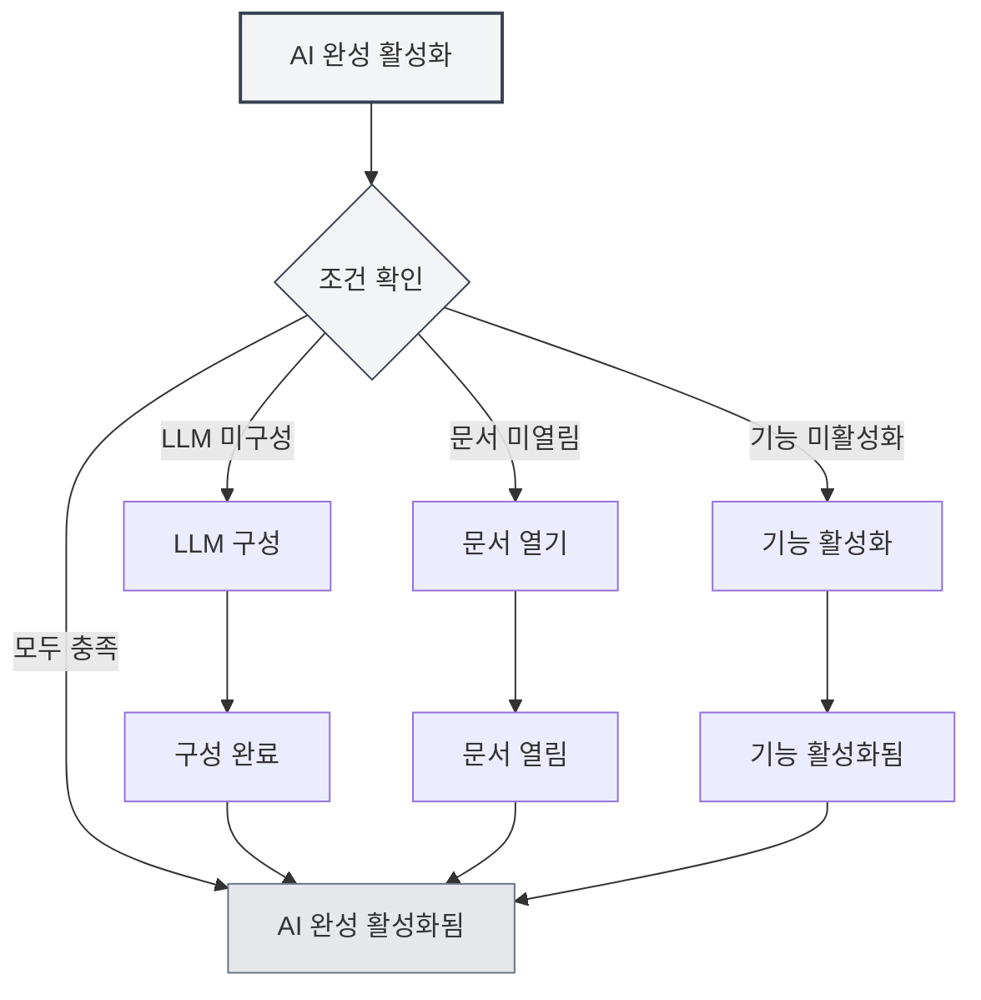
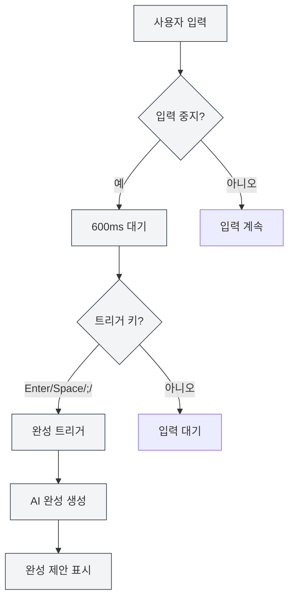
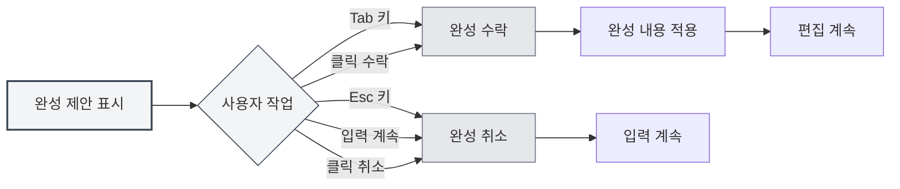

# AI 자동 완성

## 개요

AI 자동 완성 기능은 AI 기술을 사용하여 입력 중인 내용을 자동으로 완성합니다. 사용자가 입력을 멈추면 AI는 문맥을 기반으로 자동으로 완성 제안을 생성하여 문서 작성 속도를 높여줍니다.

AI 자동 완성은 다양한 문서 형식(Markdown, LaTeX, 일반 텍스트)을 지원하며, 문맥을 지능적으로 이해하여 문서 스타일과 내용에 맞는 완성 제안을 생성할 수 있습니다.

## AI 완성 활성화

### 활성화 방법

AI 자동 완성을 활성화하는 방법은 여러 가지가 있습니다:

- **마우스 오른쪽 버튼 메뉴**: 편집기에서 마우스 오른쪽 버튼을 클릭하고 "AI 자동 완성 활성화" 선택
- **설정 페이지**: 설정에서 AI 자동 완성 기능 활성화
- **단축키**: 단축키를 사용하여 빠르게 전환(구성된 경우)

상단 메뉴 모음을 통해 설정에 접근할 수 있습니다:

<MenuItemsDemo mode="demo" :items='[{"id": "settings"}]' />

<CompletionSettingsPanel mode="demo" />

### 활성화 조건

AI 자동 완성을 활성화하려면 다음 조건을 충족해야 합니다:

- **LLM 구성됨**: LLM 서비스가 구성되어 있어야 함
- **문서 열림**: 편집기에서 문서가 열려 있어야 함
- **기능 활성화됨**: 설정에서 AI 완성 기능이 활성화되어 있어야 함

자세한 내용은 [[ai.llm-config|LLM 구성]]을 참조하세요.

<CompletionSettingsPanel mode="demo" />

## 자동 트리거

<AISuggestionGhost mode="demo" />

### 트리거 조건

AI 자동 완성은 다음 상황에서 자동으로 트리거됩니다:

- **입력 중지**: 입력을 멈춘 후 600ms 후 자동 트리거
- **트리거 키**: 특정 키 입력 후 트리거(Enter, Space, `;`, `,` 등)

### 트리거 지연

트리거 지연 설정:

- **기본 지연**: 600ms(0.6초)
- **구성 가능**: 설정에서 지연 시간 조정 가능
- **균형 고려**: 지연이 너무 짧으면 자주 트리거되고, 너무 길면 사용 경험에 영향을 미침

<CompletionSettingsPanel mode="demo" />

### 트리거 키

지원되는 트리거 키:

- **Enter**: 엔터 키 트리거
- **Space**: 스페이스바 트리거
- **;**: 세미콜론 트리거
- **,**: 쉼표 트리거

설정에서 트리거 키를 구성할 수 있으며, 여러 키를 동시에 활성화하는 것을 지원합니다.

## 수동 트리거

<AISuggestionGhost mode="demo" />

### 트리거 방법

수동으로 완성을 트리거하는 방법:

- **단축키**: `Shift+Tab`을 눌러 수동으로 완성 트리거
- **마우스 오른쪽 버튼 메뉴**: 마우스 오른쪽 버튼 클릭 후 "수동 완성 트리거" 선택

수동 트리거는 자동 트리거의 지연을 건너뛰고 즉시 완성을 시작합니다.

<CompletionSettingsPanel mode="demo" />

### 사용 시나리오

수동 트리거에 적합한 시나리오:

- **즉시 완성 필요**: 즉시 완성 제안을 얻어야 할 때
- **자동 트리거 실패**: 자동 트리거가 작동하지 않을 때
- **특정 위치**: 특정 위치에서 완성이 필요할 때

## 완성 내용

<AISuggestionGhost mode="demo" />

### 문맥 이해

AI 완성은 다음 문맥을 이해합니다:

- **현재 단락**: 현재 단락의 내용 이해
- **문서 구조**: 문서의 전체 구조 이해
- **문서 스타일**: 문서의 작성 스타일 이해
- **문서 주제**: 문서의 주제와 내용 이해

### 완성 모드

AI 완성은 두 가지 모드를 지원합니다:

- **전체 생성**: 완전한 완성 내용 생성
- **부분 생성**: 일부 내용만 생성(설정에 따라)

완성 모드는 설정에서 구성할 수 있습니다.

<CompletionSettingsPanel mode="demo" />

### 완성 길이

완성 내용 길이 제어:

- **최대 토큰 수**: 완성의 최대 토큰 수 설정 가능
- **기본값**: 50 토큰
- **범위**: 20 토큰부터 무제한(0은 무제한을 의미)

토큰 수가 클수록 완성 내용이 많아지지만, 생성 시간도 더 길어집니다.

<CompletionSettingsPanel mode="demo" />

## 완성 수락

<AISuggestionGhost mode="demo" />

### 수락 방법

완성 제안을 수락하는 방법:

- **Tab 키**: `Tab` 키를 눌러 완성 제안 수락
- **클릭 수락**: 완성 제안의 "수락" 버튼 클릭

### 완성 취소

완성 제안을 취소하는 방법:

- **Esc 키**: `Esc` 키를 눌러 완성 제안 취소
- **입력 계속**: 계속 입력하면 자동으로 완성 취소
- **클릭 취소**: 완성 제안의 "취소" 버튼 클릭

### 완성 편집

완성을 수락한 후 계속 편집할 수 있습니다:

- **직접 편집**: 수락 후 완성 내용을 직접 편집 가능
- **부분 수락**: 완성 내용의 일부만 수락 가능
- **완성 수정**: 완성 내용을 수정한 후 사용 가능

## 지식 베이스 통합

### 지식 베이스 활성화

지식 베이스 통합 활성화:

1. **설정 열기**: 설정에서 지식 베이스 통합 활성화
2. **지식 베이스 구성**: 지식 베이스 관련 설정 구성
3. **자동 검색**: 완성 시 자동으로 지식 베이스 검색

자세한 내용은 [[knowledge-base.config|지식 베이스 구성]]을 참조하세요.

### 문맥 검색

지식 베이스 검색 기능:

- **자동 검색**: 완성 시 관련 지식 자동 검색
- **의미 매칭**: 의미적 유사도에 따라 관련 내용 매칭
- **결과 통합**: 검색 결과를 완성 제안에 통합

### 검색 설정

지식 베이스 검색 설정:

- **신뢰도 임계값**: 검색의 신뢰도 임계값 설정
- **검색 수량**: 검색 결과 수량 설정
- **검색 범위**: 검색 범위 설정

## 완성 설정

### 기본 설정

AI 완성의 기본 설정:

- **활성화/비활성화**: AI 완성 기능 활성화 또는 비활성화
- **트리거 지연**: 자동 트리거 지연 시간 설정
- **트리거 키**: 트리거 키 구성
- **최대 토큰 수**: 완성의 최대 토큰 수 설정

<CompletionSettingsPanel mode="demo" />

### 고급 설정

AI 완성의 고급 설정:

- **완성 모드**: 완성 모드 선택(전체 생성/부분 생성)
- **문맥 길이**: 완성에 사용되는 문맥 길이 설정
- **온도 설정**: AI 생성의 온도 매개변수 설정
- **지식 베이스 통합**: 지식 베이스 통합 옵션 구성

<CompletionSettingsPanel mode="demo" />

### 형식 설정

다른 형식의 완성 설정:

- **Markdown**: Markdown 형식의 완성 설정
- **LaTeX**: LaTeX 형식의 완성 설정
- **일반 텍스트**: 일반 텍스트 형식의 완성 설정

다른 형식은 다른 완성 전략과 설정을 가질 수 있습니다.

## 사용 팁

### 완성 품질 향상

1. **문맥 제공**: 문서에 충분한 문맥 정보 제공
2. **지식 베이스 활성화**: 지식 베이스 통합 활성화로 완성 품질 향상
3. **설정 조정**: 필요에 따라 완성 설정 조정

### 효율적 사용

1. **합리적 사용**: AI 완성에 지나치게 의존하지 않기
2. **내용 확인**: 완성 수락 후 내용 정확성 확인
3. **수동 조정**: 필요 시 완성 내용 수동 조정

### 문제 방지

1. **빈번한 트리거 방지**: 빈번한 완성 트리거로 입력 경험에 영향 주지 않기
2. **정확성 확인**: 완성 내용의 정확성 확인
3. **적시 취소**: 필요 없는 완성은 적시에 취소

## 자주 묻는 질문

### Q: 완성이 부정확한가요?

A: AI 완성은 문맥과 학습 데이터를 기반으로 하므로 부정확할 수 있습니다. 더 많은 문맥 정보를 제공하거나 지식 베이스 통합을 활성화하여 정확성을 높일 수 있습니다.

### Q: 완성이 느린가요?

A: 완성 속도는 AI 서비스 응답 속도에 따라 다릅니다. 완성 설정을 조정하거나 더 빠른 LLM 서비스를 사용할 수 있습니다.

### Q: 자동 완성을 어떻게 끌 수 있나요?

A: 설정에서 AI 자동 완성 기능을 비활성화하거나 마우스 오른쪽 버튼 메뉴를 사용하여 끌 수 있습니다.

### Q: 트리거 키를 사용자 정의할 수 있나요?

A: 예. 설정에서 트리거 키를 구성할 수 있으며, 여러 키를 동시에 활성화하는 것을 지원합니다.

### Q: 완성 내용이 너무 길어요?

A: 설정에서 완성의 최대 토큰 수를 조정하여 완성 내용의 길이를 제한할 수 있습니다.

## 관련 문서

- [[ai.chat|AI 대화]]
- [[ai.proofread|AI 교정]]
- [[knowledge-base.config|지식 베이스 구성]]
- [[ai.llm-config|LLM 구성]]