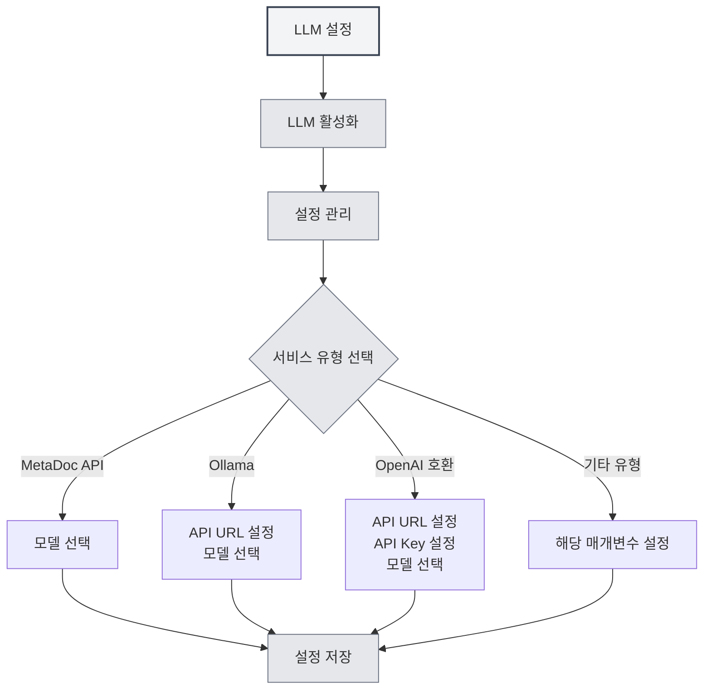

# LLM 설정 가이드

## 개요

LLM(대형 언어 모델)은 MetaDoc에서 AI 대화, 교정, 자동 완성, 어시스턴트 및 에이전트 등의 기능을 위한 공통 기반입니다. 본 문서는 왜 LLM을 설정해야 하는지, 설정이 어떤 기능에 영향을 미치는지, 그리고 구체적인 설정 화면에 어떻게 접근하는지 설명합니다.

<Demo component="SettingLlmSection" mode="demo" />

## 왜 LLM을 설정해야 하나요

- **API 호출**: 대화, 자동 완성, 교정 등은 선택한 LLM 인터페이스에 요청을 보내므로, 올바른 주소와 키를 설정해야 합니다.
- **모델 차이**: 서로 다른 모델은 품질, 속도, 비용에서 큰 차이가 있습니다. 상황에 맞는 적절한 모델을 선택하면 경험을 향상시키고 비용을 통제할 수 있습니다.
- **통합 관리**: [[settings.llm|LLM 설정]]에서 활성화 상태, 온도, 추론 태그 등을 중앙에서 관리할 수 있어, 한 번 설정하면 모든 AI 기능에 영향을 미칩니다.

## 설정이 영향을 미치는 기능

LLM을 설정하고 활성화하면 다음 기능에 영향을 줍니다:

| 기능         | 설명                                                                 |
| ------------ | -------------------------------------------------------------------- | -------------------------------------------------------------------------------------- |
| **AI 대화**  | [[ai.chat            | AI 대화 기능]]: AI와의 다중 턴 대화, 문맥 기반 답변                                   |
| **AI 교정**  | [[ai.proofread       | AI 교정 기능]]: 문법 및 맞춤법 검사, 수정 제안                                         |
| **AI 자동 완성** | [[ai.completion      | AI 자동 완성]]: 글쓰기 중 지능형 문장 완성 및 보완                                     |
| **AI 어시스턴트** | [[ai.assistants      | AI 어시스턴트 기능]]: 수식 인식, 도면 어시스턴트, 데이터 분석 등                       |
| **에이전트** | [[agent.introduction | 에이전트 프레임워크]]: 대화, 도구 호출, 워크플로 실행                                  |

LLM을 끄거나 사용 가능한 서비스를 설정하지 않으면, 위 기능을 사용할 수 없거나 먼저 설정을 완료하라는 안내가 표시됩니다.

## LLM 설정 방법

### 설정 페이지 접근

1. **설정** → **LLM 설정**(또는 앱 내 동등한 메뉴)을 엽니다.
2. **[[settings.llm|LLM 설정]]** 페이지에서 다음을 할 수 있습니다:
   - LLM 활성화/비활성화
   - 온도, 추론 태그 자동 제거 여부 등의 전역 옵션 설정
   - 여러 LLM 설정 관리(생성, 편집, 삭제, 정렬)

상단 메뉴 바를 통해 LLM 설정에 접근할 수 있습니다:

<MenuItemsDemo mode="demo" :items='[{"id": "settings"}]' />

<MenuItemsDemo mode="demo" :items='[{"id": "ai"}]' />

### 구체적인 서비스 설정

**LLM 설정 관리**에서 기존 설정을 선택하거나 새로 생성한 후, 서비스 유형에 따라 정보를 입력합니다:

- **MetaDoc API / Ollama / OpenAI 호환 / OpenAI 공식 / DeepSeek / Gemini** 등  
  자세한 필드와 단계는 [[settings.llm-types|LLM 유형 설정]](API 주소, API 키, 모델명, 최대 토큰 등)을 참조하세요.

### 사용 권장 사항

- **첫 사용 시**: 먼저 사용 가능한 LLM 설정을 하나 완료하고 저장한 후, **LLM 활성화**를 켭니다.
- **다중 설정**: 다양한 시나리오(예: "일상 대화", "교정 전용")에 대해 여러 설정을 만들고, 해당 기능이나 에이전트 설정에서 선택하여 사용할 수 있습니다.
- **비용 및 개인정보**: 클라우드 API 사용은 비용이 발생하고 콘텐츠가 업로드될 수 있습니다. 로컬 및 개인정보 보호가 필요한 경우, Ollama와 같은 로컬 배포 방식을 우선 고려하세요(자세한 내용은 [[settings.llm-types|LLM 유형 설정]] 참조).

## 관련 문서

- [[settings.llm|LLM 설정]]
- [[settings.llm-types|LLM 유형 설정]]
- [[settings.llm-management|LLM 설정 관리]]
- [[ai.chat|AI 대화 기능]]
- [[agent.introduction|에이전트 프레임워크 개요]]

<AIChat mode="demo" />