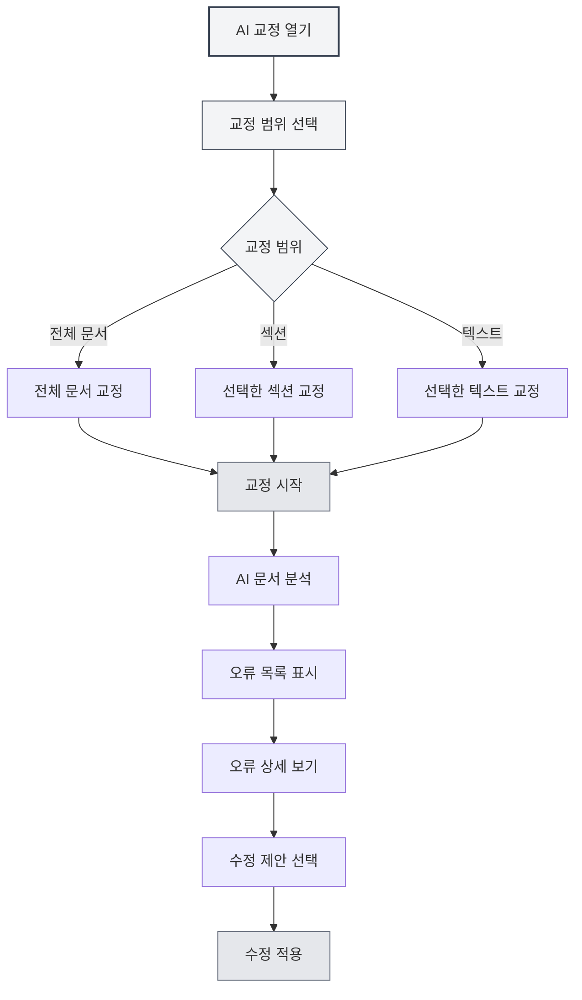
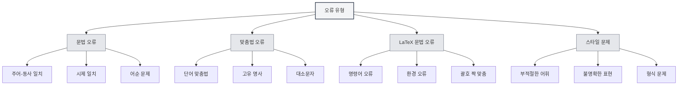
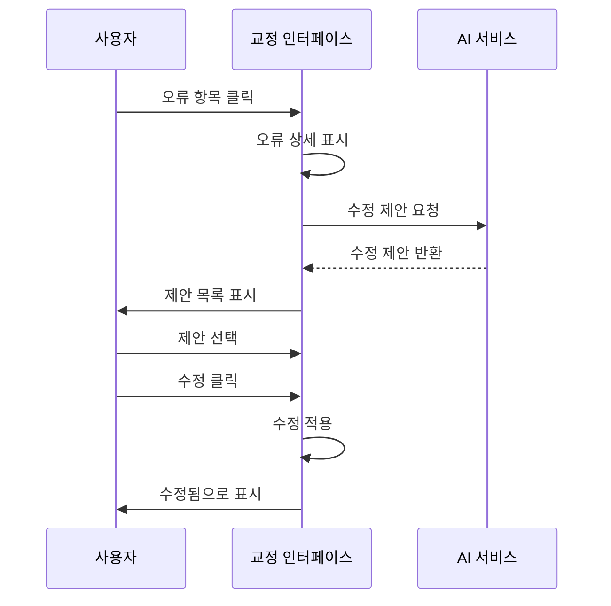

# AI 교정

## 개요

AI 교정 기능은 AI 기술을 사용하여 문서의 문법 오류, 맞춤법 오류, LaTeX 문법 오류 등을 자동으로 검사하고 수정 제안을 제공합니다. AI 교정을 통해 문서의 오류를 빠르게 발견하고 수정하여 문서 품질을 향상시킬 수 있습니다.

AI 교정은 다양한 문서 형식(Markdown, LaTeX, 일반 텍스트)을 지원하며, 전체 문서 또는 특정 섹션을 교정하고 상세한 오류 정보와 수정 제안을 제공합니다.

## AI 교정 열기

### 열기 방법

AI 교정을 여는 여러 가지 방법이 있습니다:

- **메뉴 바**: "AI" 메뉴를 클릭하고 "AI 교정" 선택
- **단축키**: 단축키를 사용하여 빠르게 열기 (구성된 경우)
- **사이드바**: 사이드바에서 AI 교정 패널 열기

상단 메뉴 바의 AI 어시스턴트 메뉴를 통해 AI 교정 기능에 접근할 수 있습니다:

<MenuItemsDemo mode="demo" :items='[{"id": "ai-assistant", "items": ["proofread"]}]' />

### 인터페이스 소개

AI 교정 인터페이스는 다음 부분으로 구성됩니다:

- **오류 목록**: 왼쪽에 모든 오류 표시
- **문서 미리보기**: 오른쪽에 문서 내용 표시
- **오류 통계**: 상단에 오류 통계 정보 표시
- **작업 버튼**: 상단에 작업 버튼 제공

<ProofreadView mode="demo" />

<ProofreadDisplay mode="demo" />

## 교정 범위

### 전체 문서 교정

전체 문서 교정:

1. **교정 열기**: AI 교정 패널 열기
2. **시작 클릭**: "교정 시작" 버튼 클릭
3. **완료 대기**: AI 교정 완료 대기

전체 문서 교정은 문서의 모든 내용을 자동으로 검사합니다.

<ProofreadView mode="demo" />

<ProofreadDisplay mode="demo" />

### 특정 섹션 교정

문서의 특정 섹션 교정:

1. **섹션 선택**: 개요 보기에서 교정할 섹션 선택
2. **교정 열기**: AI 교정 패널 열기
3. **섹션 지정**: 교정 설정에서 섹션 경로 지정
4. **교정 시작**: "교정 시작" 버튼 클릭

특정 섹션 교정은 선택한 섹션 및 하위 섹션의 내용만 검사합니다.

<ProofreadView mode="demo" />

<ProofreadDisplay mode="demo" />

### 지정 텍스트 교정

지정된 텍스트 내용 교정:

1. **텍스트 선택**: 편집기에서 교정할 텍스트 선택
2. **교정 열기**: AI 교정 패널 열기
3. **텍스트 붙여넣기**: 텍스트를 교정 입력란에 붙여넣기
4. **교정 시작**: "교정 시작" 버튼 클릭

<ProofreadDisplay mode="demo" />

## 오류 유형

AI 교정은 다음 유형의 오류를 감지할 수 있습니다:

### 문법 오류

문서의 문법 오류 검사:

<ProofreadDisplay mode="demo" />

- **주어-동사 일치**: 주어-동사 일치 문제 검사
- **시제 일치**: 시제 일치 문제 검사
- **어순 문제**: 어순 문제 검사
- **기타 문법**: 기타 문법 문제 검사

### 맞춤법 오류

문서의 맞춤법 오류 검사:

- **단어 맞춤법**: 단어 맞춤법 오류 검사
- **고유 명사**: 고유 명사 맞춤법 검사
- **대소문자**: 대소문자 문제 검사

### LaTeX 문법 오류

LaTeX 문서의 문법 오류 검사:

- **명령어 오류**: LaTeX 명령어 오류 검사
- **환경 오류**: LaTeX 환경 오류 검사
- **괄호 짝 맞춤**: 괄호 짝 맞춤 문제 검사
- **기타 문법**: 기타 LaTeX 문법 문제 검사

### 스타일 문제

문서의 스타일 문제 검사:

- **부적절한 어휘**: 어휘 사용의 적절성 검사
- **불명확한 표현**: 표현의 명확성 검사
- **형식 문제**: 형식 문제 검사

## 오류 정보

### 오류 표시

오류 정보는 다음 내용을 포함합니다:

<ProofreadDisplay mode="demo" />

- **오류 유형**: 오류 유형 표시 (문법, 맞춤법, LaTeX 등)
- **오류 위치**: 오류가 발생한 줄 번호와 열 번호 표시
- **오류 텍스트**: 오류가 발생한 텍스트 내용 표시
- **수정 제안**: 수정 제안 표시
- **심각도**: 오류의 심각도 표시

### 심각도

오류는 심각도에 따라 분류됩니다:

- **오류 (Error)**: 반드시 수정해야 하는 오류
- **경고 (Warning)**: 수정을 권장하는 문제
- **정보 (Info)**: 참고용 정보

### 오류 위치 찾기

오류 위치 빠르게 찾기:

1. **오류 클릭**: 오류 목록에서 오류 항목 클릭
2. **자동 위치 찾기**: 편집기가 오류 위치로 자동 스크롤
3. **강조 표시**: 오류 위치가 강조 표시됨

## 수정 제안

### 제안 보기

AI가 제공하는 수정 제안 보기:

<ProofreadDisplay mode="demo" />

- **단일 제안**: 제안이 하나만 있는 경우 직접 표시
- **다중 제안**: 제안이 여러 개 있는 경우 태그 형태로 표시
- **제안 선택**: 제안 태그를 클릭하여 제안 선택

### 수정 적용

수정 제안 적용:

<ProofreadDisplay mode="demo" />

1. **제안 선택**: 제안 태그를 클릭하여 제안 선택
2. **수정 클릭**: "수정" 버튼 클릭
3. **수정 확인**: 확인 후 수정 적용

수정 후 오류는 "수정됨"으로 표시됩니다.

### 일괄 수정

모든 오류 일괄 수정:

1. **전체 수정 클릭**: "모두 일괄 수정" 버튼 클릭
2. **수정 확인**: 확인 후 모든 오류 수정

일괄 수정은 첫 번째 제안을 사용하여 모든 오류를 수정합니다.

## 오류 관리

### 오류 무시

수정이 필요하지 않은 오류 무시:

1. **오류 선택**: 무시할 오류 선택
2. **무시 클릭**: "무시" 버튼 클릭
3. **무시 확인**: 확인 후 오류 무시

무시된 오류는 오류 목록에서 제거됩니다.

### 사전에 추가

단어를 사전에 추가:

1. **오류 선택**: 맞춤법 오류 선택
2. **사전에 추가**: "사전에 추가" 버튼 클릭
3. **추가 확인**: 확인 후 사전에 추가

사전에 추가된 후 해당 단어는 더 이상 맞춤법 오류로 표시되지 않습니다.

### 수정된 항목 비우기

수정된 오류 비우기:

1. **비우기 클릭**: "수정된 항목 비우기" 버튼 클릭
2. **비우기 확인**: 확인 후 수정된 오류 비우기

수정된 오류를 비우면 오류 목록이 더 깔끔해집니다.

## 사용 팁

<ProofreadView mode="demo" />

### 효율적인 교정

1. **먼저 전체 문서 교정**: 먼저 전체 문서를 교정하여 전체 상황 파악
2. **그 다음 섹션별 교정**: 문제가 있는 섹션을 대상으로 상세 교정
3. **일괄 수정**: 일괄 수정을 사용하여 일반적인 오류 빠르게 수정

### 오류 처리

1. **심각한 오류 우선 처리**: 심각한 오류를 우선적으로 처리
2. **제안 확인**: 수정 제안을 꼼꼼히 확인
3. **수동 조정**: 필요시 수정 내용 수동 조정

### 사전 관리

1. **전문 용어 추가**: 전문 용어를 사전에 추가
2. **정기적 업데이트**: 사전 내용 정기적으로 업데이트
3. **사전 내보내기**: 사전 백업 내보내기

## 자주 묻는 질문

### Q: 교정 결과가 정확하지 않나요?

A: AI 교정은 AI 모델을 기반으로 하므로 정확하지 않을 수 있습니다. 특히 전문 용어와 특수 표현에 대해서는 교정 결과를 수동으로 확인하는 것이 좋습니다.

### Q: 특정 섹션을 어떻게 교정하나요?

A: 교정 설정에서 섹션 경로(예: "1.1")를 지정하거나, 개요 보기를 사용하여 섹션을 선택하세요.

### Q: 특정 오류를 무시할 수 있나요?

A: 예, 가능합니다. "무시" 버튼을 클릭하여 수정이 필요하지 않은 오류를 무시할 수 있습니다.

### Q: 사전에 어떻게 추가하나요?

A: 맞춤법 오류를 선택하고 "사전에 추가" 버튼을 클릭하면 단어를 사전에 추가할 수 있습니다.

### Q: 교정 속도가 느립니다.

A: 교정 속도는 문서 크기와 AI 서비스 응답 속도에 따라 다릅니다. 큰 문서의 경우 섹션별로 교정하는 것을 권장합니다.

## 관련 문서

- [[ai.chat|AI 대화]]
- [[ai.completion|AI 자동 완성]]
- [[outline.basics|개요 보기 기능]]