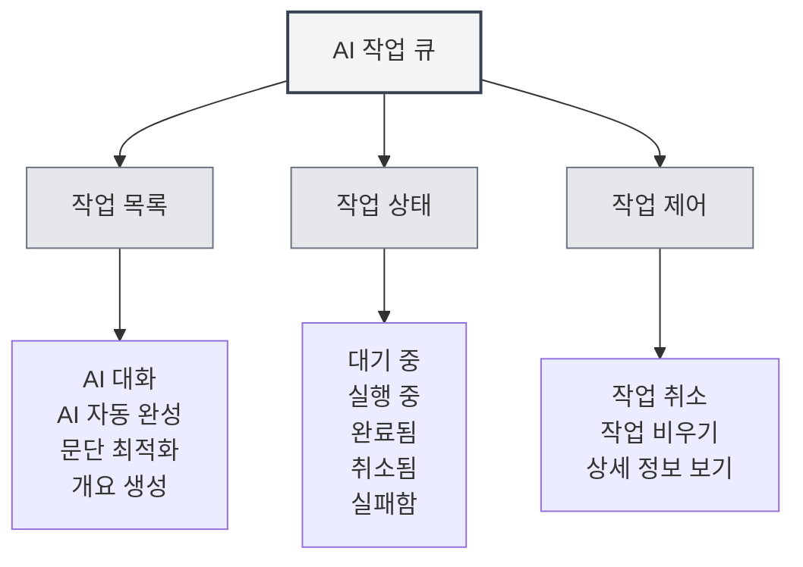

# AI 작업 큐

## 개요

AI 작업 큐는 실행 중인 모든 AI 작업을 관리하고 모니터링하는 데 사용됩니다. 작업 큐를 통해 작업 상태를 확인하고, 작업을 취소하며, 작업 진행 상황을 확인하여 AI 기능의 효율적인 운영을 보장할 수 있습니다.

## 작업 큐 소개

<AITaskQueue mode="demo" />

### 작업 큐란 무엇인가요

AI 작업 큐는 실행 중이거나 실행 대기 중인 모든 AI 작업을 표시하는 관리 인터페이스입니다:

- **작업 목록**: 모든 작업과 그 상태를 표시
- **작업 상태**: 작업의 실행 상태를 표시
- **작업 진행률**: 작업의 실행 진행 상황을 표시
- **작업 제어**: 작업을 취소하거나 관리할 수 있음

### 작업 유형

작업 큐에는 다음과 같은 유형의 작업이 포함될 수 있습니다:

- **AI 대화**: AI 대화 작업
- **AI 자동 완성**: AI 자동 완성 작업
- **문단 최적화**: 문단 최적화 작업
- **개요 생성**: 개요 생성 작업
- **기타 AI 작업**: 기타 AI 관련 작업

## 작업 큐 열기

### 접근 방법

다음 방법으로 작업 큐를 열 수 있습니다:

- **사이드바**: 사이드바에 작업 큐 진입점이 있을 수 있음
- **메뉴 옵션**: 일부 메뉴에 작업 큐 옵션이 있을 수 있음
- **단축키**: 일부 경우 단축키가 있을 수 있음 (향후 지원 가능성 있음)

### 작업 큐 패널

<AITaskQueue mode="demo" />

작업 큐는 일반적으로 사이드 패널로 표시됩니다:

- **작업 목록**: 모든 작업을 표시
- **작업 상세 정보**: 선택한 작업의 상세 정보를 표시
- **제어 버튼**: 작업 제어 기능을 제공

## 작업 보기

<AITaskQueue mode="demo" />

### 작업 목록

작업 목록은 모든 작업을 표시합니다:

- **작업 이름**: 작업의 이름을 표시
- **작업 상태**: 작업의 현재 상태를 표시
- **작업 진행률**: 작업의 실행 진행 상황을 표시
- **작업 시간**: 작업의 생성 시간을 표시

### 작업 상태

작업은 다음 상태 중 하나일 수 있습니다:

- **대기 중**: 작업이 생성되어 실행을 기다리는 중
- **실행 중**: 작업이 실행 중
- **완료됨**: 작업 실행이 완료됨
- **취소됨**: 작업이 취소됨
- **실패함**: 작업 실행이 실패함

### 작업 상세 정보

작업의 상세 정보를 확인할 수 있습니다:

- **작업 이름**: 작업의 이름
- **작업 유형**: 작업의 유형
- **작업 매개변수**: 작업의 매개변수
- **작업 결과**: 작업의 결과 (완료된 경우)
- **오류 정보**: 작업의 오류 정보 (실패한 경우)

## 작업 제어

<AITaskQueue mode="demo" />

### 작업 취소

실행 중인 작업을 취소할 수 있습니다:

1. **작업 선택**: 작업 목록에서 취소할 작업을 선택
2. **취소 클릭**: "취소" 버튼 클릭
3. **취소 확인**: 취소 작업 확인
4. **작업 취소**: 작업이 취소되고 제거됨

<AITaskQueue mode="demo" />

### 작업 비우기

모든 작업을 비울 수 있습니다:

1. **작업 큐 열기**: 작업 큐 패널 열기
2. **비우기 클릭**: "비우기" 버튼 클릭
3. **비우기 확인**: 비우기 작업 확인
4. **작업 비우기**: 모든 작업이 취소되고 제거됨

### 작업 우선순위

일부 작업에는 우선순위가 있을 수 있습니다:

- **높은 우선순위**: 중요한 작업이 우선 실행
- **일반 우선순위**: 일반 작업이 순서대로 실행
- **낮은 우선순위**: 낮은 우선순위 작업이 마지막에 실행

## 작업 진행률 표시

<AITaskQueue mode="demo" />

### 진행률 표시줄

작업 진행률은 진행률 표시줄로 표시됩니다:

- **진행률 백분율**: 작업 완료 백분율을 표시
- **진행률 표시줄**: 작업 진행률을 시각적으로 표시
- **진행률 업데이트**: 진행률이 실시간으로 업데이트됨

### 진행률 정보

작업의 진행률 정보를 확인할 수 있습니다:

- **현재 단계**: 현재 실행 중인 단계를 표시
- **완료된 단계**: 완료된 단계를 표시
- **총 단계 수**: 총 단계 수를 표시
- **예상 시간**: 예상 완료 시간을 표시

<AITaskQueue mode="demo" />

## 작업 지연

<AITaskQueue mode="demo" />

### 지연 완성

AI 자동 완성 작업을 지연시킬 수 있습니다:

1. **작업 큐 열기**: 작업 큐 패널 열기
2. **지연 시간 선택**: 지연 시간(분) 선택
3. **지연 적용**: 지연 설정 적용
4. **작업 지연**: 완성 작업이 지연되어 실행됨

### 지연 표시

지연 시간은 작업 큐에 표시됩니다:

- **남은 시간**: 남은 지연 시간을 표시
- **카운트다운**: 실시간 카운트다운 표시
- **자동 실행**: 지연 시간 종료 후 자동 실행

## 작업 기록

<AITaskQueue mode="demo" />

### 기록

작업 큐는 작업 기록을 저장할 수 있습니다:

- **완료된 작업**: 완료된 작업을 표시
- **실패한 작업**: 실패한 작업을 표시
- **취소된 작업**: 취소된 작업을 표시

### 기록 보기

작업 기록을 확인할 수 있습니다:

- **기록 목록**: 기록 작업 목록을 표시
- **작업 상세 정보**: 기록 작업의 상세 정보 확인
- **결과 보기**: 작업 결과 확인

## 모범 사례

<AITaskQueue mode="demo" />

1. **정기적 확인**: 작업 큐를 정기적으로 확인하여 작업 실행 상황 파악
2. **적시 취소**: 불필요한 작업은 적시에 취소하여 자원 해제
3. **진행률 모니터링**: 작업 진행률을 주시하여 작업이 정상적으로 실행되도록 보장
4. **오류 처리**: 실패한 작업은 적시에 처리하여 후속 작업에 영향이 없도록 함
5. **자원 관리**: 작업을 합리적으로 관리하여 자원 낭비 방지

## 주의사항

1. **작업 수**: 과도한 작업은 성능에 영향을 줄 수 있음
2. **작업 취소**: 작업 취소는 실행 중인 작업에 영향을 줄 수 있음
3. **작업 상태**: 작업 상태는 실시간으로 변할 수 있음
4. **자원 점유**: 작업은 시스템 자원을 점유함
5. **네트워크 의존성**: 일부 작업은 네트워크 연결이 필요함

## 관련 문서

- [[ai.chat|AI 대화 기능]]
- [[ai.completion|AI 자동 완성]]
- [[features.paragraph-optimization|문단 최적화 기능]]