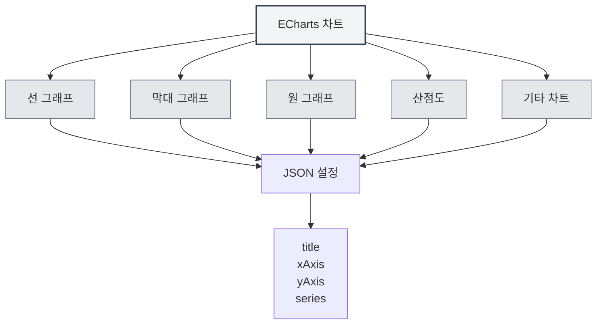

# ECharts 차트

## 개요

ECharts는 다양한 차트 유형을 지원하는 강력한 데이터 시각화 차트 라이브러리입니다. MetaDoc은 ECharts 차트를 지원하여 Markdown 문서에서 ECharts 설정을 사용하여 다양한 데이터 시각화 차트를 생성할 수 있습니다.

<DataAnalysisWindow mode="demo" />

## ECharts 문법

<ChartGenerationDisplay mode="demo" />

### 기본 문법

ECharts는 JSON 설정 형식을 사용합니다:

````markdown
```echarts
{
  "title": {
    "text": "예제 차트"
  },
  "xAxis": {
    "type": "category",
    "data": ["A", "B", "C"]
  },
  "yAxis": {
    "type": "value"
  },
  "series": [{
    "data": [10, 20, 30],
    "type": "bar"
  }]
}
```
````

### 설정 형식

ECharts 설정은 유효한 JSON이어야 합니다:

- **JSON 형식**: 표준 JSON 형식 사용
- **영문 구두점**: 영문 쉼표, 콜론, 따옴표 사용
- **완전한 설정**: 필요한 설정 항목 포함



## 지원하는 차트 유형

<DataAnalysisDisplay mode="demo" />

### 선 그래프

선 그래프 생성:

````markdown
```echarts
{
  "xAxis": {
    "type": "category",
    "data": ["월", "화", "수"]
  },
  "yAxis": {
    "type": "value"
  },
  "series": [{
    "data": [120, 200, 150],
    "type": "line"
  }]
}
```
````

### 막대 그래프

<ChartGenerationDisplay mode="demo" />

막대 그래프 생성:

````markdown
```echarts
{
  "xAxis": {
    "type": "category",
    "data": ["A", "B", "C"]
  },
  "yAxis": {
    "type": "value"
  },
  "series": [{
    "data": [10, 20, 30],
    "type": "bar"
  }]
}
```
````

### 원 그래프

<DataAnalysisDisplay mode="demo" />

원 그래프 생성:

````markdown
```echarts
{
  "series": [{
    "type": "pie",
    "data": [
      {"value": 335, "name": "카테고리 A"},
      {"value": 310, "name": "카테고리 B"},
      {"value": 234, "name": "카테고리 C"}
    ]
  }]
}
```
````

### 산점도

<ChartGenerationDisplay mode="demo" />

산점도 생성:

````markdown
```echarts
{
  "xAxis": {
    "type": "value"
  },
  "yAxis": {
    "type": "value"
  },
  "series": [{
    "type": "scatter",
    "data": [[10, 20], [15, 25], [20, 30]]
  }]
}
```
````

### 레이더 차트

<OutlineTreeDisplay mode="demo" />

레이더 차트 생성:

````markdown
```echarts
{
  "radar": {
    "indicator": [
      {"name": "지표1", "max": 100},
      {"name": "지표2", "max": 100}
    ]
  },
  "series": [{
    "type": "radar",
    "data": [{
      "value": [80, 90]
    }]
  }]
}
```
````

### 히트맵

<DataAnalysisDisplay mode="demo" />

히트맵 생성:

````markdown
```echarts
{
  "xAxis": {
    "type": "category",
    "data": ["A", "B", "C"]
  },
  "yAxis": {
    "type": "category",
    "data": ["X", "Y", "Z"]
  },
  "series": [{
    "type": "heatmap",
    "data": [[0, 0, 10], [0, 1, 20], [1, 0, 30]]
  }]
}
```
````

## 차트 설정

<OutlineTreeDisplay mode="demo" />

### 제목 설정

차트 제목 설정:

```json
{
  "title": {
    "text": "차트 제목",
    "subtext": "부제목"
  }
}
```

### 좌표축 설정

좌표축 설정:

```json
{
  "xAxis": {
    "type": "category",
    "data": ["A", "B", "C"]
  },
  "yAxis": {
    "type": "value"
  }
}
```

### 시리즈 설정

데이터 시리즈 설정:

```json
{
  "series": [
    {
      "name": "시리즈 이름",
      "type": "bar",
      "data": [10, 20, 30]
    }
  ]
}
```

### 범례 설정

범례 설정:

```json
{
  "legend": {
    "data": ["시리즈1", "시리즈2"]
  }
}
```

### 툴팁 설정

툴팁 설정:

```json
{
  "tooltip": {
    "trigger": "axis"
  }
}
```

## 고급 기능

<ChartGenerationDisplay mode="demo" />

### 다중 시리즈 차트

다중 시리즈 차트 생성:

````markdown
```echarts
{
  "xAxis": {
    "type": "category",
    "data": ["월", "화", "수"]
  },
  "yAxis": {
    "type": "value"
  },
  "series": [
    {
      "name": "시리즈1",
      "type": "bar",
      "data": [10, 20, 30]
    },
    {
      "name": "시리즈2",
      "type": "line",
      "data": [15, 25, 35]
    }
  ]
}
```
````

### 데이터 줌

데이터 줌 추가:

```json
{
  "dataZoom": [
    {
      "type": "slider",
      "start": 0,
      "end": 100
    }
  ]
}
```

### 시각적 매핑

시각적 매핑 추가:

```json
{
  "visualMap": {
    "min": 0,
    "max": 100,
    "inRange": {
      "color": ["#50a3ba", "#eac736", "#d94e5d"]
    }
  }
}
```

## 렌더링 방식

### 메인 프로세스 렌더링

ECharts는 메인 프로세스를 사용하여 렌더링합니다:

- **서버 측 렌더링**: 메인 프로세스에서 차트 렌더링
- **SVG 형식**: 기본적으로 SVG 형식으로 렌더링
- **PNG 형식**: PNG 형식으로 변환 가능

### 렌더링 성능

ECharts 렌더링 특징:

- **렌더링 속도**: 메인 프로세스 렌더링 속도가 빠름
- **자원 사용량**: 렌더링 시 메인 프로세스 자원 사용
- **오류 처리**: 렌더링 오류는 콘솔에 표시됨

## 주의사항

### 문법 주의사항

1. **JSON 형식**: 유효한 JSON 형식을 사용해야 함
2. **영문 구두점**: 영문 쉼표, 콜론, 따옴표 사용
3. **완전한 설정**: 필요한 설정 항목 포함
4. **올바른 문법**: JSON 문법이 올바른지 확인, 그렇지 않으면 렌더링 불가

### 렌더링 주의사항

1. **설정 검증**: 렌더링 전 설정 형식 검증
2. **문법 오류**: JSON 문법 오류 시 차트 렌더링 불가
3. **복잡한 차트**: 지나치게 복잡한 차트는 렌더링 성능에 영향
4. **내보내기 호환성**: 내보낼 때 차트가 대상 형식에서 정상 표시되는지 확인

## 모범 사례

1. **설정 규범**: ECharts 공식 설정 규범 준수
2. **JSON 형식**: JSON 형식이 올바른지 확인
3. **코드 명확성**: 설정 코드를 명확하고 읽기 쉽게 유지
4. **렌더링 테스트**: 편집 후 차트 렌더링 효과 테스트
5. **참조 문서**: ECharts 공식 문서 및 예제 참조

## 관련 문서

- [[charts.introduction|차트 기능 소개]]
- [[charts.mermaid|Mermaid 차트]]
- [[charts.plantuml|PlantUML 차트]]
