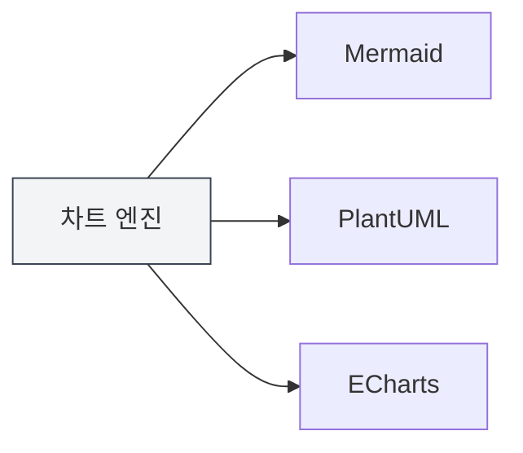
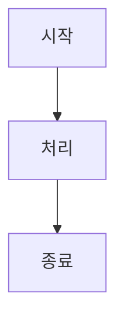

# 차트 기능 소개

## 개요

MetaDoc는 다양한 차트 그리기 엔진을 지원하여 Markdown 문서에 여러 유형의 차트를 삽입하고 렌더링할 수 있습니다. 차트 기능을 통해 플로우차트, UML 다이어그램, 데이터 시각화 차트 등을 생성하여 문서 내용을 풍부하게 할 수 있습니다.

<GraphWindow mode="demo" />

## 지원하는 차트 엔진

<ChartGenerationDisplay mode="demo" />

### 차트 유형

MetaDoc는 다음 차트 엔진을 지원합니다:

- **Mermaid**: 플로우차트, UML 다이어그램, 간트 차트 등
- **PlantUML**: 전문 UML 모델링 다이어그램
- **ECharts**: 데이터 시각화 차트
- **Flowchart**: 기본 플로우차트
- **Graphviz**: 그래프 시각화
- **Mindmap**: 마인드맵
- **Markmap**: Markdown 마인드맵
- **SMILES**: 화학 구조식
- **ABC**: 악보

### 엔진 비교

<DataAnalysisDisplay mode="demo" />

| 엔진      | 적용 시나리오                     | 렌더링 방식   |
| --------- | -------------------------------- | ------------ |
| Mermaid   | 플로우차트, 시퀀스 다이어그램, 클래스 다이어그램, 간트 차트 | 브라우저 렌더링 |
| PlantUML  | 전문 UML 모델링                  | 메인 프로세스 렌더링 |
| ECharts   | 데이터 시각화 (선 그래프, 막대 그래프 등) | 메인 프로세스 렌더링 |
| Flowchart | 기본 플로우차트                   | Vditor 렌더링 |
| Graphviz  | 그래프 시각화                     | Vditor 렌더링 |
| Mindmap   | 마인드맵                         | Vditor 렌더링 |

### 엔진 비교 차트

<OutlineTreeDisplay mode="demo" />



## 차트 삽입

<DataAnalysisWindow mode="demo" />

### 코드 블록 문법

Markdown 문서에서 코드 블록을 사용하여 차트를 삽입합니다:

````markdown

````

### 차트 유형 식별자

다른 차트 유형은 다른 코드 블록 식별자를 사용합니다:

- **Mermaid**: ` ```mermaid `
- **PlantUML**: ` ```plantuml `
- **ECharts**: ` ```echarts `
- **Flowchart**: ` ```flowchart `
- **Graphviz**: ` ```graphviz `
- **Mindmap**: ` ```mindmap `

## 차트 렌더링

<ChartGenerationDisplay mode="demo" />

### 실시간 렌더링

차트는 편집기에서 실시간으로 렌더링됩니다:

- **자동 렌더링**: 차트 코드 입력 후 자동으로 렌더링됨
- **실시간 미리보기**: 미리보기 창에서 차트를 실시간으로 표시
- **오류 표시**: 구문 오류 시 오류 메시지가 표시됨

### 렌더링 방식

다른 차트는 다른 렌더링 방식을 사용합니다:

- **브라우저 렌더링**: Mermaid 등은 브라우저 API를 사용하여 렌더링
- **메인 프로세스 렌더링**: PlantUML, ECharts는 메인 프로세스를 사용하여 렌더링
- **Vditor 렌더링**: Flowchart 등은 Vditor를 사용하여 렌더링

### 렌더링 형식

차트는 다른 형식으로 렌더링될 수 있습니다:

- **SVG**: 벡터 이미지 형식 (기본값)
- **PNG**: 비트맵 형식 (변환 가능)

## 차트 내보내기

<OutlineTreeDisplay mode="demo" />

### 내보내기 지원

차트는 여러 형식으로 내보내기를 지원합니다:

- **PDF 내보내기**: 차트가 PDF에 포함됨
- **HTML 내보내기**: 차트가 HTML에 포함됨
- **이미지 내보내기**: 차트를 별도의 이미지로 내보낼 수 있음

### 내보내기 품질

내보내기 시 차트 품질을 유지합니다:

- **벡터 이미지**: SVG 형식은 선명도를 유지
- **비트맵**: PNG 형식은 인쇄에 적합
- **해상도**: 내보내기 형식에 따라 해상도 조정

## 차트 편집

<DataAnalysisDisplay mode="demo" />

### 코드 편집

차트 코드를 직접 편집할 수 있습니다:

- **구문 강조**: 코드 블록이 구문 강조를 지원
- **자동 완성**: 일부 편집기는 자동 완성을 지원
- **오류 검사**: 실시간 구문 오류 검사

### 미리보기 업데이트

코드 편집 후 미리보기가 자동으로 업데이트됩니다:

- **실시간 업데이트**: 코드 수정 후 미리보기가 즉시 업데이트됨
- **오류 표시**: 구문 오류 시 오류 정보 표시
- **렌더링 상태**: 차트의 렌더링 상태 표시

## 다국어 지원

<DataAnalysisWindow mode="demo" />

### 차트 코드 다국어

차트 코드는 다국어를 지원합니다:

- **한국어 지원**: 한국어 라벨과 텍스트 사용 가능
- **영어 지원**: 영어 라벨과 텍스트 사용 가능
- **혼합 사용**: 한국어와 영어를 혼합하여 사용 가능

### 국제화

차트 기능은 국제화를 지원합니다:

- **인터페이스 언어**: 차트 관련 인터페이스는 시스템 언어를 따름
- **오류 메시지**: 오류 메시지는 현재 언어로 표시
- **도움말 문서**: 도움말 문서는 다국어를 지원

## 모범 사례

1. **적절한 엔진 선택**: 요구 사항에 맞는 적절한 차트 엔진 선택
2. **구문 규칙**: 각 엔진의 구문 규칙 준수
3. **코드 명확성**: 차트 코드를 명확하고 읽기 쉽게 유지
4. **렌더링 테스트**: 편집 후 차트 렌더링 효과 테스트
5. **내보내기 테스트**: 내보내기 전 목표 형식에서 차트 표시 효과 테스트

## 주의 사항

1. **구문 정확성**: 차트 코드 구문이 정확해야 렌더링 가능
2. **렌더링 성능**: 복잡한 차트는 렌더링 성능에 영향을 줄 수 있음
3. **내보내기 호환성**: 일부 차트 형식은 특정 내보내기 형식과 호환되지 않을 수 있음
4. **코드 보안**: 차트 코드의 보안에 주의, 악성 코드 방지
5. **버전 호환성**: 다른 버전의 차트 엔진은 구문 차이가 있을 수 있음

## 관련 문서

- [[charts.mermaid|Mermaid 차트]]
- [[charts.plantuml|PlantUML 차트]]
- [[charts.echarts|ECharts 차트]]
- [[markdown.features|Markdown 편집기 기능]]