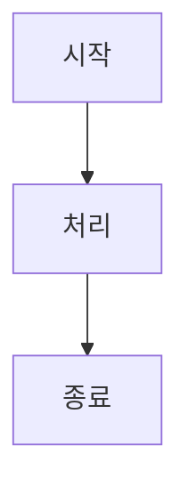
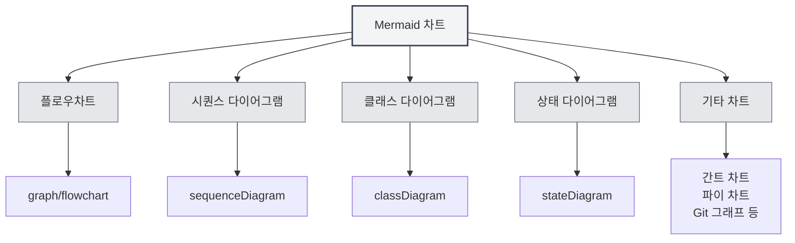
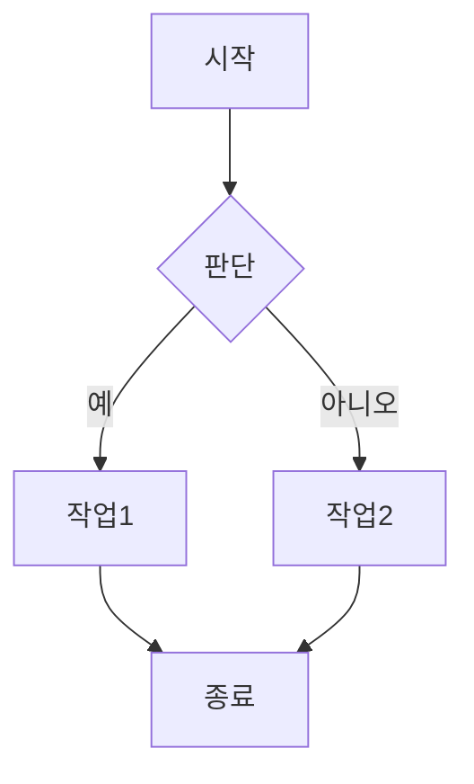
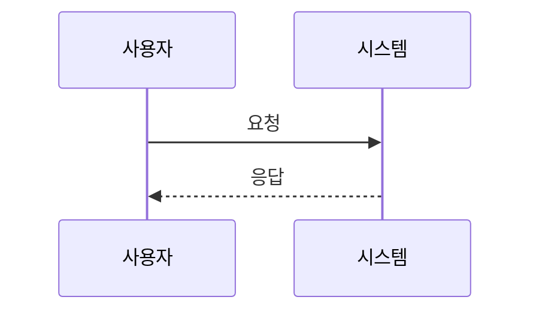
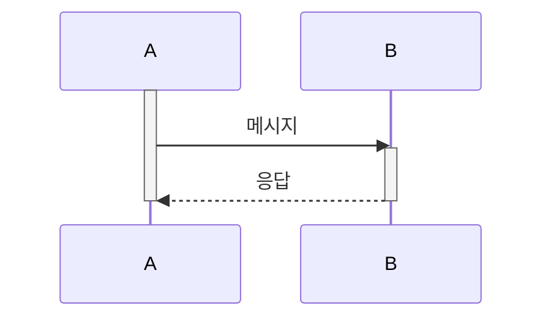
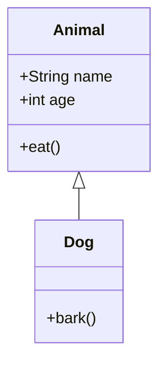
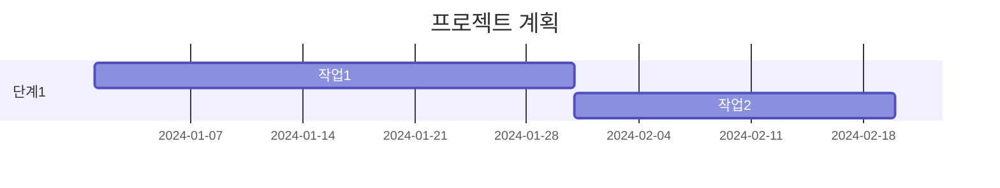
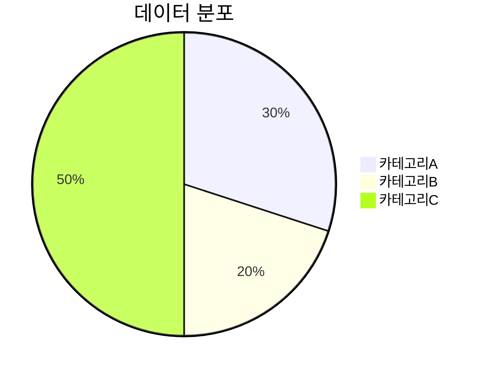
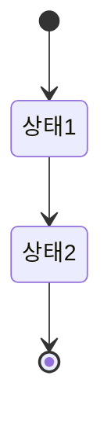
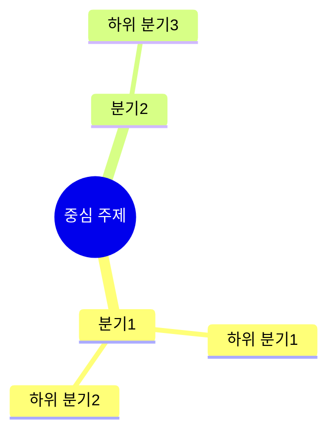

# Mermaid 차트

## 개요

Mermaid는 인기 있는 차트 그리기 도구로, 플로우차트, 시퀀스 다이어그램, 클래스 다이어그램, 간트 차트 등을 빠르게 그리기에 적합합니다. MetaDoc은 Mermaid 차트를 지원하며, Markdown 문서에서 직접 Mermaid 문법을 사용하여 다양한 차트를 생성할 수 있습니다.

<GraphWindow mode="demo" initialTool="mermaid" />

## Mermaid 문법

<OutlineTreeDisplay mode="demo" />

### 기본 문법

Mermaid는 간단한 텍스트 문법을 사용하여 차트를 설명합니다:

````markdown

````

### 차트 유형

<ChartGenerationDisplay mode="demo" />

Mermaid는 다양한 차트 유형을 지원합니다:

- **플로우차트** (graph/flowchart)
- **시퀀스 다이어그램** (sequenceDiagram)
- **클래스 다이어그램** (classDiagram)
- **상태 다이어그램** (stateDiagram)
- **엔티티 관계도** (erDiagram)
- **간트 차트** (gantt)
- **파이 차트** (pie)
- **Git 그래프** (gitgraph)
- **사용자 여정도** (journey)
- **마인드맵** (mindmap)
- **타임라인** (timeline)



## 플로우차트

<OutlineTreeDisplay mode="demo" />

### 기본 플로우차트

기본 플로우차트 생성:

````markdown

````

### 플로우차트 방향

플로우차트의 방향을 설정할 수 있습니다:

- **TD**: 위에서 아래로 (Top Down)
- **BT**: 아래에서 위로 (Bottom Top)
- **LR**: 왼쪽에서 오른쪽으로 (Left Right)
- **RL**: 오른쪽에서 왼쪽으로 (Right Left)

### 노드 모양

다양한 노드 모양을 사용할 수 있습니다:

- **사각형**: `[텍스트]`
- **둥근 사각형**: `(텍스트)`
- **마름모**: `{텍스트}`
- **원형**: `((텍스트))`
- **육각형**: `{{텍스트}}`
- **사다리꼴**: `[/텍스트\]`
- **역사다리꼴**: `[\텍스트/]`

## 시퀀스 다이어그램

<DataAnalysisDisplay mode="demo" />

### 기본 시퀀스 다이어그램

시퀀스 다이어그램 생성:

````markdown

````

### 메시지 유형

다양한 유형의 메시지를 사용할 수 있습니다:

- **실선 화살표**: `->>` 동기 메시지
- **점선 화살표**: `-->>` 비동기 메시지
- **실선**: `->` 동기 메시지 (반환 없음)
- **점선**: `-->` 비동기 메시지 (반환 없음)

### 활성화 상자

객체의 활동을 나타내기 위해 활성화 상자를 추가할 수 있습니다:

````markdown

````

## 클래스 다이어그램

<ChartGenerationDisplay mode="demo" />

### 기본 클래스 다이어그램

클래스 다이어그램 생성:

````markdown

````

### 클래스 관계

다양한 클래스 관계를 표현할 수 있습니다:

- **상속**: `<|--` 또는 `--|>`
- **구현**: `<|..` 또는 `..|>`
- **합성**: `*--` 또는 `--*`
- **집합**: `o--` 또는 `--o`
- **연관**: `-->` 또는 `<--`
- **의존**: `..>` 또는 `<..`

### 클래스 멤버

클래스의 멤버를 정의할 수 있습니다:

- **속성**: `+name: String` (공개), `-name: String` (비공개)
- **메서드**: `+method()` (공개), `-method()` (비공개)

## 간트 차트

<OutlineTreeDisplay mode="demo" />

### 기본 간트 차트

간트 차트 생성:

````markdown

````

### 날짜 형식

날짜 형식을 설정할 수 있습니다:

- **YYYY-MM-DD**: 년-월-일
- **MM/DD/YYYY**: 월/일/년
- **기타 형식**: 다양한 날짜 형식 지원

### 작업 관계

작업 관계를 설정할 수 있습니다:

- **after**: 특정 작업 이후
- **마일스톤**: `milestone`을 사용하여 마일스톤 표시

## 파이 차트

<DataAnalysisDisplay mode="demo" />

### 기본 파이 차트

파이 차트 생성:

````markdown

````

## 상태 다이어그램

<ChartGenerationDisplay mode="demo" />

### 기본 상태 다이어그램

상태 다이어그램 생성:

````markdown

````

## 마인드맵

<OutlineTreeDisplay mode="demo" />

### 기본 마인드맵

마인드맵 생성:

````markdown

````

## 주의사항

<DataAnalysisDisplay mode="demo" />

### 문법 주의사항

1. **문자열 감싸기**: 이스케이프 오류를 피하기 위해 `["..."]`로 문자열을 감싸는 것을 권장합니다.
2. **식별자**: 클래스 다이어그램에서 공백이나 특수 문자가 포함된 식별자 사용을 피하세요.
3. **한글 지원**: 한글을 사용할 수 있지만, 영어 식별자 사용을 권장합니다.
4. **문법 버전**: Mermaid 문법 버전에 유의하세요. 버전에 따라 차이가 있을 수 있습니다.

### 렌더링 주의사항

1. **문법 오류**: 문법 오류가 있으면 차트가 렌더링되지 않습니다.
2. **복잡한 차트**: 지나치게 복잡한 차트는 렌더링 성능에 영향을 줄 수 있습니다.
3. **브라우저 호환성**: 일부 브라우저는 특정 Mermaid 기능을 지원하지 않을 수 있습니다.
4. **내보내기 호환성**: 내보낼 때 차트가 대상 형식에서 정상적으로 표시되는지 확인하세요.

## 모범 사례

1. **문법 규칙**: Mermaid 공식 문법 규칙을 따르세요.
2. **코드 명확성**: 차트 코드를 명확하고 읽기 쉽게 유지하세요.
3. **렌더링 테스트**: 편집 후 차트 렌더링 효과를 테스트하세요.
4. **예제 사용**: Mermaid 공식 문서의 예제를 참고하세요.
5. **버전 호환성**: Mermaid 버전 호환성에 유의하세요.

## 관련 문서

- [[charts.introduction|차트 기능 소개]]
- [[charts.plantuml|PlantUML 차트]]
- [[charts.echarts|ECharts 차트]]
