# PlantUML 차트

## 개요

PlantUML은 다양한 UML 차트 유형을 지원하는 전문 UML 모델링 도구입니다. MetaDoc은 PlantUML 차트를 지원하여 Markdown 문서에서 PlantUML 구문을 사용하여 전문적인 UML 차트를 생성할 수 있습니다.

<GraphWindow mode="demo" initialTool="plantuml" />

## PlantUML 구문

<OutlineTreeDisplay mode="demo" />

### 기본 구문

PlantUML은 특정 마크업과 구문을 사용합니다:

````markdown
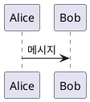
````

### 필수 마크업

<ChartGenerationDisplay mode="demo" />

PlantUML 차트는 반드시 다음을 포함해야 합니다:

- **@startuml**: 차트 시작 마크업
- **@enduml**: 차트 종료 마크업

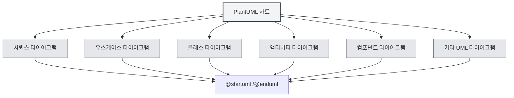

## 지원하는 차트 유형

<DataAnalysisDisplay mode="demo" />

### 시퀀스 다이어그램

시퀀스 다이어그램 생성:

````markdown
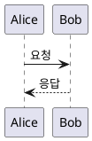
````

### 유스케이스 다이어그램

<OutlineTreeDisplay mode="demo" />

유스케이스 다이어그램 생성:

````markdown
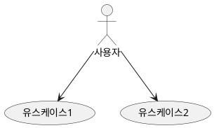
````

### 클래스 다이어그램

<ChartGenerationDisplay mode="demo" />

클래스 다이어그램 생성:

````markdown
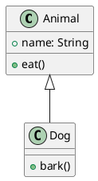
````

### 액티비티 다이어그램

<DataAnalysisDisplay mode="demo" />

액티비티 다이어그램 생성:

````markdown
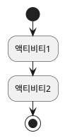
````

### 컴포넌트 다이어그램

<OutlineTreeDisplay mode="demo" />

컴포넌트 다이어그램 생성:

````markdown
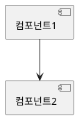
````

### 배포 다이어그램

<ChartGenerationDisplay mode="demo" />

배포 다이어그램 생성:

````markdown
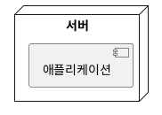
````

### 상태 다이어그램

<DataAnalysisDisplay mode="demo" />

상태 다이어그램 생성:

````markdown
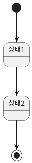
````

## 시퀀스 다이어그램 상세 설명

<OutlineTreeDisplay mode="demo" />

### 참여자

참여자 정의:

````markdown
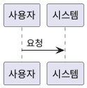
````

### 메시지 유형

다양한 유형의 메시지를 사용할 수 있습니다:

- **동기 메시지**: `->`
- **비동기 메시지**: `-->`
- **반환 메시지**: `<-` 또는 `<--`
- **자기 호출**: 자신을 가리키는 `->`

### 액티베이션 박스

액티베이션 박스 추가:

````markdown
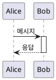
````

## 클래스 다이어그램 상세 설명

<ChartGenerationDisplay mode="demo" />

### 클래스 정의

클래스 정의:

````markdown
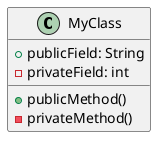
````

### 클래스 관계

클래스 관계 표현:

- **상속**: `<|--` 또는 `--|>`
- **구현**: `<|..` 또는 `..|>`
- **합성**: `*--` 또는 `--*`
- **집합**: `o--` 또는 `--o`
- **연관**: `-->` 또는 `<--`
- **의존**: `..>` 또는 `<..`

### 인터페이스와 추상 클래스

인터페이스와 추상 클래스 정의:

````markdown
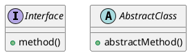
````

## 액티비티 다이어그램 상세 설명

### 기본 액티비티

액티비티 정의:

````markdown

````

### 결정 노드

결정 추가:

````markdown
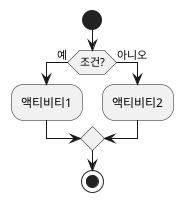
````

### 반복

반복 추가:

````markdown
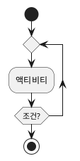
````

## 스타일과 테마

### 테마 설정

테마 설정 가능:

````markdown
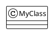
````

### 색상 설정

색상 설정 가능:

````markdown
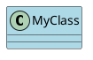
````

## 렌더링 방식

### 메인 프로세스 렌더링

PlantUML은 메인 프로세스를 사용하여 렌더링합니다:

- **서버 측 렌더링**: 메인 프로세스에서 차트 렌더링
- **SVG 형식**: 기본적으로 SVG 형식으로 렌더링
- **PNG 형식**: PNG 형식으로 변환 가능

### 렌더링 성능

PlantUML 렌더링 특징:

- **렌더링 속도**: 메인 프로세스 렌더링 속도가 빠름
- **자원 사용량**: 렌더링 시 메인 프로세스 자원 사용
- **오류 처리**: 렌더링 오류는 콘솔에 표시됨

## 주의사항

### 구문 주의사항

1. **필수 마크업**: 반드시 `@startuml`과 `@enduml`을 포함해야 함
2. **구문 규칙**: PlantUML 공식 구문 규칙을 따름
3. **한글 지원**: 한글 사용 가능하지만, 영어 식별자 사용 권장
4. **버전 호환성**: PlantUML 버전 호환성에 유의

### 렌더링 주의사항

1. **코드 추출**: 코드 추출이 정확한지 확인, XML 태그 포함 방지
2. **구문 오류**: 구문 오류 시 차트 렌더링 불가
3. **복잡한 차트**: 지나치게 복잡한 차트는 렌더링 성능에 영향
4. **내보내기 호환성**: 내보낼 때 대상 형식에서 차트가 정상 표시되는지 확인

## 모범 사례

1. **구문 규칙**: PlantUML 공식 구문 규칙을 따름
2. **코드 명확성**: 차트 코드를 명확하고 읽기 쉽게 유지
3. **마크업 사용**: 항상 `@startuml`과 `@enduml` 마크업 사용
4. **렌더링 테스트**: 편집 후 차트 렌더링 효과 테스트
5. **참조 문서**: PlantUML 공식 문서 참조

## 관련 문서

- [[charts.introduction|차트 기능 소개]]
- [[charts.mermaid|Mermaid 차트]]
- [[charts.echarts|ECharts 차트]]