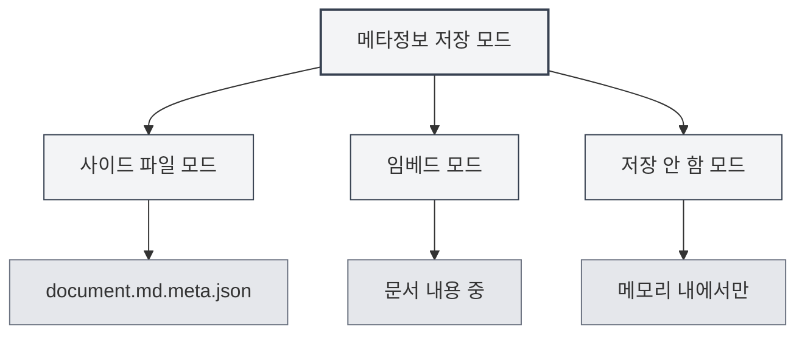

# 문서 메타정보

## 개요

문서 메타정보는 문서의 기본 속성을 설명하는 데이터로, 제목, 저자, 설명, 키워드 등을 포함합니다. 적절하게 메타정보를 설정하면 문서 관리와 검색에 도움이 되며, 문서를 내보낼 때 이 정보가 자동으로 포함됩니다.

MetaDoc는 각 문서에 대해 메타정보를 설정할 수 있도록 지원하며, 이 정보는 사이드 파일에 저장하거나 문서 내용에 포함시키거나, 저장하지 않을 수도 있습니다. 또한 AI를 사용하여 메타정보를 자동 생성할 수도 있습니다.

<MetaInfoPanel mode="demo" :meta='{"title": "", "author": "", "description": "", "keywords": []}' :outlineJson='""' />

## 메타정보 소개

### 제목 (Title)

문서의 제목으로, 일반적으로 문서 상단과 탭에 표시됩니다.

- **용도**: 문서의 주요 내용 식별
- **표시 위치**: 탭 제목, 내보낸 문서의 제목 페이지
- **예시**: `"MetaDoc 사용자 매뉴얼"`

<MetaInfoPanel mode="demo" :meta='{"title": "MetaDoc 사용자 매뉴얼", "author": "", "description": "", "keywords": []}' :outlineJson='""' />

### 저자 (Author)

문서의 저자 또는 생성자입니다.

- **용도**: 문서 생성자 식별
- **표시 위치**: 내보낸 문서의 저자 정보
- **예시**: `"홍길동"`

<MetaInfoPanel mode="demo" :meta='{"title": "예시 문서", "author": "홍길동", "description": "", "keywords": []}' :outlineJson='""' />

### 설명 (Description)

문서의 간략한 설명 또는 요약입니다.

- **용도**: 문서의 주요 내용 요약
- **표시 위치**: 내보낸 문서의 요약 부분
- **예시**: `"이 문서는 MetaDoc의 기본 사용 방법을 소개합니다"`

<MetaInfoPanel mode="demo" :meta='{"title": "예시 문서", "author": "저자명", "description": "이 문서는 MetaDoc의 기본 사용 방법을 소개합니다", "keywords": []}' :outlineJson='""' />

### 키워드 (Keywords)

문서 검색 및 분류에 사용되는 문서의 키워드 목록입니다.

- **용도**: 문서 검색 및 분류 지원
- **형식**: 문자열 배열
- **예시**: `["MetaDoc", "사용자 매뉴얼", "문서 편집"]`

<MetaInfoPanel mode="demo" :meta='{"title": "예시 문서", "author": "저자명", "description": "문서 설명", "keywords": ["MetaDoc", "사용자 매뉴얼", "문서 편집"]}' :outlineJson='""' />

## 메타정보 설정

### 수동 설정

1. **메타정보 패널 열기**:

   - 편집기 도구 모음의 "메타정보" 버튼 클릭
   - 또는 단축키 사용 (구성된 경우)

2. **메타정보 입력**:

   - **제목**: 문서 제목 입력
   - **저자**: 저자 이름 입력
   - **설명**: 문서 설명 입력 (여러 줄 지원)
   - **키워드**: 키워드 입력, 여러 키워드는 쉼표로 구분

3. **저장**: "저장" 버튼 클릭하여 메타정보 저장

메타정보 패널 인터페이스는 다음과 같습니다:

<MetaInfoPanel mode="demo" :meta='{"title": "예시 문서", "author": "저자명", "description": "문서 설명", "keywords": ["키워드1", "키워드2"]}' :outlineJson='""' />

### 일괄 설정

모든 메타정보 필드를 한 번에 설정할 수 있습니다:

1. 메타정보 패널 열기
2. 모든 필드 입력
3. "저장" 버튼 클릭

<MetaInfoPanel mode="demo" :meta='{"title": "일괄 설정 예시", "author": "관리자", "description": "모든 메타정보 필드를 일괄 설정하는 예시", "keywords": ["일괄", "설정", "메타정보"]}' :outlineJson='""' />

### 메타정보 편집

설정된 메타정보는 언제든지 수정할 수 있습니다:

1. 메타정보 패널 열기
2. 변경할 필드 수정
3. "저장" 버튼 클릭

수정된 메타정보는 즉시 적용되며, 다음에 문서를 저장할 때 저장됩니다.

## 메타정보 저장 모드

MetaDoc는 세 가지 메타정보 저장 모드를 지원하며, [[settings.basic|기본 설정]]에서 구성할 수 있습니다:



### 사이드 파일 모드

메타정보는 문서와 동일한 이름의 사이드 파일(`.meta.json`)에 저장됩니다.

<MetaInfoPanel mode="demo" :meta='{"title": "사이드 파일 모드 예시", "author": "시스템", "description": "메타정보가 .meta.json 파일에 저장됨", "keywords": ["사이드 파일", "메타데이터"]}' :outlineJson='""' />

**장점**:

- 원본 문서 내용 수정 안 함
- 사이드 파일을 삭제하여 언제든지 원본 문서 복원 가능
- 버전 관리에 적합

**단점**:

- 추가 파일 생성
- 문서 이동 시 사이드 파일도 함께 이동 필요

**예시**:

- 문서: `document.md`
- 메타정보 파일: `document.md.meta.json`

### 임베드 모드

메타정보가 문서 내용에 포함됩니다 (Markdown의 front matter 또는 LaTeX의 주석).

<MetaInfoPanel mode="demo" :meta='{"title": "임베드 모드 예시", "author": "임베드 저자", "description": "메타정보가 문서에 포함됨", "keywords": ["임베드", "front matter"]}' :outlineJson='""' />

**장점**:

- 문서와 메타정보가 함께 있어 관리 용이
- 추가 파일 불필요

**단점**:

- 원본 문서 내용 수정
- 일부 형식은 임베드를 지원하지 않을 수 있음

**예시** (Markdown):

```markdown
---
title: 문서 제목
author: 저자 이름
description: 문서 설명
keywords: [키워드1, 키워드2]
---

문서 내용...
```

### 저장 안 함 모드

메타정보는 편집 시에만 사용되며, 파일에 저장되지 않습니다.

<MetaInfoPanel mode="demo" :meta='{"title": "저장 안 함 모드", "author": "임시", "description": "메타정보를 메모리에서만 저장", "keywords": ["임시", "저장 안 함"]}' :outlineJson='""' />

**장점**:

- 원본 문서에 영향 없음
- 추가 파일 생성 안 함

**단점**:

- 문서 닫은 후 메타정보 손실
- 내보낼 때 메타정보 사용 불가

## AI 메타정보 생성

MetaDoc는 AI를 사용하여 문서 메타정보를 자동 생성하는 기능을 지원하며, 문서 내용과 개요 구조를 기반으로 지능적으로 생성합니다.

### 단일 필드 생성

특정 필드의 메타정보 생성:

1. 메타정보 패널 열기
2. 필드 옆의 "AI 생성" 버튼 클릭
3. AI 생성 결과 대기
4. 생성된 내용 확인, 수락 또는 재생성 가능

### 모든 필드 생성

모든 메타정보 필드를 한 번에 생성:

1. 메타정보 패널 열기
2. "AI 모두 생성" 버튼 클릭
3. AI 생성 결과 대기
4. 생성된 내용 확인, 수락, 수정 또는 재생성 가능

<MetaInfoPanel mode="demo" :meta='{"title": "AI 생성 예시", "author": "AI 어시스턴트", "description": "AI를 사용하여 자동 생성된 메타정보", "keywords": ["AI", "자동 생성", "지능형"]}' :outlineJson='""' />

### 생성 원리

AI 메타정보 생성은 다음을 기반으로 합니다:

- **문서 개요**: 문서의 제목 구조 분석
- **문서 내용**: 문서의 주요 내용 분석
- **문맥 이해**: 문서의 주제와 목적 이해

생성 결과는 문서 내용에 따라 자동 조정되어 메타정보가 문서 내용을 정확히 반영하도록 합니다.

## 내보내기에서의 메타정보 활용

내보낸 문서에는 메타정보가 자동으로 포함됩니다:

### PDF 내보내기

- **제목**: PDF 문서 속성에 표시
- **저자**: PDF 문서 속성에 표시
- **설명**: PDF 주제(Subject)로 사용
- **키워드**: PDF 문서 속성에 표시

### DOCX 내보내기

- **제목**: Word 문서 속성에 표시
- **저자**: Word 문서 속성에 표시
- **설명**: Word 요약으로 사용
- **키워드**: Word 문서 속성에 표시

### HTML 내보내기

- **제목**: HTML의 `<title>` 태그에 표시
- **저자**: HTML의 `<meta>` 태그에 표시
- **설명**: HTML의 `<meta>` 태그에 표시
- **키워드**: HTML의 `<meta>` 태그에 표시

## 사용 팁

### 적절한 제목 설정

- **간결 명료**: 제목은 문서 내용을 간결하게 요약해야 함
- **너무 길지 않게**: 제목이 너무 길면 표시 효과에 영향
- **키워드 사용**: 제목에 중요한 키워드 포함

### 키워드 설정

- **적절한 수량**: 3-10개의 키워드 설정 권장
- **높은 관련성**: 키워드는 문서 내용과 높은 관련성 있어야 함
- **중복 피하기**: 중복되거나 유사한 키워드 설정 피하기

### AI 생성 최적화

- **생성 후 확인**: AI 생성 내용은 수동 확인 필요
- **적절한 수정**: 실제 필요에 따라 생성 내용 수정
- **여러 번 생성**: 만족스럽지 않으면 여러 번 생성하여 최상의 결과 선택

<MetaInfoPanel mode="demo" :meta='{"title": "메타정보 완전 예시", "author": "데모 사용자", "description": "완전한 메타정보 구성 예시 표시", "keywords": ["메타정보", "구성", "예시"]}' :outlineJson='""' />

## 자주 묻는 질문

### Q: 메타정보는 어디에 저장되나요?

A: 저장 모드에 따라 메타정보는 사이드 파일, 문서 내용에 포함, 또는 저장되지 않을 수 있습니다. 설정에서 저장 모드를 구성할 수 있습니다.

### Q: 메타정보를 삭제하려면 어떻게 하나요?

A: 메타정보 패널에서 모든 필드를 비우고 저장하면 메타정보가 삭제됩니다.

### Q: AI 생성 내용이 부정확하면 어떻게 하나요?

A: AI 생성 내용은 참고용이며, 수동으로 수정하거나 재생성할 수 있습니다. 생성 후 확인하고 조정하는 것이 좋습니다.

### Q: 메타정보가 문서 내용에 영향을 미치나요?

A: 임베드 모드를 사용하면 메타정보가 문서 내용에 포함됩니다. 사이드 파일 모드나 저장 안 함 모드를 사용하면 원본 문서 내용에 영향을 미치지 않습니다.

### Q: 내보낼 때 메타정보가 손실되나요?

A: 아닙니다. 내보낼 때 메타정보가 자동으로 포함되어 내보낸 문서의 속성에 표시됩니다.

## 관련 문서

- [[core.file-operations|파일 작업]]
- [[core.export|내보내기 기능]]
- [[settings.basic|기본 설정]]
- [[ai.assistants|AI 어시스턴트 기능]]