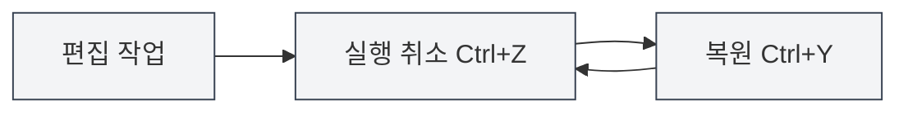
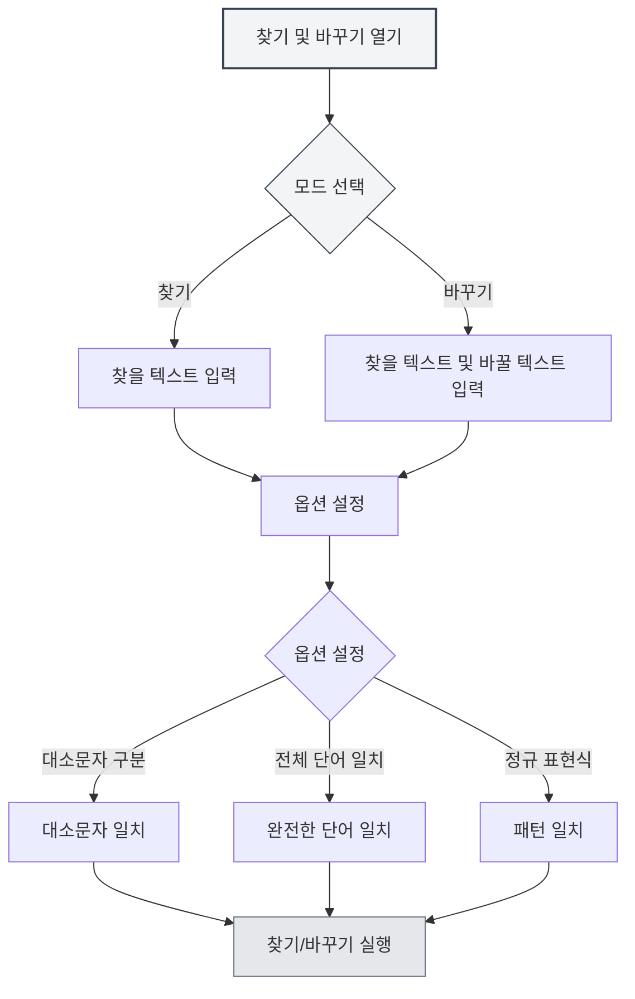

# 편집기 기본 조작

## 개요

편집기 기본 조작은 MetaDoc으로 문서를 편집하는 기본 기술입니다. 이러한 조작을 숙지하면 편집 효율을 크게 향상시킬 수 있습니다.

MetaDoc의 편집기는 실행 취소, 다시 실행, 복사, 붙여넣기, 잘라내기, 전체 선택 및 찾기/바꾸기 등 표준 텍스트 편집 작업을 지원합니다.

<SearchReplaceMenu mode="demo" :position='{"top": 100, "left": 200}' :adapter='null' />

<MenuItemsDemo mode="demo" :items='[{"id": "edit"}]' />

## 실행 취소와 다시 실행

### 실행 취소

마지막 편집 작업을 취소합니다:

- **단축키**: `Ctrl+Z` (Windows/Linux) 또는 `Cmd+Z` (macOS)
- **메뉴**: "편집" → "실행 취소" 클릭

여러 작업을 연속적으로 취소하여 문서의 초기 상태로 복원할 수 있습니다.

### 다시 실행

<MenuItemsDemo mode="demo" :items='[{"id": "edit"}]' />

취소된 작업을 복원합니다:

- **단축키**: `Ctrl+Y` 또는 `Ctrl+Shift+Z` (Windows/Linux) 또는 `Cmd+Shift+Z` (macOS)
- **메뉴**: "편집" → "다시 실행" 클릭

다시 실행 작업은 취소된 순서의 반대로 작업을 복원합니다.

## 복사, 붙여넣기, 잘라내기

<MenuItemsDemo mode="demo" :items='[{"id": "edit"}]' />

### 복사

선택한 텍스트를 클립보드에 복사합니다:

- **단축키**: `Ctrl+C` (Windows/Linux) 또는 `Cmd+C` (macOS)
- **메뉴**: "편집" → "복사" 클릭
- **마우스 오른쪽 버튼 메뉴**: 텍스트 선택 후 마우스 오른쪽 버튼으로 "복사" 선택

### 붙여넣기

<MenuItemsDemo mode="demo" :items='[{"id": "edit"}]' />

클립보드의 내용을 현재 위치에 붙여넣습니다:

- **단축키**: `Ctrl+V` (Windows/Linux) 또는 `Cmd+V` (macOS)
- **메뉴**: "편집" → "붙여넣기" 클릭
- **마우스 오른쪽 버튼 메뉴**: 마우스 오른쪽 버튼으로 "붙여넣기" 선택

붙여넣기 작업은 내용을 커서 위치에 삽입하며, 이미 선택된 텍스트가 있으면 해당 내용을 대체합니다.

### 잘라내기

<MenuItemsDemo mode="demo" :items='[{"id": "edit"}]' />

선택한 텍스트를 클립보드로 잘라내기(원래 위치의 내용 삭제):

- **단축키**: `Ctrl+X` (Windows/Linux) 또는 `Cmd+X` (macOS)
- **메뉴**: "편집" → "잘라내기" 클릭
- **마우스 오른쪽 버튼 메뉴**: 텍스트 선택 후 마우스 오른쪽 버튼으로 "잘라내기" 선택

잘라내기 작업은 원래 위치의 텍스트를 삭제하고 클립보드에 저장하여 다른 위치에 붙여넣을 수 있습니다.

## 전체 선택

<MenuItemsDemo mode="demo" :items='[{"id": "edit"}]' />

문서의 모든 내용을 선택합니다:

- **단축키**: `Ctrl+A` (Windows/Linux) 또는 `Cmd+A` (macOS)
- **메뉴**: "편집" → "전체 선택" 클릭

전체 선택 후 다음을 수행할 수 있습니다:

- 전체 문서 내용 복사
- 전체 문서 내용 삭제
- 모든 텍스트 통일 서식 지정

## 찾기 및 바꾸기

### 찾기

<SearchReplaceMenu mode="demo" :position='{"top": 100, "left": 200}' :adapter='null' />

문서에서 지정된 텍스트를 찾습니다:

- **단축키**: `Ctrl+F` (Windows/Linux) 또는 `Cmd+F` (macOS)
- **메뉴**: "편집" → "찾기" 클릭

찾기 기능은 다음을 지원합니다:

- **대소문자 구분**: 대소문자를 구분하여 찾기
- **전체 단어 일치**: 완전한 단어만 일치
- **정규 표현식**: 정규 표현식을 사용한 고급 찾기
- **강조 표시**: 찾기 결과가 문서에서 강조 표시됨

### 바꾸기

<SearchReplaceMenu mode="demo" :position='{"top": 100, "left": 200}' :adapter='null' />

텍스트를 찾아 바꿉니다:

- **단축키**: `Ctrl+H` (Windows/Linux) 또는 `Cmd+H` (macOS)
- **메뉴**: "편집" → "찾기 및 바꾸기" 클릭

바꾸기 기능은 다음을 지원합니다:

- **단일 바꾸기**: 일치하는 텍스트를 하나씩 바꾸기
- **모두 바꾸기**: 일치하는 모든 텍스트를 한 번에 바꾸기
- **바꾸기 미리보기**: 바꾸기 전 결과 미리보기

### 찾기 및 바꾸기 옵션

찾기 및 바꾸기 대화 상자는 다음 옵션을 제공합니다:

- **대소문자 구분**: 대소문자가 완전히 동일한 텍스트만 일치
- **전체 단어 일치**: 완전한 단어만 일치(단어의 일부는 일치하지 않음)
- **정규 표현식**: 정규 표현식을 사용한 패턴 일치
- **순환 찾기**: 문서 끝에 도달하면 자동으로 처음부터 다시 찾기

찾기 및 바꾸기 메뉴 인터페이스는 다음과 같습니다:

<SearchReplaceMenu mode="demo" :position='{"top": 100, "left": 200}' :adapter='null' />

## 텍스트 선택

### 기본 선택

- **클릭**: 클릭 위치에 커서 배치
- **드래그**: 시작 위치부터 끝 위치까지 텍스트 선택
- **더블 클릭**: 전체 단어 선택
- **트리플 클릭**: 전체 줄 선택

### 확장 선택

- **Shift+클릭**: 클릭 위치까지 선택 범위 확장
- **Ctrl+클릭**: 여러 개의 불연속 선택 영역 추가(편집기가 지원하는 경우)
- **Alt+드래그**: 열 선택 모드(편집기가 지원하는 경우)

## 커서 이동

### 기본 이동

- **방향키**: 커서를 위, 아래, 왼쪽, 오른쪽으로 이동
- **Home/End**: 줄의 시작/끝으로 이동
- **Ctrl+Home/End**: 문서의 시작/끝으로 이동
- **Page Up/Page Down**: 위/아래로 페이지 이동

### 단어 이동

- **Ctrl+왼쪽/오른쪽 화살표**: 단어 단위로 커서 이동
- **Ctrl+위/아래 화살표**: 위/아래로 단락 이동

## 삭제 작업

### 기본 삭제

- **Backspace**: 커서 앞의 문자 삭제
- **Delete**: 커서 뒤의 문자 삭제
- **Ctrl+Backspace**: 커서 앞의 전체 단어 삭제
- **Ctrl+Delete**: 커서 뒤의 전체 단어 삭제

## 편집기 차이점

MetaDoc은 두 가지 주요 편집기를 제공합니다:

### Markdown 편집기 (Vditor)

- 실시간 미리보기 지원
- 서식 지정 도구 모음 제공
- 여러 편집 모드 지원(IR/WYSIWYG/SV)
- 자세한 내용은 [[markdown.editor|Markdown 편집기 사용 가이드]] 참조

### LaTeX 편집기 (Monaco)

- 전문적인 코드 편집 경험
- 구문 강조 및 자동 완성
- 코드 접기 지원
- 자세한 내용은 [[latex.editor|LaTeX 편집기 사용 가이드]] 참조

두 편집기의 기본 조작은 기본적으로 동일하지만 고급 기능에서는 차이가 있습니다.

## 단축키 참조

### 일반 단축키

| 작업     | Windows/Linux              | macOS         |
| -------- | -------------------------- | ------------- |
| 실행 취소 | `Ctrl+Z`                   | `Cmd+Z`       |
| 다시 실행 | `Ctrl+Y` 또는 `Ctrl+Shift+Z` | `Cmd+Shift+Z` |
| 복사     | `Ctrl+C`                   | `Cmd+C`       |
| 붙여넣기 | `Ctrl+V`                   | `Cmd+V`       |
| 잘라내기 | `Ctrl+X`                   | `Cmd+X`       |
| 전체 선택 | `Ctrl+A`                   | `Cmd+A`       |
| 찾기     | `Ctrl+F`                   | `Cmd+F`       |
| 찾기 및 바꾸기 | `Ctrl+H`                   | `Cmd+H`       |

## 주의사항

1. **실행 취소 기록**: 문서를 닫으면 실행 취소 기록이 지워지므로, 문서를 수시로 저장하는 것이 좋습니다.
2. **클립보드**: 복사 및 잘라내기 내용은 시스템 클립보드에 저장되며, 애플리케이션을 닫으면 손실될 수 있습니다.
3. **찾기 및 바꾸기**: 정규 표현식을 사용할 때 특수 문자 이스케이프에 주의하세요.
4. **대용량 문서**: 대용량 문서를 처리할 때 찾기 및 바꾸기 작업에 시간이 다소 걸릴 수 있습니다.

## 관련 문서

- [[core.file-operations|파일 작업]]
- [[core.editor-settings|편집기 설정]]
- [[markdown.editor|Markdown 편집기 사용 가이드]]
- [[latex.editor|LaTeX 편집기 사용 가이드]]