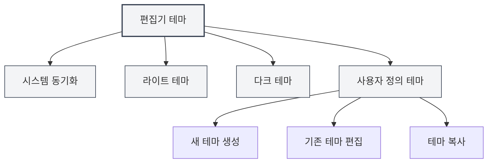
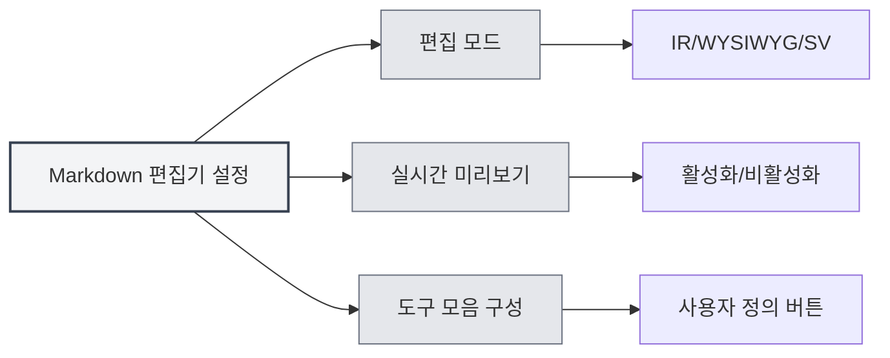

# 편집기 설정

## 개요

편집기 설정을 통해 테마, 글꼴, 줄 번호 표시 등 편집기의 외관과 동작을 사용자 정의할 수 있습니다. 적절한 설정은 편집 경험과 작업 효율성을 향상시킵니다.

편집기 설정은 전역 설정과 편집기별 설정으로 구분됩니다. 전역 설정은 모든 편집기에 영향을 미치며, 일부 설정은 특정 유형의 편집기(예: Markdown 편집기 또는 LaTeX 편집기)에만 적용될 수 있습니다.

<MenuItemsDemo mode="demo" :items='[{"id": "settings"}]' />

## 편집기 테마

<MenuItemsDemo mode="demo" :items='[{"id": "settings"}]' />

### 테마 유형

MetaDoc는 다양한 테마 모드를 지원합니다:

- **시스템 동기화**: 시스템 테마(라이트/다크)를 자동으로 따라갑니다.
- **라이트 테마**: 항상 라이트 테마를 사용합니다.
- **다크 테마**: 항상 다크 테마를 사용합니다.
- **사용자 정의 테마**: 사용자 정의 색상 구성을 사용합니다.

### 테마 설정

<SettingThemeSection mode="demo" />

1. 설정 페이지를 엽니다(메뉴 "설정" 클릭 또는 단축키 사용).
2. "테마 설정" 섹션으로 이동합니다.
3. 원하는 테마를 선택합니다.

상단 메뉴 바를 통해 설정에 접근할 수 있습니다:

상단 메뉴 바의 "설정" 메뉴를 클릭하면 설정 패널을 열어 편집기 테마, 콘텐츠 테마, 코드 테마 등의 옵션을 구성할 수 있습니다.

<MenuItemsDemo mode="demo" :items='[{"id": "settings"}]' />

테마 설정은 애플리케이션을 재시작하지 않고도 즉시 적용됩니다.

### 사용자 정의 테마

<SettingThemeSection mode="demo" />

사용자 정의 테마를 생성하고 편집할 수 있습니다:

1. 테마 설정 페이지에서 "새 테마"를 클릭합니다.
2. 테마 이름과 테마 색상을 설정합니다.
3. 저장 후 사용할 수 있습니다.

사용자 정의 테마는 다음을 지원합니다:

- **편집**: 테마 이름과 색상 수정
- **복사**: 기존 테마를 새 테마의 시작점으로 복사
- **삭제**: 필요 없는 사용자 정의 테마 삭제

## 콘텐츠 테마

<SettingThemeSection mode="demo" />

콘텐츠 테마는 문서 미리보기 영역의 표시 스타일을 제어합니다:

- **자동**: 전역 테마에 따라 자동 선택
- **라이트**: 항상 라이트 미리보기 스타일 사용
- **다크**: 항상 다크 미리보기 스타일 사용

콘텐츠 테마는 주로 Markdown 미리보기와 PDF 미리보기의 표시 효과에 영향을 줍니다.

## 코드 테마

<SettingThemeSection mode="demo" />

코드 테마는 코드 블록의 구문 강조 스타일을 제어합니다:

- **자동**: 전역 테마에 따라 자동 선택
- **사전 설정 테마**: 사전 설정된 코드 테마 선택(예: GitHub, Monokai, Solarized 등)

코드 테마는 다음에 영향을 줍니다:

- Markdown 코드 블록의 구문 강조
- LaTeX 편집기의 코드 강조
- 콘솔 출력의 표시 스타일

## 글꼴 설정

<SettingBasicSection mode="demo" />

### 편집기 글꼴

편집기에 사용되는 글꼴은 시스템 설정에서 구성할 수 있습니다. 기본적으로 다음과 같은 고정폭 글꼴을 사용합니다:

- JetBrains Mono
- Consolas
- Courier New
- Microsoft YaHei Mono

### 글꼴 크기

- **확대**: `Ctrl+=` 또는 `Ctrl+마우스 휠 위로` 사용
- **축소**: `Ctrl+-` 또는 `Ctrl+마우스 휠 아래로` 사용
- **재설정**: `Ctrl+0`으로 기본 크기로 재설정

글꼴 크기 조정은 즉시 적용되지만 설정에 저장되지는 않습니다.

## 줄 번호 표시

<SettingBasicSection mode="demo" />

### 줄 번호 표시/숨기기

줄 번호 표시 설정은 편집기가 줄 번호를 표시할지 여부를 제어합니다:

- **활성화**: 줄 번호를 표시하여 코드 위치 파악이 용이함
- **비활성화**: 줄 번호를 숨겨 더 넓은 편집 영역 확보

### 줄 번호 표시 설정

1. 설정 페이지를 엽니다.
2. "편집기 설정" 섹션에서 "줄 번호 표시"를 찾습니다.
3. 토글 스위치로 줄 번호를 활성화 또는 비활성화합니다.

줄 번호 설정은 다음에 영향을 줍니다:

- LaTeX 편집기
- 일반 텍스트 편집기
- 코드 미리보기 영역

참고: Markdown 편집기(Vditor)의 줄 번호 표시는 자체 구성에 의해 제어됩니다.

## 미니맵 표시

미니맵(Minimap)은 편집기 오른쪽에 있는 코드 축약판으로, 문서 내용을 빠르게 탐색하고 위치를 파악하는 데 도움을 줍니다.

### 미니맵 표시/숨기기

미니맵 표시 설정:

- **활성화**: 미니맵을 표시하여 긴 문서 탐색이 용이함
- **비활성화**: 미니맵을 숨겨 더 넓은 편집 영역 확보

### 미니맵 설정

미니맵 설정은 일반적으로 편집기의 오른쪽 클릭 메뉴나 도구 모음에 있습니다:

1. 편집기에서 오른쪽 클릭합니다.
2. "미니맵" 또는 "Minimap" 옵션을 찾습니다.
3. 표시 상태를 전환합니다.

미니맵 기능은 주로 다음에 적용됩니다:

- LaTeX 편집기(Monaco)
- 일반 텍스트 편집기(Monaco)

## 편집기별 설정

### Markdown 편집기 설정

Markdown 편집기(Vditor)의 특정 설정:

- **편집 모드**: IR 모드, WYSIWYG 모드, SV 모드
- **실시간 미리보기**: 실시간 미리보기 기능 활성화/비활성화
- **도구 모음 구성**: 도구 모음 버튼 사용자 정의

자세한 내용은 [[markdown.editor|Markdown 편집기 사용 가이드]]를 참조하세요.

### LaTeX 편집기 설정

LaTeX 편집기(Monaco)의 특정 설정:

- **코드 접기**: 코드 접기 기능 활성화/비활성화
- **자동 줄 바꿈**: 긴 줄의 표시 방식 제어
- **문법 검사**: LaTeX 문법 검사 활성화/비활성화

자세한 내용은 [[latex.editor|LaTeX 편집기 사용 가이드]]를 참조하세요.

## 설정 동기화

편집기 설정은 로컬 구성에 저장되며, 다음을 포함합니다:

- 테마 선택
- 줄 번호 표시 선호도
- 글꼴 크기(현재 세션)
- 미니맵 표시 상태

설정은 애플리케이션 재시작 후 자동으로 복원됩니다.

## 단축키 참조

### 글꼴 조정

| 작업         | Windows/Linux | macOS      |
| ------------ | ------------- | ---------- |
| 글꼴 확대     | `Ctrl+=`      | `Cmd+=`    |
| 글꼴 축소     | `Ctrl+-`      | `Cmd+-`    |
| 글꼴 재설정   | `Ctrl+0`      | `Cmd+0`    |
| 마우스 휠 확대/축소 | `Ctrl+휠`   | `Cmd+휠` |

## 모범 사례

1. **테마 선택**:

   - 장시간 편집 시 다크 테마 사용을 권장하여 눈의 피로를 줄입니다.
   - 인쇄 미리보기 시 라이트 테마를 사용하여 더 나은 인쇄 효과를 얻습니다.

2. **줄 번호 표시**:

   - 코드 작성 시 줄 번호를 활성화하여 오류 위치 파악이 용이합니다.
   - 일반 텍스트 편집 시 줄 번호를 끄고 더 넓은 편집 영역을 확보할 수 있습니다.

3. **미니맵**:

   - 긴 문서 편집 시 미니맵을 활성화하여 문서 구조를 빠르게 탐색합니다.
   - 짧은 문서 편집 시 미니맵을 끌 수 있습니다.

4. **글꼴 크기**:
   - 화면 크기와 개인 습관에 따라 글꼴 크기를 조정합니다.
   - 가독성과 화면 공간의 균형을 위해 14-16px 글꼴 크기 사용을 권장합니다.

## 주의 사항

1. **테마 동기화**: "시스템 동기화" 선택 후 테마는 시스템 설정을 따라 자동으로 전환됩니다.
2. **설정 범위**: 일부 설정은 특정 편집기에만 영향을 미치며 다른 편집기에는 영향을 주지 않습니다.
3. **성능 영향**: 일부 기능(예: 실시간 미리보기)을 활성화하면 편집 성능에 영향을 줄 수 있습니다.
4. **사용자 정의 테마**: 사용자 정의 테마의 색상은 전체 애플리케이션의 색상 구성표에 영향을 줍니다.

## 관련 문서

- [[core.editor-basics|편집기 기본 조작]]
- [[settings.basic|기본 설정]]
- [[settings.theme|테마 설정]]
- [[markdown.editor|Markdown 편집기 사용 가이드]]
- [[latex.editor|LaTeX 편집기 사용 가이드]]