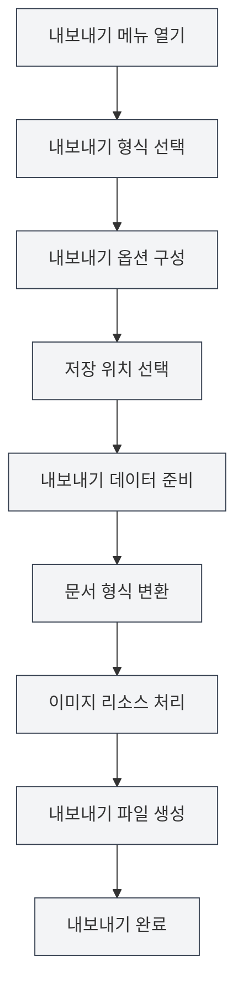

# 내보내기 기능

## 개요

MetaDoc는 문서를 PDF, HTML, DOCX, LaTeX, Markdown, JSON 등 다양한 형식으로 내보내기를 지원합니다. 내보내기 기능은 문서 형식에 따라 다른 내보내기 옵션을 제공하여, 내보낸 문서가 원래의 형식과 스타일을 유지하도록 보장합니다.

내보내기 기능은 자동으로 문서 메타정보(제목, 저자, 설명, 키워드)를 포함하며, 내보내기 과정에서 이미지, 표, 수학 공식 등의 요소를 처리합니다.

<MenuItemsDemo mode="demo" :items='[{"id": "file", "items": ["export"]}]' />

<MetaInfoPanel mode="demo" :meta='{"title": "내보내기 예시", "author": "저자", "description": "문서 설명", "keywords": ["내보내기", "PDF"]}' :outlineJson='""' />

<MenuItemsDemo mode="demo" :items='[{"id": "file", "items": ["export"]}]' />

<MetaInfoPanel mode="demo" :meta='{"title": "내보내기 형식", "author": "MetaDoc", "description": "지원하는 내보내기 형식 소개", "keywords": ["내보내기", "형식"]}' :outlineJson='""' />

## 내보내기 형식 지원

<MenuItemsDemo mode="demo" :items='[{"id": "file", "items": ["export"]}]' />

### Markdown 문서 내보내기

Markdown 문서(`.md`)는 다음 형식으로 내보낼 수 있습니다:

- **PDF**: 인쇄 및 공유에 적합
- **HTML**: 웹페이지 표시에 적합
- **DOCX**: Word 편집에 적합
- **LaTeX**: 학술 논문에 적합
- **JSON**: 프로그램 처리에 적합

<MetaInfoPanel mode="demo" :meta='{"title": "LaTeX 내보내기", "author": "시스템", "description": "LaTeX 문서 내보내기 옵션", "keywords": ["LaTeX", "내보내기"]}' :outlineJson='""' />

### LaTeX 문서 내보내기

LaTeX 문서(`.tex`)는 다음 형식으로 내보낼 수 있습니다:

- **PDF**: LaTeX 컴파일을 통해 생성
- **Markdown**: Markdown 형식으로 변환
- **HTML**: HTML 형식으로 변환
- **DOCX**: Word 형식으로 변환

<MenuItemsDemo mode="demo" :items='[{"id": "file", "items": ["export"]}]' />

### JSON 문서 내보내기

JSON 문서(`.json`)는 다음으로 내보낼 수 있습니다:

- **JSON**: JSON 형식 유지

## 내보내기 작업

### 기본 내보내기

1. **내보내기 메뉴 열기**:
   - 메뉴 바의 "파일" → "내보내기" 클릭
   - 또는 단축키 사용(구성된 경우)

파일 메뉴의 내보내기 옵션은 다음과 같습니다:

<MenuItemsDemo mode="demo" :items='[{"id": "file", "items": ["export"]}]' />

2. **내보내기 형식 선택**:

   - 내보내기 메뉴에서 목표 형식 선택
   - 시스템은 현재 문서 형식에 따라 사용 가능한 내보내기 옵션을 표시합니다

3. **저장 위치 선택**:

   - 파일 저장 대화 상자에서 저장 위치 선택
   - 파일 이름 입력(시스템이 올바른 확장자를 자동으로 추가함)

4. **내보내기 완료 대기**:
   - 내보내기 과정에서 진행률 표시줄이 표시됩니다
   - 내보내기가 완료되면 성공 메시지가 표시됩니다

### 빠른 내보내기

자주 사용하는 형식의 경우 단축키를 사용하여 빠르게 내보낼 수 있습니다:

- **PDF로 내보내기**: `Ctrl+Shift+E`(구성된 경우)
- **HTML로 내보내기**: 메뉴를 통해 선택

## Markdown 내보내기 상세 설명

<MenuItemsDemo mode="demo" :items='[{"id": "file", "items": ["export"]}]' />

### PDF로 내보내기

PDF 내보내기는 Markdown을 PDF 형식으로 변환합니다:

- **포함 내용**: 문서 본문, 이미지, 표, 수학 공식
- **포함 메타정보**: 제목, 저자, 설명, 키워드
- **스타일**: PDF 전용 스타일 사용, 인쇄에 적합
- **이미지 처리**: 이미지는 페이지에 맞도록 자동으로 크기가 조정됩니다

**사용 시나리오**:

- 문서 인쇄
- 타인과 문서 공유
- 보관 저장

### HTML로 내보내기

<MetaInfoPanel mode="demo" :meta='{"title": "HTML 내보내기", "author": "시스템", "description": "HTML 내보내기 설정 및 옵션", "keywords": ["HTML", "내보내기"]}' :outlineJson='""' />

HTML 내보내기는 Markdown을 웹페이지 형식으로 변환합니다:

- **포함 내용**: 문서 본문, 이미지, 표, 수학 공식
- **포함 메타정보**: 제목, 저자, 설명, 키워드(HTML의 meta 태그 내)
- **스타일**: HTML 스타일 사용, 웹페이지 표시에 적합
- **이미지 처리**: 원본 URL 유지, base64로 변환 또는 폴더에 저장 중 선택 가능

**사용 시나리오**:

- 웹사이트에 게시
- 브라우저에서 보기
- 타인과 공유

### DOCX로 내보내기

<MenuItemsDemo mode="demo" :items='[{"id": "file", "items": ["export"]}]' />

DOCX 내보내기는 Markdown을 Word 형식으로 변환합니다:

- **포함 내용**: 문서 본문, 이미지, 표, 수학 공식
- **포함 메타정보**: 제목, 저자, 설명, 키워드(Word 문서 속성 내)
- **스타일**: Word 스타일 사용, Word에서 추가 편집 가능
- **이미지 처리**: 이미지는 Word 문서에 삽입됩니다

**사용 시나리오**:

- Word에서 추가 편집
- 타인과 협업 편집
- 문서 제출

### LaTeX로 내보내기

<MetaInfoPanel mode="demo" :meta='{"title": "LaTeX 내보내기", "author": "학술", "description": "Markdown을 LaTeX로 변환 내보내기", "keywords": ["LaTeX", "학술"]}' :outlineJson='""' />

LaTeX 내보내기는 Markdown을 LaTeX 형식으로 변환합니다:

- **포함 내용**: 문서 본문, 이미지, 표, 수학 공식
- **포함 메타정보**: 제목, 저자, 설명, 키워드(LaTeX 문서 내)
- **형식 변환**: Markdown 구문을 해당 LaTeX 명령어로 변환
- **수학 공식**: LaTeX 수학 공식 형식 유지

**사용 시나리오**:

- 학술 논문 작성
- LaTeX 형식이 필요한 시나리오
- LaTeX 문서 추가 편집

### JSON으로 내보내기

<MenuItemsDemo mode="demo" :items='[{"id": "file", "items": ["export"]}]' />

JSON 내보내기는 문서를 JSON 형식으로 저장합니다:

- **포함 내용**: 문서의 모든 데이터(내용, 메타정보, 개요 등)
- **형식**: 구조화된 JSON 데이터
- **용도**: 프로그램 처리, 데이터 백업

## LaTeX 내보내기 상세 설명

<MetaInfoPanel mode="demo" :meta='{"title": "LaTeX 내보내기 상세 설명", "author": "시스템", "description": "LaTeX 문서 내보내기 상세 설명", "keywords": ["LaTeX", "PDF", "내보내기"]}' :outlineJson='""' />

### PDF로 내보내기

LaTeX 문서를 PDF로 내보내려면 LaTeX 컴파일이 필요합니다:

1. **LaTeX 컴파일**: 시스템이 LaTeX 문서를 자동으로 컴파일합니다
2. **PDF 생성**: 컴파일 성공 후 PDF 파일 생성
3. **메타정보 포함**: PDF 문서 속성에 메타정보 포함

**주의사항**:

- LaTeX 배포판(예: TeX Live) 설치 필요
- 컴파일에 시간이 다소 소요될 수 있음
- 컴파일 실패 시 오류 메시지 표시

### Markdown으로 내보내기

LaTeX 문서를 Markdown 형식으로 변환할 수 있습니다:

- **형식 변환**: LaTeX 명령어를 Markdown 구문으로 변환
- **수학 공식**: LaTeX 공식을 Markdown 수학 공식 형식으로 변환
- **표**: LaTeX 표를 Markdown 표로 변환

### HTML로 내보내기

LaTeX 문서를 HTML 형식으로 변환할 수 있습니다:

- **형식 변환**: LaTeX 명령어를 HTML 태그로 변환
- **수학 공식**: MathJax 또는 KaTeX 사용 렌더링
- **스타일**: HTML 스타일 사용 표시

### DOCX로 내보내기

LaTeX 문서를 Word 형식으로 변환할 수 있습니다:

- **형식 변환**: LaTeX 명령어를 Word 형식으로 변환
- **수학 공식**: Word 수학 공식 형식으로 변환
- **표**: Word 표 형식으로 변환

## 내보내기 옵션 구성

### 이미지 처리 옵션

내보내기 시 이미지 처리 방식을 구성할 수 있습니다:

- **원본 URL 유지**: 이미지의 원본 URL 유지(HTML 내보내기에 적합)
- **Base64로 변환**: 이미지를 문서에 삽입(HTML, DOCX 내보내기에 적합)
- **폴더에 저장**: 이미지를 지정된 폴더에 저장(HTML 내보내기에 적합)

### PDF 내보내기 옵션

PDF 내보내기는 다음 옵션을 지원합니다:

- **페이지 크기**: A4, Letter 등
- **페이지 여백**: 사용자 정의 페이지 여백
- **글꼴**: 글꼴 및 글자 크기 선택
- **이미지 품질**: 이미지 품질 조정

### HTML 내보내기 옵션

HTML 내보내기는 다음 옵션을 지원합니다:

- **스타일**: HTML 스타일 테마 선택
- **수학 공식 렌더링**: MathJax 또는 KaTeX 선택
- **코드 하이라이트**: 코드 하이라이트 활성화 또는 비활성화

## 내보내기 진행률

내보내기 과정에서 진행률 표시줄이 표시됩니다:

- **준비 단계**: 내보내기 데이터 준비
- **변환 단계**: 문서 형식 변환
- **이미지 처리**: 문서 내 이미지 처리
- **파일 생성**: 최종 파일 생성

내보내기 시간이 오래 걸리는 경우:

- **진행률 확인**: 진행률 표시줄에서 현재 진행률 확인
- **내보내기 취소**: "취소" 버튼 클릭하여 내보내기 작업 취소

## 내보내기 파일 이름 지정

내보낸 파일은 자동으로 이름이 지정됩니다:

- **기본 이름**: 문서 제목 또는 파일 이름 사용
- **자동 확장자**: 내보내기 형식에 따라 자동으로 확장자 추가
- **사용자 정의 이름**: 저장 대화 상자에서 사용자 정의 이름 선택 가능

## 사용 팁

### 적절한 형식 선택

- **PDF**: 인쇄 및 공식 공유에 적합
- **HTML**: 웹페이지 표시 및 온라인 보기에 적합
- **DOCX**: 추가 편집이 필요한 시나리오에 적합
- **LaTeX**: 학술 작성 및 LaTeX 형식이 필요한 시나리오에 적합

### 이미지 처리 권장사항

- **HTML 내보내기**: 웹페이지에 표시할 경우 Base64 또는 폴더 저장 권장
- **DOCX 내보내기**: 이미지는 자동 삽입되며 추가 처리 불필요
- **PDF 내보내기**: 이미지는 자동 크기 조정되어 페이지 적합성 보장

### 일괄 내보내기

여러 문서를 내보내야 하는 경우:

1. 문서를 하나씩 열기
2. 필요한 형식으로 각각 내보내기
3. 또는 스크립트를 사용한 일괄 처리(고급 사용자)

## 자주 묻는 질문

### Q: 내보내기가 실패하면 어떻게 하나요?

A: 문서에 오류가 있는지 확인하고, 모든 이미지와 리소스에 접근 가능한지 확인하세요. PDF 내보내기가 실패하면 LaTeX 컴파일에 오류가 있는지 확인하세요.

### Q: 내보낸 PDF 형식이 올바르지 않나요?

A: PDF 내보내기 옵션 설정을 확인하고, 페이지 크기와 여백을 조정하세요. 문서 내용 형식이 올바른지 확인하세요.

### Q: 내보낸 후 이미지가 표시되지 않나요?

A: 이미지 경로가 올바른지 확인하고, 이미지 파일이 존재하는지 확인하세요. HTML 내보내기의 경우 적절한 이미지 처리 방식을 선택하세요.

### Q: 내보내기 스타일을 사용자 정의할 수 있나요?

A: 일부 형식은 사용자 정의 스타일을 지원하며, 내보내기 옵션에서 구성할 수 있습니다. PDF 및 HTML 내보내기는 스타일 사용자 정의를 지원합니다.

### Q: 내보내기 시 메타정보가 포함되나요?

A: 네, 내보내기 시 자동으로 문서 메타정보(제목, 저자, 설명, 키워드)가 포함되어 내보낸 문서의 속성에 표시됩니다.

## 관련 문서

- [[core.file-operations|파일 작업]]
- [[core.document-metadata|문서 메타정보]]
- [[markdown.basics|Markdown 구문]]
- [[latex.basics|LaTeX 구문]]
- [[latex.compilation|LaTeX 컴파일 및 미리보기]]