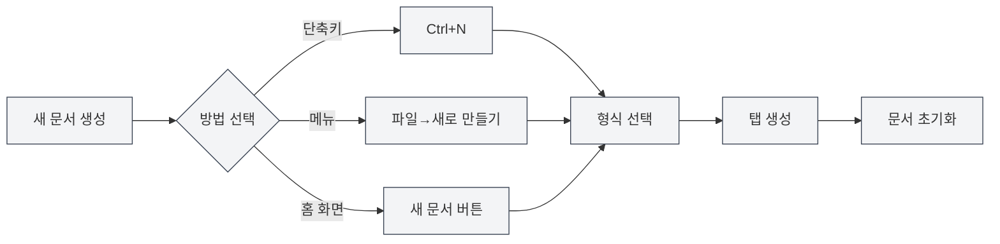
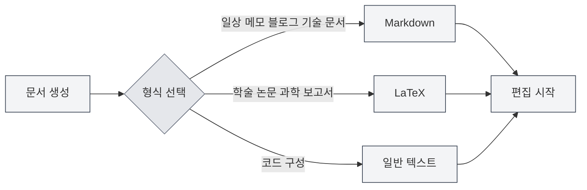
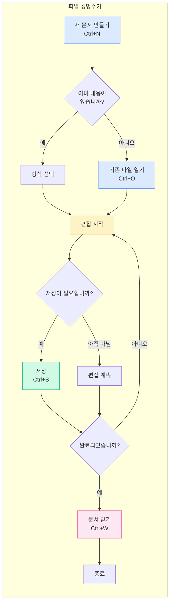

# 파일 작업

## 개요

파일 작업은 MetaDoc의 기본 기능입니다. 기술 문서, 학술 논문 작성부터 일상적인 메모 기록까지, 숙련된 파일 작업은 창작 과정을 더욱 원활하게 만들어 줍니다. 이 문서에서는 문서를 생성, 열기, 저장 및 관리하는 방법을 상세히 설명합니다.

## 새 문서 만들기

<MainTabs mode="demo" />

<MenuItemsDemo mode="demo" :items='[{"id": "file", "items": ["new"]}]' />

### 빈 문서 생성하기

MetaDoc은 새 문서를 생성하는 여러 편리한 방법을 제공합니다. 현재 작업 습관에 가장 적합한 방법을 선택할 수 있습니다.

**방법 1: 단축키 (가장 빠름)**

- `Ctrl+N`을 눌러 즉시 새 문서 생성
- 편집 중 빠르게 새 문서를 만들 때 적합

**방법 2: 파일 메뉴**

- 왼쪽 메뉴 바의 "파일" 아이콘 클릭
- 펼쳐진 메뉴에서 "새로 만들기" 선택

**방법 3: 홈 화면 진입점**

- 홈 화면에서 "새 문서" 버튼 클릭
- 애플리케이션을 막 열었을 때 작업을 시작하기에 적합

아래는 새로 만들기, 열기, 저장 등 일반적인 작업을 포함하는 파일 메뉴의 인터페이스를 보여줍니다.

<MenuItemsDemo mode="demo" :items='[{"id": "file", "items": ["new", "open", "save", "save-as", "save-all", "close"]}]' />

<MainTabs mode="demo" />

**문서 생성 후 상태**:

새 문서를 생성하면 다음을 확인할 수 있습니다.

- 상단에 "제목 없음"으로 표시된 새 탭이 나타납니다.
- 시스템에서 문서 형식(Markdown, LaTeX 또는 일반 텍스트)을 선택하라는 메시지가 표시됩니다.
- 이때 문서는 메모리에만 있으며, 디스크에 보존하려면 저장해야 합니다.

### 문서 형식 선택하기

문서를 생성할 때 문서 형식을 선택해야 합니다. 다른 형식은 다른 시나리오에 적합합니다.

**Markdown (.md)** —— 가장 일반적으로 사용되는 경량 형식

- 적합: 일상 메모, 블로그 글, 기술 문서, 프로젝트 문서
- 장점: 문법이 간단하고 읽기 쉬우며 내보내기 형식이 풍부함
- 사용 예: 회의 요점 기록, 기술 블로그 작성, 학습 노트 정리

**LaTeX (.tex)** —— 전문적인 학술 조판 형식

- 적합: 학술 논문, 학위 논문, 과학 기술 보고서, 수학 문서
- 장점: 조판이 정교하고 수식 지원이 완벽하며 목차와 참조를 자동 생성함
- 사용 예: 연구 논문 작성, 수학 교재 편집, 학술 발표 준비

**일반 텍스트 (.txt)** —— 가장 간단한 텍스트 형식

- 적합: 코드 조각, 구성 파일, 임시 메모
- 장점: 범용성이 강하며 모든 편집기에서 열 수 있음
- 사용 예: 코드 조각 저장, 임시 정보 기록

## 문서 열기

<MenuItemsDemo mode="demo" :items='[{"id": "file", "items": ["open"]}]' />

### 기존 파일 열기

1. **단축키 방식**: `Ctrl+O`를 눌러 파일 선택 대화 상자 열기
2. **메뉴 방식**: "파일" → "열기" 클릭
3. **홈 화면 방식**: 홈 화면에서 "파일 열기" 버튼 클릭

### 지원되는 파일 형식

MetaDoc은 다음 형식의 파일 열기를 지원합니다.

- `.md` - Markdown 문서
- `.tex` - LaTeX 문서
- `.txt` - 일반 텍스트 파일
- `.json` - JSON 형식 파일

### 최근 파일 목록

홈 화면에는 최근에 연 문서 목록이 표시되어 빠르게 액세스할 수 있습니다.

- 최근 문서 카드를 클릭하면 빠르게 열 수 있습니다.
- 마우스 오른쪽 버튼을 클릭하면 최근 문서 기록을 삭제할 수 있습니다.
- 최대 12개의 최근 문서가 표시됩니다.

### 파일 연결

MetaDoc은 파일 연결 기능을 지원합니다.

- 시스템에서 `.md` 또는 `.tex` 파일을 두 번 클릭하면 MetaDoc이 자동으로 열립니다.
- 파일이 다른 창에서 이미 열려 있는 경우, 다른 창에서 파일이 열려 있음을 알려줍니다.

## 문서 저장하기

<MenuItemsDemo mode="demo" :items='[{"id": "file", "items": ["save", "save-as", "save-all"]}]' />

### 현재 문서 저장하기

자주 저장하는 습관을 들이면 예기치 않은 상황으로 인해 작업 결과를 잃는 것을 방지할 수 있습니다.

**저장 방법**:

- **단축키** (권장): `Ctrl+S` —— 가장 일반적으로 사용되는 저장 방법, 키보드에서 손을 떼지 않음
- **메뉴 작업**: "파일" 메뉴 → "저장" 클릭

**첫 저장**:
문서가 새로 생성된 경우, 처음 저장할 때 "다른 이름으로 저장" 대화 상자가 나타납니다. 다음을 수행해야 합니다.

1. 저장 위치 선택 (예: "문서" 폴더)
2. 파일 이름 입력 (예: "프로젝트 계획.md")
3. "저장" 버튼 클릭

**이미 저장된 문서 업데이트 저장**:
문서가 이전에 저장된 적이 있는 경우, `Ctrl+S`를 누르면 대화 상자 없이 원본 파일을 직접 덮어씁니다.

### 다른 이름으로 저장 —— 문서 사본 생성하기

원본 문서를 유지하면서 새 버전을 생성해야 할 때 "다른 이름으로 저장" 기능을 사용합니다.

**사용 시나리오**:

- 문서 수정 전 백업 사본 생성
- 문서를 다른 위치에 저장
- 다른 파일 이름으로 문서의 다른 버전 저장

**작업 방법**:

- **단축키**: `Ctrl+Shift+S`
- **메뉴**: "파일" → "다른 이름으로 저장" 클릭

**예시**:
"보고서v1.md"를 편집 중이며, 대폭 수정하기 전에 백업을 저장하려는 경우:

1. `Ctrl+Shift+S` 누르기
2. 새 파일 이름 "보고서v1_백업.md" 입력
3. 저장 클릭
4. 원본 문서 편집을 계속하며 안심하고 수정

### 모두 저장 —— 모든 문서를 한 번에 저장하기

여러 문서를 동시에 열어 놓은 경우, "모두 저장" 기능을 사용하여 모든 문서를 한 번에 저장할 수 있습니다.

**작업 방법**:

- **단축키**: `Ctrl+K S` (`Ctrl+K`를 먼저 누른 다음 `S` 누르기)
- **메뉴**: "파일" → "모두 저장" 클릭

**사용 시나리오**:

- 작업 종료 시 열려 있는 모든 문서 빠르게 저장
- 모든 수정 사항이 저장되었는지 확인

### 자동 저장 —— 시스템이 저장을 도와줍니다

MetaDoc은 자동 저장 기능을 지원하여 창작에 집중하는 동안 문서를 자동으로 저장할 수 있습니다.

**설정 방법**:
[[settings.basic|기본 설정]]에 들어가 "자동 저장" 옵션을 찾아 적절한 시간 간격을 선택합니다.

- **끄기**: 저장 시기를 수동으로 제어
- **1분**: 가장 안전하지만 디스크 쓰기가 증가함
- **5분**: 균형 잡힌 솔루션 (권장)
- **10분/30분/1시간**: 긴 문서에 적합하며 저장 빈도 감소

**작동 원리**:

- 자동 저장은 백그라운드에서 자동으로 수행되어 편집을 방해하지 않습니다.
- 자동 저장 시 탭의 "저장되지 않음" 표시가 사라집니다.
- 자동 저장에 영향을 받지 않고 언제든지 수동으로 저장(`Ctrl+S`)할 수 있습니다.

**권장 사항**:

- 중요한 문서의 경우 5분 자동 저장을 활성화하는 것이 좋습니다.
- 자동 저장이 활성화된 경우에도 중요한 단계(예: 장 완료)에서는 여전히 수동 저장을 권장합니다.

## 파일 닫기

<MainTabs mode="demo" />

### 현재 탭 닫기

- **단축키**: `Ctrl+W`
- **탭 닫기 버튼 클릭**: 탭 오른쪽의 × 버튼 클릭

### 닫기 전 확인

문서에 저장되지 않은 변경 사항이 있는 경우, 닫을 때 다음을 확인합니다.

- **저장**: 변경 사항을 저장한 후 닫기
- **저장 안 함**: 변경 사항을 포기하고 바로 닫기
- **취소**: 닫기 작업 취소

### 닫힌 탭 다시 열기

- **단축키**: `Ctrl+Shift+T`

최근에 닫힌 탭을 복원할 수 있습니다 (최대 20개 복원).

## 다중 탭 관리

<MainTabs mode="demo" />

MetaDoc은 여러 문서를 동시에 열 수 있으며, 각 문서는 독립적인 탭에 표시됩니다.

탭 바에는 열려 있는 모든 문서가 표시되며 전환, 닫기, 드래그 등의 작업을 지원합니다.

<MainTabs mode="demo" />

- **탭 전환**: `Ctrl+Tab`을 사용하여 다음 탭으로 전환, `Ctrl+Shift+Tab`을 사용하여 이전 탭으로 전환
- **드래그 정렬**: 탭을 드래그하여 순서를 다시 정렬할 수 있습니다.
- **탭 고정**: 탭을 마우스 오른쪽 버튼으로 클릭하고 "고정"을 선택하면, 고정된 탭은 항상 왼쪽에 표시되며 닫을 수 없습니다.

더 많은 탭 작업은 [[core.multi-tab|다중 탭 관리]]에서 확인하세요.

## 파일 상태 표시

탭은 문서의 상태를 표시합니다.

- **저장되지 않음**: 탭 제목 옆에 점(●)이 표시되어 저장되지 않은 변경 사항이 있음을 나타냅니다.
- **저장됨**: 특별한 표시 없음
- **읽기 전용**: 잠금 아이콘이 표시되어 파일이 읽기 전용 모드임을 나타냅니다.

## 주의 사항

1. **파일 경로**: 파일을 저장할 때 충분한 디스크 공간과 쓰기 권한이 있는지 확인하세요.
2. **파일 형식**: 저장 시 적절한 파일 형식을 선택하여 형식 비호환성을 피하세요.
3. **백업**: 중요한 문서는 정기적으로 백업하는 것이 좋으며, "다른 이름으로 저장" 기능을 사용하여 사본을 생성할 수 있습니다.
4. **파일 충돌**: 파일이 외부에서 수정된 경우 MetaDoc이 감지하고 충돌 처리 방법을 알려줍니다.

## 관련 문서

- [[core.editor-basics|편집기 기본 작업]]
- [[core.multi-tab|다중 탭 관리]]
- [[core.document-metadata|문서 메타정보]]
- [[core.export|내보내기 기능]]
- [[settings.basic|기본 설정]]