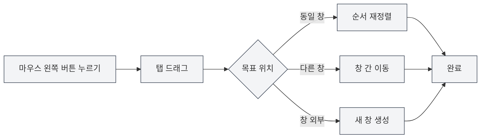

# 다중 탭 관리

## 개요

MetaDoc는 다중 탭 관리를 지원하여 여러 문서를 동시에 열 수 있으며, 각 문서는 독립적인 탭에 표시됩니다. 탭 작업을 숙지하면 작업 효율성을 크게 향상시킬 수 있습니다.

탭 관리에는 새로 만들기, 전환, 닫기, 드래그 정렬, 고정 등의 기능이 포함되어 있어 여러 문서를 유연하게 구성하고 관리할 수 있습니다.

<MainTabs mode="demo" />

<AIChat mode="demo" />

<KnowledgeBase mode="demo" />

<ProofreadView mode="demo" />

<GraphWindow mode="demo" />

<OcrWindow mode="demo" />

<DataAnalysisWindow mode="demo" />

<AgentView mode="demo" />

<MenuItemsDemo mode="demo" :items='[{"id": "file", "items": ["new", "open", "save"]}]' />

<ViewMenuItemsDemo mode="demo" :items='["editor", "outline"]' />

<Outline mode="demo" />

<ResizableDivider mode="demo" />

<TitleMenu mode="demo" title="탭 예시" :position='{"top": 100, "left": 200}' path="1" :tree='{}' />

## 새 탭 만들기

### 새 탭 생성

새 탭을 만드는 방법은 여러 가지가 있습니다:

1.  **단축키**: `Ctrl+T`를 눌러 새 탭을 빠르게 생성합니다.
2.  **버튼 클릭**: 탭 표시줄 오른쪽의 "+" 버튼을 클릭합니다.
3.  **메뉴**: "파일" → "새로 만들기"를 클릭합니다.

탭 표시줄에는 열려 있는 모든 문서가 표시되며, 새로 만들기, 전환, 닫기 등의 작업을 지원합니다:

<MainTabs mode="demo" />

새로 생성된 탭은 빈 문서를 열며, 문서 형식(Markdown/LaTeX/일반 텍스트)을 선택할 수 있습니다.

### 파일에서 탭 생성

파일을 열면 자동으로 새 탭이 생성됩니다:

1.  **단축키**: `Ctrl+O`를 눌러 파일 선택 대화 상자를 엽니다.
2.  **메뉴**: "파일" → "열기"를 클릭합니다.
3.  **홈 화면**: 홈 화면에서 "파일 열기" 버튼을 클릭합니다.

열린 파일은 새 탭에 표시됩니다.

## 탭 전환

### 단축키로 전환

-   **다음 탭**: `Ctrl+Tab`을 눌러 다음 탭으로 전환합니다.
-   **이전 탭**: `Ctrl+Shift+Tab`을 눌러 이전 탭으로 전환합니다.

전환 시 순환 표시되며, 마지막 탭에 도달하면 자동으로 첫 번째 탭으로 돌아갑니다.

### 마우스로 전환

-   **탭 클릭**: 탭 제목을 직접 클릭하여 해당 탭으로 전환합니다.
-   **마우스 휠**: 탭 표시줄에서 마우스 휠을 굴려 탭을 전환할 수 있습니다.
    -   **휠 아래로**: 다음 탭으로 전환합니다.
    -   **휠 위로**: 이전 탭으로 전환합니다.

### 탭 전환 표시기

단축키를 사용하여 탭을 전환할 때 전환 표시기가 나타나 현재 선택된 탭을 보여주어 빠르게 찾을 수 있도록 도와줍니다.

## 탭 닫기

### 현재 탭 닫기

-   **단축키**: `Ctrl+W`를 눌러 현재 활성화된 탭을 닫습니다.
-   **닫기 버튼 클릭**: 탭 오른쪽의 × 버튼을 클릭합니다.
-   **가운데 버튼 클릭**: 마우스 가운데 버튼으로 탭을 클릭하여 닫습니다.

### 닫기 전 확인

탭 내 문서에 저장되지 않은 변경 사항이 있는 경우, 닫을 때 다음과 같이 확인합니다:

-   **저장**: 변경 사항을 저장한 후 탭을 닫습니다.
-   **저장 안 함**: 변경 사항을 버리고 탭을 바로 닫습니다.
-   **취소**: 닫기 작업을 취소하고 편집을 계속합니다.

### 닫힌 탭 다시 열기

-   **단축키**: `Ctrl+Shift+T`를 눌러 최근에 닫은 탭을 다시 엽니다.

시스템은 최근에 닫힌 20개의 탭을 저장하며, 닫은 순서의 역순으로 하나씩 복원할 수 있습니다.

## 탭 드래그

### 순서 재정렬

탭을 드래그하여 순서를 변경할 수 있습니다:

1.  **마우스 왼쪽 버튼 누르기**: 탭 제목에서 마우스 왼쪽 버튼을 누릅니다.
2.  **드래그**: 탭을 목표 위치로 끌어옵니다.
3.  **놓기**: 마우스 왼쪽 버튼을 놓아 정렬을 완료합니다.

드래그 시 탭의 목표 위치를 보여주는 시각적 피드백이 제공됩니다.

### 창 간 드래그

탭을 다른 창으로 드래그할 수 있습니다:

1.  **탭 드래그**: 마우스 왼쪽 버튼을 누른 채 탭을 드래그합니다.
2.  **다른 창으로 이동**: 탭을 다른 MetaDoc 창으로 드래그합니다.
3.  **놓기**: 목표 창에서 마우스 버튼을 놓으면 탭이 해당 창으로 이동합니다.

창 간 드래그를 통해 여러 창 사이에서 문서를 유연하게 구성할 수 있습니다.

### 새 창 생성

탭을 창 외부로 드래그하여 새 창을 생성할 수 있습니다:

1.  **탭 드래그**: 마우스 왼쪽 버튼을 누른 채 탭을 드래그합니다.
2.  **창 외부로 이동**: 탭을 현재 창 외부로 드래그합니다.
3.  **놓기**: 마우스 버튼을 놓으면 시스템이 새 창을 생성하고 해당 탭을 엽니다.

## 탭 고정

### 탭 고정하기

고정된 탭은 항상 탭 표시줄의 가장 왼쪽에 표시되며 닫을 수 없습니다:

-   **탭 더블클릭**: 탭 제목을 더블클릭하여 해당 탭을 고정합니다.
-   **마우스 오른쪽 버튼 메뉴**: 탭을 마우스 오른쪽 버튼으로 클릭하고 "고정"을 선택합니다.

고정된 탭은 다음과 같습니다:

-   탭 표시줄의 가장 왼쪽에 표시됩니다.
-   잠금 아이콘이 표시됩니다.
-   일반적인 방법으로 닫을 수 없습니다.
-   드래그하여 위치를 이동할 수 없습니다.

### 고정 해제

-   **마우스 오른쪽 버튼 메뉴**: 고정된 탭을 마우스 오른쪽 버튼으로 클릭하고 "고정 해제"를 선택합니다.

고정 해제 후, 탭은 정상적인 닫기 및 드래그 가능 상태로 복원됩니다.

## 탭 상태

### 저장되지 않은 상태

탭은 문서의 저장 상태를 표시합니다:

-   **저장되지 않음**: 탭 제목 옆에 점(●)이 표시되어 저장되지 않은 변경 사항이 있음을 나타냅니다.
-   **저장됨**: 특별한 표시가 없습니다.

### 읽기 전용 상태

문서가 읽기 전용인 경우, 탭에 잠금 아이콘이 표시됩니다:

-   **읽기 전용 문서**: 잠금 아이콘이 표시되어 문서를 편집할 수 없음을 나타냅니다.
-   **편집 가능 문서**: 특별한 표시가 없습니다.

### 미리보기 상태

미리보기 상태의 탭:

-   **미리보기 모드**: 단일 클릭으로 열린 파일은 미리보기 모드로 표시됩니다.
-   **더블클릭 활성화**: 미리보기 탭을 더블클릭하여 정식 탭으로 활성화할 수 있습니다.
-   **자동 활성화**: 편집하거나 뷰를 전환한 후 자동으로 활성화됩니다.

## 탭 마우스 오른쪽 버튼 메뉴

탭을 마우스 오른쪽 버튼으로 클릭하면 다음과 같은 작업을 제공하는 컨텍스트 메뉴가 표시됩니다:

-   **닫기**: 현재 탭을 닫습니다.
-   **다른 탭 닫기**: 현재 탭을 제외한 모든 탭을 닫습니다.
-   **오른쪽 탭 닫기**: 현재 탭 오른쪽의 모든 탭을 닫습니다.
-   **고정/고정 해제**: 탭을 고정하거나 고정 해제합니다.
-   **새 창으로 이동**: 탭을 새 창으로 이동합니다.
-   **경로 복사**: 문서 경로를 클립보드에 복사합니다.

## 탭 수 제한

MetaDoc는 동시에 열 수 있는 탭 수에 엄격한 제한을 두지 않지만, 다음을 권장합니다:

-   **적절한 수**: 동시에 10-20개 정도의 탭을 여는 것이 적절합니다.
-   **성능 영향**: 너무 많은 탭을 열면 애플리케이션 성능에 영향을 줄 수 있습니다.
-   **메모리 사용량**: 각 탭은 일정량의 메모리를 사용합니다.

탭이 너무 많으면 필요하지 않은 탭을 닫는 것이 좋습니다.

## 단축키 참조

### 탭 작업 단축키

| 작업               | Windows/Linux    | macOS           |
| ------------------ | ---------------- | --------------- |
| 새 탭 만들기       | `Ctrl+T`         | `Cmd+T`         |
| 탭 닫기           | `Ctrl+W`         | `Cmd+W`         |
| 다음 탭으로 전환   | `Ctrl+Tab`       | `Cmd+Tab`       |
| 이전 탭으로 전환   | `Ctrl+Shift+Tab` | `Cmd+Shift+Tab` |
| 닫힌 탭 다시 열기 | `Ctrl+Shift+T`   | `Cmd+Shift+T`   |

### 마우스 작업

| 작업         | 방법                     |
| ------------ | ------------------------ |
| 탭 전환       | 탭 제목 클릭             |
| 탭 닫기       | × 버튼 클릭 또는 가운데 버튼 클릭 |
| 탭 고정       | 탭 제목 더블클릭         |
| 드래그 정렬   | 왼쪽 버튼 누른 채 드래그 |
| 휠로 전환     | 탭 표시줄에서 마우스 휠 굴리기 |

## 사용 팁

### 탭 구성하기

1.  **자주 사용하는 문서 고정**: 자주 사용하는 문서를 고정하여 빠르게 접근할 수 있습니다.
2.  **프로젝트별 그룹화**: 관련 문서를 함께 배치하고 드래그 정렬을 사용하여 구성합니다.
3.  **다중 창 사용**: 다른 프로젝트의 문서를 다른 창에 배치합니다.

### 빠른 전환

1.  **단축키 사용**: `Ctrl+Tab` 단축키를 능숙하게 사용하여 탭을 빠르게 전환합니다.
2.  **휠 사용**: 탭 표시줄에서 마우스 휠을 굴려 빠르게 탐색합니다.
3.  **전환 표시기 사용**: 단축키 사용 시 전환 표시기가 나타나 위치를 쉽게 파악할 수 있습니다.

### 일괄 작업

1.  **여러 탭 닫기**: 마우스 오른쪽 버튼 메뉴의 "다른 탭 닫기" 또는 "오른쪽 탭 닫기" 기능을 사용합니다.
2.  **모든 탭 저장**: `Ctrl+K S`를 사용하여 열려 있는 모든 문서를 저장합니다.
3.  **다시 열기**: `Ctrl+Shift+T`를 사용하여 닫힌 탭을 빠르게 복원합니다.

## 자주 묻는 질문

### Q: 특정 탭을 빠르게 찾는 방법은 무엇인가요?

A: `Ctrl+Tab` 단축키를 사용하면 전환 표시기가 나타나 모든 탭을 보여줍니다. Tab 키를 계속 눌러 선택하거나 직접 클릭할 수 있습니다.

### Q: 탭이 너무 많으면 어떻게 하나요?

A: 자주 사용하는 탭을 고정하고, 필요하지 않은 탭을 닫거나, 다중 창을 사용하여 문서를 그룹화할 수 있습니다.

### Q: 실수로 닫은 탭을 복원하는 방법은 무엇인가요?

A: `Ctrl+Shift+T` 단축키를 사용하여 최근에 닫은 탭을 다시 열 수 있습니다.

### Q: 고정된 탭을 닫을 수 있나요?

A: 고정된 탭은 일반적인 방법으로 닫을 수 없으며, 먼저 고정을 해제해야 합니다. 고정된 탭을 마우스 오른쪽 버튼으로 클릭하고 "고정 해제"를 선택하세요.

### Q: 창 간에 탭을 드래그할 수 있나요?

A: 예, 가능합니다. 탭을 다른 MetaDoc 창으로 드래그하면 탭이 해당 창으로 이동합니다.

## 관련 문서

-   [[core.file-operations|파일 작업]]
-   [[core.multi-window|다중 창 관리]]
-   [[core.editor-basics|편집기 기본 작업]]
