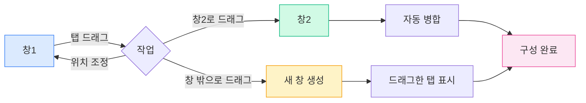

# 다중 창 관리

## 개요

MetaDoc는 다중 창 관리를 지원하여 서로 다른 창에서 다양한 문서를 열 수 있습니다. 다중 창 관리를 통해 여러 문서를 동시에 보고 편집하여 작업 효율성을 높일 수 있습니다.

## 다중 창 지원

### 창 유형

MetaDoc는 두 가지 유형의 창을 지원합니다:

- **주 창**: 문서 편집, 홈페이지 등 주요 기능을 담당하며, 다중 탭 관리를 지원합니다.
- **보조 창**: 설정, AI 채팅, OCR 등의 도구 창으로, 단일 인스턴스 창입니다.

### 창 특징

주 창의 특징:

- **다중 탭**: 각 창마다 독립적인 탭 목록을 가집니다.
- **독립 상태**: 각 창마다 독립적인 문서 상태를 가집니다.
- **드래그 앤 드롭 지원**: 탭 드래그를 통한 분할 및 병합을 지원합니다.
- **창 풀**: 미리 생성된 유휴 창으로 빠른 표시를 구현합니다.

## 새 창 생성

### 드래그로 생성

탭을 드래그하여 새 창을 생성할 수 있습니다:

1. **탭 드래그**: 탭을 창 경계 밖으로 드래그합니다.
2. **창 생성**: 시스템이 자동으로 새 창을 생성합니다.
3. **내용 표시**: 새 창에 드래그한 탭의 내용이 표시됩니다.

탭 바는 드래그 앤 드롭 작업을 지원하여 탭을 드래그해 창 밖으로 빼내 새 창을 생성할 수 있습니다:

<MainTabs mode="demo" />

**주의사항**:

- 단일 탭 창은 드래그를 통해 새 창을 생성할 수 없습니다.
- 드래그 시 창 풀에서 미리 로드된 창을 자동으로 가져와 빠르게 표시합니다.

### 우클릭 메뉴로 생성

우클릭 메뉴를 통해 새 창을 생성할 수 있습니다:

1. **탭 우클릭**: 이동할 탭을 우클릭합니다.
2. **옵션 선택**: "새 창에서 열기"를 선택합니다.
3. **창 생성**: 시스템이 새 창을 생성하고 탭을 이동시킵니다.

### 창 풀 메커니즘

MetaDoc는 창 풀 메커니즘을 사용하여 창 생성을 최적화합니다:

- **미리 로드된 창**: 시스템이 2개의 유휴 창을 미리 생성합니다.
- **빠른 표시**: 미리 로드된 창을 사용하면 즉시 표시됩니다 (<100ms).
- **자동 보충**: 사용 후 자동으로 새 창을 풀에 보충합니다.

## 창 간 탭 드래그 앤 드롭

### 드래그 병합

탭을 한 창에서 다른 창으로 드래그하여 유연한 창 구성을 할 수 있습니다:

**작업 단계**:

1. **탭 드래그**: 원본 창에서 탭을 드래그합니다.
2. **대상 창으로 드래그**: 탭을 대상 창의 탭 바로 드래그합니다.
3. **자동 병합**: 탭이 대상 창에 자동으로 추가됩니다.

### 드래그 위치

드래그 시 삽입 위치를 지정할 수 있습니다:

- **자동 위치 지정**: 마우스 위치에 따라 자동으로 삽입 위치를 결정합니다.
- **특정 위치 지정**: 특정 위치에 드래그하여 삽입할 수 있습니다.
- **끝에 삽입**: 끝까지 드래그하면 마지막에 삽입됩니다.

### 단일 탭 창 병합

원본 창에 탭이 하나만 있는 경우:

- **자동 병합**: 다른 창으로 드래그하면 자동으로 병합됩니다.
- **창 닫힘**: 병합 후 원본 창은 자동으로 닫힙니다.
- **빈 창 방지**: 빈 창이 생기는 것을 방지합니다.

## 창 관리

### 창 전환

시스템 단축키를 사용하여 창을 전환할 수 있습니다:

- **Alt+Tab** (Windows/Linux): 창 전환
- **Cmd+Tab** (macOS): 창 전환

### 창 상태

각 창은 독립적인 상태를 가집니다:

- **탭 목록**: 각 창마다 독립적인 탭 목록을 가집니다.
- **문서 상태**: 각 창마다 독립적인 문서 상태를 가집니다.
- **뷰 상태**: 각 창마다 독립적인 뷰 상태를 가집니다.

### 창 닫기

창을 닫는 방법:

- **닫기 버튼**: 창의 닫기 버튼을 클릭합니다.
- **단축키**: 시스템 단축키를 사용하여 창을 닫습니다.
- **메뉴 옵션**: 메뉴를 통해 창을 닫습니다.

**주의사항**:

- 창을 닫기 전에 저장되지 않은 문서를 저장하라는 메시지가 표시됩니다.
- 보조 창을 닫으면 실제로 닫히지 않고 숨겨집니다.

## 창 동기화

### 상태 동기화

일부 상태는 창 간에 동기화됩니다:

- **언어 설정**: 언어 전환은 모든 창에 동기화됩니다.
- **테마 설정**: 테마 전환은 모든 창에 동기화됩니다.
- **시스템 설정**: 시스템 설정은 모든 창에 동기화됩니다.

### 파일 연결

파일 연결 기능:

- **중복 방지**: 동일한 파일이 여러 창에서 동시에 열리지 않습니다.
- **창 위치 찾기**: 파일이 이미 다른 창에서 열려 있으면 알림을 표시하고 해당 창으로 이동합니다.
- **파일 잠금**: 파일 이동 시 임시로 잠겨 충돌을 방지합니다.

## 모범 사례

1. **적절한 분할 화면**: 다중 창을 사용하여 분할 화면 편집을 구현하고 효율성을 높입니다.
2. **창 구성**: 관련 문서는 같은 창에, 관련 없는 문서는 분리하여 배치합니다.
3. **탭 관리**: 탭 드래그 앤 드롭을 적절히 사용하여 창 레이아웃을 구성합니다.
4. **창 전환**: Alt+Tab을 능숙하게 사용하여 창을 빠르게 전환합니다.
5. **상태 저장**: 창을 닫기 전에 중요한 문서가 저장되었는지 확인합니다.

## 주의사항

1. **창 수**: 너무 많은 창은 성능에 영향을 줄 수 있으므로 적절히 제어하는 것이 좋습니다.
2. **파일 잠금**: 파일 이동 시 임시로 잠기므로 충돌을 피해야 합니다.
3. **상태 독립성**: 각 창의 상태는 독립적이며 서로 영향을 주지 않습니다.
4. **창 풀**: 창 풀 메커니즘은 자동으로 관리되므로 수동 개입이 필요 없습니다.
5. **보조 창**: 보조 창은 단일 인스턴스이며, 닫으면 숨겨집니다.

## 관련 문서

- [[core.multi-tab|다중 탭 관리]]
- [[core.file-operations|파일 작업]]

<ViewMenuItemsDemo mode="demo" :items='["home", "outline"]' />

<ViewMenuItemsDemo mode="demo" :items='["chat", "agent"]' />

<MenuItemsDemo mode="demo" :items='[{"id": "file"}]' />

<MenuItemsDemo mode="demo" :items='[{"id": "edit"}]' />

<MenuItemsDemo mode="demo" :items='[{"id": "view"}]' />

<QuickStartPanel mode="demo" />

<LeftMenu mode="demo" />