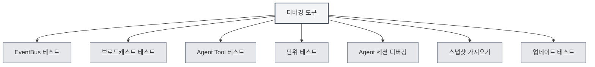

# 디버깅 도구

## 개요

디버깅 도구는 MetaDoc에서 제공하는 개발 환경 기능으로, 애플리케이션 기능을 테스트하고 디버깅하는 데 사용됩니다. 이 도구들은 개발 환경에서만 사용 가능하며, 개발자가 코드를 빠르게 테스트하고 디버그하는 데 도움을 줍니다.

<SettingDebugSection mode="demo" />

## 디버깅 도구 소개

<SettingDebugSection mode="demo" />

<ConsoleTerminal mode="demo" consoleKey="debug" :history='[]' />

### 디버깅 도구 접근

디버깅 도구는 개발 환경에서만 사용 가능합니다:

1. **개발 환경**: 개발 환경에서 실행 중인지 확인하세요.
2. **설정 페이지**: 설정 페이지를 엽니다.
3. **디버깅 도구**: 설정 페이지에서 "디버깅 도구" 옵션을 찾습니다.
4. **도구 열기**: 디버깅 도구 인터페이스를 열기 위해 클릭합니다.

상단 메뉴 바를 통해 디버깅 도구에 접근할 수 있습니다 (개발 환경에서만):

<MenuItemsDemo mode="demo" :items='[{"id": "settings"}]' />

### 도구 유형

디버깅 도구는 다음 기능 모듈을 포함합니다:

- **EventBus 테스트**: EventBus 이벤트 테스트
- **브로드캐스트 테스트**: 브로드캐스트 이벤트 테스트
- **Agent Tool 테스트**: Agent 도구 테스트
- **단위 테스트**: 단위 테스트 실행
- **Agent 세션 디버깅**: Agent 세션 디버깅
- **스냅샷 가져오기**: 문서 스냅샷 가져오기
- **업데이트 테스트**: 업데이트 기능 테스트

<SettingDebugSection mode="demo" />

## EventBus 테스트

### 이벤트 전송

EventBus 이벤트를 전송하여 테스트할 수 있습니다:

1. **이벤트 이름**: 전송할 이벤트 이름을 입력합니다.
2. **이벤트 데이터**: 선택 사항, JSON 형식의 이벤트 데이터를 입력합니다.
3. **이벤트 전송**: "이벤트 전송" 버튼을 클릭합니다.
4. **결과 확인**: 이벤트 전송 결과를 확인합니다.

<ConsoleTerminal mode="demo" consoleKey="debug" :history='[]' />

### 이벤트 수신 대기

EventBus 이벤트를 수신 대기할 수 있습니다:

- **이벤트 목록**: 전송된 모든 이벤트를 표시합니다.
- **이벤트 상세**: 이벤트의 상세 정보를 확인합니다.
- **이벤트 데이터**: 이벤트의 데이터 내용을 확인합니다.

## 브로드캐스트 테스트

### 브로드캐스트 전송

브로드캐스트 이벤트를 전송하여 테스트할 수 있습니다:

1. **대상 창**: 브로드캐스트 대상을 선택합니다 (all/home/ai-chat 등).
2. **이벤트 이름**: 브로드캐스트할 이벤트 이름을 입력합니다.
3. **이벤트 데이터**: 선택 사항, JSON 형식의 이벤트 데이터를 입력합니다.
4. **브로드캐스트 전송**: "브로드캐스트 전송" 버튼을 클릭합니다.
5. **결과 확인**: 브로드캐스트 전송 결과를 확인합니다.

<ConsoleTerminal mode="demo" consoleKey="debug" :history='[]' />

### 브로드캐스트 수신 대기

브로드캐스트 이벤트를 수신 대기할 수 있습니다:

- **브로드캐스트 목록**: 전송된 모든 브로드캐스트를 표시합니다.
- **브로드캐스트 상세**: 브로드캐스트의 상세 정보를 확인합니다.
- **대상 창**: 브로드캐스트의 대상 창을 확인합니다.

## Agent Tool 테스트

### 도구 테스트

Agent 도구를 테스트할 수 있습니다:

1. **도구 선택**: 테스트할 Agent 도구를 선택합니다.
2. **매개변수 입력**: 도구의 테스트 매개변수를 입력합니다 (JSON 형식).
3. **컨텍스트 선택**: 테스트할 컨텍스트 Tab ID를 선택합니다.
4. **테스트 실행**: "테스트 실행" 버튼을 클릭합니다.
5. **결과 확인**: 테스트 결과를 확인합니다.

### 테스트 기록

테스트 기록을 확인할 수 있습니다:

- **기록 목록**: 모든 테스트 기록을 표시합니다.
- **테스트 결과**: 각 테스트의 결과를 확인합니다.
- **오류 정보**: 테스트의 오류 정보를 확인합니다.

## 단위 테스트

### 단일 테스트

단일 단위 테스트를 실행할 수 있습니다:

1. **모듈 선택**: 테스트할 모듈을 선택합니다.
2. **테스트 선택**: 실행할 테스트 함수를 선택합니다.
3. **매개변수 편집**: 테스트 함수의 매개변수를 편집합니다.
4. **테스트 실행**: "테스트 실행" 버튼을 클릭합니다.
5. **결과 확인**: 테스트 결과를 확인합니다.

<ConsoleTerminal mode="demo" consoleKey="debug" :history='[]' />

### 일괄 테스트

단위 테스트를 일괄 실행할 수 있습니다:

1. **모듈 선택**: 하나 이상의 모듈을 선택합니다.
2. **컨텍스트 선택**: 테스트할 컨텍스트 Tab ID를 선택합니다.
3. **테스트 시작**: "일괄 테스트 시작" 버튼을 클릭합니다.
4. **진행 상황 확인**: 테스트 진행 상황을 확인합니다.
5. **결과 확인**: 모든 테스트 결과를 확인합니다.

### 테스트 결과

테스트 결과는 다음을 포함합니다:

- **테스트 상태**: 테스트 통과 여부를 표시합니다.
- **테스트 출력**: 테스트의 출력 정보를 표시합니다.
- **오류 정보**: 테스트의 오류 정보를 표시합니다 (있는 경우).
- **실행 시간**: 테스트의 실행 시간을 표시합니다.

## Agent 세션 디버깅

### 세션 디버깅

Agent 세션을 디버깅할 수 있습니다:

1. **세션 선택**: 디버깅할 Agent 세션을 선택합니다.
2. **메시지 확인**: 세션의 메시지 기록을 확인합니다.
3. **메시지 전송**: 테스트 메시지를 전송합니다.
4. **응답 확인**: Agent의 응답을 확인합니다.

<ConsoleTerminal mode="demo" consoleKey="debug" :history='[]' />

### 디버깅 정보

디버깅 정보를 확인할 수 있습니다:

- **세션 상태**: 세션의 현재 상태를 표시합니다.
- **도구 호출**: 도구 호출 기록을 확인합니다.
- **오류 정보**: 오류 정보를 확인합니다.

## 스냅샷 가져오기

### 스냅샷 가져오기

문서 스냅샷을 가져올 수 있습니다:

1. **스냅샷 선택**: 가져올 스냅샷 파일을 선택합니다.
2. **스냅샷 가져오기**: "스냅샷 가져오기" 버튼을 클릭합니다.
3. **결과 확인**: 가져오기 결과를 확인합니다.

<ConsoleTerminal mode="demo" consoleKey="debug" :history='[]' />

### 스냅샷 형식

스냅샷 파일 형식:

- **JSON 형식**: 스냅샷 파일은 JSON 형식입니다.
- **문서 내용**: 문서의 전체 내용을 포함합니다.
- **문서 상태**: 문서의 상태 정보를 포함합니다.

## 업데이트 테스트

### 업데이트 테스트

업데이트 기능을 테스트할 수 있습니다:

1. **업데이트 채널 선택**: 업데이트 채널을 선택합니다 (release/dev).
2. **업데이트 확인**: "업데이트 확인" 버튼을 클릭합니다.
3. **결과 확인**: 업데이트 확인 결과를 확인합니다.

<SettingDebugSection mode="demo" />

## 모범 사례

1. **개발 환경**: 디버깅 도구는 개발 환경에서만 사용하세요.
2. **테스트 격리**: 테스트 시 독립적인 테스트 데이터를 사용하세요.
3. **오류 처리**: 테스트 중 발생하는 오류를 주의해서 처리하세요.
4. **결과 기록**: 중요한 테스트 결과를 기록하세요.
5. **도구 사용**: 디버깅 도구를 적절히 사용하여 개발 효율성을 높이세요.

## 주의사항

1. **개발 환경**: 디버깅 도구는 개발 환경에서만 사용 가능합니다.
2. **데이터 보안**: 테스트 시 데이터 보안에 유의하고, 운영 데이터에 영향을 주지 않도록 하세요.
3. **성능 영향**: 일부 테스트는 애플리케이션 성능에 영향을 줄 수 있습니다.
4. **오류 처리**: 테스트 중 발생하는 오류는 적절히 처리해야 합니다.
5. **도구 제한**: 일부 도구는 사용 제한이 있을 수 있습니다.

## 관련 문서

- [[agent.session|Agent 세션 관리]]
- [[agent.tools|도구 집합 관리]]
- [[settings.basic|기본 설정]]