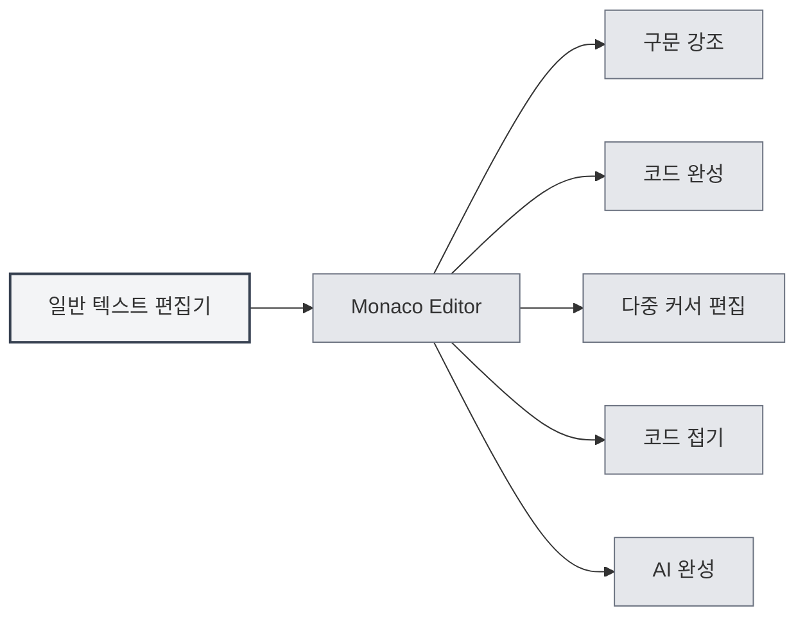
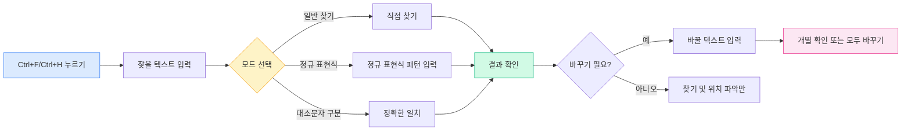

# 일반 텍스트 편집기

## 개요

일반 텍스트 편집기는 일반 텍스트 파일과 코드 파일을 편집하는 데 사용됩니다. MetaDoc의 일반 텍스트 편집기는 Monaco Editor를 기반으로 하여 전문적인 코드 편집 경험을 제공하며, 구문 강조, 코드 완성, AI 완성 등의 기능을 지원합니다.

일반 텍스트 편집기는 코드 파일(`.js`, `.py`, `.java` 등)과 설정 파일(`.json`, `.yaml`, `.ini` 등)을 포함한 다양한 파일 형식을 지원하며, 파일 확장자에 따라 언어를 자동으로 인식하고 해당하는 구문 강조를 적용합니다.

## Monaco 편집기 기능

<LaTeXEditorDemo mode="demo" />

<SearchReplaceMenu mode="demo" :position='{"top": 100, "left": 200}' :adapter='null' />

<MenuItemsDemo mode="demo" :items='[{"id": "file"}]' />

<ViewMenuItemsDemo mode="demo" :items='["editor", "outline"]' />

### 편집기 소개

일반 텍스트 편집기는 Monaco Editor를 사용하며, 다음과 같은 특징을 가집니다:

- **전문 코드 편집**: Visual Studio Code와 유사한 편집 경험 제공
- **구문 강조**: 파일 유형에 따라 자동으로 구문 강조 적용
- **코드 완성**: 지능형 코드 완성 지원
- **다중 커서 편집**: 다중 커서 동시 편집 지원
- **코드 접기**: 코드 블록 접기 지원

### 지원 파일 형식

일반 텍스트 편집기는 다음 파일 형식을 지원합니다:

**코드 파일**:

- JavaScript/TypeScript: `.js`, `.jsx`, `.ts`, `.tsx`
- Python: `.py`
- Java: `.java`
- C/C++: `.c`, `.cpp`, `.h`, `.hpp`
- C#: `.cs`
- Go: `.go`
- Rust: `.rs`
- Swift: `.swift`
- Kotlin: `.kt`
- 기타: `.php`, `.rb`, `.scala`, `.dart`, `.lua` 등

**설정 파일**:

- JSON: `.json`
- YAML: `.yaml`, `.yml`
- XML: `.xml`
- TOML: `.toml`
- INI: `.ini`, `.conf`
- SQL: `.sql`

**스크립트 파일**:

- Shell: `.sh`, `.bash`, `.zsh`
- PowerShell: `.ps1`
- 기타: `.vim`, `.diff`, `.patch`, `.log`

### 자동 언어 인식

편집기는 파일 확장자에 따라 언어를 자동으로 인식합니다:

- **파일 확장자**: 파일 확장자에 해당하는 언어 모드 선택
- **구문 강조**: 해당하는 구문 강조 규칙 자동 적용
- **코드 완성**: 해당 언어의 코드 완성 기능 활성화

파일에 확장자가 없거나 확장자가 인식되지 않으면, 편집기는 일반 텍스트 모드를 사용합니다.

## 코드 강조

### 구문 강조

편집기는 파일 유형에 따라 자동으로 구문 강조를 적용합니다:

- **키워드 강조**: 언어 키워드를 다른 색상으로 표시
- **문자열 강조**: 문자열을 특정 색상으로 표시
- **주석 강조**: 주석을 회색으로 표시
- **함수 강조**: 함수 이름을 특정 색상으로 표시

구문 강조는 코드 구조를 더 명확하게 하여 읽기와 편집을 용이하게 합니다.

### 테마 동기화

코드 강조 테마는 편집기 테마를 따릅니다:

- **밝은 테마**: 밝은 테마에서 밝은 구문 강조 사용
- **어두운 테마**: 어두운 테마에서 어두운 구문 강조 사용
- **자동 동기화**: 편집기 테마 설정 자동 동기화

## 줄 번호 표시

### 줄 번호 표시

줄 번호는 편집기 왼쪽에 표시되어 다음과 같은 데 도움을 줍니다:

- **코드 위치 파악**: 특정 줄로 빠르게 이동
- **코드 참조**: 문서에서 특정 코드 줄을 참조하기 용이
- **코드 디버깅**: 오류 위치 빠르게 파악

### 줄 번호 설정

줄 번호 표시는 설정에서 구성할 수 있습니다:

1. 설정 페이지 열기
2. "편집기 설정" 섹션에서 "줄 번호 표시" 찾기
3. 토글 스위치로 줄 번호 활성화 또는 비활성화

줄 번호 설정은 모든 Monaco 편집기(일반 텍스트 편집기, LaTeX 편집기 등)에 영향을 미칩니다.

<MenuItemsDemo mode="demo" :items='[{"id": "file", "items": ["new", "open", "save"]}]' />

<ViewMenuItemsDemo mode="demo" :items='["editor", "outline"]' />

<MainTabs mode="demo" />

<AISuggestionGhost mode="demo" />

<LaTeXEditorDemo mode="demo" />

## 파일 미리보기 및 통계 정보

### 파일 통계

편집기는 파일의 통계 정보를 표시합니다:

- **문자 수**: 파일의 총 문자 수 표시
- **줄 수**: 파일의 총 줄 수 표시
- **단어 수**: 파일의 총 단어 수 표시(해당하는 경우)

통계 정보는 상태 표시줄이나 편집기 하단에 표시됩니다.

### 파일 미리보기

파일을 열 때, 편집기는 다음을 수행합니다:

- **내용 로드**: 파일 내용 빠르게 로드
- **강조 적용**: 파일 유형에 따라 구문 강조 적용
- **통계 표시**: 파일의 통계 정보 표시

### 파일 형식 감지

편집기는 파일 형식을 자동으로 감지합니다:

- **확장자 감지**: 파일 확장자에 따라 형식 인식
- **내용 감지**: 확장자가 명확하지 않으면 내용에 따라 인식 시도
- **수동 선택**: 파일 형식을 수동으로 선택 가능

## AI 완성 기능

### AI 자동 완성

일반 텍스트 편집기는 AI 자동 완성 기능을 지원합니다:

- **자동 트리거**: 입력 중지 후 자동으로 완성 트리거
- **수동 트리거**: `Shift+Tab`을 사용하여 수동으로 완성 트리거
- **지능형 완성**: 컨텍스트에 따라 완성 제안 생성

AI 완성 기능은 다음과 같은 데 도움을 줍니다:

- **코드 생성**: 주석이나 컨텍스트에 따라 코드 생성
- **함수 완성**: 함수 정의나 호출 완성
- **주석 생성**: 코드 주석 생성

### 완성 설정

AI 완성 설정은 Markdown 편집기와 동일합니다:

- **활성화/비활성화**: 설정에서 활성화 또는 비활성화 가능
- **트리거 키**: 트리거 키(Enter, Space, `;`, `,`) 구성 가능
- **완성 모드**: 완전 생성 또는 부분 생성 선택 가능
- **최대 토큰 수**: 완성의 최대 토큰 수 설정 가능

자세한 내용은 [[ai.completion|AI 자동 완성]]을 참조하세요.

## 편집기 기능

### 코드 접기

편집기는 코드 블록 접기를 지원합니다:

- **코드 블록 접기**: 줄 번호 왼쪽의 접기 아이콘 클릭
- **코드 블록 펼치기**: 접기 표시를 클릭하여 펼치기
- **단축키**: `Ctrl+Shift+[` 접기, `Ctrl+Shift+]` 펼치기

코드 접기를 통해 현재 편집 중인 부분에 집중할 수 있습니다.

### 찾기 및 바꾸기

편집기는 강력한 찾기 및 바꾸기 기능을 지원하여 코드에서 내용을 빠르게 찾고 수정하는 데 도움을 줍니다:

**기본 작업**:

- **찾기**: `Ctrl+F`로 찾기 대화상자 열기, 찾을 텍스트 입력
- **바꾸기**: `Ctrl+H`로 찾기 및 바꾸기 대화상자 열기, 찾을 내용과 바꿀 내용 입력
- **개별 바꾸기**: 개별 확인 후 바꾸기
- **모두 바꾸기**: 일괄적으로 모든 일치 항목 바꾸기

**고급 옵션**:

- **정규 표현식**: 정규 표현식을 사용한 복잡한 패턴 매칭
- **대소문자 구분**: 대소문자를 구분하여 찾기
- **전체 단어 일치**: 완전한 단어만 일치

**사용 시나리오**:

- 변수명 일괄 수정
- 특정 함수 호출 찾기
- 코드 내 문자열 바꾸기
- 정규 표현식을 사용한 복잡한 바꾸기

찾기 및 바꾸기 패널 인터페이스는 다음과 같습니다:

<SearchReplaceMenu mode="demo" :position='{"top": 100, "left": 200}' :adapter='null' />

### 다중 커서 편집

편집기는 다중 커서 동시 편집을 지원합니다:

- **커서 추가**: `Alt+클릭`으로 클릭 위치에 새 커서 추가
- **위쪽 커서 추가**: `Ctrl+Alt+↑`로 위쪽에 커서 추가
- **아래쪽 커서 추가**: `Ctrl+Alt+↓`로 아래쪽에 커서 추가
- **동일 단어 선택**: `Ctrl+D`로 다음 동일 단어 선택

다중 커서 편집을 통해 여러 위치를 동시에 수정하여 편집 효율성을 높일 수 있습니다.

## 사용 팁

<LaTeXEditorDemo mode="demo" />

<ConsoleTerminal mode="demo" consoleKey="plaintext" :history='[]' />

### 효율적인 편집

1. **단축키 사용**: 자주 사용하는 단축키를 숙달하여 편집 효율성 향상
2. **코드 접기 사용**: 확인할 필요가 없는 코드 블록 접기
3. **다중 커서 사용**: 다중 커서로 여러 위치 동시 편집

### 코드 완성

1. **AI 완성 활성화**: AI 완성 기능을 활성화하여 지능형 완성 제안 획득
2. **수동 트리거 사용**: 필요 시 `Shift+Tab`으로 수동 완성 트리거
3. **설정 조정**: 요구 사항에 따라 완성 설정 조정

### 파일 관리

1. **형식 인식**: 자동 형식 인식을 위해 파일 확장자가 올바른지 확인
2. **통계 확인**: 파일 통계 정보 확인으로 파일 크기 파악
3. **파일 저장**: 변경 사항 손실 방지를 위해 파일을 수시로 저장

## 자주 묻는 질문

### Q: 구문 강조가 올바르지 않나요?

A: 파일 확장자가 올바른지 확인하세요. 확장자가 올바르지 않으면 편집기가 파일 유형을 인식하지 못할 수 있습니다. 파일 형식을 수동으로 선택할 수 있습니다.

### Q: 코드 완성이 표시되지 않나요?

A: AI 완성 기능이 활성화되어 있는지 확인하세요. 일부 파일 유형은 코드 완성을 지원하지 않을 수 있습니다.

### Q: 파일 형식을 어떻게 전환하나요?

A: 파일 형식은 파일 확장자에 따라 자동으로 인식됩니다. 변경이 필요하면 파일 이름을 바꾸거나 형식을 수동으로 선택하세요.

### Q: 줄 번호가 표시되지 않나요?

A: 설정의 "줄 번호 표시" 옵션이 활성화되어 있는지 확인하세요. 줄 번호 설정은 모든 Monaco 편집기에 영향을 미칩니다.

### Q: 파일이 너무 커서 편집할 수 없나요?

A: 매우 큰 파일의 경우 편집기가 일부 기능을 제한할 수 있습니다. 초대형 파일 처리는 전용 텍스트 편집기 사용을 권장합니다.

## 관련 문서

- [[core.editor-basics|편집기 기본 조작]]
- [[core.editor-settings|편집기 설정]]
- [[latex.editor|LaTeX 편집기 사용 가이드]]
- [[ai.completion|AI 자동 완성]]