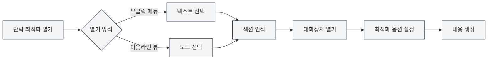

# 단락 최적화 기능

## 개요

단락 최적화 기능을 사용하면 문서의 특정 단락이나 섹션을 AI로 최적화할 수 있습니다. 우클릭 메뉴나 아웃라인 뷰에서 단락 최적화 기능을 열어 단락 내용을 생성하거나 최적화할 수 있습니다.

## 단락 최적화 열기

### 우클릭 메뉴에서 열기

편집기에서 우클릭으로 단락 최적화를 열 수 있습니다:

1. **텍스트 선택**: 편집기에서 최적화할 텍스트를 선택합니다
2. **우클릭 메뉴**: 선택한 텍스트를 우클릭합니다
3. **최적화 선택**: 우클릭 메뉴에서 "단락 최적화" 또는 유사한 옵션을 선택합니다
4. **대화상자 열기**: 단락 최적화 대화상자가 열립니다

### 아웃라인에서 열기

아웃라인 뷰에서 단락 최적화를 열 수 있습니다:

1. **노드 선택**: 아웃라인 트리에서 최적화할 노드를 선택합니다
2. **우클릭 메뉴**: 노드를 우클릭합니다
3. **최적화 선택**: 우클릭 메뉴에서 "단락 최적화" 또는 유사한 옵션을 선택합니다
4. **대화상자 열기**: 단락 최적화 대화상자가 열립니다

사이드바를 통해 아웃라인 뷰에 접근할 수 있습니다:

<ViewMenuItemsDemo mode="demo" :items='["outline"]' />

<ViewMenuItemsDemo mode="demo" :items='["chat"]' />

<AIChat mode="demo" />

단락 최적화기 인터페이스는 다음과 같습니다:

<SectionOptimizer mode="demo" title="예시 섹션" path="1" :tree='{"text": "예시 섹션", "children": []}' language="markdown" :adapter='null' />

### 자동 섹션 인식

단락 최적화는 현재 섹션을 자동으로 인식합니다:

- **커서 위치**: 커서 위치에 따라 현재 섹션을 인식합니다
- **선택 텍스트**: 텍스트가 선택된 경우, 선택된 텍스트를 사용합니다
- **아웃라인 노드**: 아웃라인에서 열 경우, 해당 아웃라인 노드를 사용합니다

## 최적화 옵션

### 최적화 모드

다양한 최적화 모드를 선택할 수 있습니다:

- **내용 생성**: 새로운 단락 내용을 생성합니다
- **내용 최적화**: 기존 단락 내용을 최적화합니다
- **내용 추가**: 기존 내용 뒤에 새로운 내용을 추가합니다
- **내용 교체**: 기존 단락 내용을 교체합니다

### 컨텍스트 모드

컨텍스트 모드를 선택할 수 있습니다:

- **전체 문서 컨텍스트**: 전체 문서를 컨텍스트로 사용합니다
- **섹션 컨텍스트**: 현재 섹션만 컨텍스트로 사용합니다
- **컨텍스트 없음**: 컨텍스트 정보를 사용하지 않습니다

### 사용자 정의 프롬프트

사용자 정의 프롬프트를 입력할 수 있습니다:

- **최적화 목표**: 최적화 목표를 설명합니다
- **내용 요구사항**: 내용 요구사항을 설명합니다
- **스타일 요구사항**: 작성 스타일을 지정합니다

### 사전 설정 프롬프트

사전 설정 프롬프트를 사용할 수 있습니다:

- **내용 확장**: 단락 내용을 확장합니다
- **내용 간소화**: 단락 내용을 간소화합니다
- **내용 재작성**: 단락 내용을 재작성합니다
- **내용 보완**: 단락 내용을 보완합니다

## 내용 생성

### 생성 과정

내용 생성 과정:

1. **섹션 분석**: 현재 섹션의 구조와 내용을 분석합니다
2. **프롬프트 구성**: 옵션에 따라 최적화 프롬프트를 구성합니다
3. **AI 호출**: AI를 호출하여 최적화된 내용을 생성합니다
4. **결과 표시**: 대화상자에 생성된 내용을 표시합니다

### 생성 결과

생성된 내용은 대화상자에 표시됩니다:

- **내용 미리보기**: 생성된 내용을 미리 볼 수 있습니다
- **내용 편집**: 생성된 내용을 편집할 수 있습니다
- **내용 적용**: 내용을 문서에 적용할 수 있습니다

### 생성 옵션

생성 시 옵션을 설정할 수 있습니다:

- **스트리밍 출력**: 생성 과정을 실시간으로 표시합니다
- **일괄 생성**: 생성 완료 후에 표시합니다
- **생성 취소**: 언제든지 생성 과정을 취소할 수 있습니다

## 내용 적용

### 적용 방식

생성된 내용을 문서에 적용할 수 있습니다:

- **교체**: 기존 단락 내용을 교체합니다
- **삽입**: 지정된 위치에 내용을 삽입합니다
- **추가**: 단락 끝에 내용을 추가합니다

### 적용 위치

적용 위치를 지정할 수 있습니다:

- **현재 위치**: 현재 커서 위치에 적용합니다
- **섹션 시작 위치**: 섹션 시작 위치에 적용합니다
- **섹션 끝 위치**: 섹션 끝 위치에 적용합니다

## 대화 기능

### 대화 계속하기

내용 생성 후 대화를 계속할 수 있습니다:

1. **대화 열기**: "대화 계속하기" 버튼을 클릭합니다
2. **대화 진입**: AI 대화 인터페이스로 들어갑니다
3. **최적화 계속**: 내용을 계속 최적화하거나 수정할 수 있습니다

### 대화 컨텍스트

대화에는 다음 컨텍스트가 포함됩니다:

- **원본 내용**: 원래 단락 내용
- **생성 내용**: 생성된 내용
- **최적화 기록**: 최적화 기록

## 모범 사례

1. **목표 명확화**: 최적화 목표를 명확히 하고, 명확한 프롬프트를 사용합니다
2. **컨텍스트 선택**: 상황에 맞는 적절한 컨텍스트 모드를 선택합니다
3. **내용 미리보기**: 생성 후 내용을 미리 보고 요구사항에 맞는지 확인합니다
4. **편집 조정**: 생성 후 추가로 편집하고 조정할 수 있습니다
5. **다중 최적화**: 여러 번 최적화하여 내용을 점진적으로 완성합니다

## 주의사항

1. **섹션 인식**: 섹션을 올바르게 인식하여 잘못된 내용을 최적화하지 않도록 합니다
2. **컨텍스트 사용**: 컨텍스트를 적절히 사용하여 내용이 너무 길어지지 않도록 합니다
3. **내용 품질**: 생성된 내용은 수동 검토와 조정이 필요합니다
4. **토큰 소비**: 최적화 기능은 토큰을 소비하므로 사용량에 주의합니다
5. **문서 저장**: 내용 적용 후 문서를 저장하는 것을 잊지 마세요

## 관련 문서

- [[outline.basics|아웃라인 뷰 기능]]
- [[ai.chat|AI 대화 기능]]
- [[ai.completion|AI 자동 완성]]

<Outline mode="demo" />

<CompletionSettingsPanel mode="demo" />

<MenuItemsDemo mode="demo" :items='[{"id": "ai"}]' />

<ViewMenuItemsDemo mode="demo" :items='["chat"]' />
