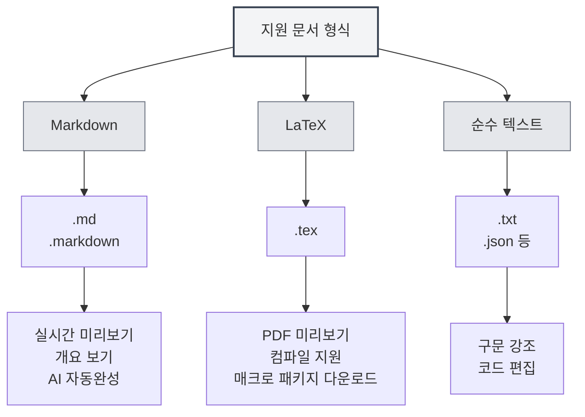

# 지원 문서 형식

## 개요

MetaDoc는 Markdown, LaTeX 및 일반 텍스트 형식을 포함한 다양한 문서 형식을 지원합니다. 시스템은 파일 형식을 자동으로 감지하며, 수동으로 형식을 선택하는 것도 가능합니다.

<MenuItemsDemo mode="demo" :items='[{"id": "file"}]' />

<MenuItemsDemo mode="demo" :items='[{"id": "edit"}]' />

<MenuItemsDemo mode="demo" :items='[{"id": "view"}]' />

<ViewMenuItemsDemo mode="demo" :items='["home", "outline", "chat"]' />

<MainTabs mode="demo" />

<QuickStartPanel mode="demo" />

<QuickStartMarkdown mode="demo" />

<QuickStartLatex mode="demo" />

## 지원 형식

### Markdown 형식

**파일 확장자**: `.md`, `.markdown`

**특징**:

- 표준 Markdown 문법 지원
- 확장 문법(표, 코드 블록, 수학 공식 등) 지원
- 실시간 미리보기 지원
- 개요 보기 지원
- AI 자동완성 지원

**사용 시나리오**:

- 기술 문서 작성
- 블로그 글 작성
- 노트 기록
- 문서 작성

### LaTeX 형식

**파일 확장자**: `.tex`

**특징**:

- 전문적인 학술 논문 작성 형식
- 수학 공식, 표, 차트 지원
- 실시간 PDF 미리보기
- 매크로 패키지 자동 다운로드 지원
- 컴파일 오류 메시지 지원

**사용 시나리오**:

- 학술 논문 작성
- 기술 보고서 작성
- 책 편집
- 복잡한 문서 편집

### 일반 텍스트 형식

**파일 확장자**: `.txt`, `.json` 등

**특징**:

- 간단한 텍스트 편집
- 구문 강조 지원
- 코드 편집 기능
- 미리보기 및 개요 미지원

**사용 시나리오**:

- 코드 파일 편집
- 설정 파일 편집
- 간단한 텍스트 편집
- 데이터 파일 편집

## 파일 형식 감지

### 자동 감지

MetaDoc는 파일 형식을 자동으로 감지합니다:

1. **확장자 감지**: 우선 파일 확장자에 따라 형식 감지

   - `.md`, `.markdown` → Markdown 형식
   - `.tex` → LaTeX 형식
   - `.txt`, `.json` 등 → 일반 텍스트 형식

2. **내용 감지**: 확장자로 형식을 확인할 수 없는 경우, 파일 내용을 감지

   - LaTeX 내용은 우선 LaTeX 형식으로 인식
   - 기타 내용은 기본적으로 Markdown 형식으로 인식

3. **기본 형식**: 감지할 수 없는 경우, 기본적으로 Markdown 형식 사용

### 감지 우선순위

형식 감지는 다음 우선순위를 따릅니다:

1. **파일 확장자**: 우선 확장자를 사용하여 감지
2. **파일 내용**: 확장자로 확인이 불가능한 경우, 내용 감지
3. **기본 형식**: 감지할 수 없을 때 기본 형식 사용

### 감지 규칙

- **Markdown 감지**: 확장자가 `.md` 또는 `.markdown`일 때 Markdown으로 인식
- **LaTeX 감지**: 확장자가 `.tex`이거나 내용에 LaTeX 명령어가 포함된 경우 LaTeX으로 인식
- **일반 텍스트 감지**: 기타 확장자이거나 확인할 수 없는 경우 일반 텍스트로 인식

## 수동 형식 선택

### 파일 열 때 선택

파일을 열 때 수동으로 형식을 선택할 수 있습니다:

1. **파일 열기 대화상자**: 파일 열기 대화상자에서
2. **형식 선택**: 파일 형식 선택(자동 감지가 올바르지 않은 경우)
3. **열기 확인**: 확인 후 선택한 형식으로 파일 열기

### 새 파일 생성 시 선택

새 파일을 생성할 때 형식을 선택할 수 있습니다:

1. **새 문서**: "새 문서" 버튼 클릭
2. **형식 선택**: 형식 선택 대화상자에서 형식 선택
3. **문서 생성**: 지정된 형식의 문서 생성

### 형식 전환

열려 있는 문서의 형식을 전환할 수 있습니다:

1. **문서 열기**: 형식을 전환할 문서 열기
2. **형식 메뉴**: 메뉴에서 형식 전환 옵션 찾기
3. **형식 선택**: 새로운 형식 선택
4. **전환 확인**: 형식 전환 확인

**주의사항**:

- 형식 전환은 문서 내용에 영향을 줄 수 있음
- 일부 형식의 기능은 변환되지 않을 수 있음
- 전환하기 전에 문서를 백업하는 것이 좋음

## 형식 특성 비교

### 기능 지원

| 기능       | Markdown | LaTeX    | 일반 텍스트 |
| ---------- | -------- | -------- | ----------- |
| 실시간 미리보기   | ✅       | ✅ (PDF) | ❌          |
| 개요 보기   | ✅       | ✅       | ❌          |
| AI 자동완성     | ✅       | ✅       | ✅          |
| 수학 공식   | ✅       | ✅       | ❌          |
| 표 지원   | ✅       | ✅       | ❌          |
| 코드 강조   | ✅       | ✅       | ✅          |
| 메타정보 지원 | ✅       | ✅       | ❌          |

### 편집기 특성

| 특성       | Markdown | LaTeX | 일반 텍스트 |
| ---------- | -------- | ----- | ----------- |
| 구문 강조   | ✅       | ✅    | ✅          |
| 자동완성   | ✅       | ✅    | ✅          |
| 오류 메시지   | ✅       | ✅    | ❌          |
| 접기 기능   | ✅       | ✅    | ✅          |
| 멀티 커서 편집 | ✅       | ✅    | ✅          |

## 형식 변환

### 내보내기 형식

문서를 다른 형식으로 내보낼 수 있습니다:

- **Markdown → PDF**: PDF 문서로 내보내기
- **Markdown → HTML**: HTML 문서로 내보내기
- **Markdown → DOCX**: Word 문서로 내보내기
- **LaTeX → PDF**: PDF 문서로 컴파일
- **LaTeX → Markdown**: Markdown 형식으로 변환

### 변환 시 주의사항

형식 변환 시 주의해야 할 점:

- **내용 호환성**: 일부 형식의 기능은 변환되지 않을 수 있음
- **스타일 손실**: 변환 후 일부 스타일이 손실될 수 있음
- **내용 조정**: 변환 후 내용을 수동으로 조정해야 할 수 있음

## 모범 사례

1. **적절한 형식 선택**: 문서 유형에 맞는 적절한 형식 선택
2. **표준 확장자 사용**: 자동 감지에 편리하도록 표준 파일 확장자 사용
3. **형식 일관성**: 동일 프로젝트 내에서는 통일된 형식 사용
4. **문서 백업**: 형식 변환 전 원본 문서 백업
5. **변환 테스트**: 변환 후 내용이 올바른지 확인

## 주의사항

1. **형식 감지**: 자동 감지가 정확하지 않을 수 있으므로 수동 선택 가능
2. **형식 전환**: 형식 전환은 문서 내용에 영향을 줄 수 있음
3. **호환성**: 다른 형식의 기능 지원은 다름
4. **파일 확장자**: 표준 확장자 사용 권장
5. **형식 변환**: 변환 시 일부 내용이나 스타일이 손실될 수 있음

## 관련 문서

- [[markdown.basics|Markdown 문법]]
- [[latex.basics|LaTeX 문법]]
- [[editor.plain-text|일반 텍스트 편집기]]
- [[core.file-operations|파일 작업]]