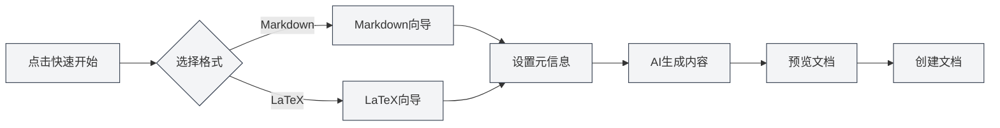

# 홈페이지 기능

## 개요

홈페이지는 MetaDoc의 진입 화면으로, 빠른 시작, 새 문서 만들기, 파일 열기 등의 기능을 제공합니다. 홈페이지는 간결하고 아름다운 디자인으로, MetaDoc 사용을 빠르게 시작할 수 있도록 도와줍니다.

## 빠른 시작

### 빠른 시작 마법사

"빠른 시작" 버튼을 클릭하면 빠른 시작 마법사를 실행할 수 있습니다:

1. **형식 선택**: 문서 형식 선택(Markdown 또는 LaTeX)
2. **메타정보 설정**: 문서 제목, 저자 등의 정보 입력
3. **AI 콘텐츠 생성**: AI를 활용하여 문서 내용 생성
4. **문서 미리보기**: 생성된 문서 내용 미리보기
5. **문서 생성**: 확인 후 문서 생성

빠른 시작 마법사의 형식 선택 화면은 다음과 같습니다:

<QuickStartPanel mode="demo" />

### Markdown 빠른 시작

Markdown 형식을 선택한 후:

- **템플릿 선택**: Markdown 템플릿을 선택할 수 있습니다
- **콘텐츠 생성**: AI가 Markdown 내용을 생성할 수 있습니다
- **빠른 편집**: 생성 후 즉시 편집을 시작할 수 있습니다

Markdown 선택 후 진입하는 마법사 화면:

<QuickStartMarkdown mode="demo" />

### LaTeX 빠른 시작

LaTeX 형식을 선택한 후:

- **문서 유형**: 문서 유형(article, book 등)을 선택할 수 있습니다
- **콘텐츠 생성**: AI가 LaTeX 내용을 생성할 수 있습니다
- **컴파일 미리보기**: 생성 후 PDF 컴파일 미리보기가 가능합니다

LaTeX 선택 후 진입하는 마법사 화면:

<QuickStartLatex mode="demo" />

## 새 문서 만들기

### 빈 문서 생성

"새 문서 만들기" 버튼을 클릭하여 빈 문서를 빠르게 생성할 수 있습니다:

1. "새 문서 만들기" 버튼 클릭
2. 문서 형식 선택(Markdown/LaTeX/일반 텍스트)
3. 문서가 새 탭에서 열립니다

**단축키**: `Ctrl+N`(Windows/Linux) 또는 `Cmd+N`(macOS)를 사용하여 빠르게 생성할 수도 있습니다.

## 파일 열기

### 기존 파일 열기

"파일 열기" 버튼을 클릭하여 기존 파일을 열 수 있습니다:

1. "파일 열기" 버튼 클릭
2. 파일 선택 대화상자에서 파일 선택
3. 파일이 새 탭에서 열립니다

**단축키**: `Ctrl+O`(Windows/Linux) 또는 `Cmd+O`(macOS)를 사용하여 빠르게 열 수도 있습니다.

### 지원되는 파일 형식

- **Markdown** (.md)
- **LaTeX** (.tex)
- **일반 텍스트** (.txt)
- **JSON** (.json)

## 사용자 설명서

### 사용자 설명서 열기

"사용자 설명서" 버튼을 클릭하여 사용자 설명서를 열 수 있습니다:

1. "사용자 설명서" 버튼 클릭
2. 사용자 설명서가 새 탭에서 열립니다
3. 다양한 기능을 탐색하고 학습할 수 있습니다

**단축키**: `F1` 키를 눌러 빠르게 사용자 설명서를 열 수도 있습니다.

## 최근 문서 목록

### 최근 문서 보기

홈페이지에는 최근에 연 문서 목록이 표시됩니다:

- **표시 개수**: 최대 12개의 최근 문서 표시
- **문서 카드**: 각 문서가 카드 형태로 표시됨
- **빠른 열기**: 카드를 클릭하여 문서를 빠르게 열 수 있음

### 최근 문서 작업

- **문서 열기**: 문서 카드를 클릭하여 문서 열기
- **기록 삭제**: 카드의 삭제 버튼을 클릭하여 기록 삭제
- **오른쪽 클릭 메뉴**: 카드를 오른쪽 클릭하면 더 많은 옵션이 있을 수 있음

### 최근 문서 관리

- **자동 업데이트**: 문서를 연 후 목록이 자동으로 업데이트됨
- **기록 저장**: 최근 문서 기록이 저장됨
- **목록 정렬**: 연 시간 기준 역순으로 정렬됨

## 사용자 프로필 대화상자

### 사용자 프로필 열기

홈페이지에 사용자 프로필 대화상자가 표시될 수 있습니다:

- **첫 사용 시**: 첫 사용 시 사용자 프로필 설정을 요청할 수 있음
- **프로필 설정**: 사용자 프로필 및 사용 선호도 설정 가능
- **AI 최적화**: 사용자 프로필은 AI가 사용자의 요구를 더 잘 이해하도록 도움

### 사용자 프로필 내용

사용자 프로필에는 다음이 포함될 수 있습니다:

- **기본 정보**: 이름, 직업 등
- **사용 선호도**: 편집 습관, 자주 사용하는 기능 등
- **사용자 프로필**: AI가 사용자의 사용 시나리오를 이해하도록 도움

## 홈페이지 인터페이스

### 인터페이스 레이아웃

홈페이지는 중앙 정렬 레이아웃을 사용합니다:

- **상단**: MetaDoc 제목 및 부제목
- **중앙**: 작업 버튼 영역
- **하단**: 최근 문서 목록

### 시각적 디자인

홈페이지는 간결하고 현대적인 디자인을 채택합니다:

- **동적 배경**: 동적 배경 애니메이션 효과
- **그리드 장식**: 미니멀한 그리드 장식
- **카드 디자인**: 작업 버튼은 카드 디자인을 사용

## 모범 사례

1. **빠른 시작**: 처음 사용 시 빠른 시작 마법사 사용 권장
2. **단축키**: 단축키를 능숙하게 사용하여 효율성 향상
3. **최근 문서**: 최근 문서 목록을 활용하여 자주 사용하는 문서에 빠르게 접근
4. **사용자 프로필**: 더 나은 AI 경험을 위해 사용자 프로필 설정
5. **사용자 설명서**: 문제 발생 시 사용자 설명서 참조

## 주의사항

1. **홈페이지 표시**: 홈페이지는 열린 문서가 없을 때만 표시됨
2. **빠른 시작**: 빠른 시작 마법사는 언제든지 닫을 수 있음
3. **최근 문서**: 최근 문서 목록은 최대 12개까지 표시됨
4. **사용자 프로필**: 사용자 프로필 설정은 선택 사항임
5. **인터페이스 언어**: 홈페이지 인터페이스 언어는 시스템 언어 설정을 따름

## 관련 문서

- [[quick-start.guide|빠른 시작 가이드]]
- [[core.file-operations|파일 작업]]
- [[user.profile|사용자 프로필]]
- [[views.types|뷰 유형]]

<MenuItemsDemo mode="demo" :items='[{"id": "file"}]' />

<MenuItemsDemo mode="demo" :items='[{"id": "edit"}]' />

<MenuItemsDemo mode="demo" :items='[{"id": "view"}]' />

<ViewMenuItemsDemo mode="demo" :items='["home", "outline", "chat", "agent"]' />

<MainTabs mode="demo" />

<UserProfileView mode="demo" />