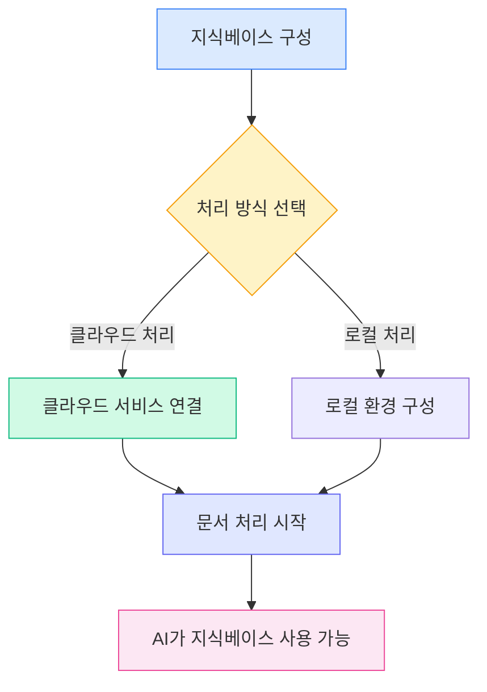
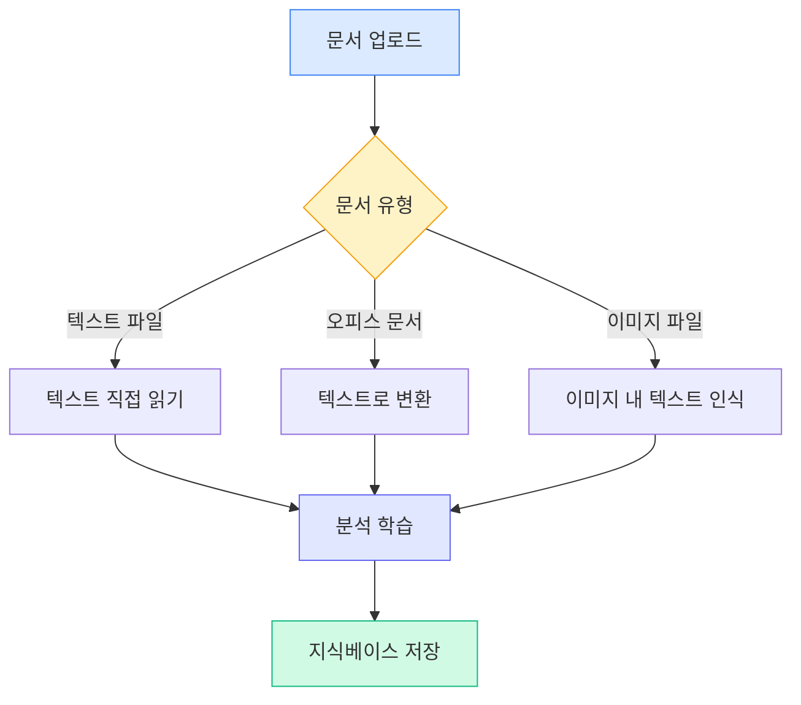
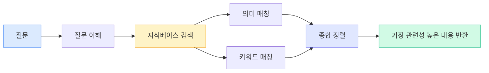

# 지식베이스 구성

## 개요

지식베이스는 MetaDoc의 지능형 문서 관리 시스템입니다. 귀하의 문서를 지식베이스에 "학습"시킴으로써 AI는 해당 내용을 이해하고 참조하여 더 정확한 답변과 제안을 제공할 수 있습니다.

본 가이드는 지식베이스를 구성하여 더 나은 서비스를 제공받을 수 있도록 도와줍니다.

## 지식베이스 기능 활성화

지식베이스 설정 페이지에서 먼저 지식베이스 기능을 활성화해야 합니다:

1. "지식베이스 활성화" 스위치를 찾습니다.
2. 스위치를 "활성화" 상태로 전환합니다.
3. 지식베이스 관련 매개변수를 구성합니다.

상단 메뉴 바를 통해 지식베이스 관리에 접근할 수 있습니다:

<KnowledgeBase mode="demo" />

위 그림은 지식베이스 관리 인터페이스의 주요 기능 영역을 보여줍니다:

- **왼쪽 패널**: 지식베이스 목록 및 검색 기능
- **중앙 영역**: 추가된 문서 목록
- **오른쪽 상세 정보**: 선택된 문서의 상세 정보 및 처리 상태
- **하단 도구 모음**: 문서 추가, 처리 시작, 삭제 등의 작업 버튼

## 처리 방식 선택

### 두 가지 방식 소개

MetaDoc은 문서를 처리하는 두 가지 방식을 제공합니다:

**클라우드 처리 (권장)**

- 문서를 클라우드 서비스로 전송하여 분석
- 처리 속도가 빠르며 로컬 리소스를 사용하지 않음
- 네트워크 연결 필요

**로컬 처리 (개발 중)**

- 사용자의 컴퓨터에서 직접 문서 처리
- 데이터 완전 로컬, 개인정보 보호
- 높은 사양의 컴퓨터 구성 필요

현재 버전은 클라우드 처리 방식만 지원합니다. 설정에서 선택할 수 있습니다:

<MenuItemsDemo mode="demo" :items='[{"id": "settings"}]' />

### 클라우드 처리의 장점

대부분의 사용자에게 클라우드 처리를 권장합니다:

- **빠른 시작**: 복잡한 로컬 환경 구성 불필요
- **시간 절약**: 대량 문서 처리 시 속도가 더 빠름
- **리소스 절약**: 컴퓨터 메모리 및 프로세서 점유 안 함
- **유지 관리 간편**: 자동 업데이트, 수동 관리 불필요

### 로컬 처리가 필요한 경우

다음과 같은 요구사항이 있는 경우 로컬 처리 기능 출시를 기다릴 수 있습니다:

- 매우 민감한 기밀 문서 처리
- 네트워크가 없는 환경에서 자주 작업
- 고성능 컴퓨터 구성 보유 (독립 그래픽 카드 포함)
- 대량 문서 처리 필요 (10GB 이상)

<SettingKnowledgeBaseSection mode="demo" />

## 지식베이스 작동 원리 이해

### 문서가 어떻게 "학습"되는가

<RAGToolDisplay mode="demo" />

문서를 지식베이스에 추가할 때 MetaDoc은 다음 단계를 실행합니다:

1. **문서 내용 읽기**

   - PDF, Word, 이미지 등 형식에서 텍스트 추출
   - 문서의 구조와 형식 정보 유지

2. **문서 의미 이해**

   - 텍스트를 AI가 이해할 수 있는 "의미 표현"으로 변환
   - 문서에 지능형 태그를 부여하는 것과 유사

3. **인덱스 구축**

   - 빠른 검색을 위한 인덱스 생성
   - AI가 순간적으로 관련 내용을 찾을 수 있도록 함

4. **지식 저장**
   - 처리 결과를 로컬 데이터베이스에 저장
   - 언제든지 호출 가능

<KnowledgeBase mode="demo" />

## 지원 문서 형식

### 직접 처리 가능한 형식

MetaDoc 지식베이스는 다양한 일반 문서 형식을 지원합니다:

**텍스트류**

- Markdown 문서 (.md) — 기술 문서의 선호 형식
- LaTeX 문서 (.tex) — 학술 논문에 자주 사용되는 형식
- 일반 텍스트 파일 (.txt) — 간단한 텍스트 기록

**오피스 문서**

- PDF 파일 (.pdf) — 가장 일반적인 문서 형식
- Word 문서 (.docx) — Microsoft Office 형식

**이미지류**

- PNG 이미지 (.png) — 스크린샷, 차트
- JPEG 이미지 (.jpg, .jpeg) — 사진, 스캔본

### 다른 문서의 처리 방식

다른 유형의 문서는 MetaDoc이 다른 방식으로 처리합니다:

**텍스트 문서** (Markdown, LaTeX, TXT)

- 텍스트 내용 직접 읽기
- 제목 구조와 형식 유지
- 처리 속도가 가장 빠름

**오피스 문서** (PDF, Word)

- 먼저 일반 텍스트로 변환
- 제목, 단락 등의 구조 추출
- 문서의 논리적 계층 유지

**이미지 문서** (PNG, JPG)

- OCR 기술을 사용하여 이미지 내 텍스트 인식
- 스캔된 종이 문서 처리에 적합
- 처리 시간이 상대적으로 김

<RAGToolDisplay mode="demo" />

## 지능형 검색 메커니즘

### 지식베이스가 관련 내용을 찾는 방법

AI가 지식베이스를 사용해야 할 때 MetaDoc은 지능형 검색 전략을 채택합니다:

**의미 매칭**

- 키워드뿐만 아니라 질문의 의미도 이해
- 예: "설치 방법"을 검색하면 "설치 단계", "배포 가이드" 등 관련 내용도 찾을 수 있음

**혼합 검색**

- 의미 이해와 키워드 매칭 결합
- 정확성 보장과 재현율 향상 모두 달성
- 자동 정렬, 가장 관련성 높은 내용 우선 표시

**빠른 응답**

- 효율적인 인덱싱 알고리즘 사용
- 밀리초 단위 응답, 대화 흐름에 영향 없음

<KnowledgeBase mode="demo" />

## 청크 처리 설명

### 청크가 필요한 이유

더 효율적인 검색을 위해 MetaDoc은 긴 문서를 작은 청크로 나눕니다:

**청크의 장점**

- **정확한 위치 지정**: 문서 내 특정 단락을 찾을 수 있음
- **속도 향상**: 작은 청크는 처리 및 검색이 더 빠름
- **문맥 유지**: 인접 청크 간 중복을 두어 의미가 끊기지 않도록 함

**기본 설정**

- 각 청크 약 500자 (한글 약 250자)
- 인접 청크 간 50자 중복
- 이 설정은 정확성과 효율성 사이의 균형을 이룸

### 청크 예시

긴 글이 있다고 가정합니다:

원문: [시작 단락...중간 단락...끝 단락...]

청크 후:

- 청크 1: 시작 단락 + 일부 중간 내용
- 청크 2: 일부 중간 내용 (중복 영역) + 더 많은 중간 내용
- 청크 3: 더 많은 중간 내용 + 끝 단락

이렇게 하면 질문이 "중간 내용"만 관련되어 있어도 정확하게 관련 부분을 찾을 수 있습니다.

<SettingKnowledgeBaseSection mode="demo" />

## 구성 권장사항

### 처음 사용 시 권장 설정

지식베이스를 처음 사용하는 경우 다음 설정을 권장합니다:

- **처리 방식**: 클라우드 처리 (기본값)
- **검색 민감도**: 중간 (기본값)
  - 민감도 너무 높음: 관련 없는 내용이 너무 많이 반환될 수 있음
  - 민감도 너무 낮음: 일부 관련 내용이 누락될 수 있음
  - 중간 설정: 두 가지 균형 유지

### 다른 유형의 문서에 대해

**기술 문서/매뉴얼**

- 전용 지식베이스 구축에 적합
- AI가 기술적 질문에 정확히 답변 가능
- 코드 조각 검색 지원

**학술 논문**

- 완전한 참조 정보 유지
- 문서 간 지식 연관 지원
- 문헌 검토 및 연구에 적합

**일상 노트**

- 개인 지식베이스 구축
- 과거 기록 빠르게 검색
- 창의적 글쓰기 시 참고 자료 지원

### 사용 권장사항

**1. 정기적 유지 관리**

- 오래되거나 더 이상 필요 없는 문서 삭제
- 기존 문서의 새 버전 업데이트
- 지식베이스의 정리 및 정확성 유지

**2. 합리적 분류**

- 관련 주제의 문서를 함께 보관
- 지식베이스에 명확한 이름 설정
- 관리 및 사용 용이

**3. 개인정보 보호 고려사항**

- 기밀 문서는 신중하게 업로드
- 데이터 처리 방식 이해
- 적합한 처리 방식 선택

<RAGToolDisplay mode="demo" />

## 주의사항

### 사용 전 확인사항

1. **처리 시간**

   - 소형 문서 (1-10페이지): 몇 초
   - 중형 문서 (10-50페이지): 수십 초
   - 대형 문서 (50페이지 이상): 몇 분 소요될 수 있음
   - 처리 완료까지 기다려 주십시오

2. **저장 공간**

   - 지식베이스는 일정 하드 디스크 공간을 차지함
   - 대략 원본 문서 크기의 2-3배
   - 사용하지 않는 문서 정기 삭제로 공간 확보 가능

3. **네트워크 요구사항**

   - 문서 추가 시 네트워크 연결 필요
   - 검색 시 네트워크 불필요 (로컬에 저장됨)
   - 불안정한 네트워크는 처리 속도에 영향 줄 수 있음

4. **파일 형식**
   - 업로드 파일 형식이 올바른지 확인
   - 손상된 파일은 처리 불가능할 수 있음
   - 암호화된 PDF는 먼저 복호화 필요

### 자주 묻는 질문

**Q: 지식베이스의 문서는 안전한가요?**
A: 문서 처리 후의 벡터 데이터는 로컬에 저장됩니다. 클라우드 처리를 사용하는 경우 원본 문서는 클라우드 서비스로 전송되어 처리되며, 처리 완료 후 삭제됩니다. 매우 민감한 내용은 업로드하지 않는 것을 권장합니다.

**Q: 얼마나 큰 문서까지 처리할 수 있나요?**
A: 단일 문서는 100MB 이하를 권장합니다. 초대형 문서는 여러 개의 작은 문서로 분할하여 처리할 수 있습니다.

**Q: 처리된 문서는 수정할 수 있나요?**
A: 지식베이스의 내용은 원본 문서의 "스냅샷"입니다. 문서가 업데이트된 경우 지식베이스에 다시 추가해야 합니다.

**Q: 왜 일부 내용은 검색되지 않나요?**
A: 가능한 원인: 1) 문서 처리가 아직 완료되지 않음; 2) 내용이 이미지에 있고 OCR 인식 실패; 3) 검색어와 문서 내용 표현 방식 차이가 큼.

## 관련 문서

- [[knowledge-base.management|지식베이스 관리]] - 지식베이스에 문서를 추가, 삭제, 관리하는 방법 학습
- [[knowledge-base.usage|지식베이스 사용]] - AI 대화에서 지식베이스를 사용하는 방법 이해
- [[ai.chat|AI 대화 기능]] - AI 대화의 고급 기능 탐색