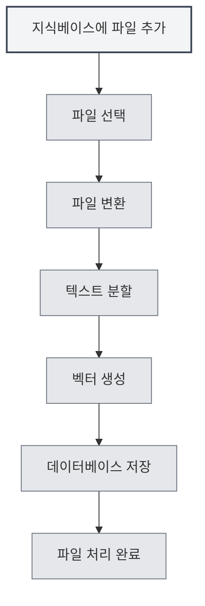

# 지식베이스 사용

## 개요

지식베이스는 MetaDoc의 RAG(검색 증강 생성) 시스템으로, 벡터 검색을 통해 AI 기능에 컨텍스트 정보를 제공합니다. 지식베이스를 적절히 사용하면 AI 응답의 정확성과 관련성을 크게 향상시킬 수 있습니다.

<KnowledgeBase mode="demo" />

## 지식베이스 소개

### 지식베이스란?

지식베이스는 문서 저장 및 검색 시스템으로, 다음과 같은 기능을 수행할 수 있습니다:

- **문서 저장**: 문서를 벡터로 변환하여 저장
- **의미론적 검색**: 의미적 유사도를 기반으로 관련 내용 검색
- **AI 강화**: AI 대화에 컨텍스트 정보 제공

### 작동 원리

<RAGToolDisplay mode="demo" />

지식베이스는 벡터 임베딩 기술을 사용합니다:

1. **문서 처리**: 문서를 텍스트 청크로 분할
2. **벡터화**: 각 텍스트 청크에 대한 벡터 임베딩 생성
3. **저장**: 벡터를 데이터베이스에 저장
4. **검색**: 쿼리를 기반으로 벡터를 생성하여 유사한 내용 검색

<KnowledgeBase mode="demo" />

## 지식베이스에 파일 추가

### 파일 추가

1. 지식베이스 관리 페이지 열기
2. "파일 추가" 버튼 클릭
3. 추가할 파일 선택
4. 파일 처리 완료 대기

### 지원 파일 형식

지식베이스는 다음 파일 형식을 지원합니다:

- **Markdown** (.md): Markdown 문서
- **LaTeX** (.tex): LaTeX 문서
- **PDF** (.pdf): PDF 문서
- **Word** (.docx): Word 문서
- **이미지** (.png, .jpg 등): OCR을 통한 텍스트 인식
- **일반 텍스트** (.txt): 일반 텍스트 파일

### 파일 처리

<RAGToolDisplay mode="demo" />

파일 추가 후 시스템은 자동으로 다음을 수행합니다:

1. **텍스트 변환**: 파일을 텍스트 내용으로 변환
2. **텍스트 분할**: 텍스트를 고정 크기의 청크로 분할
3. **벡터 생성**: 각 청크에 대한 벡터 임베딩 생성
4. **데이터 저장**: 벡터와 텍스트를 데이터베이스에 저장

처리 시간은 파일 크기에 따라 다르며, 대용량 파일은 시간이 더 오래 걸릴 수 있습니다.

<KnowledgeBase mode="demo" />

## 지식베이스 파일 관리

### 파일 목록

지식베이스 관리 페이지에는 추가된 모든 파일이 표시됩니다:

- **파일명**: 파일의 이름
- **크기/청크 수**: 파일 크기 및 데이터 청크 수
- **상태**: 파일 활성화 여부

### 파일 작업

<RAGToolDisplay mode="demo" />

#### 파일 활성화/비활성화

- **활성화**: 파일이 검색되어 AI 기능에 사용됨
- **비활성화**: 파일이 검색되지 않지만 데이터는 보존됨

#### 파일 미리보기

파일을 클릭하여 내용을 미리 볼 수 있습니다:

- **내용 보기**: 미리보기 패널에서 파일 텍스트 확인
- **편집기 열기**: 편집기에서 파일 열기

#### 파일 이름 변경

1. 이름을 변경할 파일 선택
2. 파일명 옆의 편집 버튼 클릭
3. 새 파일명 입력
4. 이름 변경 확인

#### 파일 삭제

1. 삭제할 파일 선택
2. "삭제" 버튼 클릭
3. 삭제 작업 확인

파일 삭제 시 관련된 모든 벡터와 데이터 청크가 삭제됩니다.

#### 파일 다운로드

지식베이스의 파일을 다운로드할 수 있습니다:

1. 다운로드할 파일 선택
2. "다운로드" 버튼 클릭
3. 저장 위치 선택

<KnowledgeBase mode="demo" />

## 벡터 검색

### 검색 원리

벡터 검색은 ANN(근사 최근접 이웃) 알고리즘을 사용합니다:

- **벡터 유사도**: 쿼리 벡터와 문서 벡터 간의 유사도 계산
- **코사인 유사도**: 코사인 유사도를 사용하여 유사도 측정
- **결과 정렬**: 유사도에 따라 결과 정렬 반환

### 검색 방식

<RAGToolDisplay mode="demo" />

지식베이스는 두 가지 검색 방식을 지원합니다:

- **벡터 검색**: 의미적 유사도 기반
- **하이브리드 검색**: 벡터 검색과 키워드 매칭 결합

### 검색 테스트

지식베이스 관리 페이지에서 검색 기능을 테스트할 수 있습니다:

1. 검색창에 쿼리 텍스트 입력
2. 신뢰도 임계값 조정
3. "검색" 버튼 클릭
4. 검색 결과 확인

### 신뢰도 임계값

신뢰도 임계값은 검색 결과의 필터링을 제어합니다:

- **낮은 임계값 (0.1-0.3)**: 더 많은 결과 반환하지만 관련 없는 내용 포함 가능
- **중간 임계값 (0.4-0.6)**: 관련성과 수량의 균형 (권장)
- **높은 임계값 (0.7-0.9)**: 매우 관련성 높은 결과만 반환

<KnowledgeBase mode="demo" />

## 하이브리드 검색

### 검색 메커니즘

하이브리드 검색은 두 가지 방법을 결합합니다:

- **벡터 검색**: 의미적 유사도 기반
- **키워드 매칭**: 텍스트 매칭 기반

### 점수 메커니즘

하이브리드 검색은 종합 점수를 사용합니다:

- **벡터 유사도**: 의미적 유사도 점수
- **키워드 매칭**: 텍스트 매칭 점수
- **종합 점수**: 두 가지 점수를 결합한 최종 점수

### 장점

하이브리드 검색의 장점:

- **정확성**: 벡터 검색이 의미적 이해 제공
- **정밀성**: 키워드 매칭이 정확한 매칭 제공
- **균형성**: 두 방법의 장점을 종합

<RAGToolDisplay mode="demo" />

## 검색 테스트

### 검색 테스트

지식베이스 관리 페이지에서 검색을 테스트할 수 있습니다:

1. **쿼리 입력**: 검색창에 검색할 내용 입력
2. **임계값 조정**: 슬라이더를 사용하여 신뢰도 임계값 조정
3. **검색 실행**: "검색" 버튼 클릭 또는 Enter 키 누름
4. **결과 확인**: 결과 영역에서 검색 결과 확인

### 검색 결과

검색 결과는 다음을 표시합니다:

- **매칭 텍스트**: 쿼리와 관련된 텍스트 조각
- **유사도**: 텍스트와 쿼리의 유사도 점수
- **출처 파일**: 텍스트가 추출된 파일

### 결과 정렬

검색 결과는 유사도에 따라 정렬됩니다:

- **가장 관련성 높음**: 유사도가 가장 높은 결과가 앞에 위치
- **관련성 감소**: 유사도가 감소하는 순서로 정렬

## 벡터 재구성

### 벡터 재구성

파일의 벡터 데이터에 문제가 있는 경우 벡터를 재구성할 수 있습니다:

1. 재구성할 파일 선택
2. "벡터 재구성" 버튼 클릭
3. 재구성 완료 대기

### 전체 벡터 재구성

모든 파일의 벡터를 재구성할 수 있습니다:

1. "전체 벡터 재구성" 버튼 클릭
2. 작업 확인
3. 모든 파일 재구성 완료 대기

### 재구성 시나리오

벡터 재구성이 필요한 시나리오:

- **임베딩 모델 변경**: 모델 변경 후 필요
- **벡터 데이터 손상**: 벡터 데이터에 문제 발생 시
- **벡터 표현 업데이트**: 벡터 표현 업데이트 필요 시

## 지식베이스 비우기

### 비우기 작업

전체 지식베이스를 비워야 하는 경우:

1. "지식베이스 비우기" 버튼 클릭
2. 작업 확인
3. 비우기 완료 대기

### 비우기 영향

지식베이스 비우기는 다음을 수행합니다:

- 모든 파일 기록 삭제
- 모든 데이터 청크 삭제
- 모든 벡터 삭제
- 작업 복구 불가

**주의사항**:

- 비우기 작업은 복구할 수 없으므로 신중하게 수행하세요
- 비우기 전 중요한 파일을 백업하는 것이 좋습니다
- 비운 후 파일을 다시 추가해야 합니다

<KnowledgeBase mode="demo" />

## AI 기능에서 사용

### AI 대화

지식베이스는 자동으로 AI 대화에 컨텍스트를 제공합니다:

- **자동 검색**: 대화 내용에 따라 관련 지식 자동 검색
- **컨텍스트 주입**: 검색 결과를 대화 컨텍스트에 주입
- **응답 강화**: 지식베이스 내용을 기반으로 더 정확한 응답 생성

### AI 완성

지식베이스는 AI 완성 기능을 강화할 수 있습니다:

- **컨텍스트 이해**: 지식베이스 내용을 기반으로 컨텍스트 이해
- **내용 생성**: 지식베이스 내용과 관련된 내용 생성
- **정확성 향상**: 완성 내용의 정확성 향상

### 에이전트 도구

지식베이스는 에이전트 도구로 사용될 수 있습니다:

- **RAG 도구**: 에이전트 워크플로우에서 RAG 검색 사용
- **컨텍스트 제공**: 에이전트에 관련 컨텍스트 정보 제공
- **작업 실행**: 지식이 필요한 작업을 에이전트가 완료하도록 지원

## 모범 사례

1. **파일 구성**: 주제 또는 프로젝트별로 파일 구성
2. **정기적 업데이트**: 파일 내용 업데이트 후 벡터 즉시 재구성
3. **임계값 조정**: 사용 효과에 따라 신뢰도 임계값 조정
4. **파일 정리**: 더 이상 필요하지 않은 파일 정기적 삭제
5. **검색 테스트**: 검색 기능을 정기적으로 테스트하여 효과 확인

## 주의사항

1. **지식베이스 활성화**: 지식베이스 기능 사용 전 활성화 필요
2. **파일 처리**: 대용량 파일 처리에는 시간이 걸리므로 인내심 필요
3. **저장 공간**: 지식베이스는 일정량의 저장 공간을 차지함
4. **네트워크 연결**: API 모드 사용 시 네트워크 연결 필요
5. **데이터 보안**: 지식베이스 내 민감한 정보 보호에 주의

## 관련 문서

- [[knowledge-base.management|지식베이스 관리]]
- [[knowledge-base.config|지식베이스 구성]]
- [[settings.llm|LLM 구성]]
- [[ai.chat|AI 대화 기능]]

<KnowledgeBase mode="demo" />

<RAGToolDisplay mode="demo" />