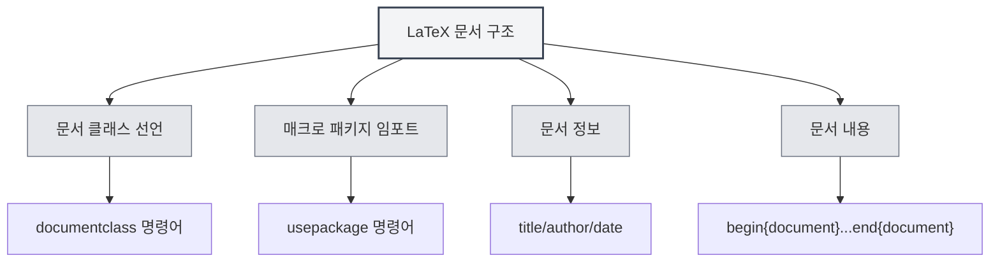

# LaTeX 문법

## 개요

LaTeX는 TeX 기반의 조판 시스템으로, 학술 논문 및 과학 기술 문서 작성에 널리 사용됩니다. MetaDoc은 완전한 LaTeX 편집, 컴파일 및 미리보기 지원을 제공합니다.

<LaTeXEditorDemo mode="demo" />

<PdfPreviewPanel mode="demo" />

<LaTeXCompilerPanel mode="demo" />

<LaTeXConsole mode="demo" />

## 기본 문법

### 문서 구조

LaTeX 문서의 기본 구조:

```latex
\documentclass{article}
\usepackage[utf8]{inputenc}

\title{문서 제목}
\author{작성자}
\date{\today}

\begin{document}
\maketitle

\section{섹션 제목}
내용...

\end{document}
```



### 수학 공식

**인라인 공식**:

```latex
이것은 인라인 공식입니다: $E = mc^2$
```

**블록 수준 공식**:

```latex
\begin{equation}
\int_{-\infty}^{\infty} e^{-x^2} dx = \sqrt{\pi}
\end{equation}
```

**다중 행 공식**:

```latex
\begin{align}
x &= a + b \\
y &= c + d
\end{align}
```

### 표

`tabular` 환경 사용:

```latex
\begin{tabular}{|c|c|c|}
\hline
열1 & 열2 & 열3 \\
\hline
데이터1 & 데이터2 & 데이터3 \\
\hline
\end{tabular}
```

### 이미지 삽입

`figure` 환경 사용:

```latex
\begin{figure}[h]
\centering
\includegraphics[width=0.8\textwidth]{image.png}
\caption{이미지 제목}
\label{fig:example}
\end{figure}
```

### 참고문헌

`BibTeX` 또는 `natbib` 사용:

```latex
\bibliographystyle{plain}
\bibliography{references}
```

## 컴파일 및 미리보기

LaTeX 문서는 PDF를 생성하기 위해 컴파일이 필요합니다. 자세한 내용은 [[latex.compilation|LaTeX 컴파일과 미리보기]]를 참조하세요.

컴파일이 완료되면 [[latex.pdf-preview|PDF 미리보기 기능]]에서 결과를 확인할 수 있습니다.

## 관련 문서

- [[latex.editor|LaTeX 에디터 사용 가이드]]
- [[latex.compilation|LaTeX 컴파일과 미리보기]]
- [[latex.pdf-preview|PDF 미리보기 기능]]
- [[latex.console|콘솔 출력]]