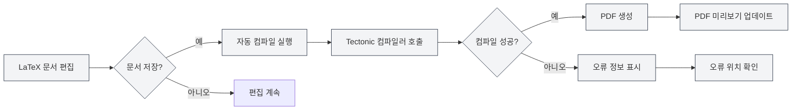
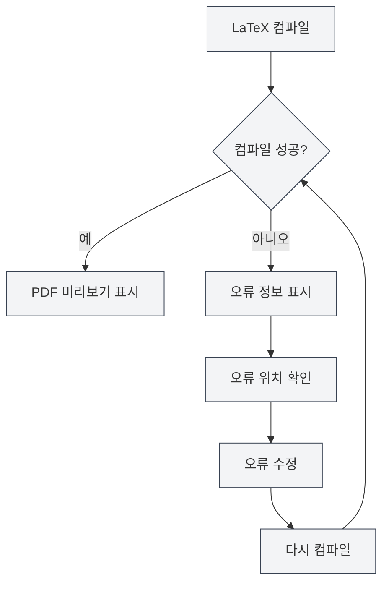

# LaTeX 컴파일 및 미리보기

## 개요

LaTeX 문서는 컴파일해야 PDF를 생성할 수 있습니다. MetaDoc은 Tectonic 컴파일러를 사용하며, 자동 컴파일, 실시간 미리보기, 오류 위치 확인 등의 기능을 지원하여 LaTeX 문서를 효율적으로 작성하고 디버깅할 수 있게 합니다.

컴파일 과정에서 필요한 매크로 패키지를 자동으로 다운로드하므로 수동 구성이 필요 없어 LaTeX 사용 절차를 크게 단순화합니다.

## LaTeX 문서 컴파일

<LaTeXCompilerPanel mode="demo" />

### 자동 컴파일

MetaDoc은 자동 컴파일 기능을 지원합니다:

- **저장 시 컴파일**: LaTeX 문서를 저장할 때 자동으로 컴파일 실행
- **수동 컴파일**: 도구 모음의 "컴파일" 버튼을 클릭하여 수동으로 컴파일 실행
- **컴파일 상태**: 컴파일 과정에서 진행 상황과 상태 표시

### 컴파일 과정

<LaTeXConsole mode="demo" />

컴파일 과정은 다음 단계를 포함합니다:

1. **컴파일 환경 준비**: Tectonic 컴파일러 사용 가능 여부 확인
2. **매크로 패키지 다운로드**: 문서에서 사용하는 LaTeX 매크로 패키지 자동 다운로드
3. **컴파일 실행**: Tectonic 컴파일러 실행하여 PDF 생성
4. **출력 처리**: 컴파일 로그 및 오류 정보 처리
5. **미리보기 업데이트**: 컴파일 성공 시 PDF 미리보기 업데이트

### 컴파일 옵션

<LaTeXEditorDemo mode="demo" />

컴파일은 다음 옵션을 지원합니다:

- **컴파일러**: Tectonic 컴파일러 사용 (기본값)
- **컴파일 모드**: 비대화식 모드, 오류 발생 시 중지
- **출력 디렉터리**: PDF 파일은 문서와 동일한 디렉터리에 저장

### 컴파일 시간

<ConsoleTerminal mode="demo" consoleKey="demo" :history='[{"content": "Tectonic编译器启动...", "type": "out"}, {"content": "解析文档结构", "type": "out"}]' />

컴파일 시간은 다음에 따라 달라집니다:

- **문서 크기**: 문서가 클수록 컴파일 시간이 길어짐
- **매크로 패키지 수**: 사용하는 매크로 패키지가 많을수록 첫 컴파일 시간이 길어짐 (다운로드 필요)
- **이미지 수**: 포함된 이미지가 많을수록 컴파일 시간이 길어짐

첫 컴파일은 매크로 패키지를 다운로드해야 하므로 시간이 오래 걸릴 수 있습니다. 이후 컴파일은 더 빨라집니다.

## PDF 미리보기

<PdfPreviewPanel mode="demo" pdfUrl="" />

### 자동 업데이트

PDF 미리보기는 컴파일 성공 후 자동으로 업데이트됩니다:

- **실시간 미리보기**: 컴파일 성공 후 즉시 PDF 미리보기 표시
- **자동 새로 고침**: PDF 내용 변경 시 자동으로 미리보기 새로 고침
- **동기화 스크롤**: PDF와 코드의 동기화된 위치 확인 지원

### 미리보기 기능

<LaTeXCompilerPanel mode="demo" />

PDF 미리보기 패널은 다음 기능을 제공합니다:

- **페이지 탐색**: 이전 페이지, 다음 페이지, 지정 페이지로 이동
- **확대/축소 제어**: 확대, 축소, 확대/축소 초기화
- **미리보기 새로 고침**: 수동으로 PDF 미리보기 새로 고침
- **코드 위치 확인**: PDF 위치에서 LaTeX 코드 위치로 이동

자세한 내용은 [[latex.pdf-preview|PDF 미리보기 기능]]을 참조하세요.

PDF 미리보기 패널 인터페이스는 다음과 같습니다:

<PdfPreviewPanel mode="demo" pdfUrl="" />

## 콘솔 출력

<LaTeXConsole mode="demo" />

### 컴파일 로그

컴파일 과정의 로그는 콘솔 출력 패널에 표시됩니다:

- **표준 출력**: 컴파일 과정의 정상 출력
- **오류 정보**: 컴파일 오류 및 경고 정보
- **실시간 업데이트**: 컴파일 과정에서 로그 실시간 업데이트

콘솔 출력 패널 인터페이스는 다음과 같습니다:

<ConsoleTerminal mode="demo" consoleKey="demo" :history='[{"content": "编译开始...", "type": "out"}, {"content": "正在下载宏包: amsmath", "type": "out"}, {"content": "警告: 未定义的引用", "type": "warn"}, {"content": "编译完成", "type": "out"}]' />

### 오류 정보

<ConsoleTerminal mode="demo" consoleKey="demo" :history='[{"content": "错误: 未定义的命令", "type": "error"}, {"content": "警告: 超文本引用未找到", "type": "warn"}]' />

컴파일 오류는 다른 색상으로 표시됩니다:

- **오류**: 빨간색 표시, 컴파일 실패를 의미
- **경고**: 노란색 표시, 가능한 문제를 의미
- **정보**: 회색 표시, 일반 정보를 의미

### 오류 위치 확인

컴파일 오류는 다음을 표시합니다:

- **오류 위치**: 오류가 발생한 줄 번호와 열 번호 표시
- **오류 유형**: 오류 유형 및 설명 표시
- **빠른 이동**: 오류 정보를 클릭하여 해당 코드 위치로 이동

자세한 내용은 [[latex.console|콘솔 출력]]을 참조하세요.

## PDF 위치 확인

<LaTeXEditorDemo mode="demo" />

### 코드에서 PDF로 위치 확인

LaTeX 편집기에서 다음을 수행할 수 있습니다:

1. **코드 선택**: LaTeX 코드 선택
2. **마우스 오른쪽 버튼 메뉴**: 마우스 오른쪽 버튼을 클릭하고 "PDF로 위치 확인" 선택
3. **미리보기 이동**: PDF 미리보기가 해당 위치로 자동 이동

### PDF에서 코드로 위치 확인

PDF 미리보기에서 다음을 수행할 수 있습니다:

1. **PDF 위치 클릭**: PDF의 특정 위치 클릭
2. **자동 이동**: 편집기가 해당 LaTeX 코드 위치로 자동 이동

이 기능을 사용하면 PDF와 코드 사이를 빠르게 전환하여 디버깅 및 편집이 용이해집니다.

## 컴파일 오류 처리

<LaTeXConsole mode="demo" />

### 일반적인 오류 유형

LaTeX 컴파일 중 다음 오류가 발생할 수 있습니다:

- **구문 오류**: LaTeX 구문이 올바르지 않음
- **매크로 패키지 누락**: 설치되지 않은 매크로 패키지 사용 (Tectonic이 자동 다운로드)
- **파일 누락**: 참조된 파일이 존재하지 않음
- **인코딩 오류**: 파일 인코딩이 올바르지 않음

### 오류 처리 절차

### 디버깅 팁

1. **콘솔 확인**: 콘솔 출력의 오류 정보를 자세히 확인
2. **오류 위치 확인**: 오류 위치 확인 기능을 사용하여 문제 코드 빠르게 찾기
3. **단계별 수정**: 첫 번째 오류부터 시작하여 하나씩 수정
4. **구문 확인**: LaTeX 구문이 올바른지 확인
5. **파일 확인**: 참조된 파일이 존재하고 경로가 올바른지 확인

## Tectonic 컴파일러

<LaTeXCompilerPanel mode="demo" />

### 컴파일러 소개

MetaDoc은 Tectonic 컴파일러를 사용하며, 다음과 같은 특징이 있습니다:

- **TeX 배포판 설치 불필요**: Tectonic은 독립 실행형 바이너리 파일
- **매크로 패키지 자동 다운로드**: 컴파일 시 CTAN에서 필요한 매크로 패키지 자동 다운로드
- **빠른 컴파일**: 기존 TeX 배포판에 비해 컴파일 속도가 빠름
- **크로스 플랫폼 지원**: Windows, macOS, Linux 전 플랫폼 지원

### 매크로 패키지 관리

Tectonic은 LaTeX 매크로 패키지를 자동으로 관리합니다:

- **자동 다운로드**: 처음 사용 시 자동 다운로드
- **캐시 관리**: 다운로드한 매크로 패키지는 캐시되어 이후 컴파일이 더 빠름
- **버전 관리**: 매크로 패키지 버전 자동 관리

어떤 매크로 패키지도 수동으로 다운로드하거나 구성할 필요 없이, 문서에서 `\usepackage{}` 명령어를 사용하기만 하면 됩니다.

## 사용 팁

<LaTeXEditorDemo mode="demo" />

### 컴파일 속도 향상

1. **이미지 줄이기**: 문서 내 이미지 수 줄이기
2. **코드 최적화**: LaTeX 코드 구조 최적화
3. **캐시 사용**: Tectonic의 매크로 패키지 캐시 활용

### 컴파일 오류 디버깅

1. **전체 로그 확인**: 콘솔의 전체 컴파일 로그 확인
2. **구문 확인**: LaTeX 구문을 자세히 확인
3. **단계별 컴파일**: 일부 코드를 주석 처리하여 단계적으로 문제 위치 확인
4. **문서 참조**: LaTeX 매크로 패키지 문서 참조

### 컴파일 절차 최적화

1. **저장 시 컴파일**: 저장 시 자동 컴파일 활성화
2. **미리보기 사용**: PDF 미리보기를 사용하여 효과 빠르게 확인
3. **위치 확인 기능**: 위치 확인 기능을 사용하여 코드와 PDF 빠르게 전환

## 자주 묻는 질문

### Q: 컴파일 실패 시 어떻게 하나요?

A: 콘솔 출력의 오류 정보를 확인하고, 오류 메시지에 따라 코드를 수정하세요. 일반적인 문제로는 구문 오류, 파일 누락 등이 있습니다.

### Q: 컴파일 시간이 너무 오래 걸립니다.

A: 첫 컴파일은 매크로 패키지를 다운로드해야 하므로 시간이 오래 걸리는 것이 정상입니다. 이후 컴파일은 더 빨라집니다. 계속 느리다면 문서 크기와 이미지 수를 확인하세요.

### Q: 매크로 패키지 다운로드 실패?

A: 네트워크 연결을 확인하고 CTAN에 접근할 수 있는지 확인하세요. Tectonic은 다운로드를 자동으로 재시도합니다.

### Q: PDF 미리보기가 업데이트되지 않습니다.

A: "새로 고침" 버튼을 클릭하여 수동으로 미리보기를 새로 고치거나, 컴파일이 성공했는지 확인하세요.

### Q: 컴파일 로그는 어떻게 확인하나요?

A: 컴파일 로그는 콘솔 출력 패널에 표시되며, 표준 출력, 오류 정보 및 경고 정보를 확인할 수 있습니다.

## 관련 문서

- [[latex.editor|LaTeX 편집기 사용 가이드]]
- [[latex.basics|LaTeX 구문]]
- [[latex.pdf-preview|PDF 미리보기 기능]]
- [[latex.console|콘솔 출력]]

<LaTeXCompilerPanel mode="demo" />

<LaTeXEditorDemo mode="demo" />