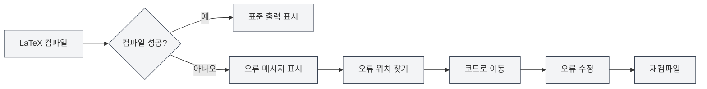

# 콘솔 출력

## 개요

콘솔 출력 패널은 LaTeX 컴파일 과정 중의 로그 정보를 표시하며, 표준 출력, 오류 메시지, 경고 메시지 등을 포함합니다. 콘솔 출력을 확인함으로써 컴파일 과정을 이해하고, 오류를 찾아내며, 문제를 디버깅할 수 있습니다.

콘솔 출력은 Monaco 에디터를 사용하여 표시되며, 구문 강조, 오류 위치 찾기, 로그 필터링 등의 기능을 지원하여 컴파일 로그를 효율적으로 확인하고 분석할 수 있게 합니다.

## LaTeX 컴파일 출력

<LaTeXConsole mode="demo" />

### 표준 출력

컴파일 과정 중의 표준 출력은 콘솔에 표시됩니다:

- **컴파일 진행 상황**: 컴파일의 각 단계를 표시
- **패키지 다운로드**: 다운로드된 패키지 정보 표시
- **컴파일 정보**: 컴파일 과정의 상세 정보 표시

표준 출력은 일반 텍스트로 표시되어 컴파일 과정을 이해하는 데 도움을 줍니다.

콘솔 출력 패널 인터페이스는 다음과 같습니다:

<ConsoleTerminal mode="demo" consoleKey="demo" :history='[{"content": "컴파일 시작...", "type": "out"}, {"content": "경고: 정의되지 않은 참조", "type": "warn"}, {"content": "컴파일 완료", "type": "out"}]' />

### 출력 형식

<ConsoleTerminal mode="demo" consoleKey="demo" :history='[{"content": "표준 출력 정보", "type": "out"}, {"content": "경고 메시지", "type": "warn"}, {"content": "오류 메시지", "type": "error"}]' />

콘솔 출력은 서로 다른 색상을 사용하여 다양한 유형의 정보를 구분합니다:

- **표준 출력**: 회색 텍스트, 정상적인 컴파일 정보 표시
- **오류 메시지**: 빨간색 텍스트, 컴파일 오류 표시
- **경고 메시지**: 노란색 텍스트, 컴파일 경고 표시
- **디버그 정보**: 진한 회색 텍스트, 디버그 정보 표시

## 오류 메시지 표시

<LaTeXConsole mode="demo" />

### 오류 형식

컴파일 오류는 특정 형식으로 표시됩니다:

- **오류 위치**: 오류가 발생한 파일명, 줄 번호, 열 번호 표시
- **오류 유형**: 오류 유형 표시 (예: 구문 오류, 파일 누락 등)
- **오류 설명**: 오류에 대한 상세 설명 표시

### 오류 위치 찾기

콘솔 출력은 오류 위치 찾기 기능을 지원합니다:

- **오류 클릭**: 오류 메시지를 클릭하면 해당 코드 위치로 이동
- **강조 표시**: 오류에 해당하는 코드 줄이 강조 표시됨
- **빠른 수정**: 오류 위치로 빠르게 이동하여 수정이 용이함

### 일반적인 오류 유형

LaTeX 컴파일 중 다음과 같은 오류가 발생할 수 있습니다:

- **구문 오류**: LaTeX 구문이 올바르지 않음
- **정의되지 않은 명령어**: 정의되지 않은 LaTeX 명령어 사용
- **닫히지 않은 환경**: 환경이 올바르게 닫히지 않음
- **파일 누락**: 참조된 파일이 존재하지 않음
- **패키지 오류**: 패키지 로드 실패 또는 충돌

## 경고 메시지 표시

<ConsoleTerminal mode="demo" consoleKey="demo" :history='[{"content": "경고: 정의되지 않은 참조", "type": "warn"}]' />

### 경고 형식

컴파일 경고는 특정 형식으로 표시됩니다:

- **경고 위치**: 경고가 발생한 위치 표시
- **경고 유형**: 경고 유형 표시
- **경고 설명**: 경고에 대한 상세 설명 표시

### 경고 처리

경고 메시지는 일반적으로 컴파일을 막지는 않지만, 최종 결과에 영향을 미칠 수 있습니다:

- **경고 확인**: 경고 메시지를 주의 깊게 확인하여 가능한 문제 파악
- **경고 수정**: 경고 메시지에 따라 코드 수정
- **경고 무시**: 경고가 결과에 영향을 미치지 않는다면 일시적으로 무시 가능

## 로그 필터링

<LaTeXConsole mode="demo" />

### 필터 기능

콘솔 출력은 로그 필터링 기능을 지원합니다:

- **유형별 필터링**: 오류, 경고 또는 표준 출력만 표시
- **키워드 필터링**: 특정 키워드를 포함하는 로그만 필터링
- **시간별 필터링**: 특정 시간대의 로그만 필터링

### 필터 설정

로그 필터링은 콘솔 패널에서 구성할 수 있습니다:

1. 콘솔 출력 패널 열기
2. 필터 옵션을 사용하여 표시할 내용 선택
3. 키워드를 입력하여 검색 필터링 적용

### 로그 지우기

콘솔 출력 지우기:

- **지우기 버튼**: 콘솔의 "지우기" 버튼 클릭
- **단축키**: `Ctrl+L` (구성된 경우)

로그를 지우면 표시된 모든 로그 정보가 삭제됩니다.

## 로그 작업

<ConsoleTerminal mode="demo" consoleKey="demo" :history='[{"content": "컴파일 로그 내용...", "type": "out"}]' />

### 로그 복사

콘솔 출력을 클립보드에 복사:

- **복사 버튼**: 콘솔의 "복사" 버튼 클릭
- **단축키**: `Ctrl+C` (텍스트 선택 후)

로그를 복사하여 다른 위치에 저장하거나 다른 사람과 공유할 수 있습니다.

### 로그 저장

콘솔 출력을 파일로 저장:

- **저장 버튼**: 콘솔의 "로그 저장" 버튼 클릭
- **파일 선택**: 저장 위치와 파일명 선택

저장된 로그 파일은 후속 분석이나 문제 보고에 사용할 수 있습니다.

### AI 분석

콘솔 출력은 AI 분석 기능을 지원합니다:

- **AI 분석 활성화**: 콘솔 패널에서 AI 분석 스위치 활성화
- **자동 분석**: AI가 오류 메시지를 자동으로 분석하고 수정 제안 제공
- **제안 확인**: AI가 제공하는 오류 수정 제안 확인

AI 분석 기능은 컴파일 오류를 빠르게 이해하고 수정하는 데 도움을 줄 수 있습니다.

## 콘솔 설정

<LaTeXConsole mode="demo" />

### 표시 옵션

콘솔 출력은 다음 표시 옵션을 지원합니다:

- **줄 번호 표시**: 로그 줄의 줄 번호 표시
- **자동 줄 바꿈**: 긴 줄을 자동으로 줄 바꿈하여 표시
- **글꼴 크기**: 로그 표시 글꼴 크기 조정

### 테마 설정

콘솔 출력은 에디터 테마를 따릅니다:

- **밝은 테마**: 밝은 테마에서 밝은 배경색 사용
- **어두운 테마**: 어두운 테마에서 어두운 배경색 사용
- **자동 동기화**: 에디터 테마 설정 자동 동기화

## 사용 팁

<ConsoleTerminal mode="demo" consoleKey="demo" :history='[{"content": "오류 위치로 이동...", "type": "out"}]' />

### 빠른 오류 위치 찾기

1. **오류 메시지 확인**: 오류 메시지의 형식과 내용을 주의 깊게 확인
2. **위치 찾기 기능 사용**: 오류 메시지를 클릭하여 코드 위치로 빠르게 이동
3. **컨텍스트 확인**: 오류 위치의 주변 코드 확인

### 컴파일 로그 이해하기

1. **표준 출력 읽기**: 컴파일 과정의 각 단계 이해
2. **오류 메시지에 집중**: 오류 메시지에 집중하여 우선 수정
3. **경고 메시지 확인**: 경고 메시지를 확인하여 가능한 문제 파악

### 디버깅 팁

1. **단계별 컴파일**: 일부 코드를 주석 처리하여 단계적으로 문제 위치 파악
2. **전체 로그 확인**: 전체 컴파일 로그를 확인하여 컴파일 과정 이해
3. **AI 분석 사용**: AI 분석 기능을 활성화하여 수정 제안 얻기

## 자주 묻는 질문

<LaTeXConsole mode="demo" />

### Q: 콘솔 출력이 표시되지 않아요.

A: 콘솔 출력 패널이 열려 있는지 확인하세요. LaTeX 문서를 컴파일하면 콘솔 패널이 자동으로 열립니다.

### Q: 오류를 빠르게 찾는 방법은 무엇인가요?

A: 오류 메시지는 빨간색으로 표시되며, 오류 메시지를 클릭하면 코드 위치로 빠르게 이동할 수 있습니다.

### Q: 로그가 너무 많아요.

A: 필터 기능을 사용하여 필요 없는 로그를 걸러내거나, 지우기 기능을 사용하여 오래된 로그를 지우세요.

### Q: 컴파일 로그를 저장하는 방법은 무엇인가요?

A: 콘솔의 "로그 저장" 버튼을 클릭하고 저장 위치를 선택하면 로그 파일을 저장할 수 있습니다.

### Q: AI 분석이 정확하지 않아요.

A: AI 분석은 참고용이며, 오류 메시지와 코드 컨텍스트를 종합적으로 판단하는 것이 좋습니다. 수동으로 수정하거나 다시 분석할 수 있습니다.

## 관련 문서

- [[latex.compilation|LaTeX 컴파일 및 미리보기]]
- [[latex.editor|LaTeX 에디터 사용 가이드]]
- [[latex.pdf-preview|PDF 미리보기 기능]]

<PdfPreviewPanel mode="demo" pdfUrl="" />

<LaTeXCompilerPanel mode="demo" />

<LaTeXEditorDemo mode="demo" />
