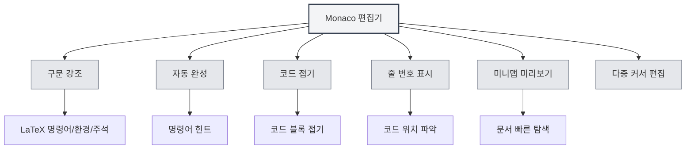

# LaTeX 편집기 사용 가이드

## 개요

MetaDoc의 LaTeX 편집기는 Monaco Editor를 기반으로 하여 전문적인 LaTeX 코드 편집 경험을 제공합니다. 편집기는 구문 강조, 자동 완성, 코드 접기 등의 기능을 지원하여 LaTeX 문서를 효율적으로 작성할 수 있도록 돕습니다.

Monaco Editor는 Visual Studio Code에서 사용되는 편집기 코어로, 강력한 코드 편집 능력과 풍부한 기능 특성을 가지고 있습니다.

<PdfPreviewPanel mode="demo" pdfUrl="" />

<ConsoleTerminal mode="demo" consoleKey="demo" :history='[{"content": "컴파일 완료", "type": "out"}]' />

<QuickStartLatex mode="demo" />

<LaTeXEditor mode="demo" />

## Monaco 편집기 소개

Monaco Editor는 LaTeX 편집을 위해 다음과 같은 특성을 제공합니다:

- **구문 강조**: LaTeX 명령어, 환경, 주석 등 다양한 구문 요소를 다른 색상으로 표시
- **자동 완성**: LaTeX 명령어 입력 시 자동으로 완성 제안 표시
- **코드 접기**: 코드 블록 접기 지원, 긴 문서 탐색에 용이
- **줄 번호 표시**: 줄 번호 표시, 코드 위치 파악에 편리
- **미니맵 미리보기**: 오른쪽에 코드 축소판 표시, 문서 구조 빠른 탐색
- **다중 커서 편집**: 다중 커서 동시 편집 지원

<LaTeXEditorDemo mode="demo" />

## 코드 강조 및 구문 힌트

### 구문 강조

LaTeX 편집기는 자동으로 인식하여 다음을 강조 표시합니다:

- **명령어**: `\documentclass`, `\usepackage` 등의 LaTeX 명령어
- **환경**: `\begin{document}`, `\end{document}` 등의 환경 태그
- **주석**: `%`로 시작하는 주석 줄
- **수학 공식**: `$`, `$$`로 감싸진 수학 공식 영역
- **특수 문자**: `&`, `#`, `$` 등의 특수 문자

구문 강조는 코드 구조를 더 명확하게 하여 읽기와 편집을 용이하게 합니다.

### 구문 힌트

편집기는 다음 상황에서 구문 힌트를 표시합니다:

- **명령어 입력**: `\` 입력 후 사용 가능한 LaTeX 명령어 자동 표시
- **환경 입력**: `\begin{` 입력 후 사용 가능한 환경 이름 표시
- **패키지 이름 입력**: `\usepackage{` 입력 후 일반적인 패키지 이름 표시

구문 힌트는 올바른 LaTeX 명령어를 빠르게 입력하고 오타를 줄이는 데 도움을 줍니다.

<LaTeXEditor mode="demo" />

## 줄 번호 표시

### 줄 번호 표시

줄 번호는 편집기 왼쪽에 표시되어 다음을 돕습니다:

- **코드 위치 파악**: 특정 줄로 빠르게 이동
- **오류 찾기**: 컴파일 오류 시 줄 번호 표시, 문제 위치 파악에 용이
- **코드 참조**: 문서 내 특정 코드 줄 참조에 편리

### 줄 번호 설정

줄 번호 표시는 설정에서 구성할 수 있습니다:

1. 설정 페이지 열기
2. "줄 번호 표시" 옵션 찾기
3. 토글 스위치로 줄 번호 활성화 또는 비활성화

줄 번호 설정은 모든 Monaco 편집기(LaTeX 편집기, 일반 텍스트 편집기 등)에 영향을 미칩니다.

<LaTeXEditorDemo mode="demo" />

## 미니맵 미리보기

### 미니맵 기능

미니맵(Minimap)은 편집기 오른쪽에 표시되는 코드 축소판입니다:

- **빠른 탐색**: 미니맵에서 전체 문서 구조 확인 가능
- **빠른 위치 이동**: 미니맵 클릭 시 해당 위치로 빠르게 이동
- **구조 미리보기**: 색상 차이를 통해 문서의 다른 부분 파악

### 미니맵 표시/숨기기

미니맵은 다음 방법으로 제어할 수 있습니다:

1. 편집기에서 마우스 오른쪽 버튼 클릭
2. "미니맵" 또는 "Minimap" 옵션 찾기
3. 표시 상태 전환

미니맵은 특히 긴 문서 편집에 적합하여 문서 구조를 빠르게 파악하는 데 도움을 줍니다.

## 코드 접기

### 접기 기능

코드 접기를 통해 코드 블록을 접어 볼 필요 없는 부분을 숨길 수 있습니다:

- **환경 접기**: `\begin{...}...\end{...}` 환경 블록 접기
- **함수 접기**: 사용자 정의 명령어 정의 접기
- **주석 접기**: 긴 주석 블록 접기

### 접기 사용

- **접기**: 줄 번호 왼쪽의 접기 아이콘 클릭, 또는 단축키 `Ctrl+Shift+[` 사용
- **펼치기**: 접기 표시 클릭, 또는 단축키 `Ctrl+Shift+]` 사용
- **모두 접기**: 단축키 `Ctrl+K Ctrl+0` 사용하여 모든 코드 블록 접기
- **모두 펼치기**: 단축키 `Ctrl+K Ctrl+J` 사용하여 모든 코드 블록 펼치기

코드 접기는 현재 편집 중인 부분에 집중할 수 있게 하여 편집 효율성을 높입니다.

<LaTeXEditorDemo mode="demo" />

## 자동 완성

### 완성 트리거

편집기는 다음 상황에서 자동으로 완성 제안을 표시합니다:

- **명령어 입력**: `\` 입력 후 LaTeX 명령어 목록 표시
- **환경 입력**: `\begin{` 입력 후 환경 이름 표시
- **패키지 이름 입력**: `\usepackage{` 입력 후 일반적인 패키지 이름 표시
- **기타 문자**: 다른 문자 입력 후 관련 제안 표시 가능

### 완성 수락

- **Enter 키**: 현재 선택된 완성 제안 수락
- **Tab 키**: 현재 선택된 완성 제안 수락
- **방향키**: 완성 목록에서 위아래로 선택 이동
- **Esc 키**: 완성 제안 취소

### 완성 설정

완성 기능은 편집기 설정에서 구성할 수 있습니다:

- **빠른 제안**: 다른 문자 입력 후 자동으로 완성 제안 표시
- **트리거 문자**: 특정 문자(예: `\`) 입력 후 자동으로 완성 표시
- **수락 문자**: 제출 문자 입력 시 자동으로 완성 수락

<LaTeXEditor mode="demo" />

## 편집 기능

### 다중 커서 편집

Monaco 편집기는 다중 커서 동시 편집을 지원합니다:

- **Alt+클릭**: 클릭 위치에 새 커서 추가
- **Ctrl+Alt+위/아래 화살표**: 위/아래에 커서 추가
- **Ctrl+D**: 다음 동일한 단어 선택 및 커서 추가
- **Ctrl+Shift+L**: 모든 동일한 단어 선택 및 커서 추가

다중 커서 편집은 여러 위치를 동시에 수정하여 편집 효율성을 높입니다.

### 열 선택

열 선택 모드를 지원합니다:

- **Alt+Shift+드래그**: 사각형 영역 선택
- **Alt+Shift+방향키**: 열 선택 확장

열 선택은 테이블 또는 정렬된 코드 편집에 적합합니다.

### 코드 서식 지정

편집기는 기본적인 코드 서식 지정을 지원합니다:

- **자동 들여쓰기**: 코드 구조에 따라 자동 들여쓰기
- **자동 줄 바꿈**: 긴 줄 자동 줄 바꿈 표시
- **들여쓰기 방식**: 다른 들여쓰기 방식(공백, 탭) 지원

<LaTeXEditorDemo mode="demo" />

## 찾기 및 바꾸기

### 찾기 기능

- **단축키**: `Ctrl+F`로 찾기 대화상자 열기
- **강조 표시**: 찾기 결과가 문서에서 강조 표시됨
- **순환 찾기**: 문서 끝 도달 시 자동으로 처음부터 다시 시작

### 바꾸기 기능

- **단축키**: `Ctrl+H`로 찾기 및 바꾸기 대화상자 열기
- **개별 바꾸기**: 일치하는 텍스트를 하나씩 바꾸기
- **모두 바꾸기**: 일치하는 모든 텍스트를 한 번에 바꾸기

### 고급 옵션

찾기 및 바꾸기는 다음 옵션을 지원합니다:

- **대소문자 구분**: 대소문자가 완전히 동일한 텍스트만 일치
- **전체 단어 일치**: 완전한 단어만 일치
- **정규 표현식**: 정규 표현식을 사용한 패턴 일치

<LaTeXEditorDemo mode="demo" />

## 단축키 참조

### 편집 단축키

| 작업 | Windows/Linux | macOS   |
| ---- | ------------- | ------- |
| 실행 취소 | `Ctrl+Z`      | `Cmd+Z` |
| 다시 실행 | `Ctrl+Y`      | `Cmd+Y` |
| 복사 | `Ctrl+C`      | `Cmd+C` |
| 붙여넣기 | `Ctrl+V`      | `Cmd+V` |
| 모두 선택 | `Ctrl+A`      | `Cmd+A` |
| 찾기 | `Ctrl+F`      | `Cmd+F` |
| 바꾸기 | `Ctrl+H`      | `Cmd+H` |

### 코드 접기 단축키

| 작업     | Windows/Linux   | macOS          |
| -------- | --------------- | -------------- |
| 접기     | `Ctrl+Shift+[`  | `Cmd+Option+[` |
| 펼치기   | `Ctrl+Shift+]`  | `Cmd+Option+]` |
| 모두 접기 | `Ctrl+K Ctrl+0` | `Cmd+K Cmd+0`  |
| 모두 펼치기 | `Ctrl+K Ctrl+J` | `Cmd+K Cmd+J`  |

### 다중 커서 단축키

| 작업               | Windows/Linux  | macOS          |
| ------------------ | -------------- | -------------- |
| 커서 추가         | `Alt+클릭`     | `Option+클릭`  |
| 위쪽 커서 추가     | `Ctrl+Alt+↑`   | `Cmd+Option+↑` |
| 아래쪽 커서 추가   | `Ctrl+Alt+↓`   | `Cmd+Option+↓` |
| 다음 동일 단어 선택 | `Ctrl+D`       | `Cmd+D`        |
| 모든 동일 단어 선택 | `Ctrl+Shift+L` | `Cmd+Shift+L`  |

<LaTeXEditor mode="demo" />

## 사용 팁

### 빠른 입력

1. **명령어 완성**: `\` 입력 후 방향키로 명령어 선택, Enter로 수락
2. **환경 완성**: `\begin{` 입력 후 환경 이름 선택, 편집기가 자동으로 `\end{...}` 완성
3. **패키지 이름 완성**: `\usepackage{` 입력 후 패키지 이름 선택, 빠르게 매크로 패키지 추가

<LaTeXEditor mode="demo" />

### 코드 구성

1. **접기 사용**: 볼 필요 없는 코드 블록 접기, 편집 영역 깔끔하게 유지
2. **주석 사용**: 코드 기능 설명 주석 추가, 향후 유지보수에 편리
3. **적절한 들여쓰기**: 코드 들여쓰기 일관성 유지, 가독성 향상

<LaTeXEditorDemo mode="demo" />

### 오류 위치 파악

1. **줄 번호 확인**: 컴파일 오류 시 줄 번호 표시, 편집기에서 빠르게 위치 파악
2. **찾기 기능 사용**: 찾기 기능으로 특정 명령어 또는 텍스트 빠르게 위치 파악
3. **미니맵 사용**: 미니맵에서 문서 구조 빠르게 탐색

## 자주 묻는 질문

### Q: 자동 완성이 표시되지 않나요?

A: 편집기 설정의 "빠른 제안" 옵션이 활성화되어 있는지 확인하세요. `\` 입력 후 자동으로 완성 제안이 표시되어야 합니다.

### Q: 코드를 어떻게 접나요?

A: 줄 번호 왼쪽의 접기 아이콘을 클릭하거나, 단축키 `Ctrl+Shift+[`를 사용하세요. 접힌 환경 블록은 줄 번호 왼쪽에 접기 표시가 나타납니다.

### Q: 미니맵이 표시되지 않나요?

A: 편집기 설정의 "미니맵" 옵션이 활성화되어 있는지 확인하세요. 미니맵은 편집기 오른쪽에 표시됩니다.

### Q: 특정 줄로 어떻게 빠르게 이동하나요?

A: 단축키 `Ctrl+G`(Windows/Linux) 또는 `Cmd+G`(macOS)로 "줄로 이동" 대화상자를 열고, 줄 번호를 입력하면 이동합니다.

### Q: 코드 서식 지정이 올바르지 않나요?

A: Monaco 편집기는 LaTeX 구문에 따라 자동 들여쓰기를 수행합니다. 들여쓰기가 올바르지 않으면 수동으로 조정하거나 Tab 키를 사용하세요.

## 관련 문서

- [[latex.basics|LaTeX 구문]]
- [[latex.compilation|LaTeX 컴파일 및 미리보기]]
- [[latex.pdf-preview|PDF 미리보기 기능]]
- [[latex.console|콘솔 출력]]
- [[core.editor-basics|편집기 기본 조작]]
- [[core.editor-settings|편집기 설정]]